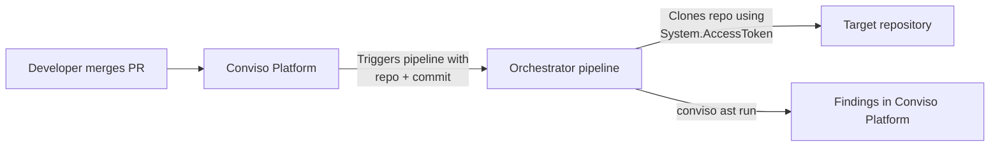

# Azure DevOps AST Orchestrator

The Conviso Platform **Azure DevOps AST Orchestrator** centralizes AST scanning in a single Azure Pipeline. Instead of adding a pipeline to every repository, you build **one** pipeline. Conviso calls it after each PR merge and tells it which repository and commit to scan.

## How it works



Benefits:

- **Centralized management**: Scanning logic lives in one pipeline.
- **Consistency**: Same scan behavior for every mapped repository.
- **Simple onboarding**: Add repositories without duplicating CI configuration.
- **Keyless authentication**: No Personal Access Token (PAT) to create, rotate, or share.

:::tip Security and compliance
This integration uses **ephemeral native authentication** (`System.AccessToken`). Azure Pipelines generates the token for each run and it expires automatically when the job finishes. No personal token or long-lived credential needs to be stored or shared.
:::

:::note
**Execution costs**: Scans run in your Azure Pipelines environment and consume your Azure Pipeline runtime.
:::

## Before you begin

You will work in **two consoles**: Azure DevOps first, then Conviso Platform. Total time: about 20 minutes.

You need:

- An Azure DevOps project where you can create pipelines and edit **Project Settings**.
- **Organization Settings > Pipelines > Settings** access. Two settings there decide whether the pipeline can reach your repositories at all (Steps 5 and 6), and one of them is enabled by default.
- Your **Conviso API key** for the target environment.
- The Azure DevOps integration already configured in Conviso Platform, with **AST Scans** enabled.

Some terms used below:

| Term | Meaning |
| --- | --- |
| **Orchestrator pipeline** | The single Azure Pipeline you create in Part 1. It does the scanning. |
| **Target repository** | Any repository you want scanned. It needs no pipeline of its own. |
| **Build identity** | The automatic service account Azure DevOps uses to run pipelines. Named `Project Collection Build Service (<org>)` or `<Project> Build Service (<org>)`. |
| **`System.AccessToken`** | Short-lived token Azure Pipelines issues to that build identity for one run. Replaces the PAT. |
| **Asset** | The repository's entry in Conviso Platform, where findings are stored. Named `organization/repository`. |

---

## Part 1 - Azure DevOps setup

### Step 1 - Add the pipeline YAML to a repository

Pick any repository in your Azure DevOps project to host the orchestrator (a dedicated repository such as `security-pipelines` works well). Create a file named `azure-pipelines-orchestrator.yml` in the branch you will use — normally `main` — and paste this content:

```yaml
trigger: none
pr: none

parameters:
  - name: repo_full_name
    type: string
    default: REPLACE/REPLACE
  - name: branch
    type: string
    default: replace-me
  - name: commit_sha
    type: string
    default: replace-me
  - name: pr_number
    type: string
    default: ""
  - name: api_url
    type: string
    default: "https://api.convisoappsec.com"

variables:
  - group: conviso-group

pool:
  vmImage: ubuntu-latest

jobs:
  - job: ast
    container: convisoappsec/convisoast:latest
    steps:
      - checkout: none

      - bash: |
          set -euo pipefail

          REPO_FULL='${{ parameters.repo_full_name }}'
          BRANCH='${{ parameters.branch }}'
          SHA='${{ parameters.commit_sha }}'

          case "$REPO_FULL" in ''|REPLACE/REPLACE) echo "##vso[task.logissue type=error]invalid repo_full_name"; exit 1;; esac
          case "$SHA" in ''|replace-me) echo "##vso[task.logissue type=error]invalid commit_sha"; exit 1;; esac
          test -n "${SYSTEM_ACCESSTOKEN:-}" || { echo "##vso[task.logissue type=error]SYSTEM_ACCESSTOKEN missing: map \$(System.AccessToken) in the step env block"; exit 1; }
          test -n "${CONVISO_API_KEY:-}" || { echo "##vso[task.logissue type=error]CONVISO_API_KEY missing"; exit 1; }

          PROJECT="${REPO_FULL%%/*}"
          REPO="${REPO_FULL#*/}"
          ORG="${SYSTEM_COLLECTIONURI#https://dev.azure.com/}"
          ORG="${ORG%/}"

          WORKDIR="$(Build.SourcesDirectory)"
          rm -rf "${WORKDIR:?}"/* && mkdir -p "$WORKDIR" && cd "$WORKDIR"
          git init -q
          git remote add origin "https://dev.azure.com/${ORG}/${PROJECT}/_git/${REPO}"
          git -c http.extraheader="AUTHORIZATION: bearer ${SYSTEM_ACCESSTOKEN}" fetch origin "$SHA"
          git checkout -B "$BRANCH" "$SHA"

          PREV="$(git rev-parse "${SHA}^1")"
          export CONVISO_API_URL='https://api.convisoappsec.com'
          conviso ast run --asset-name "${ORG}/${REPO}" --current-commit "$SHA" --previous-commit "$PREV" --vulnerability-auto-close
        env:
          SYSTEM_ACCESSTOKEN: $(System.AccessToken)
          CONVISO_API_KEY: $(CONVISO_API_KEY)
          SYSTEM_COLLECTIONURI: $(System.CollectionUri)
```

Copy it as-is. Do not replace the `REPLACE/REPLACE` and `replace-me` defaults — Conviso overwrites them on every trigger, and they exist only to make an accidental manual run fail loudly.


#### What the parameters mean

| Parameter | Sent by Conviso as | Notes |
| --- | --- | --- |
| `repo_full_name` | `<project>/<repository>` | Azure DevOps project name, then repository name. Not the organization. |
| `branch` | Branch of the merged PR | Used for the local checkout name. |
| `commit_sha` | Merge commit SHA | The commit that gets scanned. |
| `pr_number` | PR number | Not used by the scan; accepted for compatibility. |
| `api_url` | Conviso API URL | Must stay declared even though the script exports the URL itself. Removing it breaks the trigger. |

#### The two lines that replace the PAT

The `env` block at the bottom of the step is what makes keyless auth work:

```yaml
        env:
          SYSTEM_ACCESSTOKEN: $(System.AccessToken)
          CONVISO_API_KEY: $(CONVISO_API_KEY)
```

Azure Pipelines hides `System.AccessToken` from scripts unless you map it explicitly like this. The `git` command then sends it as a one-off header, so the token is never written into `.git/config` or printed in the remote URL.

### Step 2 - Create the pipeline and copy its ID

1. Go to **Pipelines > Pipelines** and click **New pipeline**.
2. Choose **Azure Repos Git**, then select the repository where you saved the YAML.
3. Choose **Existing Azure Pipelines YAML file**.
4. Select the branch (`main`) and the path (`/azure-pipelines-orchestrator.yml`), then click **Continue**.
5. Click **Save** — **not** *Save and run*. The pipeline is not ready to run yet.

Now copy the pipeline ID. Open the pipeline and look at the browser address bar:

```text
https://dev.azure.com/my-org/my-project/_build?definitionId=42
```

The number after `definitionId=` is the **pipeline ID** — `42` in this example. Write it down; Conviso asks for it in Part 2.

### Step 3 - Create the Variable Group

1. Go to **Pipelines > Library > + Variable group**.
2. Name it exactly `conviso-group`. The name must match the `- group: conviso-group` line in the YAML — a typo here makes every run fail.
3. Add a variable named `CONVISO_API_KEY` with your Conviso API key as the value.
4. Click the **lock icon** next to the value to store it as a secret.
5. Click **Save**.
6. Open the **Pipeline permissions** tab of the variable group, click **+**, and select your orchestrator pipeline.

Step 6 is easy to miss and is a common cause of failed runs. Without it the run stops with *"variable group could not be found or is not authorized for use"*.

You do **not** add any repository credential here. Git access comes from `System.AccessToken`.


### Step 4 - Give the build identity Read access to the repositories

The pipeline clones target repositories as the build identity, so that identity needs **Read** permission on them.

This is the only step you repeat as you onboard more repositories — and you repeat it **once per project**, not once per repository, if you grant the permission at the **All Repositories** level.

For each project that owns repositories you want to scan:

1. Go to **Project Settings > Repositories**.
2. Select **All Repositories** at the top of the list to apply the permission project-wide, or select a single repository to be more restrictive.
3. Open the **Security** tab.
4. In the user/group list, find the build identity:
   - `Project Collection Build Service (<organization>)` — use this when the orchestrator scans repositories across more than one project.
   - `<Project Name> Build Service (<organization>)` — use this when everything lives in one project.
5. Set **Read** to **Allow**.

Leave every other permission unset. Read is all the scan needs.

If you use the **project-scoped** identity and the repository lives in a different project than the pipeline, that identity also needs the **View project-level information** permission in the target project (**Project Settings > Permissions**). Repository Read alone is not enough.

### Step 5 - Check "Protect access to repositories in YAML pipelines"

:::danger Required check - the orchestrator will not work without it
Go to **Organization Settings > Pipelines > Settings** (and **Project Settings > Pipelines > Settings**) and look at **Protect access to repositories in YAML pipelines**.

**This setting is enabled by default for every organization and project created after May 2020.** While it is enabled, the job access token only reaches repositories that the YAML references explicitly through a `checkout` step or a `uses` statement. The orchestrator uses `checkout: none` and clones a repository chosen at run time, so its `git fetch` fails with an authorization error.

Pick one of the two options below before you continue. **You do this once**, not once per repository: Option A is a single edit to the orchestrator YAML, and Option B is a single organization or project setting. If the setting is enabled at the organization level, it is grayed out in **Project Settings**.
:::

#### Option A - Reference the target repository in the YAML (keeps the setting enabled)

Conviso sends `repo_full_name` as a template parameter, which Azure DevOps resolves at compile time, so the repository can be declared as a resource and checked out normally. The declaration is generic — its value changes on every run — so this single edit covers every repository you onboard later. Replace the `resources`/`jobs` part of the template from Step 1 with:

```yaml
resources:
  repositories:
    - repository: target
      type: git
      name: ${{ parameters.repo_full_name }}
      ref: refs/heads/${{ parameters.branch }}

jobs:
  - job: ast
    container: convisoappsec/convisoast:latest
    steps:
      - checkout: target
        path: target
        persistCredentials: true
        fetchDepth: 0

      - bash: |
          set -euo pipefail

          BRANCH='${{ parameters.branch }}'
          SHA='${{ parameters.commit_sha }}'

          test -n "${CONVISO_API_KEY:-}" || { echo "##vso[task.logissue type=error]CONVISO_API_KEY missing"; exit 1; }

          REPO_FULL='${{ parameters.repo_full_name }}'
          REPO="${REPO_FULL#*/}"
          ORG="${SYSTEM_COLLECTIONURI#https://dev.azure.com/}"
          ORG="${ORG%/}"

          cd "$(Agent.BuildDirectory)/target"
          git fetch origin "$SHA"
          git checkout -B "$BRANCH" "$SHA"

          PREV="$(git rev-parse "${SHA}^1")"
          export CONVISO_API_URL='https://api.convisoappsec.com'
          conviso ast run --asset-name "${ORG}/${REPO}" --current-commit "$SHA" --previous-commit "$PREV" --vulnerability-auto-close
        env:
          CONVISO_API_KEY: $(CONVISO_API_KEY)
          SYSTEM_COLLECTIONURI: $(System.CollectionUri)
```

The `checkout` step authenticates with the job access token itself, and `persistCredentials: true` keeps that token available for the later `git fetch`. Build identity permissions from Step 4 still apply.

Validate this variant with a manual run (Step 9) against one repository before rolling it out to your whole organization.

#### Option B - Disable the setting

Uncheck **Protect access to repositories in YAML pipelines** and keep the template exactly as shown in Step 1.

This widens the job access token to every repository in the authorized projects, for **all** pipelines in the scope where you disable it — not just the orchestrator. Prefer Option A unless your organization already runs with this setting off.

### Step 6 - Allow cross-project access (only if needed)

Skip this step if the orchestrator pipeline and **all** target repositories are in the same Azure DevOps project.

:::warning Organization scope configuration (cross-project scans)
If the Orchestrator pipeline and the target repositories live in **different projects of the same Azure DevOps organization**, go to **Organization Settings > Pipelines > Settings** and **uncheck** _"Limit job authorization scope to current project for non-release pipelines"_. This lets the job access token reach repositories in other projects of the same organization.

The organization-level setting wins: while it is enabled there, you cannot re-enable collection scope from an individual project. If it is already unchecked at the organization level, check the same option in **Project Settings > Pipelines > Settings** for the project that hosts the orchestrator, since the project-level setting blocks access on its own.

Alternatively, leave the scope limited and grant the project-scoped build identity access to the other project, as described in Step 4.
:::

:::note
Pipelines in **public** projects are always project-scoped and cannot reach resources in other projects, whatever these settings say. Host the orchestrator in a private project.
:::

---

## Part 2 - Conviso Platform setup

### Step 7 - Open the Azure DevOps integration

In Conviso Platform, go to **Integrations**, filter by **Application Lifecycle Management**, and open **Azure DevOps**.


### Step 8 - Fill in the Orchestrator settings

In **Integrations > Azure DevOps > Orchestrator configuration**, fill:

| Field | What to enter | Where to find it |
| --- | --- | --- |
| **Orchestrator organization** | Azure DevOps organization name, e.g. `my-org` | First path segment of `https://dev.azure.com/my-org/...` |
| **Orchestrator project** | Project that contains the orchestrator pipeline | Second path segment of the same URL |
| **Orchestrator pipeline ID** | The number you copied in Step 2, e.g. `42` | `definitionId=` in the pipeline URL |
| **Orchestrator ref** | Branch holding the YAML file — use `main` | The branch you saved the file in |

Click **Save configuration**.


With **AST Scans** enabled and these settings saved, Conviso triggers the orchestrator automatically on eligible PR merges for mapped assets. No trigger configuration is needed inside Azure DevOps — that is why the YAML starts with `trigger: none`.

---

## Part 3 - Test it

### Step 9 - Run the pipeline manually

Test permissions before waiting for a real merge.

1. Pick any target repository and copy a recent commit SHA from **Repos > Commits**.
2. Open the orchestrator pipeline and click **Run pipeline**.
3. Expand the parameters and fill:
   - `repo_full_name`: `<project>/<repository>`, e.g. `my-project/my-api`
   - `branch`: `main`
   - `commit_sha`: the SHA you copied
4. Click **Run**.

A green run means the variable group, build identity permissions, and token mapping are all correct. A red run points you to the [Troubleshooting](#troubleshooting) table below.

### Step 10 - Validate a real merge

Merge a PR in a mapped repository. Confirm a pipeline run is created automatically and finishes successfully, then check that findings appear on the matching asset in Conviso Platform.

The asset in Conviso must be named `organization/repository` (for example `my-org/my-api`) to receive the findings.


---

## Troubleshooting

| Problem | What to check |
| --- | --- |
| Run fails with a resource authorization error naming `conviso-group` | Open **Pipelines > Library > conviso-group > Pipeline permissions** and add the orchestrator pipeline (Step 3.6). Confirm the group name matches `- group: conviso-group` exactly. |
| `SYSTEM_ACCESSTOKEN missing` in the logs | The variable was not mapped. Add `SYSTEM_ACCESSTOKEN: $(System.AccessToken)` to the step `env` block (Step 1). |
| Git fetch is denied even though the build identity has **Read** | Check **Protect access to repositories in YAML pipelines** (Step 5). While it is enabled, the token cannot reach repositories that the YAML does not reference in a `checkout` step or `uses` statement — which is the case for the `checkout: none` template. |
| Git fetch fails with `TF401019`, `repository not found`, or `Authentication failed` | Grant **Read** to **Project Collection Build Service** / **Project Build Service** on the target repository, in **Project Settings > Repositories > Security** (Step 4). |
| Cross-project clone fails while same-project clones succeed | Uncheck _"Limit job authorization scope to current project for non-release pipelines"_ in **Organization Settings > Pipelines > Settings**, or grant the project-scoped identity **View project-level information** plus repository **Read** in the target project (Step 6). |
| Cross-project clone fails and the orchestrator lives in a public project | Public projects are always project-scoped. Move the orchestrator to a private project. |
| `invalid repo_full_name` in the logs | The value must be `<project>/<repository>`, not `<organization>/<repository>`. |
| `unknown revision` on `${SHA}^1` | The commit has no parent — typical of the very first commit in a repository. Scan a later commit. |
| PR merged but no pipeline run is created | Confirm **AST Scans** is enabled, the asset mapping is active for the merged branch, and the Orchestrator configuration (organization / project / pipeline ID / ref) is correct. |
| Pipeline trigger fails with `Unexpected parameter 'api_url'` | Keep `api_url` declared in the pipeline parameters — the Conviso worker always sends it. |
| `Invalid API key` in AST | Confirm `CONVISO_API_KEY` belongs to the same environment as `CONVISO_API_URL`. |
| Pipeline runs but no findings are created | Confirm the asset is named `organization/repository` in Conviso and review the pipeline logs for `conviso ast run` errors. |
| Job fails to start on a self-hosted agent | The job runs in the `convisoappsec/convisoast` container, so the agent needs Docker installed. Microsoft-hosted `ubuntu-latest` agents already have it. |

## Migrating from `ADO_GIT_PAT`

If your orchestrator still uses a Personal Access Token:

1. Grant **Read** to the build identity on the target repositories (Step 4).
2. Check **Protect access to repositories in YAML pipelines** and choose Option A or B (Step 5). A PAT-based script is exempt from that setting, so this is the step most likely to break a migration that previously worked.
3. In the step `env` block, replace `ADO_GIT_PAT: $(ADO_GIT_PAT)` with `SYSTEM_ACCESSTOKEN: $(System.AccessToken)`.
4. Replace the tokenized remote URL with the `http.extraheader` fetch shown in the template (Step 1).
5. For cross-project setups, review the job authorization scope (Step 6).
6. Run the pipeline manually to validate (Step 9).
7. Only after a green run: delete `ADO_GIT_PAT` from **Pipelines > Library** and revoke the PAT in **User Settings > Personal Access Tokens**.

## Support

If you need help validating orchestrator settings, repository access, or pipeline permissions, contact Conviso Support.
