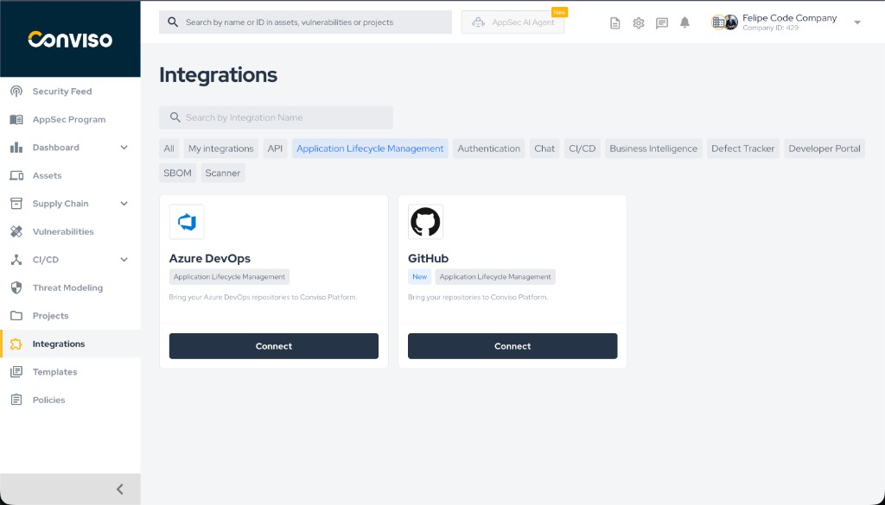
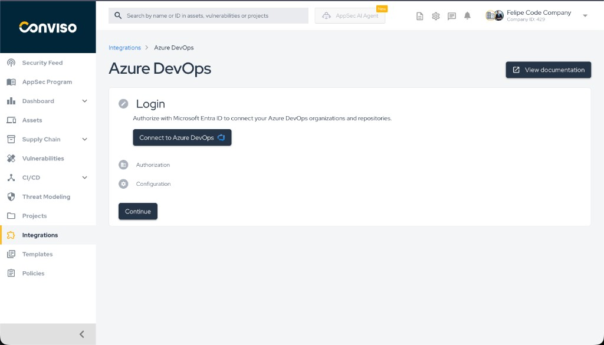
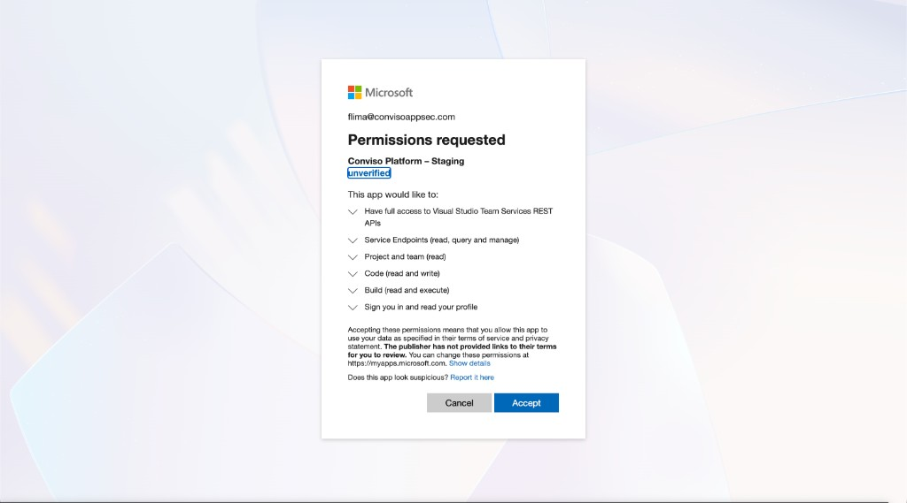
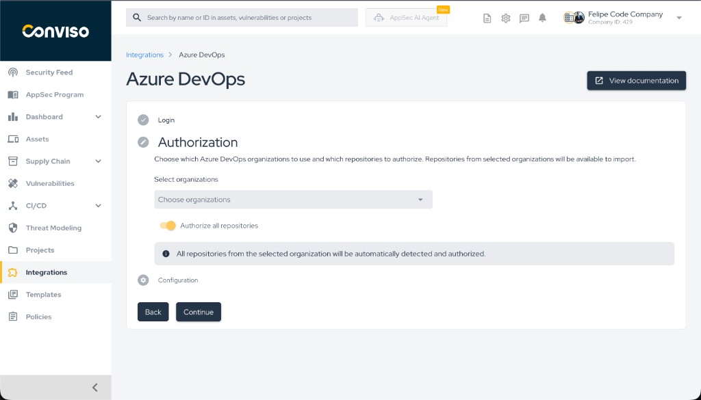
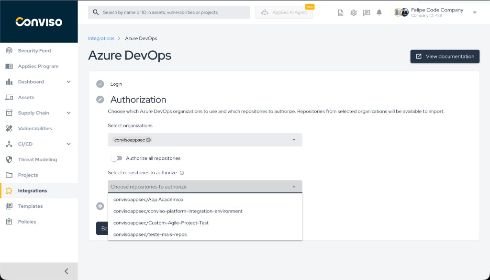
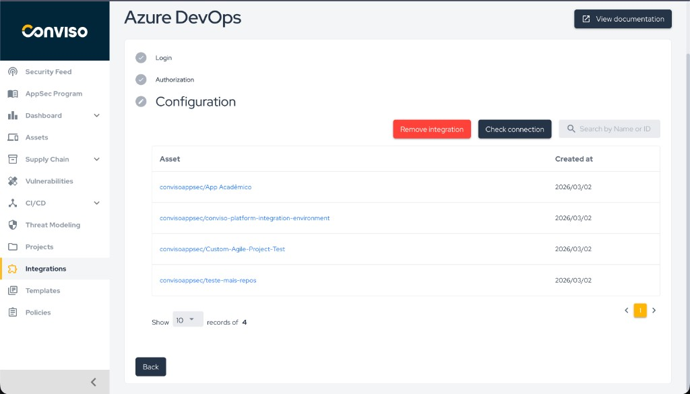

## Introduction

The **Conviso Platform** integration with [Azure DevOps](https://azure.microsoft.com/products/devops) allows you to connect your Azure DevOps organizations and repositories to the platform. Once connected, you can import repositories as assets and manage them in a single place for security scanning and vulnerability management.

The setup is divided into three steps: **Login** (OAuth with Microsoft Entra ID), **Authorization** (select organizations and repositories), and **Configuration** (view and manage imported assets).

## Objective

By the end of this guide, you will have:

- Connected your Azure DevOps account to Conviso Platform via Microsoft Entra ID.
- Selected which organizations and repositories to authorize.
- Viewed the list of integrated assets (repositories imported as assets).

## Prerequisites

Before you start, ensure that:

- You can **authorize the Conviso Platform application** in the Microsoft consent screen (grant OAuth permissions) and you have **access to the Azure DevOps organization(s)** you want to connect. If your organization restricts who can install or authorize apps, an Entra ID or Azure DevOps administrator may need to approve the app first.
- You have a **Microsoft account** (or Microsoft Entra ID account) with access to the Azure DevOps organizations you want to connect.
- Your Conviso Platform **company** has the integration feature available (contact your administrator if the Azure DevOps card does not appear).

:::info
The first time you connect, an administrator may need to register the Conviso Platform application in your Azure DevOps / Microsoft Entra ID tenant and configure the OAuth client. If you do not see the "Connect to Azure DevOps" option or the consent screen, contact your Conviso or Azure DevOps administrator.
:::

## Steps

### Step 1 – Locate the Azure DevOps integration

1. In the Conviso Platform sidebar, click **Integrations**.
2. On the Integrations page, use the category filter if needed (e.g. **Application Lifecycle Management**).
3. Locate the **Azure DevOps** card and click **Connect**.

*Step 1: Integrations page with Azure DevOps and Connect button.*

---

### Step 2 – Connect to Azure DevOps (Login)

1. On the Azure DevOps integration page, you will see three steps: **Login**, **Authorization**, and **Configuration**.
2. In the **Login** step, read the description (authorization with Microsoft Entra ID).
3. Click the **Connect to Azure DevOps** button.

*Step 2: Login step with Connect to Azure DevOps button.*

You will be redirected to Microsoft’s sign-in and consent flow.

---

### Step 3 – Sign in and accept permissions (Microsoft)

1. Sign in with your Microsoft account if prompted.
2. Review the **Permissions requested** by the Conviso Platform application (e.g. access to Visual Studio Team Services REST APIs, Code, Build, Project and team, etc.).
3. Click **Accept** to grant the requested permissions.

*Step 3: Microsoft permissions consent screen.*

After accepting, you will be redirected back to the Conviso Platform.

---

### Step 4 – Select organizations and authorize repositories (Authorization)

1. Back in Conviso Platform, you will be on the **Authorization** step.
2. In **Select organizations**, click the field and choose one or more Azure DevOps organizations to use. Repositories from these organizations will be available to import.
3. Choose how to authorize repositories:
   - **Authorize all repositories**: Turn the **Authorize all repositories** toggle **on** to automatically detect and authorize all repositories from the selected organization(s).
   - **Select specific repositories**: Turn the toggle **off** to open **Select repositories to authorize** and choose only the repositories you want.
4. Click **Continue** to save and go to the next step.

*Step 4: Authorization – select organizations and authorize all or selected repositories.*

If you chose to select specific repositories, use the dropdown as in the image below:

*Step 4b: Selecting specific repositories to authorize.*

---

### Step 5 – View and manage configuration

1. On the **Configuration** step, you will see a table of **Assets** (repositories that were imported).
2. Use the search bar to **Search by Name or ID** if you have many assets.
3. Optionally:
   - Click **Check connection** to verify that the integration is healthy.
   - Click **Remove integration** to disconnect Azure DevOps (this does not delete assets already created; it removes the link for future imports).
4. Use the pagination controls at the bottom to browse all integrated assets.

*Step 5: Configuration – list of integrated assets and actions.*

---

## Authorize all repositories – how new repos and projects are included

If you turned on **Authorize all repositories** in Step 4, the platform keeps your assets in sync as follows:

- **New repository in an existing project:** When a repository is created in a project that is already part of the integration, the platform is notified and the new repository is imported as an asset automatically.
- **New project:** Azure DevOps does not notify the platform when a new project is created. The platform runs a **daily sync** (during the night, UTC) that finds new projects in your organization(s) and imports their existing repositories. Once a project is discovered, any new repositories created in it afterward are automatically imported in real time, just like existing projects.

If you chose **Select specific repositories**, only the repositories you selected at configuration time are imported; no automatic sync runs for new repos or new projects.

## Validation

- **Login**: After Step 2 and 3, the Login step shows a check mark and you return to Conviso Platform.
- **Authorization**: After Step 4, the Authorization step shows a check mark and the Configuration step becomes active.
- **Configuration**: The Configuration step shows a table of assets; each row is a repository imported as an asset (e.g. `organization/repository-name`). You can open an asset to confirm it is linked correctly.

If **Check connection** is available, use it to confirm that the integration can still access Azure DevOps with the current credentials.

## Troubleshooting

| Problem | What to do |
|--------|------------|
| **"OAuth state is required" or "Invalid or expired OAuth state"** | Do not modify the URL when returning from Microsoft. Use the **Connect to Azure DevOps** flow again from the Login step and complete the consent in one go. If the error persists, try in a new browser tab or clear cookies for the Conviso Platform domain. |
| **"Azure DevOps OAuth is not configured"** | The Conviso Platform instance is missing OAuth configuration (client ID, secret, redirect URI). Contact your platform administrator. |
| **No organizations in the dropdown** | Ensure your Microsoft account has access to at least one Azure DevOps organization. Check at [https://dev.azure.com](https://dev.azure.com). |
| **"The integration must have at least one organization selected"** | You must select at least one organization in the Authorization step before saving or importing repositories. Go back to Authorization and select at least one organization. |
| **Repositories do not appear after import** | Import is processed asynchronously. Wait a few moments and refresh the Configuration tab. If they still do not appear, use **Check connection** and try importing again. |

## Support

If you have any questions or need assistance with the Azure DevOps integration, contact the Conviso support team.

**[Explore other Conviso Platform integrations and get started.](https://bit.ly/3NzvomE)**
