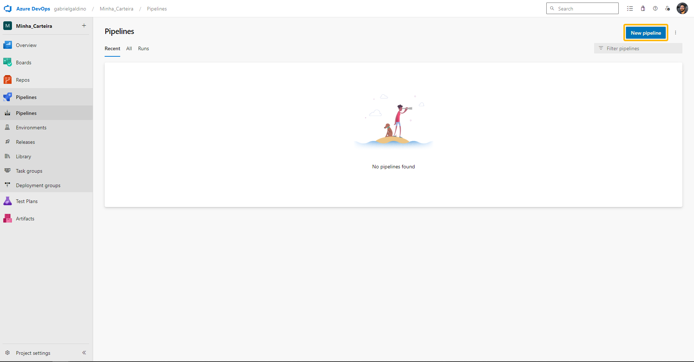

<div style={{textAlign: 'center'}}>

[](https://cta-service-cms2.hubspot.com/web-interactives/public/v1/track/redirect?encryptedPayload=AVxigLKtcWzoFbzpyImNNQsXC9S54LjJuklwM39zNd7hvSoR%2FVTX%2FXjNdqdcIIDaZwGiNwYii5hXwRR06puch8xINMyL3EXxTMuSG8Le9if9juV3u%2F%2BX%2FCKsCZN1tLpW39gGnNpiLedq%2BrrfmYxgh8G%2BTcRBEWaKasQ%3D&webInteractiveContentId=125788977029&portalId=5613826)

</div>


## Introduction

Integrate the Conviso Platform seamlessly into your [Azure DevOps Pipelines](https://dev.azure.com/) to automate and streamline your security processes. This integration ensures thorough security assessments for your applications throughout the development lifecycle.

You can run the Conviso Platform AST (Application Security Testing), which offers Static Application Security Testing (SAST), Software Composition Analysis (SCA), and Code Review directly on your Azure Pipelines.

This integration provides the **CLI as a Docker** image for executing tasks and establishing connections with the Conviso Platform.

[Explore our Integration page to learn more and supercharge your Application Security Program with Conviso Platform.](https://cta-service-cms2.hubspot.com/web-interactives/public/v1/track/redirect?encryptedPayload=AVxigLKtcWzoFbzpyImNNQsXC9S54LjJuklwM39zNd7hvSoR%2FVTX%2FXjNdqdcIIDaZwGiNwYii5hXwRR06puch8xINMyL3EXxTMuSG8Le9if9juV3u%2F%2BX%2FCKsCZN1tLpW39gGnNpiLedq%2BrrfmYxgh8G%2BTcRBEWaKasQ%3D&webInteractiveContentId=125788977029&portalId=5613826)

## Prerequisites

Before using Conviso Platform with Azure Pipelines, you must ensure that:

1. You have your Conviso API Key, a code that identifies you to Conviso Platform. Find yours [using this tutorial](https://docs.convisoappsec.com/api/generate-apikey).

2. A [new pipeline is created to run the automation](https://learn.microsoft.com/en-us/azure/devops/pipelines/create-first-pipeline?view=azure-devops#:~:text=Go%20to%20the%20Pipelines%20tab,start%20with%20an%20Empty%20job.). Follow these steps:
* Click on "**Pipelines**" in the left-hand menu.
* Click "**New Pipeline**" and configure it based on your project type.
* You will arrive at your pipeline's ```YAML document```.

<div style={{textAlign: 'center'}}>

[ 'Azure Pipelines page for “create a new pipeline')](https://cta-service-cms2.hubspot.com/web-interactives/public/v1/track/redirect?encryptedPayload=AVxigLKtcWzoFbzpyImNNQsXC9S54LjJuklwM39zNd7hvSoR%2FVTX%2FXjNdqdcIIDaZwGiNwYii5hXwRR06puch8xINMyL3EXxTMuSG8Le9if9juV3u%2F%2BX%2FCKsCZN1tLpW39gGnNpiLedq%2BrrfmYxgh8G%2BTcRBEWaKasQ%3D&webInteractiveContentId=125788977029&portalId=5613826)
</div>

3. Set two environment variables for the runner: ```FLOW_API_KEY``` and ```FLOW_PROJECT_CODE```. These codes specify the project and account on the Conviso Platform. To set a variable for a build pipeline:
* Go to the **Pipelines** page, select the relevant pipeline, and click "**Edit**."
* Locate the **Variables** section for that pipeline.
* Add or update the variable, optionally marking it as secret.
* **Save** the pipeline changes.

<div style={{textAlign: 'center'}}>

[ 'Azure Pipelines page for "review your yaml pipeline"')](https://cta-service-cms2.hubspot.com/web-interactives/public/v1/track/redirect?encryptedPayload=AVxigLKtcWzoFbzpyImNNQsXC9S54LjJuklwM39zNd7hvSoR%2FVTX%2FXjNdqdcIIDaZwGiNwYii5hXwRR06puch8xINMyL3EXxTMuSG8Le9if9juV3u%2F%2BX%2FCKsCZN1tLpW39gGnNpiLedq%2BrrfmYxgh8G%2BTcRBEWaKasQ%3D&webInteractiveContentId=125788977029&portalId=5613826)
</div>

## Usage
By the end of this tutorial, you will know how to:
* [Perform a Conviso AST scan to analyze your application's security](#perform-a-conviso-ast-scan-to-analyze-your-applications-security​)
* [Run a scan exclusively using Conviso SAST](#run-a-scan-exclusively-using-conviso-sast​)
* [Run a scan exclusively using Conviso SCA](#run-a-scan-exclusively-using-conviso-sca​)
* [How to Send Your Code to Conviso Platform for Code Review](#how-to-send-your-code-to-conviso-platform-for-code-review​)
* [How to Use Code Review, SAST and SCA Together](#getting-everything-together-code-review--sast--sca-deployment)

[Learn more about Conviso Platform integrations!](https://cta-service-cms2.hubspot.com/web-interactives/public/v1/track/redirect?encryptedPayload=AVxigLKtcWzoFbzpyImNNQsXC9S54LjJuklwM39zNd7hvSoR%2FVTX%2FXjNdqdcIIDaZwGiNwYii5hXwRR06puch8xINMyL3EXxTMuSG8Le9if9juV3u%2F%2BX%2FCKsCZN1tLpW39gGnNpiLedq%2BrrfmYxgh8G%2BTcRBEWaKasQ%3D&webInteractiveContentId=125788977029&portalId=5613826)

## Perform a Conviso AST scan to analyze your application's security
Empower your security analysis with Application Security Testing (AST) by directly incorporating the Conviso AST scan into your pipeline. This versatile tool offers SAST, SCA, and Code Review capabilities, all integrated within your pipeline.

Follow the script below to integrate Security Code Review seamlessly into your pipeline, creating a comprehensive solution within your ```azure-pipelines.yml``` file:

```yml
trigger:
  - master  
jobs:
- job: Conviso_Appsec_AST
  pool:
    vmImage: 'Ubuntu 22.04'
  container:
    image: 'convisoappsec/convisocli'
  variables:
    FLOW_PROJECT_CODE: '<Project Key>'

  steps:
    - bash: |
          conviso ast run
      env:
         FLOW_API_KEY: $(FLOW_API_KEY)
```

**Note:** To scan your repository with AST, you must have a registered project on the Conviso Platform. The Project Code is found on the specific project page. You also need your API Key, which [you can find using this tutorial](https://docs.convisoappsec.com/api/generate-apikey).

The identified vulnerabilities will be automatically sent to your Project on Conviso Platform. Now you can use the [Vulnerabilities Management](https://docs.convisoappsec.com/general/vulnerabilities_management) resource to work on the correction flow.

For manual specification of the diff range, you can refer to the provided example in the document.

```yml
trigger:
  - master  
jobs:
- job: Conviso_Appsec_Custom_Sast
  pool:
    vmImage: 'Ubuntu 22.04'
  container:
    image: 'convisoappsec/convisocli'
  variables:
    FLOW_PROJECT_CODE: '<Project Key>'

  steps:
    - bash:
          conviso ast run --start_commit `git rev-parse @~1` --end-commit $GIT_COMMIT
      env:
         FLOW_API_KEY: $(FLOW_API_KEY)
         GIT_COMMIT: $(Build.SourceVersion)
```

## Run a scan exclusively using Conviso SAST
Execute Static Application Security Testing (SAST) using the script below in your azure-pipelines.yml:

```yml
trigger:
  - master  
jobs:
- job: Conviso_Appsec_Sast
  pool:
    vmImage: 'Ubuntu 22.04'
  container:
    image: 'convisoappsec/convisocli'
  variables:
    FLOW_PROJECT_CODE: '<Project Key>'

  steps:
    - bash: |
          conviso sast run
      env:
         FLOW_API_KEY: $(FLOW_API_KEY)
```

## Run a scan exclusively using Conviso SCA
To perform Software Composition Analysis (SCA), utilize the following script in your azure-pipelines.yml:

```yml
trigger:
  - master  
jobs:
- job: Conviso_Appsec_Sca
  pool:
    vmImage: 'Ubuntu 22.04'
  container:
    image: 'convisoappsec/convisocli'
  variables:
    FLOW_PROJECT_CODE: '<Project Key>'

  steps:
    - bash: 
         conviso sca run
      env:
         FLOW_API_KEY: $(FLOW_API_KEY)
```


## How to Send Your Code to Conviso Platform for Code Review
The Code Review process involves Conviso experts providing feedback on your code. You can send your code from Azure Pipelines to the Conviso Platform for Code Review using the script below. Conviso Platform can track code changes using time tags, versioning tags, or the Git tree.

### Using Tags ordered by time
This way, you use tags to mark different versions of your code. Conviso Platform will use the tags to find the changes in your code. It will use the time of the tags to sort them.

```yml
trigger:
  - master  
jobs:
- job: Conviso_Appsec_Deploy_Tags_Time
  pool:
    vmImage: 'Ubuntu 22.04'
  container:
    image: 'convisoappsec/convisocli'
  variables:
    FLOW_PROJECT_CODE: '<Project Key>'

  steps:
    - bash: |
          conviso deploy create with tag-tracker sort-by time    
      env:
         FLOW_API_KEY: $(FLOW_API_KEY)
```

## Using Tags ordered by versioning style
For example, it will use numbers like 1.0, 1.1, 2.0, etc.

```yml
trigger:
  - master  
jobs:
- job: Conviso_Appsec_Deploy_Tags_version_style
  pool:
    vmImage: 'Ubuntu 22.04'
  container:
    image: 'convisoappsec/convisocli'
  variables:
    FLOW_PROJECT_CODE: '<Project Key>'

  steps:
    - bash: |
          conviso deploy create with tag-tracker sort-by versioning-style    
      env:
         FLOW_API_KEY: $(FLOW_API_KEY)

```

## Without using Tags, ordered by Git tree
This way, you don’t use tags at all. Conviso Platform will use the Git tree to find the changes in your code.

```yml
trigger:
  - master  
jobs:
- job: Conviso_Appsec_Deploy_Git_tree
  pool:
    vmImage: 'Ubuntu 22.04'
  container:
    image: 'convisoappsec/convisocli'
  variables:
    FLOW_PROJECT_CODE: '<Project Key>'

  steps:
    - bash: |
          conviso deploy create with values    
      env:
         FLOW_API_KEY: $(FLOW_API_KEY)
```

If you want to learn more about these ways of sending your code, [read this](https://docs.convisoappsec.com/guides/code-review-strategies) guide on Code Review Deploy Strategies.

## Troubleshooting
If you encounter authentication issues after loading the ```FLOW_API_KEY``` variable, please ensure it has been properly loaded within the environment session of all tasks utilizing the CLI.

## Support
If you have any questions or need help using our product, please don't hesitate to contact our support team.

## Resources
By exploring our content, you'll find resources to help you to understand the benefits of the Conviso Platform integrations for Secure CI/CD Pipeline:

[AppSec: Integrations with CI/CD tools through Conviso Platform](https://bit.ly/3ODN0jw): Follow this article to understand how we can integrate your main tools within a single platform.

[](https://cta-service-cms2.hubspot.com/web-interactives/public/v1/track/redirect?encryptedPayload=AVxigLKtcWzoFbzpyImNNQsXC9S54LjJuklwM39zNd7hvSoR%2FVTX%2FXjNdqdcIIDaZwGiNwYii5hXwRR06puch8xINMyL3EXxTMuSG8Le9if9juV3u%2F%2BX%2FCKsCZN1tLpW39gGnNpiLedq%2BrrfmYxgh8G%2BTcRBEWaKasQ%3D&webInteractiveContentId=125788977029&portalId=5613826)