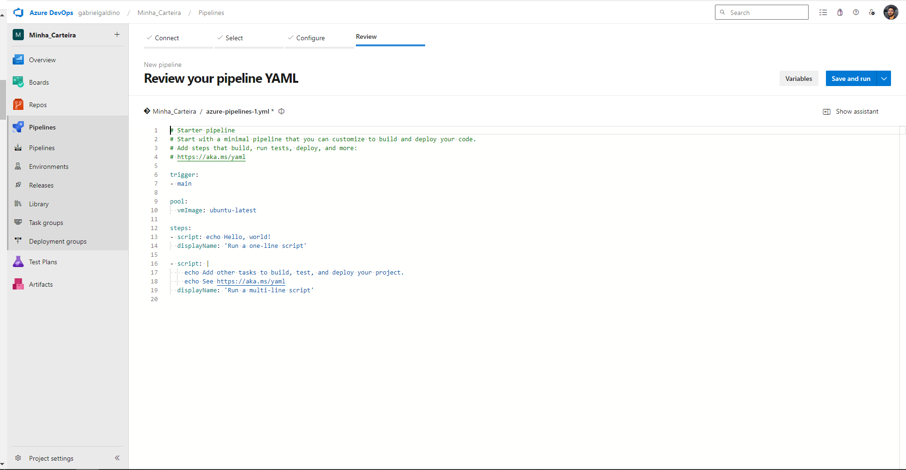

<div style={{textAlign: 'center'}}>

[](https://cta-service-cms2.hubspot.com/web-interactives/public/v1/track/redirect?encryptedPayload=AVxigLKtcWzoFbzpyImNNQsXC9S54LjJuklwM39zNd7hvSoR%2FVTX%2FXjNdqdcIIDaZwGiNwYii5hXwRR06puch8xINMyL3EXxTMuSG8Le9if9juV3u%2F%2BX%2FCKsCZN1tLpW39gGnNpiLedq%2BrrfmYxgh8G%2BTcRBEWaKasQ%3D&webInteractiveContentId=125788977029&portalId=5613826)

</div>


## Introduction

Integrate the Conviso Platform seamlessly into your [Azure DevOps Pipelines](https://dev.azure.com/) to automate and streamline your security processes. This integration ensures thorough security assessments for your applications throughout the development lifecycle.

You can run the Conviso Platform AST (Application Security Testing), which offers Static Application Security Testing (SAST), Software Composition Analysis (SCA), and Code Review directly on your Azure Pipelines.

This integration provides the **CLI as a Docker** image for executing tasks and establishing connections with the Conviso Platform.

[Explore our Integration page to learn more and supercharge your Application Security Program with Conviso Platform.](https://cta-service-cms2.hubspot.com/web-interactives/public/v1/track/redirect?encryptedPayload=AVxigLKtcWzoFbzpyImNNQsXC9S54LjJuklwM39zNd7hvSoR%2FVTX%2FXjNdqdcIIDaZwGiNwYii5hXwRR06puch8xINMyL3EXxTMuSG8Le9if9juV3u%2F%2BX%2FCKsCZN1tLpW39gGnNpiLedq%2BrrfmYxgh8G%2BTcRBEWaKasQ%3D&webInteractiveContentId=125788977029&portalId=5613826)

## Prerequisites

Before using Conviso Platform with Azure Pipelines, you must ensure that:

1. You have your Conviso API Key, a code that identifies you to Conviso Platform. Find yours [using this tutorial](https://docs.convisoappsec.com/api/generate-apikey).

2. A [new pipeline is created to run the automation](https://learn.microsoft.com/en-us/azure/devops/pipelines/create-first-pipeline?view=azure-devops#:~:text=Go%20to%20the%20Pipelines%20tab,start%20with%20an%20Empty%20job.). Follow these steps:
* Click on "**Pipelines**" in the left-hand menu.
* Click "**New Pipeline**" and configure it based on your project type.
* You will arrive at your pipeline's ```YAML document```.

<div style={{textAlign: 'center'}}>

[ 'Azure Pipelines page for “create a new pipeline')](https://cta-service-cms2.hubspot.com/web-interactives/public/v1/track/redirect?encryptedPayload=AVxigLKtcWzoFbzpyImNNQsXC9S54LjJuklwM39zNd7hvSoR%2FVTX%2FXjNdqdcIIDaZwGiNwYii5hXwRR06puch8xINMyL3EXxTMuSG8Le9if9juV3u%2F%2BX%2FCKsCZN1tLpW39gGnNpiLedq%2BrrfmYxgh8G%2BTcRBEWaKasQ%3D&webInteractiveContentId=125788977029&portalId=5613826)
</div>

3. Set two environment variables for the runner: ```CONVISO_API_KEY```.
To set a variable for a build pipeline:
* Go to the **Pipelines** page, select the relevant pipeline, and click "**Edit**."
* Locate the **Variables** section for that pipeline.
* Add or update the variable, optionally marking it as secret.
* **Save** the pipeline changes.

<div style={{textAlign: 'center'}}>

[ 'Azure Pipelines page for "review your yaml pipeline"')](https://cta-service-cms2.hubspot.com/web-interactives/public/v1/track/redirect?encryptedPayload=AVxigLKtcWzoFbzpyImNNQsXC9S54LjJuklwM39zNd7hvSoR%2FVTX%2FXjNdqdcIIDaZwGiNwYii5hXwRR06puch8xINMyL3EXxTMuSG8Le9if9juV3u%2F%2BX%2FCKsCZN1tLpW39gGnNpiLedq%2BrrfmYxgh8G%2BTcRBEWaKasQ%3D&webInteractiveContentId=125788977029&portalId=5613826)
</div>

## Perform a Conviso AST scan to analyze your application's security
Empower your security analysis with Application Security Testing (AST) by directly incorporating the Conviso AST scan into your pipeline. This versatile tool offers SAST, SCA, and Code Review capabilities, all integrated within your pipeline.

Follow the script below to integrate Security Code Review seamlessly into your pipeline, creating a comprehensive solution within your ```azure-pipelines.yml``` file:

```yml
trigger:
  - master  
jobs:
- job: Conviso_Appsec_AST
  pool:
    vmImage: ubuntu-latest
  container:
    image: 'convisoappsec/convisocli'

  steps:
    - checkout: self
      persistCredentials: true
    - bash: |
          conviso ast run --vulnerability-auto-close
      displayName: 'Running Conviso AST'
      env:
         CONVISO_API_KEY: $(CONVISO_API_KEY)
```

The identified vulnerabilities will be automatically sent the new Asset created on Conviso Platform. 

## Running the Conviso Containers

To perform the [Conviso Containers](../security-scans/conviso-containers/conviso-containers.md), you can use the example configuration below:

```yml
trigger: none
  - master  
jobs:
- job: Conviso_Containers
  pool:
    vmImage: ubuntu-latest
  container:
    image: 'convisoappsec/convisocli'

  steps:
    - checkout: self
      persistCredentials: true
    - bash: |
          export DOCKER_BUILDKIT=1
          export IMAGE_NAME='vulnerables/web-dvwa'
          export IMAGE_TAG='latest'
          docker build -t $IMAGE_NAME:$IMAGE_TAG .
          conviso container run "$IMAGE_NAME:$IMAGE_TAG"
      displayName: 'Running Conviso AST'
      env:
         CONVISO_API_KEY: $(CONVISO_API_KEY)
```

If you'd like to scan a public image available on DockerHub, modify the configuration as shown below:

```yml
trigger: none
  - master  
jobs:
- job: Conviso_Containers
  pool:
    vmImage: ubuntu-latest
  container:
    image: 'convisoappsec/convisocli'

  steps:
    - checkout: self
      persistCredentials: true
    - bash: |
          export IMAGE_NAME='vulnerables/web-dvwa'
          export IMAGE_TAG='latest'
          docker pull $IMAGE_NAME:$IMAGE_TAG
          conviso container run "$IMAGE_NAME:$IMAGE_TAG"
      displayName: 'Running Conviso AST'
      env:
         CONVISO_API_KEY: $(CONVISO_API_KEY)

```

:::note
These are only examples. You are required to provide the image for scanning, and you can use alternative methods based on your environment.

The `IMAGE_NAME` and `IMAGE_TAG` are variables that should be adjusted based on your project. For example, you may want to name the image after your project or version it differently.
:::

## Troubleshooting
If you encounter authentication issues after loading the ```CONVISO_API_KEY``` variable, please ensure it has been properly loaded within the environment session of all tasks utilizing the CLI.

## Support
If you have any questions or need help using our product, please don't hesitate to contact our support team.

## Resources
By exploring our content, you'll find resources to help you to understand the benefits of the Conviso Platform integrations for Secure CI/CD Pipeline:

[AppSec: Integrations with CI/CD tools through Conviso Platform](https://bit.ly/3ODN0jw): Follow this article to understand how we can integrate your main tools within a single platform.

[](https://cta-service-cms2.hubspot.com/web-interactives/public/v1/track/redirect?encryptedPayload=AVxigLKtcWzoFbzpyImNNQsXC9S54LjJuklwM39zNd7hvSoR%2FVTX%2FXjNdqdcIIDaZwGiNwYii5hXwRR06puch8xINMyL3EXxTMuSG8Le9if9juV3u%2F%2BX%2FCKsCZN1tLpW39gGnNpiLedq%2BrrfmYxgh8G%2BTcRBEWaKasQ%3D&webInteractiveContentId=125788977029&portalId=5613826)
