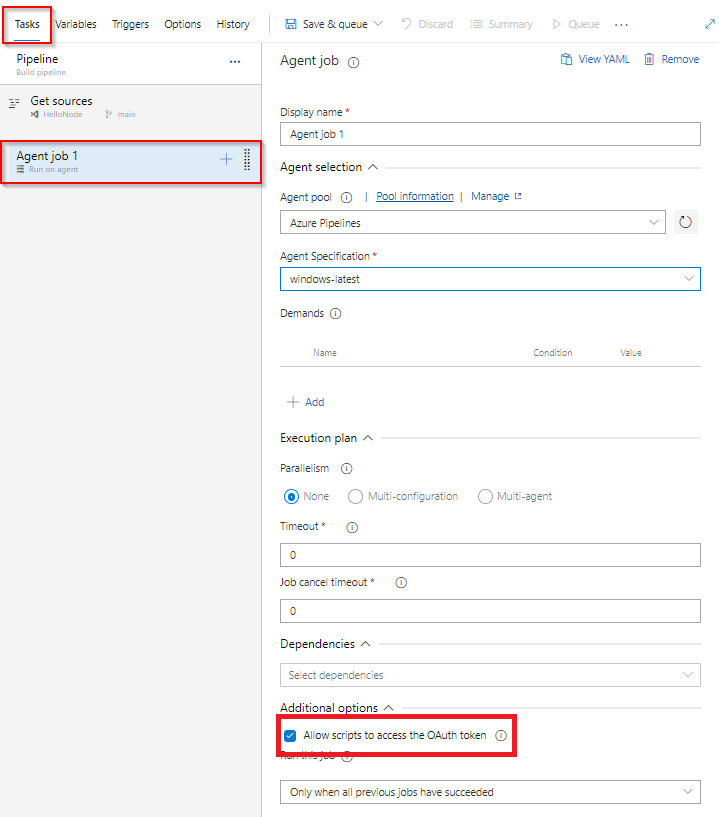
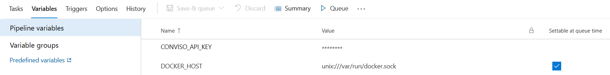
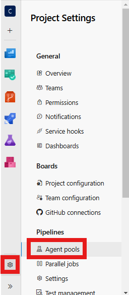
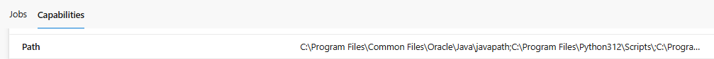
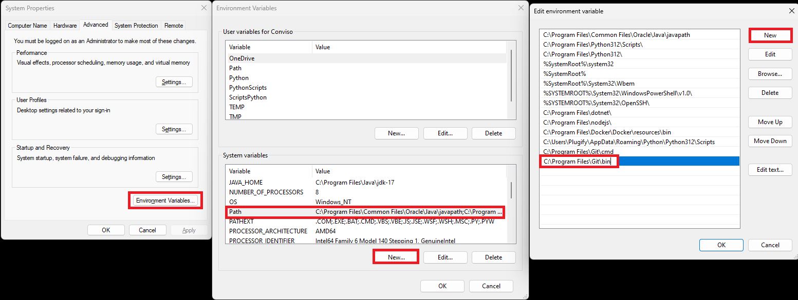

<div style={{textAlign: 'center'}}>


</div>

## Introduction

Integrate the Conviso Platform seamlessly into your [Azure DevOps Pipelines](https://dev.azure.com/) to automate and streamline your security processes. This integration ensures thorough security assessments for your applications throughout the development lifecycle.

The Azure Pipelines is a CI/CD module of the [Azure Devops](https://aex.dev.azure.com/) platform. Through this module, it is possible to create automation routines with various tasks that are available on Azure's marketplace. Currently, the integration with Conviso consists of Bash-type tasks. Among the tasks are: the AST command line interface ([AST available at PyPi](https://pypi.org/project/conviso-ast/)).

## Requirements

In order for the experience with Conviso's services to be complete, it is necessary to meet all the requirements below:

1. Hosted Agent Pool (Ubuntu 22.04 or higher) with Docker installed or Agent Cloud Azure;

2. [Script access to the OAuth token enabled](https://learn.microsoft.com/en-us/azure/devops/pipelines/release/options?view=azure-devops#allow-scripts-to-access-the-oauth-token):

<div style={{textAlign: 'center'}}>



</div>

3. External access (can be limited to Conviso's registry for AST, Dockerhub and Conviso Platform).

## First Steps

Given an Azure DevOps project, to create a Welcome Pipeline you can follow the steps below:

1. At the DevOps Project root, click at **Pipelines**;

2. At the upper right menu, click at **New Pipeline**;

3. Select the **Use the classic editor to create a pipeline without YAML** option;

4. At **Select your Repository** step, select the platform where your code is hosted, the repository and the branch for pipeline execution and click at **Continue**;

5. Select the **Start with an Empty Job** option;

6. Rename the **Agent Job 1** to Conviso Agent, selecting Agent Pool option as **Azure Pipelines** and Agent Specification option as **ubuntu-latest**;

7. At Conviso Agent, click at the **+** icon to add a new task;

8. Add a **Bash** type task, rename the Display Name to **Run Conviso AST** and modify its type to **Inline**;

9. You need to define an environment variable for `CONVISO_API_KEY` and set the value from Conviso Platform. It is important to set this variable as a secret.

10. You will also need to define the `DOCKER_HOST` environment variable and set its value to `unix:///var/run/docker.sock`:

<div style={{textAlign: 'center'}}>



</div>

## Running the Conviso AST

1.  To configure Conviso AST, within the script field, add the code snippet presented below:

```bash
docker run --rm \
  -v /var/run/docker.sock:/var/run/docker.sock \
  -v $(pwd):/opt/flowcli \
  -e DOCKER_HOST=$(DOCKER_HOST) \
  -e CONVISO_API_KEY=$(CONVISO_API_KEY) \
  convisoappsec/convisoast:latest \
  conviso ast run --vulnerability-auto-close
```

2. Click at **Save & Queue**. The pipeline execution will begin in a few moments.

3. The results will be sent to Conviso Platform.

## Running the Conviso Containers

1. To perform the [Conviso Containers](../security-scans/conviso-containers/conviso-containers.md), you can use the example configuration below:

```bash
docker run --rm \
  -v /var/run/docker.sock:/var/run/docker.sock \
  -v $(pwd):/opt/flowcli \
  -e DOCKER_HOST=$(DOCKER_HOST) \
  -e CONVISO_API_KEY=$(CONVISO_API_KEY) \
  convisoappsec/convisoast:latest \
  sh -c "
    export DOCKER_BUILDKIT=1 &&
    export IMAGE_NAME='my-image' &&
    export IMAGE_TAG='latest' &&
    docker build -t \$IMAGE_NAME:\$IMAGE_TAG . &&
    conviso container run \"\$IMAGE_NAME:\$IMAGE_TAG\"
  "
```

2. If you'd like to scan a public image available on DockerHub, modify the configuration as shown below:

```bash
docker run --rm \
  -v /var/run/docker.sock:/var/run/docker.sock \
  -v $(pwd):/opt/flowcli \
  -e DOCKER_HOST=$(DOCKER_HOST) \
  -e CONVISO_API_KEY=$(CONVISO_API_KEY) \
  convisoappsec/convisoast:latest \
  sh -c "
    export IMAGE_NAME='my-image' &&
    export IMAGE_TAG='latest' &&
    docker pull \$IMAGE_NAME:\$IMAGE_TAG &&
    conviso container run \"\$IMAGE_NAME:\$IMAGE_TAG\"
  "
```

:::note
These are only examples. You are required to provide the image for scanning, and you can use alternative methods based on your environment.

The `IMAGE_NAME` and `IMAGE_TAG` are variables that should be adjusted based on your project. For example, you may want to name the image after your project or version it differently.
:::

## Importing and Synchronizing Assets from External Scanners

Integrating the Conviso Platform with external scanners such as Checkmarx, Fortify, or Dependency-Track allows for automated asset import and synchronization. This ensures that your Conviso Platform remains up-to-date with the latest scan results. To configure this behavior, follow these steps:

1. Access the Azure DevOps Marketplace.
2. Search for **Conviso Azure Sync Task** or directly visit [this link](https://marketplace.visualstudio.com/items?itemName=Conviso.convisoAzureSyncTask).
3. Click on **Get it free**.
4. Edit Your Azure DevOps Pipeline.
5. In the **Pipelines variables** section, add the `CONVISO_API_KEY` variable and set its value to your [Conviso API Key](../platform/security-feed.md#generate-api-key).
6. Within the pipeline configuration, add the **Conviso Azure Sync Task**.
7. Fill in the fields as follows:
   - Conviso API Key: `$(CONVISO_API_KEY)`.
   - Project ID in the external tool: Project ID from the external scanner (e.g., Fortify, Checkmarx, Dependency_Track).
   - Integration Name: Name of the integration in Conviso's GraphQL schema (e.g., Fortify, Checkmarx, Dependency_Track).
   - Company ID: Company ID in Conviso Platform.
8. Save the pipeline configuration and execute it to initiate the synchronization process.

**Expected Behaviors**:
- **Importing a New Project**: If the external scanner's project does not exist in the Conviso Platform, it will be imported as a new asset.
- **Synchronizing an Existing Project**: If the project already exists in the Conviso Platform, it will be synchronized to update its data.

In both scenarios, the process is triggered by the pipeline and executed asynchronously. You can monitor the progress directly within the respective asset on the Conviso Platform.

## Troubleshooting

### Configuring API Key

If authentication is not performed even when loading the ```CONVISO_API_KEY``` variable, make sure it is provided as environment variables for all tasks that use the CLI.

### Ensuring Git is added to PATH Environment Variable

If you encounter the error below, ensure that the `PATH` environment variable includes `C:\Program Files\Git\bin`:

```
Unable to locate executable file: 'bash'. Please verify either the file path exists or the file can be found within a directory specified by the PATH environment variable.
```

Follow these steps to verify and update it:

1. Access your project in Azure;
2. Navigate to **Agent pools**:

<div style={{textAlign: 'center'}}>



</div>

3. In the **Capabilities** tab, search for the **Path** environment variable:

<div style={{textAlign: 'center'}}>



</div>

4. Add `C:\Program Files\Git\bin` to the environment variable.

<div style={{textAlign: 'center'}}>



</div>

5. Restart the agent service.

### Allowing Script Access to the OAuth Token

If you encounter the following error, it indicates that the script does not have access to the OAuth token:

```
Error: Cmd('git') failed due to: exit code(128)
    cmdline: git fetch --unshallow
    stderr: 'fatal: could not read user Password for 'https://organization@dev.azure.com': terminal prompts disabled' 
```

To resolve this issue, follow these steps:

1. Open the Agent job configuration in your pipeline settings.

2. Under **Additional options**, select the checkbox labeled [**Allow scripts to access the OAuth token**](https://learn.microsoft.com/en-us/azure/devops/pipelines/release/options?view=azure-devops#allow-scripts-to-access-the-oauth-token):

<div style={{textAlign: 'center'}}>


</div>

3. Save the changes and rerun the pipeline.

[](https://cta-service-cms2.hubspot.com/web-interactives/public/v1/track/redirect?encryptedPayload=AVxigLKtcWzoFbzpyImNNQsXC9S54LjJuklwM39zNd7hvSoR%2FVTX%2FXjNdqdcIIDaZwGiNwYii5hXwRR06puch8xINMyL3EXxTMuSG8Le9if9juV3u%2F%2BX%2FCKsCZN1tLpW39gGnNpiLedq%2BrrfmYxgh8G%2BTcRBEWaKasQ%3D&webInteractiveContentId=125788977029&portalId=5613826)