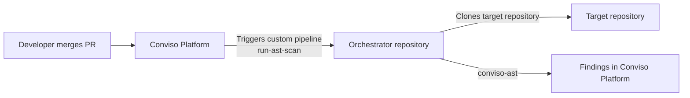

# Bitbucket AST Orchestrator

The Conviso Platform **Bitbucket AST Orchestrator** centralizes AST scanning in a **single** Bitbucket repository. Instead of adding a pipeline to every application repo, you maintain **one** Pipelines config. After each eligible pull request merge, Conviso triggers a **custom pipeline** (`run-ast-scan`) and tells it which repository and branch to scan.

You do **not** need Conviso CI YAML in every application repository.

## How it works



Benefits:

- **Centralized management**: Scanning logic lives in one `bitbucket-pipelines.yml`.
- **Consistency**: Same scan behavior for every mapped repository.
- **Simple onboarding**: Add repositories in Conviso without duplicating CI in each app.

:::note
**Execution costs**: Scans run in your Bitbucket Pipelines environment and consume your Bitbucket build minutes.
:::

## Before you begin

You will work in **two consoles**: Bitbucket first, then Conviso Platform.

You need:

- [Bitbucket ALM integration](./bitbucket.md) already connected, with repositories imported as assets.
- A Bitbucket repository that will host the orchestrator (recommended name: `conviso-ast-orchestrator`).
- Permission to enable **Pipelines** and set **Repository variables** on that repository.
- Your **Conviso API key** for the target environment.

| Term | Meaning |
| --- | --- |
| **Orchestrator repository** | The single Bitbucket repo with `bitbucket-pipelines.yml` and the custom pipeline `run-ast-scan`. |
| **Target repository** | Any imported application repository you want scanned. It needs **no** Conviso pipeline of its own. |
| **Custom pipeline** | Bitbucket Pipelines entry under `pipelines.custom` that Conviso triggers by name (`run-ast-scan`). |
| **Asset** | The repository entry in Conviso Platform where findings are stored (named `workspace/repo`). |

---

## Part 1 – Bitbucket setup

### Step 1 – Create (or pick) the orchestrator repository

1. In Bitbucket, create a dedicated repository (or reuse one) to host the orchestrator.
2. Enable **Pipelines** for that repository (**Repository settings → Pipelines → Settings**).

### Step 2 – Add the Conviso API key

In the orchestrator repository → **Repository settings → Repository variables**, create:

| Variable | Secured? | Description |
|----------|----------|-------------|
| `CONVISO_API_KEY` | **Yes** (secured) | Conviso Platform API key for your company / environment. |

### Step 3 – Add `bitbucket-pipelines.yml`

On the branch you will configure as **Ref** in Conviso (usually `main`), create `bitbucket-pipelines.yml` with:

```yaml
image: convisoappsec/convisoast_v2:latest

pipelines:
  custom:
    run-ast-scan:
      - variables:
          - name: repo_full_name
          - name: branch
          - name: api_url
            default: https://app.convisoappsec.com
          - name: company_id
            default: ""
          - name: asset_id
            default: ""
          - name: scan_run_id
            default: ""
          - name: commit_sha
            default: ""
          - name: pr_id
            default: ""
      - step:
          name: Run Conviso AST
          clone:
            enabled: false
          script:
            - export CONVISO_APIKEY="$CONVISO_API_KEY"
            - export CONVISO_BASE_URL="${api_url:-https://app.convisoappsec.com}"
            - export CONVISO_REPO_FULL_NAME="$repo_full_name"
            - export CONVISO_ASSET_ID="$asset_id"
            - export CONVISO_SCAN_RUN_ID="$scan_run_id"
            - umask 077 && conviso-ast-repository-token --provider bitbucket > repo_token
            - |
              git clone --branch "$branch" \
                "https://x-token-auth:$(cat repo_token)@bitbucket.org/${repo_full_name}.git" target
            - rm -f repo_token
            - cd target
            - export GIT_CONFIG_COUNT=1 GIT_CONFIG_KEY_0=safe.directory GIT_CONFIG_VALUE_0='*'
            - export CONVISO_COMPANY_ID="${company_id:-$CONVISO_COMPANY_ID}"
            - export CONVISO_BRANCH="$branch"
            - conviso-ast -b "$branch"
```

The custom pipeline name must be exactly **`run-ast-scan`** — that is the name Conviso triggers.

*Step 3: `bitbucket-pipelines.yml` with `run-ast-scan`, and secured `CONVISO_API_KEY` in repository variables.*


Commit and push to the orchestrator **Ref** branch.

---

## Part 2 – Conviso Platform setup

### Step 4 – Configure the orchestrator in Conviso

1. Open **Integrations** → **Bitbucket** → **Configuration**.
2. Under **Orchestrator pipeline**, set:
   - **Workspace** – Bitbucket workspace slug of the orchestrator repository.
   - **Repository** – repository slug (not the full URL).
   - **Ref** – branch or tag that contains `bitbucket-pipelines.yml` (e.g. `main`). This ref is also used as the expected **merge target** branch filter when the asset does not define its own branch.
3. Click **Save**.
4. Enable **AST scans on merge**.

*Step 4: Orchestrator workspace, repository, ref, and AST scans toggle.*


With **AST scans on merge** enabled and these settings saved, Conviso triggers the orchestrator automatically on eligible PR merges for mapped assets.

---

## How the flow works

1. A pull request is **merged** into the configured target branch of an imported Bitbucket repository.
2. Conviso creates a **custom pipeline** run on the orchestrator repository (`run-ast-scan`), with variables such as `repo_full_name`, `branch`, `company_id`, `asset_id`, and `api_url`.
3. The job clones the **target** repository and runs `conviso-ast`.
4. Findings are sent to the mapped asset in Conviso Platform.

## Validation

| Check | Expected result |
|-------|-----------------|
| Repository variable | `CONVISO_API_KEY` is set (secured) |
| Pipelines YAML | Custom pipeline named `run-ast-scan` exists on the Ref branch |
| Conviso config | Workspace + repository + ref saved; **AST scans on merge** on |
| Merge test | After merge, Bitbucket shows a Pipelines run on the orchestrator; findings appear on the asset |

Optional manual check in Bitbucket: **Run pipeline** → choose custom pipeline **`run-ast-scan`** and fill `repo_full_name` / `branch` for a known imported repo (plus `api_url` / `company_id` / `asset_id` if needed).

*Validation: successful orchestrator pipeline run.*


*Validation: findings visible on the asset in Conviso Platform (Conviso AST).*


## Troubleshooting

| Symptom | What to check |
|---------|----------------|
| `Requested selector is not found` | `pipelines.custom.run-ast-scan` exists on the **exact Ref** configured in Conviso |
| Pipeline never starts after merge | **AST scans on merge** on; orchestrator fields saved; merge target matches Ref / asset branch; webhooks healthy |
| Authentication / API key errors | `CONVISO_API_KEY` valid for the same environment as `api_url`; Bitbucket integration still connected |
| Clone fails | Target repository is imported under the same integration; OAuth user still has access |
| Findings missing in Platform | Job finished green; `company_id` / `asset_id` injected; asset exists and is active |

## Support

If you need help validating orchestrator settings, Pipelines permissions, or repository access, contact Conviso Support.

## Related guides

- [Bitbucket Integration (ALM)](./bitbucket.md)
- [Bitbucket Pipelines (per-repository CI)](./bitbucket-pipelines.md)
- [Conviso AST](../security-scans/conviso-ast/conviso-ast.md)
