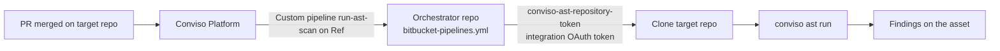

# Bitbucket AST Orchestrator

The Conviso Platform **Bitbucket AST Orchestrator** runs Conviso AST from **one** Bitbucket repository (the orchestrator). Application repositories do **not** need a Conviso Pipelines file.

When an eligible pull request is **merged**, Conviso triggers a **custom pipeline** (`run-ast-scan`) on the orchestrator and passes the target repository and branch. The job obtains a short-lived clone credential from the Platform (using your API key), clones the target repository, runs `conviso ast run`, and sends findings to the mapped asset.

You do **not** store a Bitbucket App password or OAuth token for clone — only `CONVISO_API_KEY`.

## How it works



What Conviso checks before dispatching:

1. The event is a pull request that was **merged**.
2. **AST scans on merge** is enabled on the Bitbucket integration.
3. The repository is an **imported asset** that is **enabled**.
4. The PR **destination branch** matches the configured [AST branch pattern](#ast-branch-pattern).

The pipeline always appears on the **orchestrator** repository (not on the application repository).

:::note
**Execution costs:** Pipelines run in your Bitbucket Pipelines environment and consume your Bitbucket build minutes.
:::

## Before you begin

Work in this order: **Bitbucket setup first**, then **Conviso Platform**.

You need:

- [Bitbucket ALM integration](./bitbucket.md) connected (OAuth), with repositories imported as assets.
- At least one application repository **imported as an asset** and **enabled**.
- A dedicated orchestrator repository (or an empty repo you will use only for this). Example / template: [convisoappsec/pipeline-orchestrator](https://github.com/convisoappsec/pipeline-orchestrator).
- Permission to enable **Pipelines** and set **Repository variables** on the orchestrator.
- A **Conviso API key** for the same environment you will scan against (production or staging).

| Term | Exact meaning |
| --- | --- |
| **Orchestrator repository** | Bitbucket repo that contains `bitbucket-pipelines.yml`. Conviso triggers this repo only. |
| **Target repository** | Application repo imported as an asset. It must **not** rely on a local Conviso Pipelines file for this flow. |
| **Ref** | Branch or tag **of the orchestrator** where Bitbucket loads `bitbucket-pipelines.yml` when Conviso starts the custom pipeline. |
| **AST branch pattern** | Regular expression matched against the merged PR's **destination** branch on the **target** repo. Only a branch it matches triggers a scan. See below. |
| **Custom pipeline** | Entry under `pipelines.custom` that Conviso triggers by name (`run-ast-scan`). |
| **Asset** | Imported repository in Conviso (`workspace/repo`) where findings are stored. |

### AST branch pattern

Conviso decides whether a merge triggers a scan by matching the merged PR's **destination branch**
against a **regular expression** you configure — the **AST branch pattern**. One pattern can name
several branches (`main|develop`) or a whole family of them (`release/.*`).

Before this, the platform compared that branch to a **single name**, with exact equality. Only two
setups were expressible: one branch, or every branch.

#### Where you set it

| Level | Where | Applies to |
| --- | --- | --- |
| **Repository** | The **Branch pattern** column on the repository table, in the integration's configuration step | That repository only |
| **Integration** | **Branch pattern that runs the AST**, on the integration configuration page | Every repository of this integration that has no pattern of its own |

#### Which one applies

The first level that is configured wins:

1. The repository's own **Branch pattern**.
2. The integration's **Branch pattern that runs the AST**.
3. The integration **Ref** — *legacy fallback*, so nothing changes for a setup that was already using Ref as a branch filter.
4. Nothing configured — **every branch** triggers a scan.

:::note Ref is the orchestrator's branch, not a branch policy
**Ref** means "which branch of the orchestrator repository holds `bitbucket-pipelines.yml`". It was reused as a branch
filter before the branch pattern existed, and it still is when nothing else is set — but it is no
longer the field to use for branch policy. Set a branch pattern instead, and leave Ref meaning the
one thing it should mean.
:::

#### How a pattern is matched

* **The whole branch name must match.** `main` matches `main` and nothing else — not `maintenance`, not `remain`.
* **A plain branch name behaves exactly as it did before.** Every value already configured in your account keeps meaning exactly what it means today. There is nothing to migrate and nothing you need to do.
* **`|` is how you list branches:** `main|develop|homolog`.
* **The pattern is validated when you save it.** One that does not compile, is longer than 500 characters, or is too slow to evaluate is refused, with the reason shown under the field.
* **A pattern that fails at merge time does not dispatch.** If a stored expression errors or times out while a merge is being evaluated, Conviso skips the scan rather than spending your CI budget on a decision it could not make.

#### Examples

| Pattern | Merges that trigger a scan |
| --- | --- |
| *(nothing set at any level)* | Every branch |
| `main` | `main` only |
| `main\|develop` | `main` and `develop` |
| `release/.*` | Every branch under `release/` |
| `main\|release/.*` | `main`, and every branch under `release/` |
| `main` *(stored before this feature)* | `main` only — unchanged |

#### Running the AST on demand

**Run AST** on the asset offers a **Branch to scan** picker, listing only the branches that match
that asset's pattern. If the pattern matches none of the asset's branches, the button is disabled
and says so — adjust the pattern in the integration settings.

---

## Part 1 – Bitbucket setup

### Step 1 – Create the orchestrator repository

1. Create a Bitbucket repository (recommended name: `conviso-ast-orchestrator`), **or** copy from [convisoappsec/pipeline-orchestrator](https://github.com/convisoappsec/pipeline-orchestrator) and keep only `bitbucket-pipelines.yml`.
2. Enable **Pipelines** for that repository (**Repository settings → Pipelines → Settings**).
3. Choose the branch that will contain the Pipelines file (almost always **`main`**). That value is what you will set as **Ref** in Conviso.

### Step 2 – Create the `CONVISO_API_KEY` variable

In the **orchestrator** repository (not the target):

1. Open **Repository settings → Repository variables**.
2. Create:

| Name | Secured? | Required |
|------|----------|----------|
| `CONVISO_API_KEY` | **Yes** (secured) | **Yes** |

Use the API key for the same Conviso environment as the Platform you configured (production vs staging).

:::tip Optional variable
You may add `CONVISO_COMPANY_ID`. The pipeline uses it only when the `company_id` input is empty (typical for a manual **Run pipeline**). When Conviso dispatches after a merge, it sends `company_id` in the variables, so this fallback is not required for Platform-triggered runs.
:::

Do **not** create a Bitbucket App password or OAuth token for clone. The job calls `conviso-ast-repository-token --provider bitbucket`, and the Platform returns the Bitbucket integration’s OAuth credential for that run.

### Step 3 – Add `bitbucket-pipelines.yml`

:::tip Example repository
Public template: **[convisoappsec/pipeline-orchestrator](https://github.com/convisoappsec/pipeline-orchestrator)**  

Pipelines file: [`bitbucket-pipelines.yml`](https://github.com/convisoappsec/pipeline-orchestrator/blob/main/bitbucket-pipelines.yml)
:::

On the orchestrator branch you will set as **Ref** (usually `main`):

1. Create **`bitbucket-pipelines.yml`** at the repository root.
2. Paste the YAML below (or copy it from the example repo).

```yaml
image: convisoappsec/convisoast:latest

pipelines:
  custom:
    run-ast-scan:
      - variables:
          - name: repo_full_name
          - name: branch
          - name: commit_sha
            default: ""
          - name: pr_id
            default: ""
          - name: api_url
            default: https://api.convisoappsec.com
          - name: company_id
            default: ""
          - name: asset_id
            default: ""
          - name: scan_run_id
            default: ""
      - step:
          name: Run Conviso AST
          clone:
            enabled: false
          script:
            - export CONVISO_API_KEY="$CONVISO_API_KEY"
            - |
              export CONVISO_API_URL="${api_url:-https://api.convisoappsec.com}"
              CONVISO_API_URL="${CONVISO_API_URL%/}"
              case "$CONVISO_API_URL" in
                https://app.convisoappsec.com)
                  export CONVISO_API_URL="https://api.convisoappsec.com"
                  ;;
                https://staging.convisoappsec.com)
                  export CONVISO_API_URL="https://api.staging.convisoappsec.com"
                  ;;
              esac
            - export CONVISO_REPO_FULL_NAME="$repo_full_name"
            - |
              case "${asset_id:-}" in
                ""|none|0) unset CONVISO_ASSET_ID || true ;;
                *) export CONVISO_ASSET_ID="$asset_id" ;;
              esac
              case "${scan_run_id:-}" in
                ""|none|0) unset CONVISO_SCAN_RUN_ID || true ;;
                *) export CONVISO_SCAN_RUN_ID="$scan_run_id" ;;
              esac
            - umask 077 && conviso-ast-repository-token --provider bitbucket > repo_token
            - |
              git clone --branch "$branch" \
                "https://x-token-auth:$(cat repo_token)@bitbucket.org/${repo_full_name}.git" target
            - rm -f repo_token
            - cd target
            - export GIT_CONFIG_COUNT=1 GIT_CONFIG_KEY_0=safe.directory GIT_CONFIG_VALUE_0='*'
            - export CONVISO_COMPANY_ID="${company_id:-$CONVISO_COMPANY_ID}"
            - export CONVISO_BRANCH="$branch"
            - conviso ast run --repository-dir . --output "$BITBUCKET_CLONE_DIR/conviso-ast-session.zip"
          artifacts:
            - conviso-ast-session.zip
```

3. Commit and push to that **Ref** branch.

*Step 3: `bitbucket-pipelines.yml` with `run-ast-scan`, and secured `CONVISO_API_KEY` in repository variables.*


:::important
- The custom pipeline name must be exactly **`run-ast-scan`** — that is the selector Conviso triggers.
- This template clones `branch` (the PR destination branch after merge). Conviso also sends `commit_sha` and `pr_id` for correlation.
:::

---

## Part 2 – Conviso Platform setup

### Step 4 – Configure the orchestrator

1. Open **Integrations → Bitbucket → Configuration**.
2. Turn **AST scans on merge** **on**.
3. Under **Orchestrator pipeline**, fill:
   - **Workspace** — Bitbucket workspace slug of the orchestrator repository.
   - **Repository** — repository slug (not the full URL).
   - **Ref** — orchestrator branch/tag that contains `bitbucket-pipelines.yml` (e.g. `main`).
   - **Branch pattern that runs the AST** — optional regular expression for the branches on the **target** repositories that should trigger a scan, e.g. `main|develop`. Leave it empty to keep using **Ref** as the filter. See [AST branch pattern](#ast-branch-pattern).
4. Save.

*Step 4: Orchestrator workspace, repository, ref, and AST scans toggle.*


### Step 5 – Assets and branch pattern

1. Confirm each application repository is **imported** and **enabled**.
2. Set **Branch pattern that runs the AST** on the integration page when more than one branch should be scanned — `main|develop`, or `release/.*`.
3. Override it for a single repository from the **Branch pattern** column on the repository table, when that one ships from a different branch than the rest.
4. If you set neither, the integration **Ref** is still used as the filter (legacy behavior); if Ref is empty too, every branch triggers a scan.

See [AST branch pattern](#ast-branch-pattern) for how the expression is matched and validated.

---

## End-to-end flow (after setup)

1. Developer merges a PR into a branch matching the AST branch pattern, on an imported, enabled asset.
2. Conviso validates the event and configuration, then starts custom pipeline **`run-ast-scan`** on the orchestrator / **Ref**.
3. Variables include at least: `repo_full_name`, `branch` (PR destination), `commit_sha`, `pr_id`, `api_url`, `company_id`, `asset_id` (blank values may be omitted).
4. Job steps: issue repository token → clone target at `branch` → run `conviso ast run` → upload session artifact.
5. Findings appear on the asset in Conviso Platform.
6. In Bitbucket, open the **orchestrator** → **Pipelines** → run **`run-ast-scan`** to inspect the job.

## Validation checklist

| Check | Expected |
|-------|----------|
| Variable | `CONVISO_API_KEY` exists on the orchestrator (secured) |
| Path | `bitbucket-pipelines.yml` with `pipelines.custom.run-ast-scan` is on the **Ref** branch |
| Conviso | Workspace + repository + Ref saved; **AST scans on merge** on |
| Asset | Target repo imported, enabled; the merged branch matches the AST branch pattern (repository level, integration level, or Ref as the legacy fallback) |
| After merge | New Pipelines run on the orchestrator for `run-ast-scan`; findings (or a clean result) on the asset |

*Validation: successful orchestrator pipeline run.*


*Validation: findings visible on the asset in Conviso Platform (Conviso AST).*


Manual test (optional): on the orchestrator, **Run pipeline** → custom pipeline **`run-ast-scan`**. Set `repo_full_name` and `branch` to an imported asset. Leave `api_url` empty for production (`https://api.convisoappsec.com`). Set `company_id` or define `CONVISO_COMPANY_ID`.

## Troubleshooting

| Symptom | Cause / fix |
|---------|-------------|
| Merge done, no pipeline | **AST scans on merge** off; workspace/repository/Ref incomplete; asset disabled or not imported; the merged branch does not match the AST branch pattern; webhooks unhealthy |
| A branch you expected to scan is skipped | The pattern does not match the whole branch name. `main` does not match `main-hotfix`; use `main.*` if that is what you meant. Check the repository pattern first — it overrides the integration's |
| No branch scans any more, after editing a pattern | A stored pattern that fails to compile or times out is treated as "do not dispatch". Reopen the field, save a valid expression, and confirm it is accepted |
| The pattern is refused when you save it | It does not compile, is longer than 500 characters, or is too slow to evaluate. The reason is shown under the field |
| **Run AST** is disabled on the asset | The pattern matches none of the asset's branches. Adjust it in the integration settings |
| `Requested selector is not found` | `pipelines.custom.run-ast-scan` missing on the **exact Ref** configured in Conviso |
| Token / clone fails (HTTP 4xx) | `repo_full_name` not an imported asset for that API key/company; wrong environment (`CONVISO_API_KEY` vs `api_url`); Bitbucket integration not authorized / OAuth user lacks access |
| Unreadable / HTML response from Platform | Use the API host (`api.*`), not `app.*` / `staging.*`. The template normalizes those hosts automatically |
| Scanner missing `CONVISO_COMPANY_ID` | Manual run without `company_id` and without variable `CONVISO_COMPANY_ID` |
| Wrong code scanned | `branch` mismatch; confirm you merged into a branch the AST branch pattern matches |

## Related guides

- [Example orchestrator repository (pipeline-orchestrator)](https://github.com/convisoappsec/pipeline-orchestrator)
- [Bitbucket Integration (ALM)](./bitbucket.md)
- [Bitbucket Pipelines (per-repository CI)](./bitbucket-pipelines.md)
- [Conviso AST](../security-scans/conviso-ast/conviso-ast.md)
