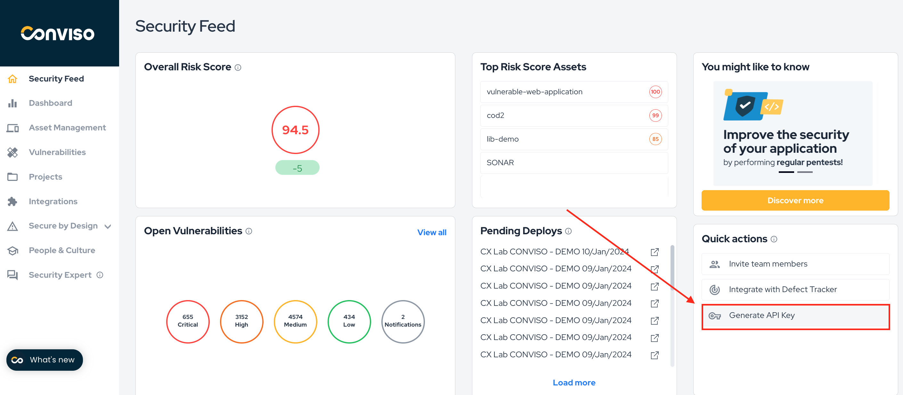
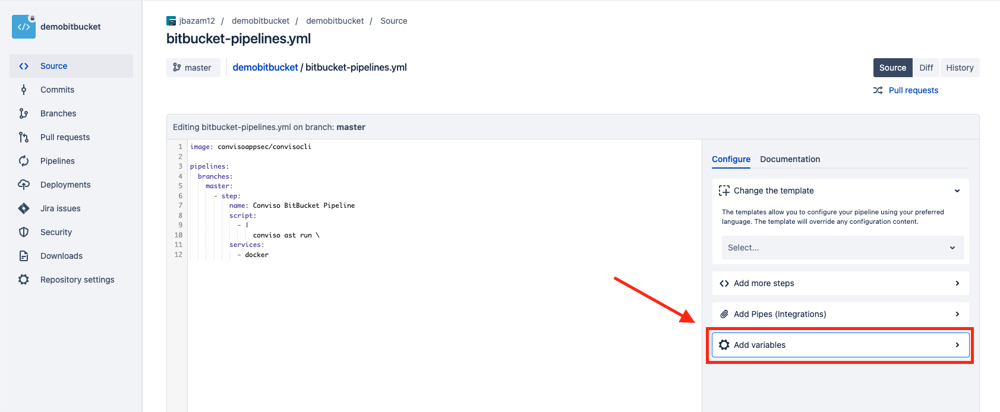
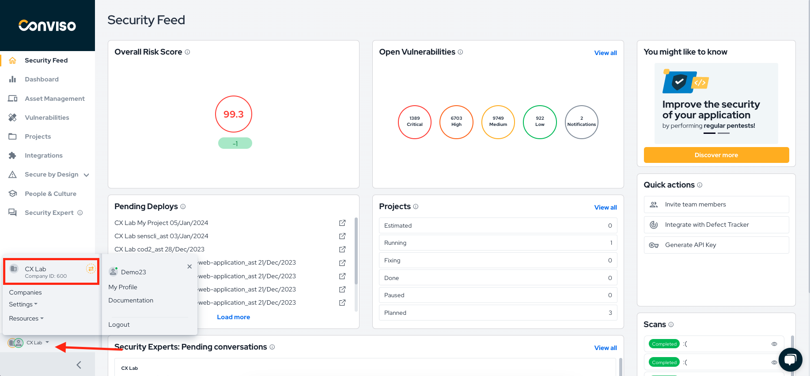

<div style={{textAlign: 'center'}}>


</div>

:::note
First time using Bitbucket? Please refer to the [following documentation](https://bitbucket.org/product/guides/).  
:::

## Introduction


With Conviso Platform integrated into your Bitbucket CI/CD Pipeline, you can automate your security processes, ensuring that your applications undergo through automated security assessments in new versions of your code.

You can run Conviso Platform **AST (Application Security Testing)**. This product offers **Static Application Security Testing (SAST)**, **Software Composition Analysis (SCA)**, Infrastructure as Code (IaC) and enables **Continuous Code Review** performed by our Security Analysts directly on your Bitbucket pipeline.

## Setting up a new repository without an existing pipeline 

To set up a repository, follow the steps below:

1. At the BitBucket project page, click at the **Pipelines** section;
2. Click **Select** at the **Starter Pipeline** option;
3. A text editor will appear; delete all of its content;
4. As the first job, let's invoke the CLI help menu. To do so, paste the snippet below:

```yml
image: convisoappsec/convisocli

pipelines:
  branches:
    master:
      - step:
          name: Conviso BitBucket Pipeline
          script:
            - conviso --help
          services:
            - docker
```

## Setting up Environment Variable

In order for the environment to be ready for the execution of all Conviso CLI resources, it is necessary to configure some environment variable. To accomplish that, follow the steps below:

1. Generate API Key. This key is available for Conviso Platform users at the user profile page;

**Generate API Key** 

<div style={{textAlign: 'center'}}>



</div>

2. Under **Repository Settings**, click at **Repository Variables**;

<div style={{textAlign: 'center'}}>



</div>


## Conviso AST

You can run Conviso Platform **AST (Application Security Testing)**. This product offers **Static Application Security Testing (SAST)**, **Software Composition Analysis (SCA)**, **Infrastructure as Code (IaC)** and enables **Continuous Code Review** to be performed by Security Analysts of Conviso (when supported in your plan) or by your own Security Analysts team.

```yml
image: convisoappsec/convisocli

pipelines:
  branches:
    master:
      - step:
          name: Conviso BitBucket Pipeline
          script:
            - |
                conviso ast run --vulnerability-auto-close \
          services:
            - docker
```

## Running the Conviso Containers

To perform the [Conviso Containers](../security-scans/conviso-containers/conviso-containers.md), you can use the example configuration below:

```yml
image: convisoappsec/convisocli:latest

pipelines:
  branches:
    master:
      - step:
          name: Conviso Containers
          script:
            - export DOCKER_BUILDKIT=1
            - export IMAGE_NAME="my-image"
            - export IMAGE_TAG="latest"
            - docker pull $IMAGE_NAME:$IMAGE_TAG
            - docker build -t $IMAGE_NAME:$IMAGE_TAG .
            - conviso container run "$IMAGE_NAME:$IMAGE_TAG"
          services: 
            - docker
```

If you'd like to scan a public image available on DockerHub, modify the configuration as shown below:

```yml
image: convisoappsec/convisocli:latest

pipelines:
  branches:
    master:
      - step:
          name: Conviso Containers
          script:
            - export IMAGE_NAME="vulnerables/web-dvwa"
            - export IMAGE_TAG="latest"
            - docker pull $IMAGE_NAME:$IMAGE_TAG
            - conviso container run "$IMAGE_NAME:$IMAGE_TAG"
          services: 
            - docker
```

:::note
These are only examples. You are required to provide the image for scanning, and you can use alternative methods based on your environment.

The `IMAGE_NAME` and `IMAGE_TAG` are variables that should be adjusted based on your project. For example, you may want to name the image after your project or version it differently.
:::

## Troubleshooting
If you encounter authentication issues after loading the ```CONVISO_API_KEY``` variable, please ensure it has been properly loaded within the environment session of all tasks utilizing the CLI.


Error. ‘credentials’ cannot be null.


To address this error, add the following lines to the configuration.


```
steps:
- checkout: self
 persistCredentials: true
```


You have access to multiple companies, specify one using CONVISO_COMPANY_ID


To view the company ID, click on the company logo icon, as exemplified in the image.




Example
```
   - export CONVISO_COMPANY_ID=0000
   - conviso ast run --vulnerability-auto-close
```


## Support
If you have any questions or need help using our product, please don't hesitate to contact our support team.


## Resources
By exploring our content, you'll find resources to help you to understand the benefits of the Conviso Platform integrations for Secure CI/CD Pipeline:

[](https://cta-service-cms2.hubspot.com/web-interactives/public/v1/track/redirect?encryptedPayload=AVxigLKtcWzoFbzpyImNNQsXC9S54LjJuklwM39zNd7hvSoR%2FVTX%2FXjNdqdcIIDaZwGiNwYii5hXwRR06puch8xINMyL3EXxTMuSG8Le9if9juV3u%2F%2BX%2FCKsCZN1tLpW39gGnNpiLedq%2BrrfmYxgh8G%2BTcRBEWaKasQ%3D&webInteractiveContentId=125788977029&portalId=5613826)