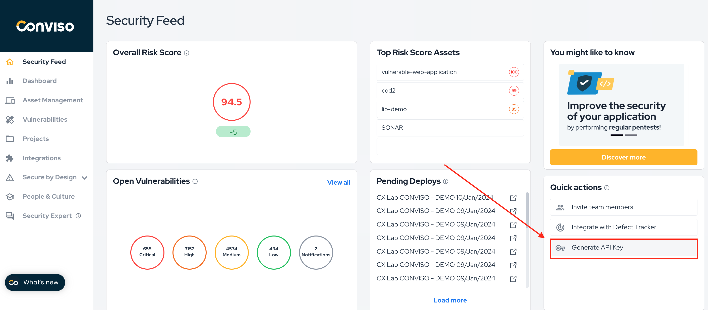
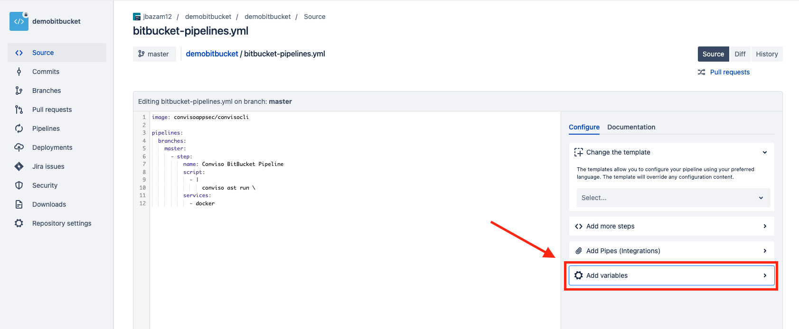
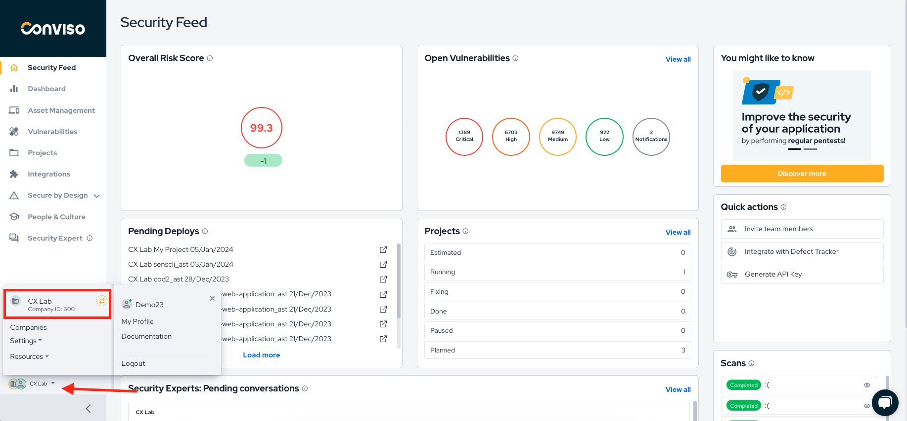

<div style={{textAlign: 'center'}}>


</div>

:::note
First time using Bitbucket? Please refer to the [following documentation](https://bitbucket.org/product/guides/).  

Looking for **centralized AST after merge** (one Pipelines repo for many assets, no per-app YAML)? See the [Bitbucket ALM integration](./bitbucket.md) and [Bitbucket AST Orchestrator](./bitbucket-ast-orchestrator.md).
:::

## Introduction


With Conviso Platform integrated into your Bitbucket CI/CD Pipeline, you can automate your security processes, ensuring that your applications undergo through automated security assessments in new versions of your code.

You can run Conviso Platform **AST (Application Security Testing)**. This product offers **Static Application Security Testing (SAST)**, **Software Composition Analysis (SCA)** and **Infrastructure as Code (IaC)** analysis directly on your Bitbucket pipeline.

The recommended setup is the **[Conviso AST Bitbucket Pipe](#running-conviso-ast-with-the-bitbucket-pipe)**. You can still call `conviso ast run` yourself inside `convisoappsec/convisoast`, the same way as on GitHub Actions.

## Setting up a new repository without an existing pipeline 

To set up a repository, follow the steps below:

1. At the BitBucket project page, click at the **Pipelines** section;
2. Click **Select** at the **Starter Pipeline** option;
3. A text editor will appear; delete all of its content;
4. Paste the [pipe snippet](#running-conviso-ast-with-the-bitbucket-pipe) (or the CLI job below). Add `CONVISO_API_KEY` as a secured repository variable before the first run.

## Setting up Environment Variable

In order for the environment to be ready for the execution of all Conviso AST resources, it is necessary to configure some environment variable. To accomplish that, follow the steps below:

1. Generate API Key. This key is available for Conviso Platform users at the user profile page;

**Generate API Key** 

<div style={{textAlign: 'center'}}>



</div>

2. Under **Repository Settings**, click **Repository variables**. Add `CONVISO_API_KEY` and check **Secured**. Add `CONVISO_COMPANY_ID` with the numeric company ID if you will pass `COMPANY_ID: $CONVISO_COMPANY_ID` to the pipe.

<div style={{textAlign: 'center'}}>



</div>


## Conviso AST

You can run Conviso Platform **AST (Application Security Testing)** with the CLI image. A single `conviso ast run` reports findings to the asset on the Conviso Platform.

```yml
image: convisoappsec/convisoast:latest

pipelines:
  branches:
    main:
      - step:
          name: Conviso AST
          clone:
            depth: full
          script:
            - conviso ast run
          services:
            - docker
```

The identified vulnerabilities are sent to the asset on Conviso Platform. Use the [Vulnerabilities](../platform/vulnerabilities) resource to work on the correction flow.

## Running Conviso AST with the Bitbucket Pipe

Instead of running the CLI inside `image: convisoappsec/convisoast`, you can add the **Conviso AST** pipe. A single pipe covers SAST, SCA and IaC and calls `conviso-ast`. To configure it, follow these steps:

1. Open the pipe repository: [conviso-appsec/bitbucket-ast-pipe](https://bitbucket.org/conviso-appsec/bitbucket-ast-pipe).
2. In the repository you want to scan, go to **Repository settings → Repository variables** and add `CONVISO_API_KEY` with your [Conviso API Key](../api/api-overview.md#generate-api-key). Check **Secured**.
3. Optionally add `CONVISO_COMPANY_ID` with your numeric company ID (or pass the ID as a literal in YAML).
4. Edit `bitbucket-pipelines.yml`.
5. Configure the pipeline with the following code:
```yaml
pipelines:
  branches:
    main:
      - step:
          name: Conviso AST
          clone:
            depth: full
          script:
            - pipe: docker://convisoappsec/bitbucket-ast-pipe:1.0.3
              variables:
                CONVISO_API_KEY: $CONVISO_API_KEY
                COMPANY_ID: $CONVISO_COMPANY_ID
```
6. `COMPANY_ID` must be numeric. Replace `$CONVISO_COMPANY_ID` with your company ID, or store that ID as a repository variable that expands to digits. Adjust the pipeline settings below to your workflow.
7. Save it and run the pipeline.

**Pipeline Settings**: the pipe itself needs only `CONVISO_API_KEY` and `COMPANY_ID` — everything around it is a starting point you should adapt:
- `pipelines.branches`: The branches worth scanning. `main` is an example, so use your own. The pipe does not filter refs.
- Pull request pipelines: add a `pull-requests:` entry. Findings are filed under the **source** branch.
- Other steps in the same file: add a Conviso AST step; do not replace the rest of the file.
- `clone.depth: full`: Full history, required only when you use `BASELINE_REF`. Without it, the default clone is enough.
- `docker://`: Required until the pipe is on Bitbucket's [official Pipes list](https://bitbucket.org/product/features/pipelines/integrations). Without it, Bitbucket looks the name up in that catalog and fails with “pipe that doesn't exist”. The Hub account is `convisoappsec` (no hyphen).

**Field Descriptions**:
- `CONVISO_API_KEY`: Your [Conviso API Key](../api/api-overview.md#generate-api-key). Store it as a **secured** repository variable and pass `CONVISO_API_KEY: $CONVISO_API_KEY` on the pipe. Bitbucket only injects user-defined variables into a pipe when they are listed and passed.
- `COMPANY_ID`: Your numeric company ID in the Conviso Platform.
- `BASELINE_REF`: Branch, tag, or commit to compare against so only what changed is scanned, such as `main` or `$BITBUCKET_PR_DESTINATION_BRANCH`. Optional. Requires `clone: depth: full` on the step.
- `ASSET_ID`: Pins the scan to a specific asset, skipping the automatic lookup by repository URL. Optional; use it if a scan stops with an asset ambiguity error.
- `SCAN_PATH`: Directory to scan, relative to the checkout. Optional; default `.`. Not named `PATH`.
- `BRANCH`: Overrides the branch recorded on the Platform. Optional; leave empty to use Bitbucket's source branch.
- `DRY_RUN`: Set to `"true"` to run `conviso-ast --dry-run` without writing to the Platform.
- `BASE_URL`: Only for a dedicated or on-premise instance. Default `https://api.convisoappsec.com`.

**Expected Behaviors**:
- **Branch association**: The scan is recorded against the branch the pipeline is for. In a **pull request** pipeline, this is the branch the pull request is coming **from**, so its findings are not filed under the target branch.
- **Findings never fail the pipeline**: The step fails only when a scan or an upload fails. Bitbucket has no `allow_failure` on a pipe. Put tests in `parallel` with `fail-fast: false` if a failing scan must not stop them.
- **Session archive**: This pipe does not copy a session zip into the checkout and does not declare artifacts. Logs stay inside the pipe container.

:::note
The pipe requires Bitbucket Cloud Pipelines on **Linux**. The image is published for `linux/amd64` only (`convisoappsec/convisoast`). Bitbucket does not have GitLab's **Protect variable**: a secured variable is masked in logs and still available on every branch that runs Pipelines. Restrict which branches run the pipe in your YAML.
:::

## Running the Conviso Containers

To perform the [Conviso Containers](../security-scans/conviso-containers/conviso-containers.md), you can use the example configuration below:

```yml
image: convisoappsec/convisoast:latest

pipelines:
  branches:
    master:
      - step:
          name: Conviso Containers
          script:
            - export DOCKER_BUILDKIT=1
            - export IMAGE_NAME="my-image"
            - export IMAGE_TAG="latest"
            - docker pull $IMAGE_NAME:$IMAGE_TAG
            - docker build -t $IMAGE_NAME:$IMAGE_TAG .
            - conviso container run "$IMAGE_NAME:$IMAGE_TAG"
          services: 
            - docker
```

If you'd like to scan a public image available on DockerHub, modify the configuration as shown below:

```yml
image: convisoappsec/convisoast:latest

pipelines:
  branches:
    master:
      - step:
          name: Conviso Containers
          script:
            - export IMAGE_NAME="vulnerables/web-dvwa"
            - export IMAGE_TAG="latest"
            - docker pull $IMAGE_NAME:$IMAGE_TAG
            - conviso container run "$IMAGE_NAME:$IMAGE_TAG"
          services: 
            - docker
```

:::note
These are only examples. You are required to provide the image for scanning, and you can use alternative methods based on your environment.

The `IMAGE_NAME` and `IMAGE_TAG` are variables that should be adjusted based on your project. For example, you may want to name the image after your project or version it differently.
:::

## Troubleshooting

If `CONVISO_API_KEY` is missing from the job, confirm it exists under **Repository settings → Repository variables** and, for the pipe, that the step passes `CONVISO_API_KEY: $CONVISO_API_KEY`. Secured variables are still not injected into a pipe unless they are listed there.

**It looks like you tried to use a pipe … that doesn't exist**

The YAML used `pipe: conviso-appsec/bitbucket-ast-pipe:1.0.3` without `docker://`. Use `pipe: docker://convisoappsec/bitbucket-ast-pipe:1.0.3`.

**You have access to multiple companies, specify one using CONVISO_COMPANY_ID**

Pass `COMPANY_ID` on the pipe (or `export CONVISO_COMPANY_ID` in a CLI step). To view the company ID, click on the company logo icon, as exemplified in the image.



```yaml
              COMPANY_ID: "0000"
```

**The pipe never runs on my feature branch**

The pipe does not decide which refs create a pipeline. Add that branch under `pipelines.branches`, or use `default:` / `pull-requests:`.

## Support
If you have any questions or need help using our product, please don't hesitate to contact our support team.
