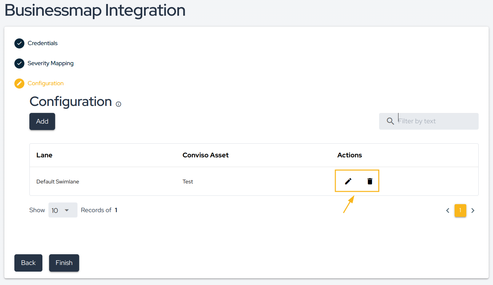
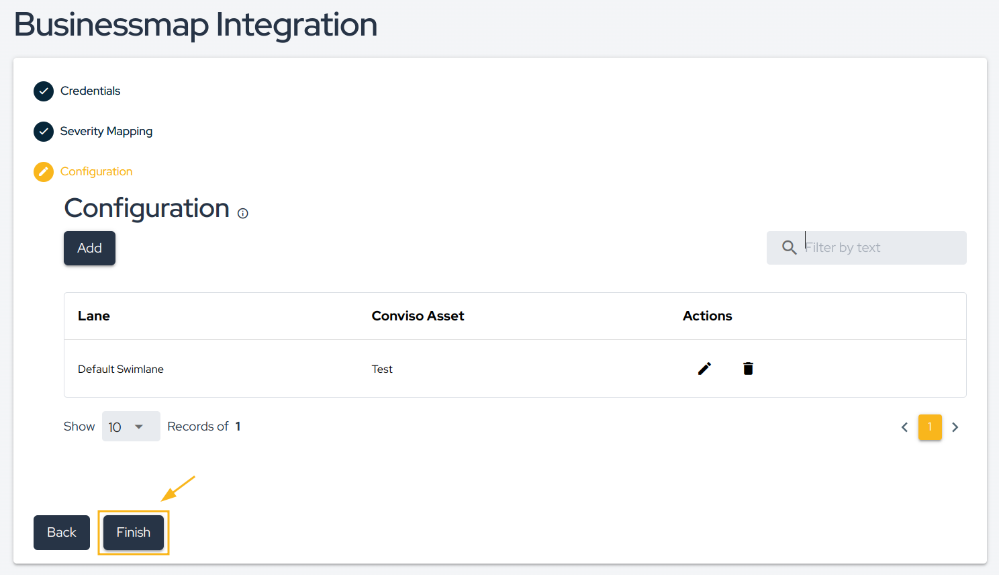

## Introduction
The [Conviso Platform](https://cta-service-cms2.hubspot.com/web-interactives/public/v1/track/redirect?encryptedPayload=AVxigLKtcWzoFbzpyImNNQsXC9S54LjJuklwM39zNd7hvSoR%2FVTX%2FXjNdqdcIIDaZwGiNwYii5hXwRR06puch8xINMyL3EXxTMuSG8Le9if9juV3u%2F%2BX%2FCKsCZN1tLpW39gGnNpiLedq%2BrrfmYxgh8G%2BTcRBEWaKasQ%3D&webInteractiveContentId=125788977029&portalId=5613826) integrates with [BusinessMap](https://businessmap.io/) enabling the creation of issues, comments, and a Webhook for issue comments.

This integration streamlines issue control management and vulnerability consolidation.

### Integration Capabilities
This integration enhances issue control management and vulnerability consolidation between systems. It facilitates seamless interaction and communication between various aspects of the process. The integration offers the following capabilities:

**From BusinessMap to Conviso Platform:**
* Foster interaction by sharing information from BusinessMap with the development team responsible for corrections in Vulnerability Management from Conviso Platform.

**From Conviso Platform to BusinessMap:**
* Generates new issues in BusinessMap based on events within Conviso Platform's Vulnerability Management System, such as identified vulnerabilities or completed security assessments.
* Establishes a linkage between vulnerabilities detected in Conviso Platform and their relevant issues in BusinessMap, enhancing traceability and collaborative efforts.
* Updates BusinessMap issues when specific actions occur in Conviso Platform's Vulnerability Management System, such as changes in vulnerability status, assessment completions, or updates to risk levels.
* Transitions BusinessMap issues to appropriate workflow stages when vulnerabilities are resolved or mitigated within Conviso Platform's Vulnerability Management System.

### Prerequirements
To set up the integration, you'll need the following information:

1. BusinessMap's website address (e.g: `https://conviso.businessmap.io`)

2. API Token for authentication purposes. See **[here to get the API Token from BusinessMap](https://businessmap.io/api)**.

## Usage
To seamlessly integrate Conviso Platform with BusinessMap, follow these step-by-step procedures:

**[1 - Configure the integration between Conviso Platform and BusinessMap](#configure-the-integration-between-conviso-platform-and-businessmap)**

**[2 - Synchronize vulnerability statuses between Conviso Platform and BusinessMap using Webhooks](#synchronize-vulnerability-statuses-between-conviso-platform-and-businessmap-using-webhooks)**

## Configure the integration between Conviso Platform and BusinessMap
Follow the instructions below to complete the integration setup.

**Step 1 -** First, access **BusinessMap** and copy the **URL** of your site, as shown in the image below:

**Step 2 -** Next, to generate the **API Token **(label), visit your's BusinessMap site and enter your credentials. When logged in, click in **your account picture (1)**, then click on **API button (2)**.

**Step 3 -** In the pop-up window that appears, click in **Generate new API Key (1)** and then **copy it to the clipboard (2)**.

**Step 3** - Now that you have the required information, go to **Conviso Platform**, look for the **Integrations (1)** on the left side menu, choose **Defect Tracker (2)** at the Categories panel to the right and finally click the **Integrate (3)** button just below BusinessMap’s card, as illustrated in the example image below:

**Step 4** - Then, enter all **BusinessMap** information in the fields requested by [Conviso Platform](https://cta-service-cms2.hubspot.com/web-interactives/public/v1/track/redirect?encryptedPayload=AVxigLKtcWzoFbzpyImNNQsXC9S54LjJuklwM39zNd7hvSoR%2FVTX%2FXjNdqdcIIDaZwGiNwYii5hXwRR06puch8xINMyL3EXxTMuSG8Le9if9juV3u%2F%2BX%2FCKsCZN1tLpW39gGnNpiLedq%2BrrfmYxgh8G%2BTcRBEWaKasQ%3D&webInteractiveContentId=125788977029&portalId=5613826), as demonstrated in the initial integration setup section.

**Step 5 - Severity Mapping** refers to BusinessMap's two-way integration with Conviso Platform. Select which severity will be referenced to BusinessMap's priority:

**Step 6 -** Then, in **Configuration**, click on the **Add** button to start pairing Conviso Platform Assets with **BusinessMap Boards:**

**Step 7 -** At the drop-down list **New Project Documentation**, select the **Conviso Platform Asset** you want to associate with your **BusinessMap Board**, which will be chosen at the BusinessMap Board drop-down list . You can also perform **Issue** and **status configuration**.

**Step 8 -** After mapping all Conviso Platform statuses to BusinessMap statuses, click on the** Save button**.

**Step 9 -** Click on the **Check Integration Connection** button to check if the platform connects with BusinessMap platform. If the connection is successful you will see the following message:

**Step 10** - After saving your integration configuration, you may want to review, modify or delete it from Conviso Platform. To do so, at your integration configuration panel, choose the **Edit** icon to review or change it; if you want to completely delete it, use the **Trash** icon at its right:

**Step 11** - Whenever a new vulnerability is detected, it is automatically sent to the lane in BusinessMap, as shown in the image below:

## Synchronize vulnerability statuses between Conviso Platform and BusinessMap using Webhooks

This feature facilitates seamless bidirectional synchronization of vulnerability statuses between the Conviso Platform and BusinessMap.

**Step 1: Copy Webhook URL**

Access the configuration page for the BusinessMap integration from the Conviso Platform. Copy the webhook URL provided by the Conviso Platform.

**Step 2: Configure the Webhook in BusinessMap**

To enable synchronization, follow these steps:

1. Access the BusinessMap platform.
2. Enter the board you wish to synchronize with the Conviso Platform.
3. Click on the three dots button.
4. Select "Board Webhooks."

**Step 3: Configure the Webhook URL**

In the Webhook URL field, paste the URL copied in the previous step.

**Note:** Remember to click "Save" after configuring the integration in BusinessMap.

## Support

Should you have any questions or require assistance while using the Conviso Platform, feel free to contact our dedicated support team.

## Resources

By exploring our comprehensive content, you’ll discover resources that will enhance your understanding of AppSec.

[Conviso Blog](https://bit.ly/3JtXM8A): Access a wealth of informative videos covering various topics related to AppSec. Please note that the content is primarily in Portuguese.

[Conviso's YouTube Channel](https://bit.ly/3NIbbfM): Engage with our informative podcast, where we discuss AppSec-related subjects, providing valuable insights and discussions. The podcast is conducted in Portuguese.

[AppSec to Go - Conviso's Podcast on AppSec](https://spoti.fi/43UJQwN): Explore our blog, which offers a collection of articles and posts covering a wide range of AppSec topics. The content on the blog is primarily written in English.

