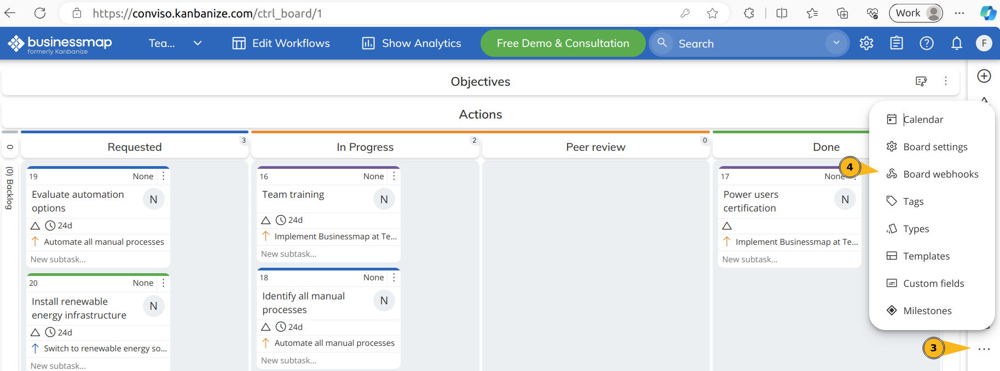
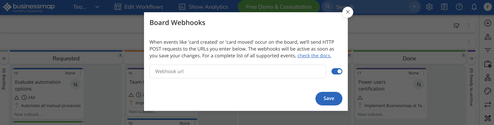

## Introduction
The [Conviso Platform](https://cta-service-cms2.hubspot.com/web-interactives/public/v1/track/redirect?encryptedPayload=AVxigLKtcWzoFbzpyImNNQsXC9S54LjJuklwM39zNd7hvSoR%2FVTX%2FXjNdqdcIIDaZwGiNwYii5hXwRR06puch8xINMyL3EXxTMuSG8Le9if9juV3u%2F%2BX%2FCKsCZN1tLpW39gGnNpiLedq%2BrrfmYxgh8G%2BTcRBEWaKasQ%3D&webInteractiveContentId=125788977029&portalId=5613826) integrates with [BusinessMap](https://businessmap.io/) enabling the creation of issues and a Webhook for updating issue status.

Integrate the Conviso Platform with BusinessMap to enhance your vulnerability management and issue control. This integration allows you to synchronize vulnerability statuses between the Conviso Platform and BusinessMap using Webhooks.

### Integration Capabilities
This integration enhances issue control management and vulnerability consolidation between systems. It facilitates seamless interaction and communication between various aspects of the process. The integration offers the following capabilities:

**From BusinessMap to Conviso Platform:**
* Foster interaction by sharing information from BusinessMap with the development team responsible for corrections in Vulnerability Management from Conviso Platform.

**From Conviso Platform to BusinessMap:**
* Generates new issues in BusinessMap based on events within Conviso Platform's Vulnerability Management System, such as identified vulnerabilities or completed security assessments.
* Establishes a linkage between vulnerabilities detected in Conviso Platform and their relevant issues in BusinessMap, enhancing traceability and collaborative efforts.
* Updates BusinessMap issues when specific actions occur in Conviso Platform's Vulnerability Management System, such as changes in vulnerability status, assessment completions, or updates to risk levels.
* Transitions BusinessMap issues to appropriate workflow stages when vulnerabilities are resolved or mitigated within Conviso Platform's Vulnerability Management System.

### Prerequirements
To set up the integration, you'll need the following information:

1. BusinessMap's website address (e.g: `https://conviso.businessmap.io`)

2. API Token for authentication purposes. See **[here to get the API Token from BusinessMap](https://businessmap.io/api)**.

:::warning

The API Token used in the integration must have full access and permission to all boards in order to the integration work as expected.

:::

## Usage
To seamlessly integrate Conviso Platform with BusinessMap, follow these step-by-step procedures:

**[1 - Configure the integration between Conviso Platform and BusinessMap](#configure-the-integration-between-conviso-platform-and-businessmap)**

**[2 - Synchronize vulnerability statuses between Conviso Platform and BusinessMap using Webhooks](#synchronize-vulnerability-statuses-between-conviso-platform-and-businessmap-using-webhooks)**

## Configure the integration between Conviso Platform and BusinessMap
Follow the instructions below to complete the integration setup.

**Step 1 -** First, access **BusinessMap** and copy the **URL** of your site, as shown in the image below:

**Step 2 -** Next, to generate the **API Token **(label), visit your's BusinessMap site and enter your credentials. When logged in, click in **your account picture (1)**, then click on **API button (2)**.

**Step 3 -** In the pop-up window that appears, click in **Generate new API Key (1)** and then **copy it to the clipboard (2)**.

**Step 4** - Now that you have the required information, go to **Conviso Platform**, look for the **Integrations (1)** on the left side menu, choose **Defect Tracker (2)** at the Categories panel to the right and finally click the **Integrate (3)** button just below BusinessMap’s card, as illustrated in the example image below:

**Step 5** - Then, enter all **BusinessMap** information in the fields requested by [Conviso Platform](https://cta-service-cms2.hubspot.com/web-interactives/public/v1/track/redirect?encryptedPayload=AVxigLKtcWzoFbzpyImNNQsXC9S54LjJuklwM39zNd7hvSoR%2FVTX%2FXjNdqdcIIDaZwGiNwYii5hXwRR06puch8xINMyL3EXxTMuSG8Le9if9juV3u%2F%2BX%2FCKsCZN1tLpW39gGnNpiLedq%2BrrfmYxgh8G%2BTcRBEWaKasQ%3D&webInteractiveContentId=125788977029&portalId=5613826), as demonstrated in the initial integration setup section.

**Step 6 - Severity Mapping** refers to BusinessMap's two-way integration with Conviso Platform. Select which severity will be referenced to BusinessMap's priority:

**Step 7 -** Then, in **Configuration** page, click on the **Check connection (1)** button to verify if the authentication is **working properly (2)**:

### Custom Configuration vs Default Configuration

At this point in the process, you have two options: **Custom Configuration** or **Default Configuration**.

With **Custom Configuration**, you can specifically link a Conviso Platform asset to a single BusinessMap board. On the other hand, **Default Configuration** enables you to link all available assets under Conviso Platform to a single BusinessMap board by default — providing a standard integration setup.

**Note**: In the event that you have both a custom configuration for an asset named "My-Asset" and a default configuration for the integration, the custom configuration will always take precedence over the default configuration.

### a) Custom Configuration

**Step 8 -** In order to add a new integration between a Conviso Asset and a BusinessMap Board, click on the **Add Custom Configuration** button to start pairing Conviso Platform Assets with specific **BusinessMap Boards**.

**Step 9 -** Select the **Conviso Platform Asset** you want to associate with your **BusinessMap Workspace**, **BusinessMap Board**, **BusinessMap Workflow**, and finally **BusinessMap Lane**.

**Step 10 -** Consider the following in order to map Conviso Platform statuses to BusinessMap statuses: **Identified status (1)** is required to map the vulnerabilities from Conviso Platform to BusinessMap, while **other fields (2)** are optional. After mapping all the statuses, click on the **Save button (3)**.

**Step 11** - After saving your integration configuration, you may want to review, modify, or delete it from Conviso Platform. To do so, at your integration configuration panel, choose the **Edit** icon to review or change it; if you want to completely delete it, use the **Trash** icon at its right.

### b) Default Configuration

**Step 8 -** In order to add a new default integration from Conviso Platform to specific BusinessMap Board, click on the **Default Configuration** button:

**Step 9 -** Select the **BusinessMap Workspace**, **BusinessMap Board**, **BusinessMap Workflow** and finally **BusinessMap Lane** that you want all the vulnerabilities will be sent:

**Step 10 -** Consider the following in order to map Conviso Platform statuses to BusinessMap statuses: **Identified status (1)** is required to map the vulnerabilities from Conviso Platform to BusinessMap, while **other fields (2)** are optional. After mapping all the statuses, click on the** Save button (3)**:

**Step 11** - After saving your integration configuration, you may want to review, modify or delete it from Conviso Platform. To do so, at your integration configuration panel, choose the **Edit** icon to review or change it; if you want to completely delete it, use the **Trash** icon at its right:

## Synchronize vulnerability statuses between Conviso Platform and BusinessMap using Webhooks

This feature facilitates seamless bidirectional synchronization of vulnerability statuses between the Conviso Platform and BusinessMap specific board.

**Step 1: Copy Webhook URL**

Access the configuration page for the BusinessMap integration from the Conviso Platform. Copy the webhook URL provided by the Conviso Platform clicking on the **"Copy" button (1)**, as shown in the image below:

**Step 2: Configure the Webhook in BusinessMap**

To enable synchronization, follow these steps:

1. Access the BusinessMap platform.
2. Enter the board you wish to synchronize with the Conviso Platform.
3. Click on the three dots button.
4. Select "Board Webhooks."

**Step 3: Configure the Webhook URL**

In the Webhook URL field, paste the URL copied in the previous step.

**Note:** Remember to click "Save" after configuring the integration in BusinessMap.

## Support

Should you have any questions or require assistance while using the Conviso Platform, feel free to contact our dedicated support team.
