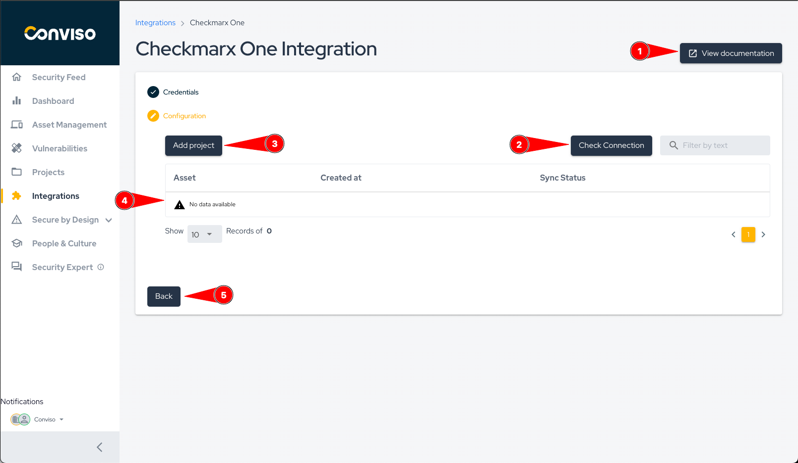
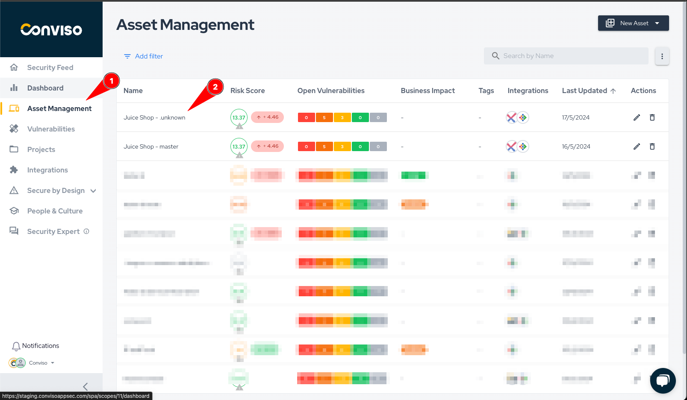

:::note
First time using Checkmarx? Please refer to the [following documentation](https://checkmarx.com/resource/documents/en/34965-68517-checkmarx-one-user-guide.html).
:::

## Introduction

This integration consolidates scan results of applications in Checkmarx with Conviso Platform, keeping both solutions synced in real time.

It supports a two-way integration regarding new vulnerabilities and status mapping, so every update in Checkmarx will also update Conviso Platform, as well as updates in the triage of vulnerabilities within Conviso Platform vulnerability management, specifically for False Positives and Accepted Risks transitions.

Aggregating Checkmarx results and other security tools with Conviso Platform will let you have a centralized view for a more efficient prioritization and security risk management of your applications. 

## Requirements

To integrate Checkmarx with the Conviso Platform, you will need the following data:

- Permission to access and modify projects and vulnerabilities, the account you use to create the API key needs to have the "ast-admin" role in Checkmarx.

- API KEY from an user with correct permissions 

## Conviso Platform Setup

To perform the integration between the two platforms, follow these steps after logging into the platform:

1. Click on the Integrations option in the side menu.
2. Look for the Checkmarx One icon and then click on Integrate button.

A form similar to the image below will appear.

If you're not sure where to get the information below, follow our tutorial [here](#how-to-get-the-necessary-information-for-the-integration).

1. Fill in the environment where your checkmarx is hosted.
2. Enter your API token.
3. Enter your tenant name.
4. Click on "Save."

After completing the steps, the following screen will appear.

On this screen, you can manage your Checkmarx integration, view and import projects, and test if your Checkmarx connection is active.

1. View this documentation.
2. Check if the communication with your Checkmarx One is active.
3. Add a new Checkmarx project to the Conviso Platform.
4. Table containing all the assets in the Conviso Platform that you imported from Checkmarx.
5. Button to return to the Checkmarx credentials configuration.

## Importing Assets

To import a new project from Checkmarx One to the Conviso Platform, follow the steps below:
1. Click on Integration in the side menu.
2. Look for the Checkmarx One icon and then click on the Configure button.

This will take you to the Checkmarx One configuration page.

1. Click on the Add Project button.

The Selection Form showing the projects registered in Checkmarx One will appear as shown in the image below.

1. You can use the search bar to filter by project name.
2. Select which projects to import.
3. Click on the Add button at the top of the form.

**Obs: Currently, when you select and import a project from Checkmarx, an asset will be created for each existing branch in that project in Checkmarx, and the vulnerabilities present in the latest scan of each branch will be imported.**

## General Information on Operation

In this section, we will address crucial information about the integration's operation. This includes details about the synchronization process, as well as the status mapping between the involved platforms.

The integration with Checkmarx will enable the import of SCA, SAST, and IaC (Kics) vulnerabilities identified in your project, making it easier to triage and manage these risks directly in Conviso Platform.

Due to the way scans are processed in Checkmarx, we recommend using a full scan. This is because, to close (mark as 'Fixed') SAST vulnerabilities, the entire code must be thoroughly analyzed by Checkmarx. Otherwise, only SCA and IaC (Kics) vulnerabilities will be closed. When using incremental scans, SAST vulnerabilities will be created or their content updated if they already exist.

### Status Mapping

When moving Vulnerabilities from one status to another, the Conviso platform will communicate and mark the Vulnerabilities in Checkmarx according to the following mapping:

| Conviso Platform     | Checkmarx                |
|----------------------|--------------------------|
| Created              | To verify                |
| Identified           | Confirmed                |
| False positive       | Not exploitable          |
| Risk accepted        | Proposed not exploitable |
| Identified           | Urgent*                  |

**Obs: When a vulnerability is marked as "urgent" in Checkmarx, it will be imported as "Identified" because it represents an identified vulnerability. However, when a vulnerability is marked as "Identified" in the Conviso Platform, it will be marked as "Confirmed." Currently, there is no way to mark a vulnerability as "urgent" in Checkmarx through the Conviso Platform.**

The modifications are bidirectional, meaning that when changes are made in the Conviso Platform, these changes will be replicated to Checkmarx, and the same applies in reverse.

When changing the status in the Conviso Platform, these changes will be replicated immediately to Checkmarx. However, if a change is first made in Checkmarx, it will only be replicated to the Conviso Platform after a synchronization between the platforms is performed.

### Synchronization

The synchronization of assets is automatically initiated every time a scan is successfully completed in Checkmarx One. You can also start a manual synchronization.

To check the status or start a manual synchronization, follow the steps below:

1. Go to the Assets Management page.
2. Click on the name of the asset that has the integration with Checkmarx.

On the asset's detail page, click on View All next to Integration, as shown in the image below.

A modal will appear as shown in the photo below.

In this modal, you will have the following information:
1. Time when the last synchronization was initiated.
2. Progress bar showing the progress of the synchronization if it is in progress.
3. Button to start a synchronization. A synchronization can only be initiated if the previous one has already finished.

Alternatively, refer to the [Azure Pipelines documentation](../integrations/azure-pipelines-cli.md#importing-and-synchronizing-assets-from-external-scanners) to automatically synchronize your assets.

## How to get the necessary information for the integration.

To get this information, you will need to log in to Checkmarx One and follow the steps below:

1. In the side menu, hover your mouse over the gear icon.
2. Click on the Identity and Access Management option.

1. In the side menu, click on API Keys.
2. To get the information of environment, you can check the URL and look at the name that comes before the first dot.
3. Still in the URL of the page, where marker 3 points, you will find your tenant name.
4. Create a new API key.

With this information, you can now create the integration in the Conviso Platform by following the steps mentioned above.

