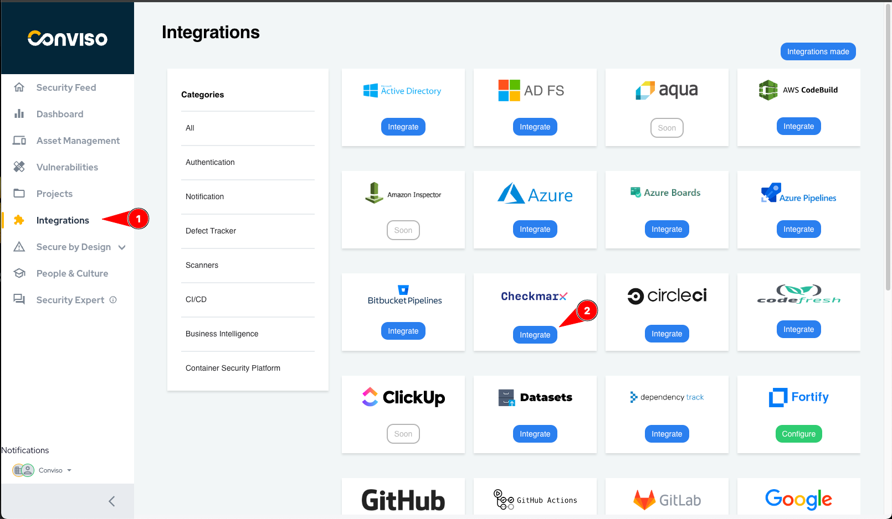
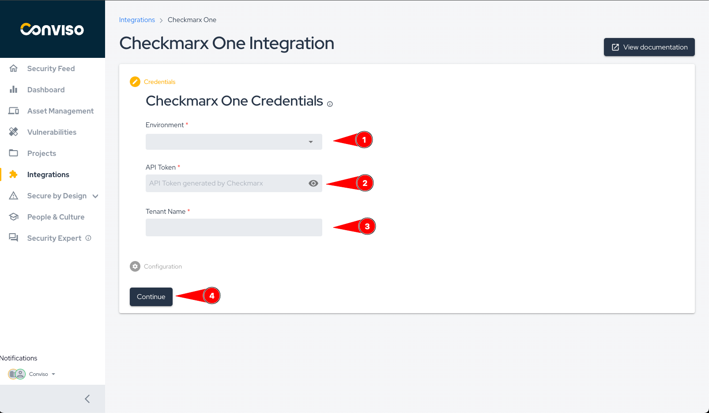

:::note
First time using Checkmarx? Please refer to the [following documentation](https://checkmarx.com/resource/documentation/).  
:::

## Introduction

Consolidate vulnerabilities: From a single console, you can consolidate and apply analysis of vulnerabilities identified by scan and develop action plans for the treatment of vulnerabilities.

The integration allows the import of issues (vulnerabilities) found in Checkmarx to Conviso Platform, allowing the user to take advantage of Conviso Platform full potential for vulnerability management.

## Requirements

- Checkmarx API URL;

- Checkmarx Username;

- Password.

## Conviso Platform Setup

Log in to the [Conviso Platform](https://app.convisoappsec.com);

On the main menu to the left, click on **Integrations**. At the panel to the right, click on the **Scanners** option, then click on the **Integrate** button on the **Checkmarx** card:

Fill in the required fields **Username**, **Password** and **API URL** with proper data. When finished, click on the **Save and Continue** button:

Select one of the synchronization options available, **Daily (everyday, at 23:59)** or **Weekly (every Sunday, at 23:59)**. After choosing your synchronization basis, click on the **Save and Continue** button:

Now, click on the **Sync Checkmarx Asset** button to populate the Assets data:

On the modal shown you have two options. By selecting the top **Asset** checkbox, you will select all of your Checkmarx assets to be imported. You may also select individual assets from the list below, selecting the desired assets to be imported to Conviso Platform. When done selecting your assets to be imported, clic on the **Save** button:

In this final step, review the imported assets and, when done, click on the **Save** button to finishe the Checkmarx integration:

After saving the Checkmarx integration, you may review the imported issues of your assets by using the **Findings** main left menu:

