

:::note
First time using ClickUp? Please refer to the [following documentation](https://docs.clickup.com/en/).  
:::

## Introduction

Streamline your development process by integrating ClickUp as a Defect Tracking tool, enhancing automation and productivity for your development team!

This integration allows you to connect a ClickUp workspace and its lists, enabling seamless two-way communication with the Conviso Platform. With this two-way integration, updates—such as status changes—can flow effortlessly between ClickUp and Conviso Platform. This eliminates the need for repetitive manual actions, saving time and reducing errors.

By integrating ClickUp, your developers can boost productivity by receiving real-time notifications for new tasks whenever vulnerabilities are identified.

### Prerequirements

To set up the integration, you'll need the following information:

1. A valid ClickUp account.
2. Permissions to create tasks and set up automations.

## Conviso Platform integration with ClickUp

On the main menu to the left, click on **Integrations**. At the panel to the right, click on the **Defect Tracking** option, then click on the **Connect** button on the **ClickUp** card:

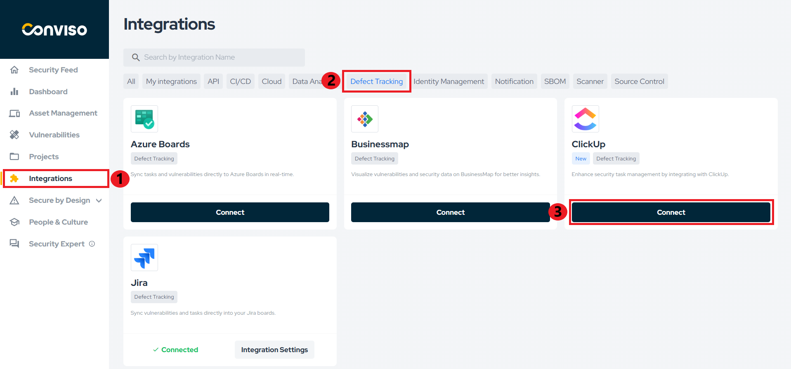

On the **Credentials** section, click on the **Log in with ClickUp** button:

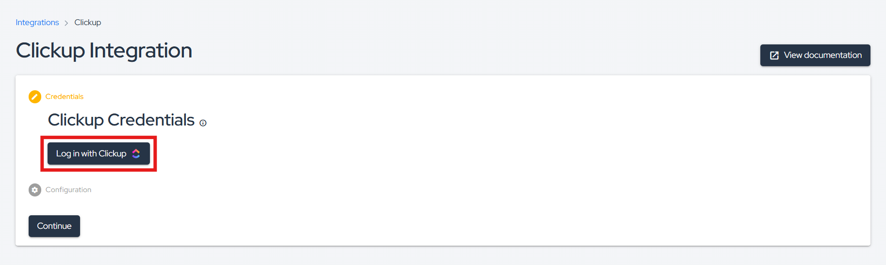

A new screen showing all your ClickUp Workspaces will be shown. Select the ClickUp Workspaces you want to integrate to Conviso Platform, then click on the **Connect Workspace** button:

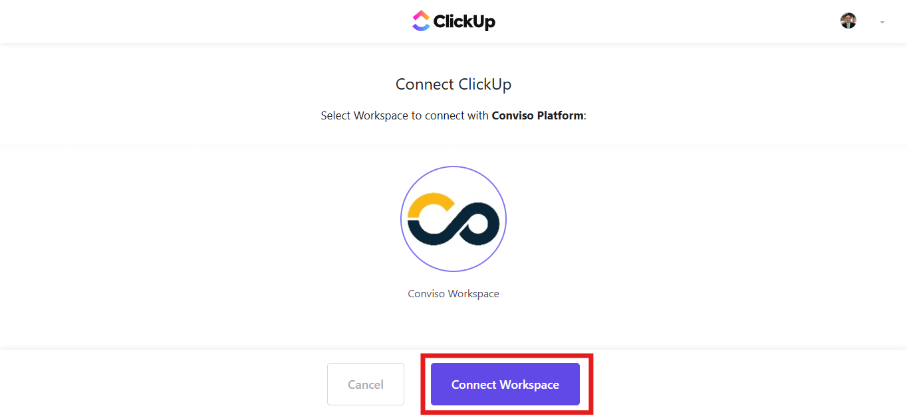

You will be redirected to Conviso Platform, indicating the successful completed connection to ClickUp with a green check next to **Connection Completed**. Click on the **Continue** button:

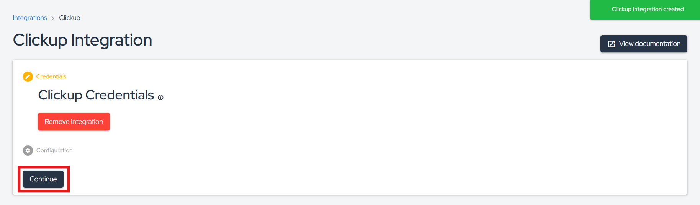

In the **Configuration** section, you can test the integration connectivity, by clicking on the **Check connection**. A green banner at the bottom of the screen will be shown, if the test succeeds (if not, a red banner will indicate that the connection has failed):

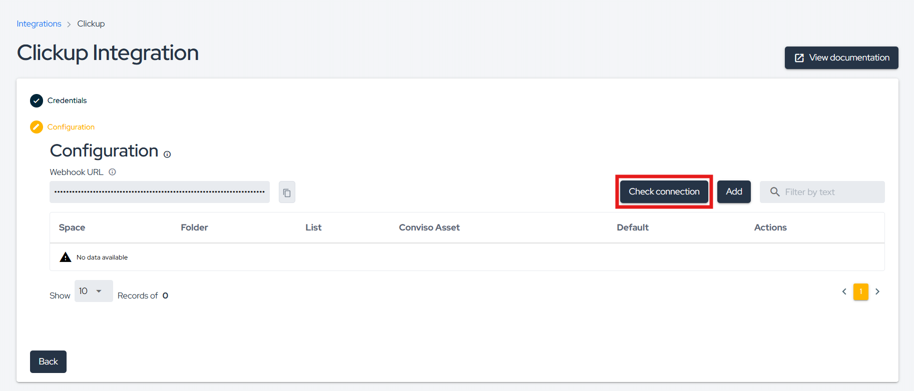

In order to start the ClickUp integration to Conviso Platform, click on the **Add** button at the **Configuration** section:

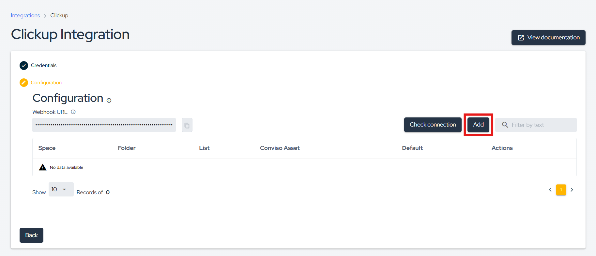

### Custom Configuration vs Default Configuration

At this point in the process, you have two options: **Custom Configuration** or **Default Configuration**.

With **Custom Configuration**, you can specifically link a Conviso Platform asset to a single ClickUp list. On the other hand, Default Configuration enables you to link all available assets under Conviso Platform to a single ClickUp list by default — providing a standard integration setup.

**Note:** In the event that you have both a custom configuration for a specific asset and a default configuration for the integration, the custom configuration will always take precedence over the default configuration.

### a) Custom Configuration

**Step 6 -** Select the **Conviso Platform Asset** you want to associate with your
**ClickUp Space**, **Folder** (optional), and finally the **List**:

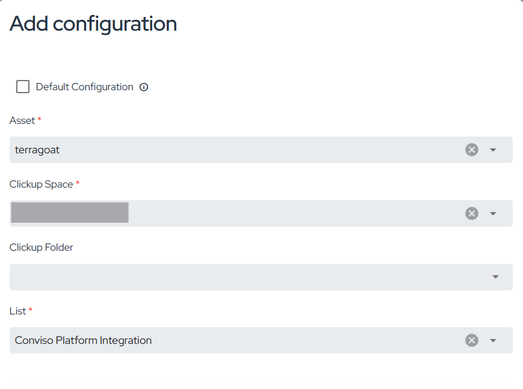

### b) Default Configuration

**Step 6 -** Check the **Default Configuration** field (notice that the Asset label is no longer available), select the **ClickUp Space**, **Folder** (optional), and finally the **List**:

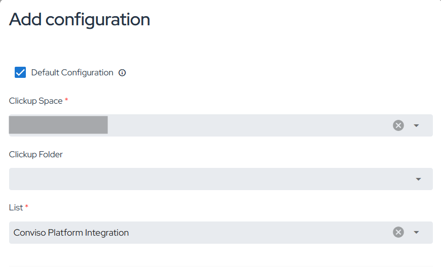

**Step 7 -** Consider the following in order to map Conviso Platform statuses to ClickUp statuses: **Identified status (1)** is required to map the vulnerabilities from Conviso Platform to ClickUp, while **other fields (2)** are optional. After mapping all the statuses, click on the **Save** button.

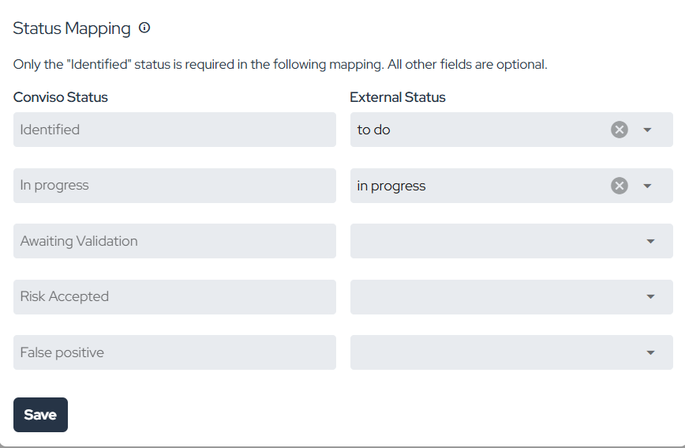

## Synchronize vulnerability statuses between Conviso Platform and ClickUp using Webhooks

**Step 1 -** Copy and save the **WebHook URL**:

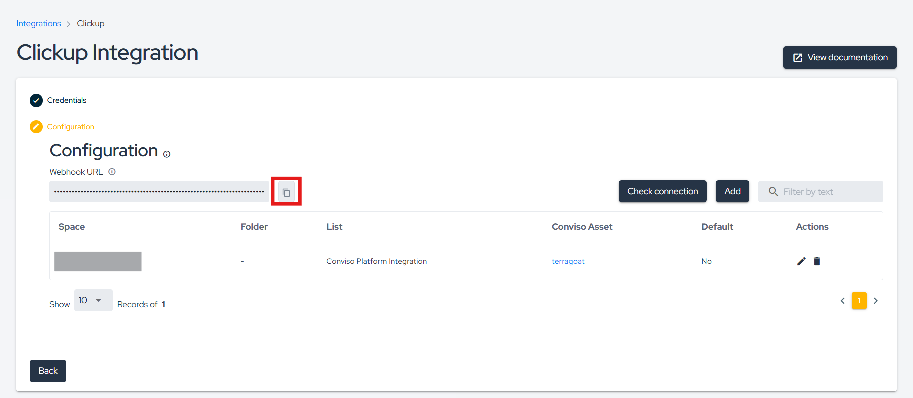

**Step 2 -** Open the desired list in ClickUp and click on **Automations**:

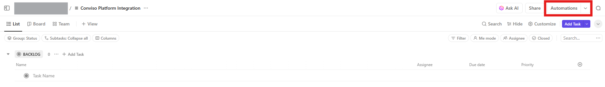

**Step 3 -** Crie uma nova automação com as configurações abaixo e clique emCreate a new automation with the settings below and click on **Create**:

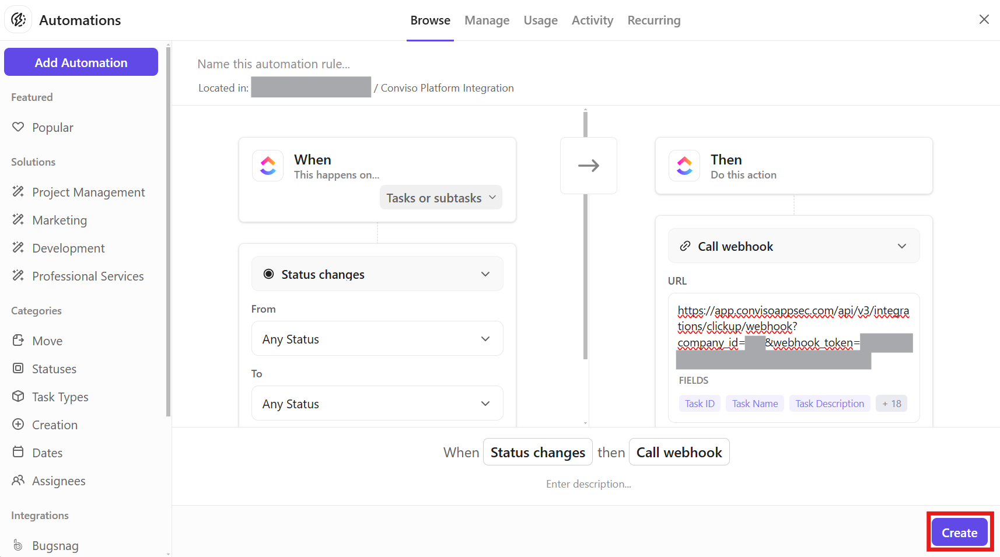

When any status changes to any other status on tasks or subtasks, the webhook will be triggered.

## Support

Should you have any questions or require assistance while using the Conviso Platform, feel free to contact our dedicated support team.
