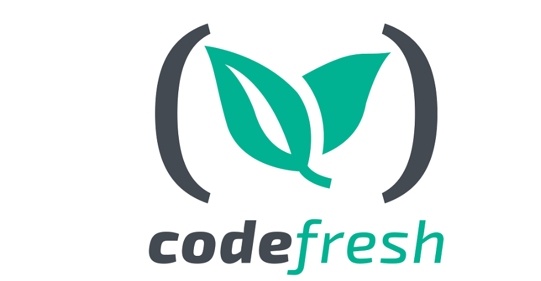

<div style={{textAlign: 'center'}}>



</div>

:::note
First time using Codefresh? Please refer to the [following documentation](https://codefresh.io/docs/).  
:::

## Requirements

Access to docker daemon when running the Pipeline is mandatory. The Codefresh SaaS version does not provide access to this feature by default. Currently, the integration is only compatible with Hybrid type environments (with runners at the infrastructure itself) or fully on-premise. More information about the Code Fresh installation types can be found at [Codefresh official documentation page](https://codefresh.io/docs/docs/administration/installation-security/).

## First Steps

If you have at least one **CodeFresh Runner** installed at your on-premises infrastructure, you can create the first pipeline by interacting with Conviso Platform command line tool, [CLI]. If you do not have one yet, it is recommended that you read the [Runner-related page in the official CodeFresh documentation](https://codefresh.io/docs/docs/administration/codefresh-runner/).

Whereas the local Runner is the default Runtime Environment for your CodeFresh account, all pipelines that didn't have this property changed manually will have their builds performed on it. With that in mind, we can proceed to the creation of a first pipeline to better know Codefresh.

1. At the main menu, click **Pipelines**;
2. In the upper right corner, click **New Pipeline**;
3. Select a project to be the test Pipeline. This Pipeline may be labeled as **conviso_sample**, as we will refer to it hereafter;
4. In this first run, no source code association is required, so the **Add Git Repository** option may remain disabled;
5. By clicking on **Create**, the page will be directed to the **Workflow** tab of the Pipeline, where Codefresh generates an example of a pipeline to be executed. We will not use that example now; copy and paste the code below into the YAML editing window;

```yml
version: "1.0"
stages:
- "test"
steps:
  conviso_sample:
    title: "CLI Hello"
    type: "freestyle"
    image: "convisoappsec/convisocli"
    commands:
      - "conviso --help"
    stage: "test"
```

6. Click **Save** and then click **Run**. In the **Trigger** modal that will be opened, click **Run** again;
7. The pipeline execution process will start. At the end of the build, the expected result is the output of the tool's help command:

```txt title="Output:"
Executing command: conviso --help
Usage: conviso [OPTIONS] COMMAND [ARGS]...
Options:
  -k, --api-key TEXT  The api key to access conviso resources. [env var: FLOW_API_KEY]
  -u, --api-url TEXT  The api url to access conviso resources. [env var: FLOW_API_URL; default: https://app.convisoappsec.com]
  -i, --api-insecure  HTTPS requests to untrusted hosts is enable. [env var: FLOW_API_INSECURE; default: False]
  -h, --help          Show this message and exit.
  -v, --version       Show the version and exit.
Commands:
  deploy
  finding
  sast
  sca
Run conviso COMMAND --help for more information on a command.
Successfully ran freestyle step: CLI Hello
```

## Variables Setup

Authentication between [CLI](../cli/installation) and the Conviso Platform is done using an API key. To do it safely, it is recommended to use the **Variables** of Pipeline. Those variables can be defined by Pipeline or by anything else at the account scope (valid for all projects), via **Shared Configuration**. The second option is more advantageous if there is interaction with the tool in more than one project and/or pipeline.

### Pipeline Variables Setup

At the right corner of pipeline editing screen, there is a menu with **Steps**, **Triggers**, **Variables** and **Help** options. 

1. Click **Variables**, then **Add Variable**;
2. At **Key** field, input the variable name: ```CONVISO_API_KEY``` ;
3. At **Value** field, paste the Conviso Platform API key value. To generate a key, follow this [guide](../api/generate-apikey).
4. After pasting the API key at the **Value** field, you will notice a padlock with the **Encrypt** option. Click the **Encrypt** option and confirm.

### Account Variables Setup

To create global variables, the user must have account administrator privileges.

1. At the main menu on the left, select **Settings** section and click **Account Settings**;
2. At the **Configuration** section, click **Shared Configuration**;
3. Click **Add Shared Value**. If you already have other contexts, click **Add Configuration Context**;
4. Select **Shared Secret** option and label it as **Conviso**;
5. At the **Key** field, input the variable name: ```CONVISO_API_KEY``` ;
6. At the **Value** field, paste the Conviso Platform API key value. To generate a key, follow this [guide];
7. Click **Add variable** and then **Save**.

It is also necessary to import the variable context created above, labeled **Conviso** in each pipeline that will be used. To accomplish that, use the guidelines that follow:

1. At the desired pipeline editing menu, click **Variables** at the menu on the right;
2. Click **Open advanced options** gear icon, and then click **Import from shared configuration**;
3. Select the earlier created **Conviso** context and then click **Add**;
4. Once it has been done, a new section called **Conviso** at **Variables** will be shown, containing passwords inherited from this context.

After fully completing the above tasks, the API key will be available in the pipeline execution context and every action that requires authentication with the platform is already pre-configured.

Notice that if we hadn't configured it that way, every command that require authentication would also require the ```-k``` option with the API key value, as shown by the ```--help``` option at first execution.

## Let us configure Codefresh pipeline in order to run Conviso AST:

The following code snippet will trigger an AST scan and send the results to Conviso Platform:

```yml
conviso_sample:
    title: "Conviso AST"
    type: "freestyle"
    image: "convisoappsec/convisocli"
    commands:
      - "conviso ast run --vulnerability-auto-close"
    stage: "test"
    working_directory: "/codefresh/volume/${{CF_REPO_NAME}}"
```

[](https://cta-service-cms2.hubspot.com/web-interactives/public/v1/track/redirect?encryptedPayload=AVxigLKtcWzoFbzpyImNNQsXC9S54LjJuklwM39zNd7hvSoR%2FVTX%2FXjNdqdcIIDaZwGiNwYii5hXwRR06puch8xINMyL3EXxTMuSG8Le9if9juV3u%2F%2BX%2FCKsCZN1tLpW39gGnNpiLedq%2BrrfmYxgh8G%2BTcRBEWaKasQ%3D&webInteractiveContentId=125788977029&portalId=5613826)