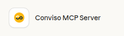
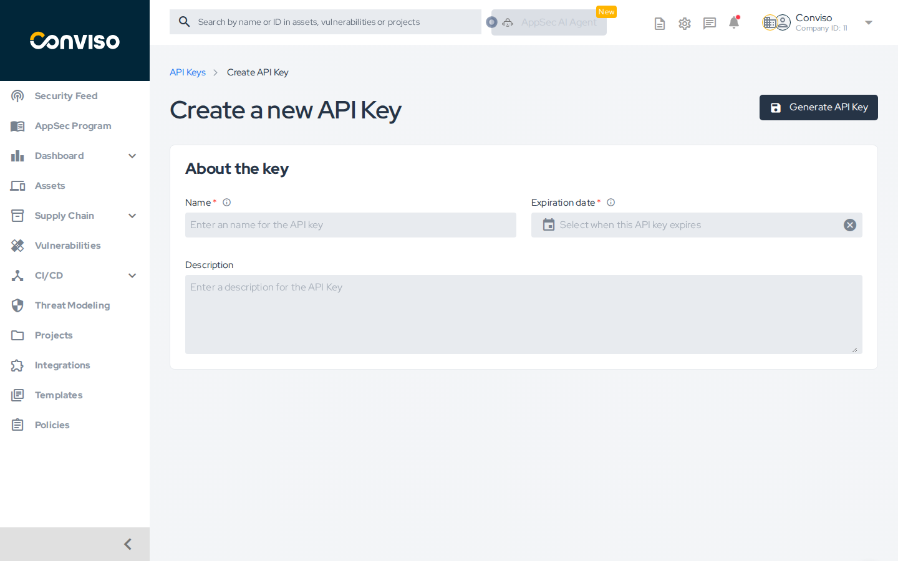
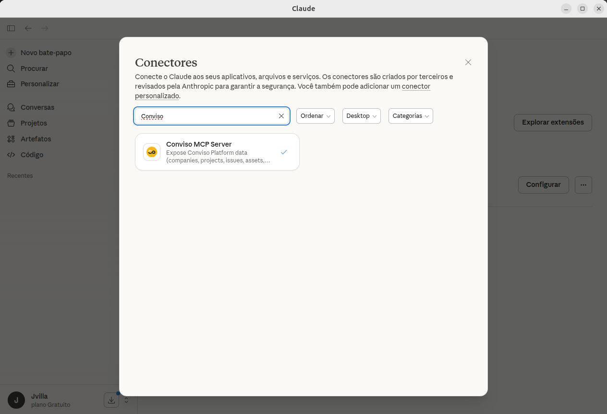
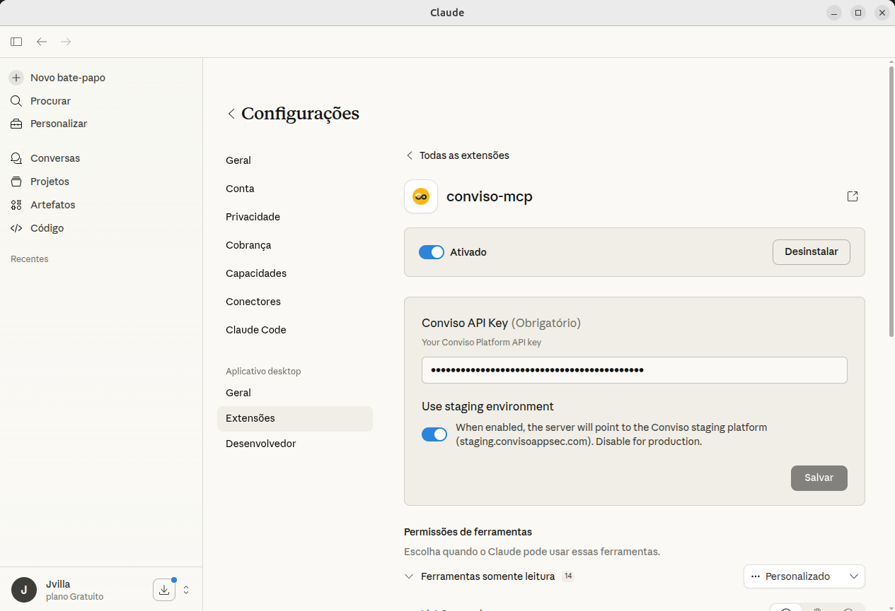

<div style={{textAlign: 'center'}}>



</div>

## Introduction

The Conviso MCP Server is a connector that exposes Conviso Platform data and tools to an LLM via the Model Context Protocol (MCP). MCP lets external services register named capabilities (tools) so an MCP-compatible client (e.g., Claude Desktop, Claude Code CLI, or Cursor) can ask the model to fetch live, authoritative security context or perform actions instead of relying on cached knowledge.

This server provides capabilities such as listing companies, projects, assets and vulnerabilities, returning technical details, generating direct links to the platform, and retrieving security metrics. It requires a Conviso Platform API Key; data returned is limited by that key's permissions.

## Features

The connector exposes a set of tools to the MCP host:

| Tool | Description |
|------|-------------|
| `get_companies` | List companies accessible with the provided API key, with optional name search |
| `get_company_info` | Retrieve detailed company info including plan and integrations |
| `get_projects` | List active security projects for a company |
| `get_project` | Retrieve metadata for a specific project |
| `get_assets` | List assets for a company |
| `get_asset` | Fetch details for a specific asset |
| `get_issues` | List vulnerabilities for a company or project |
| `get_issue` | Fetch full technical details for a vulnerability (code snippets, raw requests/responses) |
| `get_top_vulnerabilities` | Vulnerability counts grouped by severity (risk overview) |
| `create_project_url` | Generate a direct link to a project in the Platform |
| `create_issue_url` | Generate a direct link to a specific issue |
| `get_mttr_over_time` | MTTR aggregated over a date range, with severity/status/asset filters |
| `get_overall_risk_score_history` | Historical risk scores for trend analysis and reporting |
| `get_today_date` | Utility returning the current date (useful for relative metric queries) |

## Prerequisites

- Conviso Platform API Key (create it in your Conviso account under **Profile > API Keys**).
- An MCP-compatible client: Claude Desktop, Claude Code CLI, Cursor, or any client supporting stdio/HTTP MCP servers.
- Node.js 18+ (if running locally) or Docker.

:::tip Security recommendation
Create a dedicated API key for the MCP server and set an expiration date. Never share or commit the key to version control.
:::

## Choosing your installation mode

The server supports two transport modes depending on where you want to use it:

| Mode | Transport | Works in | How to install |
|------|-----------|----------|----------------|
| **Extension** | stdio | Claude Desktop — main chat | Marketplace or manual config |
| **Connector** | HTTP | Claude Desktop — Cowork/Projects | Run as HTTP server, register URL |
| **Claude Code CLI** | stdio | Terminal / IDE | `claude mcp add` |

---

## Installation

### Claude Desktop — Marketplace (Extension mode)

This installs the server as an **Extension**. It works in the **Claude Desktop main chat only** — not in Cowork or Projects mode.

1. Create an API Key in the Conviso Platform (**Profile > API Keys**).

<div style={{textAlign: 'center'}}>



</div>

2. Open Claude Desktop → **Settings > Extensions > Explore extensions**. Search for **Conviso MCP Server** and click **Install**.

<div style={{textAlign: 'center'}}>



</div>

3. Go to **Settings > Extensions**, find **Conviso MCP Server** and click **Configure**. Enter your Conviso API Key and click **Save**.

<div style={{textAlign: 'center'}}>



</div>

4. Start a new chat and run a sample prompt such as "List my companies" to confirm the server is active.

:::note
The configuration dialog appears in **Settings → Extensions → Configure**, not during the install step.
:::

---

### Claude Desktop — Connector mode (Cowork / Projects)

To use the server inside **Cowork or Projects**, you need to run it as an HTTP server and register its URL as a **Connector**.

#### 1. Start the HTTP server

Run the server directly with `npx` — no clone or install required:

```bash
PORT=3000 CONVISO_API_KEY=<your_api_key> npx -y @convisoappsec/mcp
```

The server will listen on `http://localhost:3000`.

#### 2. Register as a Connector

In Claude Desktop, go to **Settings → Connectors → Add Connector** and enter:

```
http://localhost:3000
```

#### 3. Use it in Cowork

Open Cowork or a Project and the Conviso tools will be available automatically.

:::tip Running in production
For persistent use, run the server as a background process or system service. You can also host it on any server and register its public URL as a Connector.
:::

---

### Claude Code CLI (recommended for developers)

Claude Code is the AI coding assistant CLI from Anthropic. It supports MCP servers natively — no desktop app required.

#### 1. Register the server

```bash
claude mcp add -e "CONVISO_API_KEY=<your_api_key>" -s user conviso-mcp -- \
  npx -y @convisoappsec/mcp
```

- `-s user` makes the server available in all your projects. Use `-s project` to limit it to the current project (stored in `.mcp.json`).
- `npx` downloads and runs the package automatically — no clone or install required.

#### 2. Verify the connection

```bash
claude mcp list
# conviso-mcp: node .../server.js - ✓ Connected
```

Or inside a Claude Code session, run `/mcp` to see server status and available tools.

#### 3. Use it

Start Claude Code in any project directory and interact naturally:

```
> List projects for my company
> Show the top vulnerabilities — what's the breakdown by severity?
> Get details on issue 5678, including the vulnerable code snippet
```

---

### Other clients — manual configuration

Add an entry in your MCP client's configuration file.

#### Via npx (stdio, no install required)

```json
{
  "mcpServers": {
    "conviso-mcp": {
      "command": "npx",
      "args": ["-y", "@convisoappsec/mcp"],
      "env": { "CONVISO_API_KEY": "your_api_key_here" }
    }
  }
}
```

#### Local Python (clone required)

Clone the repository first: `git clone https://github.com/convisoappsec/conviso-mcp.git`

```json
{
  "mcpServers": {
    "conviso-mcp": {
      "command": "/absolute/path/to/venv/bin/python",
      "args": ["/absolute/path/to/conviso-mcp/python/src/conviso_mcp/server.py"],
      "env": { "CONVISO_API_KEY": "your_api_key_here" }
    }
  }
}
```

#### Docker (recommended for isolation)

```json
{
  "mcpServers": {
    "conviso-mcp-docker": {
      "command": "docker",
      "args": [
        "run", "-i", "--rm",
        "-e", "CONVISO_API_KEY=your_api_key_here",

        "conviso-mcp"
      ]
    }
  }
}
```

Restart or reload your MCP client after adding the entry.

---

## Usage examples

Once the server is connected, you can ask the AI in natural language — it will call the right tools, combine results, and synthesize the answer. Below are real-world examples organized by workflow.

---

### Discover your environment

Start by finding your company ID — you'll need it for most other queries.

> **"List my companies"**

The model will call `get_companies` and return your accessible companies with their IDs. Use that ID in subsequent prompts.

> **"Show me the details for company 1234 — what plan are they on and which integrations are active?"**

Calls `get_company_info` and returns plan name, configured integrations, and metadata.

> **"List all active projects for company 1234. Which ones are currently in progress?"**

Calls `get_projects` and filters by status, so you immediately see what's active vs. completed.

---

### Vulnerability triage

> **"What's the current vulnerability breakdown for company 1234? Give me the count by severity."**

Calls `get_top_vulnerabilities` and returns a severity summary — useful for a quick risk snapshot in a standup or report.

> **"List the 10 most recent vulnerabilities for company 1234."**

Calls `get_issues` with pagination and returns title, severity, asset, and project for each.

> **"Show me all vulnerabilities for project 789 — only high and critical, ordered by most recent."**

Combines `get_issues` filtered by `project_id`. The model will filter and sort the results for you.

> **"Get the full details for issue 5678 — what's the description, status, and which asset is affected?"**

Calls `get_issue`. Returns title, description, severity, status, asset, project, and history.

> **"Get issue 5678 with the vulnerable code snippet and raw HTTP request."**

Calls `get_issue` with `return_vulnerable_data: true`. Returns the technical detail including code location, request/response, and exploit data. Handle with care — see [Security](#security).

> **"Give me a direct link to issue 5678 so I can share it with the team."**

Calls `create_issue_url` and returns the deep link to the Platform.

---

### Asset investigation

> **"List all assets for company 1234. How many do we have?"**

Calls `get_assets` and returns the full inventory with asset type, environment, and audience.

> **"Show details for asset 42 — what technology stack is it using and what's its current risk score?"**

Calls `get_asset` and returns architecture type, technologies, business impact, and the current risk score value.

> **"Which vulnerabilities are affecting asset 42?"**

Calls `get_issues` with the asset context. Gives you a scoped view of exposure for a single asset.

---

### Security metrics

> **"What's the MTTR for company 1234 for the full year 2024?"**

Calls `get_mttr_over_time` with `start_date: 2024-01-01` and `end_date: 2024-12-31`. Returns MTTR broken down by severity and date.

> **"Show me the MTTR for critical and high vulnerabilities in Q1 2025."**

Same tool, with `severities: ["CRITICAL", "HIGH"]` and the quarter date range.

> **"Is our overall risk score improving? Show me the trend for company 1234."**

Calls `get_overall_risk_score_history` and returns current score, previous score, and the delta — the model will tell you if you're trending up or down.

---

### Agentic workflows — combining multiple tools

The AI can chain tools in a single prompt to answer complex questions without manual steps.

> **"Give me a security posture summary for company 1234: current severity breakdown, risk score trend, and MTTR for criticals in the last 6 months. Format as a table."**

The model calls `get_top_vulnerabilities`, `get_overall_risk_score_history`, and `get_mttr_over_time` in sequence, then synthesizes the results into a single structured table.

> **"Find the most critical open vulnerability for company 1234, show me the vulnerable code, and give me a direct link to it."**

Chains `get_top_vulnerabilities` → `get_issues` → `get_issue` (with code snippet) → `create_issue_url`. One prompt, full context.

> **"I need to write a security update for my team. For company 1234, summarise: how many open vulnerabilities by severity, which assets are most exposed, and whether MTTR improved compared to last quarter."**

The model orchestrates multiple tools and writes a plain-language summary ready to paste into Slack or a report.

> **"List all assets for company 1234, then for each asset with a high risk score fetch its open vulnerabilities."**

Chains `get_assets` → multiple `get_issues` calls — an asset-centric risk review in one prompt.

---

### Tips for better prompts

- **Always provide the company ID** once you know it — it unlocks most tools. If you don't know it, start with "List my companies".
- **Ask for links** at the end of any vulnerability query — the model can call `create_issue_url` or `create_project_url` as a follow-up.
- **Combine context** — the AI maintains conversation context, so you can say "now get the details for the first one" after a list.
- **Request formats** — ask for tables, bullet lists, or raw JSON depending on what you need ("format as a markdown table", "give me just the IDs").

---

## Security

- The server only has the permissions of the provided API Key.
- `get_issue` with `return_vulnerable_data=true` may return exploit code, raw HTTP requests/responses, or secrets — use with care.
- Create a dedicated key with an expiration date; do not reuse your personal API key.
- Keep your API key out of version control. Use environment variables or a secrets manager.

## Open source

The Conviso MCP Server is open source and available at [github.com/convisoappsec/conviso-mcp](https://github.com/convisoappsec/conviso-mcp). Contributions are welcome — bug reports, new tools, and improvements to existing capabilities. See the repository's `CONTRIBUTING.md` to get started.

## See also

- [Conviso Skills](./conviso-skills) — reusable operational playbooks for bulk actions (vulnerability triage, owner assignment, asset risk normalization) via `conviso-cli`, with preview-first safety controls.

## Support

If you need help, contact Conviso support: [support@convisoappsec.com](mailto:support@convisoappsec.com).

[](https://cta-service-cms2.hubspot.com/web-interactives/public/v1/track/redirect?encryptedPayload=AVxigLKtcWzoFbzpyImNNQsXC9S54LjJuklwM39zNd7hvSoR%2FVTX%2FXjNdqdcIIDaZwGiNwYii5hXwRR06puch8xINMyL3EXxTMuSG8Le9if9juV3u%2F%2BX%2FCKsCZN1tLpW39gGnNpiLedq%2BrrfmYxgh8G%2BTcRBEWaKasQ%3D&webInteractiveContentId=125788977029&portalId=5613826)
