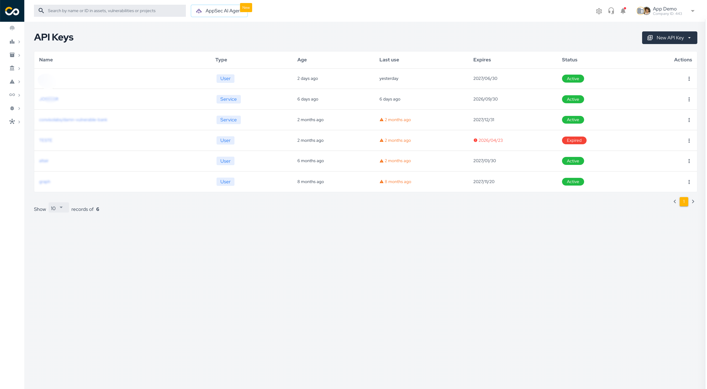

import Tabs from '@theme/Tabs';
import TabItem from '@theme/TabItem';

<div style={{textAlign: 'center'}}>


</div>

## Introduction

The Conviso MCP Server is a connector that exposes Conviso Platform data **and actions** to an LLM through the Model Context Protocol (MCP). MCP lets external services register named capabilities (tools) so an MCP-compatible client — Claude Desktop, Claude Code CLI, Cursor, or any other — can ask the model to fetch live, authoritative security context and perform operations, instead of relying on cached knowledge.

The server ships **42 tools** in two families:

- **Read tools (31)** — list and inspect companies, projects, assets, vulnerabilities, tickets, requirements, applications, scan histories, SBOM / supply-chain components, AI-Pentest artifacts and executions, threat-model artifacts, plus security metrics and deep links.
- **Write tools (11)** — a generic, **allowlisted mutation engine** (`list_mutations` → `describe_mutation` → `execute_mutation`) plus curated shortcuts for the most common writes (change issue status, create vulnerabilities / projects / assets / tickets, run DAST, trigger an AI-Pentest).

Everything the server can do is bounded by the **Conviso Platform API Key** you provide — the data returned and the operations allowed match that key's permissions.


## Quick install

Pick your client below and add the server, supplying your API key as `CONVISO_API_KEY`. Most examples run the published package with `npx` — no clone or build required. The write tools ship in all Node-based setups; only the **Python** edition (last tab) is read-only.

> **Read and write.** The server acts only within the permissions of the API key you provide.

<Tabs groupId="mcp-client">
<TabItem value="claude-code" label="Claude Code" default>

Register the server once and it's available in every project:

```bash
claude mcp add -s user -e CONVISO_API_KEY=<your_api_key> conviso-mcp -- npx -y @convisoappsec/mcp
```

Check it with `claude mcp list` (or run `/mcp` inside a session). Swap `-s user` for `-s project` to scope it to the current repo (`.mcp.json`).

</TabItem>
<TabItem value="claude-desktop" label="Claude Desktop">

**Easiest:** open **Settings → Extensions → Explore extensions**, search **Conviso MCP Server**, click **Install**, then **Configure** and paste your API key. Full walkthrough: [Marketplace steps](#desktop-marketplace).

**Manual:** edit `claude_desktop_config.json` (Settings → Developer → Edit Config):

```json
{
  "mcpServers": {
    "conviso-mcp": {
      "command": "npx",
      "args": ["-y", "@convisoappsec/mcp"],
      "env": { "CONVISO_API_KEY": "your_api_key_here" }
    }
  }
}
```

</TabItem>
<TabItem value="cursor" label="Cursor">

Add to `.cursor/mcp.json` (current project) or `~/.cursor/mcp.json` (all projects):

```json
{
  "mcpServers": {
    "conviso-mcp": {
      "command": "npx",
      "args": ["-y", "@convisoappsec/mcp"],
      "env": { "CONVISO_API_KEY": "your_api_key_here" }
    }
  }
}
```

Then enable **conviso-mcp** under **Settings → MCP**.

</TabItem>
<TabItem value="vscode" label="VS Code">

Add to `.vscode/mcp.json` — note the `servers` key and the `type` field:

```json
{
  "servers": {
    "conviso-mcp": {
      "type": "stdio",
      "command": "npx",
      "args": ["-y", "@convisoappsec/mcp"],
      "env": { "CONVISO_API_KEY": "your_api_key_here" }
    }
  }
}
```

Or add it straight from the terminal:

```bash
code --add-mcp '{"name":"conviso-mcp","command":"npx","args":["-y","@convisoappsec/mcp"],"env":{"CONVISO_API_KEY":"your_api_key_here"}}'
```

</TabItem>
<TabItem value="codex" label="Codex">

Add to `~/.codex/config.toml`:

```toml
[mcp_servers.conviso-mcp]
command = "npx"
args = ["-y", "@convisoappsec/mcp"]
env = { CONVISO_API_KEY = "your_api_key_here" }
```

</TabItem>
<TabItem value="gemini" label="Gemini">

Add to `~/.gemini/settings.json` (all projects) or `.gemini/settings.json` (current project):

```json
{
  "mcpServers": {
    "conviso-mcp": {
      "command": "npx",
      "args": ["-y", "@convisoappsec/mcp"],
      "env": { "CONVISO_API_KEY": "your_api_key_here" }
    }
  }
}
```

Or from the terminal:

```bash
gemini mcp add -e CONVISO_API_KEY=<your_api_key> conviso-mcp npx -y @convisoappsec/mcp
```

Works in **Gemini CLI** and **Gemini Code Assist** (agent mode). Verify with `/mcp list`. For HTTP transport, run the server with `PORT=3000` and use `"httpUrl": "http://localhost:3000"` instead of `command`.

</TabItem>
<TabItem value="docker" label="Docker">

Run the Node image (build it first: `docker build -t conviso-mcp-node-image node/`):

```json
{
  "mcpServers": {
    "conviso-mcp": {
      "command": "docker",
      "args": [
        "run", "-i", "--rm", "--init",
        "-e", "CONVISO_API_KEY=your_api_key_here",
        "conviso-mcp-node-image"
      ]
    }
  }
}
```

</TabItem>
</Tabs>

Restart or reload your client after adding the entry. The tabs use the **stdio** transport; for Claude **Cowork/Projects** or remote hosting, use [HTTP (Connector) mode](#connector-mode) below.

--- 


## What you can do

| Domain | Read | Write |
|--------|------|-------|
| **Companies** | List, inspect (plan, integrations, branding) | — |
| **Vulnerabilities / Issues** | List (rich filters), full technical detail, severity overview, per-asset and per-project views | Change status, create/update (source-code, web, network), reassign, mark analyzed, bulk status, bulk delete |
| **Projects** | List (filters), inspect | Create, update, change status, bulk status, bulk delete |
| **Assets** | List (filters), inspect | Create, update, run Conviso DAST |
| **Tickets** | List, inspect | Create |
| **Requirements / Checklists** | List by scope, inspect, list per project | Create/update, attach to projects |
| **Applications** | List, inspect (with linked assets) | Create, update, add/remove assets |
| **Scans** | Execution history, coverage counts | *(read-only)* |
| **Supply chain / SBOM** | List components (license, versions, issues by severity) | *(read-only)* |
| **AI-Pentest** | List artifacts, inspect scope & executions, execution results | Create/update artifact, trigger execution, cancel, retest |
| **Threat Modeling** | List artifacts, inspect versions | Create artifact/version, update, generate requirements |
| **Metrics & links** | MTTR over time, risk-score history, deep links, today's date | — |

## Tools reference

### Read tools

| Domain | Tool | Description |
|--------|------|-------------|
| **General** | `get_companies` | List companies accessible with the API key (`search` = name contains, `label_eq` = exact match). |
| **General** | `get_company_info` | Company detail: plan, integrations, branding metadata. |
| **Vulnerabilities** | `get_issues` | List vulnerabilities for a company with rich filtering and sorting. |
| **Vulnerabilities** | `get_issue` | Full technical detail for one issue; optional vulnerable code snippet and raw HTTP request/response. |
| **Vulnerabilities** | `get_issues_by_asset_id` | Same filter set, scoped to a single asset. |
| **Vulnerabilities** | `get_issues_by_project_id` | Same filter set, scoped to a single project. |
| **Vulnerabilities** | `get_top_vulnerabilities` | Counts grouped by severity (risk overview), with optional filters. |
| **Projects** | `get_projects` | List security projects for a company, with filters and sorting. |
| **Projects** | `get_project` | Metadata for a specific project. |
| **Assets** | `get_assets` | List assets for a company, with rich filtering and sorting. |
| **Assets** | `get_asset` | Detail for a specific asset. |
| **Tickets** | `get_tickets` | List tickets (paginated) with search and `TicketSearch` params. |
| **Tickets** | `get_ticket` | One ticket: status, priority, impact, assignee. |
| **Requirements** | `get_requirements` | List requirements/checklists for a scope (company). |
| **Requirements** | `get_requirement` | One requirement/checklist by id. |
| **Requirements** | `get_project_requirements` | Requirements attached to a specific project. |
| **Applications** | `get_applications` | List applications (name, url, riskScore, assetsCount). |
| **Applications** | `get_application` | One application, including its linked assets. |
| **Scans** | `get_scan_histories` | Scan executions (status, integration, duration, vuln counts). |
| **Scans** | `get_asset_scans_count` | Scan-coverage counts (assets with / without scans). |
| **Supply chain** | `get_sbom_components` | SBOM components: version, technology, package manager, license, issues by severity. |
| **AI-Pentest** | `get_pentest_artifacts` | List AI-Pentest artifacts (label, type, scheduling, latest execution). |
| **AI-Pentest** | `get_pentest_artifact` | One artifact, including scope and its executions. |
| **AI-Pentest** | `get_pentest_execution` | Execution result: status, vuln count, severity breakdown, retest progress. |
| **Threat Modeling** | `get_threat_model_artifacts` | List threat-model artifacts (label, scope, latest version). |
| **Threat Modeling** | `get_threat_model_artifact` | One artifact, including its versions (diagrams, notes, scope). |
| **Metrics** | `get_mttr_over_time` | MTTR aggregated over a date range; severity/status/asset filters. |
| **Metrics** | `get_overall_risk_score_history` | Historical risk scores for trend analysis. |
| **Utilities** | `create_project_url` | Deep link to a project in the Platform. |
| **Utilities** | `create_issue_url` | Deep link to a specific issue. |
| **Utilities** | `get_today_date` | Current date — useful to compute relative ranges ("last 30 days"). |

### Write tools

| Group | Tool | Description |
|-------|------|-------------|
| **Engine** | `list_mutations` | Discover the permitted write operations (name, description, category, destructive flag). |
| **Engine** | `describe_mutation` | Full input schema for one mutation (fields, required, enums, nested inputs) + default return fields. |
| **Engine** | `execute_mutation` | Run any **allowlisted** mutation by name with a generic input object. |
| **Shortcut** | `change_issue_status` | Change an issue/vulnerability status. |
| **Shortcut** | `create_source_code_vulnerability` | Create a manual source-code (SAST-style) vulnerability on an asset. |
| **Shortcut** | `create_project` | Create a project. |
| **Shortcut** | `create_asset` | Create an asset. |
| **Shortcut** | `create_ticket` | Open a ticket. |
| **Shortcut** | `run_dast` | Start a Conviso DAST scan on an asset. |
| **Shortcut** | `trigger_pentest` | Trigger an AI-Pentest execution from an existing artifact. |
| **Shortcut** | `create_pentest_artifact` | Create an AI-Pentest artifact (the scope/config a pentest runs against). |


## Prerequisites

- **Conviso Platform API Key** — create it under **Profile > API Keys**.
- An **MCP-compatible client**: Claude Desktop, Claude Code CLI, Cursor, or any client supporting stdio/HTTP MCP servers.
- **Node.js 20.10+** (for the Node edition / write tools) or Docker. The Python edition (read-only) needs Python 3.10+.

Generate the key in the Conviso Platform under **Profile > API Keys** and copy it — you'll pass it to the server as the `CONVISO_API_KEY` value in the steps below.

<div style={{textAlign: 'center'}}>



</div>

:::tip Security recommendation
Create a dedicated API key for the MCP server and set an expiration date. Grant it only the permissions the workflow needs, and never commit it to version control.
:::


### Tips for better prompts

- **Provide the company ID** once you know it — it unlocks most tools. If you don't have it, start with "List my companies".
- **Ask for links** at the end of any vulnerability or project query — the model calls `create_issue_url` / `create_project_url` as a follow-up.
- **Combine context** — the AI keeps conversation context, so "now get the details for the first one" works after a list.
- **Request formats** — ask for tables, bullet lists, or raw JSON ("format as a markdown table", "give me just the IDs").

---

## Security and privacy

- The server operates strictly within the permissions of the provided **API Key** — for both reads and writes.
- **Writes are allowlisted.** Only the operations listed above are reachable; destructive ones (delete / bulk / cancel / remove) are flagged so the client prompts for confirmation.
- `get_issue` with `return_vulnerable_data=true` may return exploit code, raw HTTP requests/responses, or secrets — use with care.
- Create a **dedicated key with an expiration date**; do not reuse a personal API key, and scope it to the minimum permissions needed.
- Keep the API key out of version control — use environment variables or a secrets manager.

### Privacy Policy

This connector communicates only with the Conviso Platform API (`https://app.convisoappsec.com`) using the API key you provide. It does not collect, store, or share your data with any third party — requests and responses stay between your MCP client and the Conviso Platform. Error logs go to `stderr` only.

Full privacy policy: [iubenda.com/privacy-policy/55589285](https://www.iubenda.com/privacy-policy/55589285)

## Open source

The Conviso MCP Server is open source at [github.com/convisoappsec/conviso-mcp](https://github.com/convisoappsec/conviso-mcp). Contributions are welcome — bug reports, new tools, and improvements. See the repository's `CONTRIBUTING.md` to get started.

## See also

- [Conviso Skills](./conviso-skills) — reusable operational playbooks for bulk actions (vulnerability triage, owner assignment, asset risk normalization) via `conviso-cli`, with preview-first safety controls.

## Support

If you need help, contact Conviso support: [support@convisoappsec.com](mailto:support@convisoappsec.com).

[](https://cta-service-cms2.hubspot.com/web-interactives/public/v1/track/redirect?encryptedPayload=AVxigLKtcWzoFbzpyImNNQsXC9S54LjJuklwM39zNd7hvSoR%2FVTX%2FXjNdqdcIIDaZwGiNwYii5hXwRR06puch8xINMyL3EXxTMuSG8Le9if9juV3u%2F%2BX%2FCKsCZN1tLpW39gGnNpiLedq%2BrrfmYxgh8G%2BTcRBEWaKasQ%3D&webInteractiveContentId=125788977029&portalId=5613826)
