

## Introduction

The Dynamic Application Security Testing (DAST) is a type of automated security test that aims to analyze the behavior of the application, handling the sending of requests to the server in search of possible vulnerabilities.

## Advantages

All results found by the DAST tool will be available to users on the Conviso Platform, making it easier to manage the vulnerability correction process. Your enterprise will get more control over the process and will be able to ensure that the entire correction flow is carried out following the market best practices.

## Requirements

In order to use the DAST Scan, you will need:

- A web application;
- An URL to this web application that is reachable from Conviso Platform;

## Creating a New Asset 

Log in to the [Conviso Platform](https://app.convisoappsec.com);

On the Menu to the left, choose **Assets Management**. At the panel to the left, click on the drop-down list **+ New Asset**:

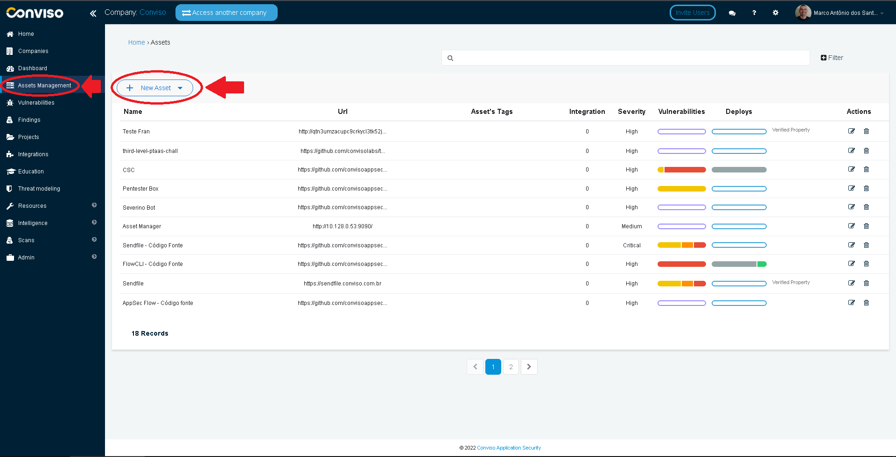

On the drop-down list, choose **Add Manually**:

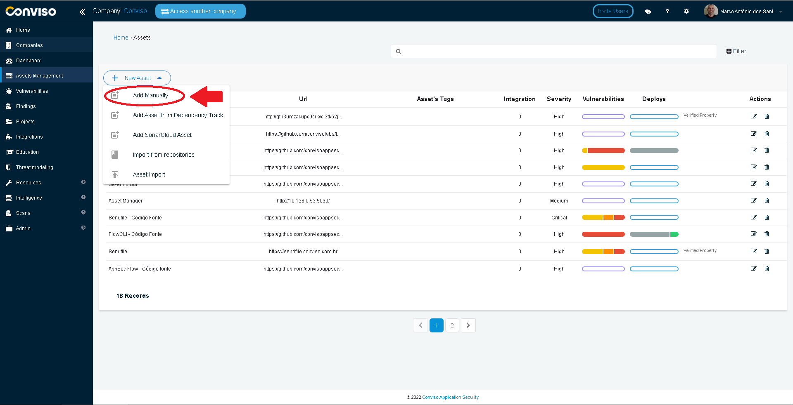

At the field **Name**, label your new asset as you wish. Then, click on the **Advanced options** button:

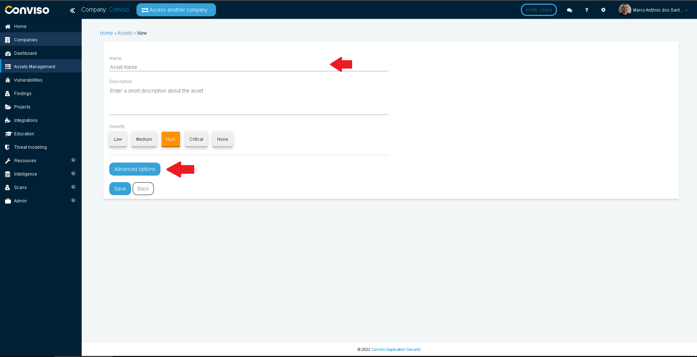

:::note
Your web application URL must be accessible from Conviso Platform!!!
:::

At the **URL** field, type the URL of the asset you want to scan:

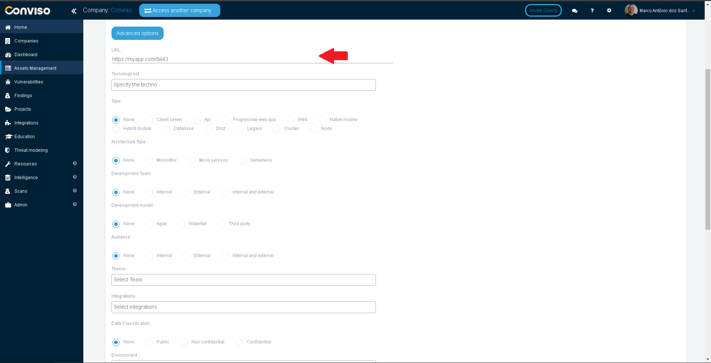

You may want to provide some additional information for your new asset. Fill the corresponding fields of the form wit useful data. When done, click at the butto **Save** at the end of the form: 

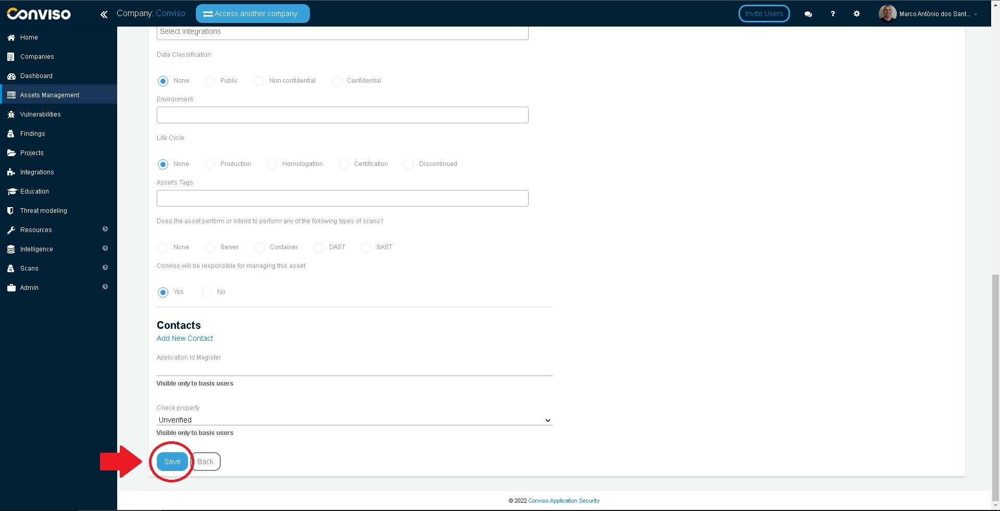

## Creating a New Scan Session

On the main left panel of Conviso Platform, click on the **Scans** menu, then click on the **New** option:

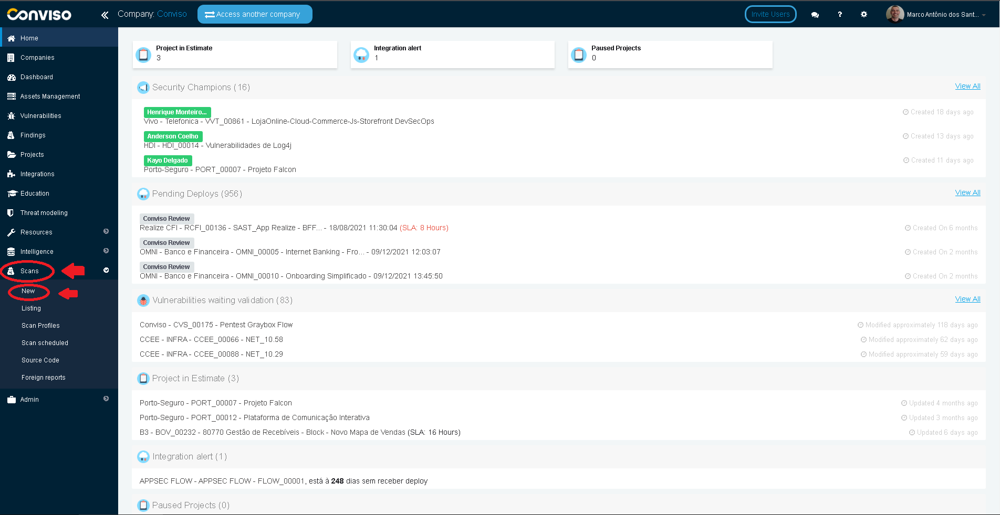

Select the option **DAST**. From the drop-down list **Asset**, select the asset you just created. On the drop-down list **Scan Profile**, select **Full Scan (Dynamic)**. When done, click on the **Scan now** button to start your scan:

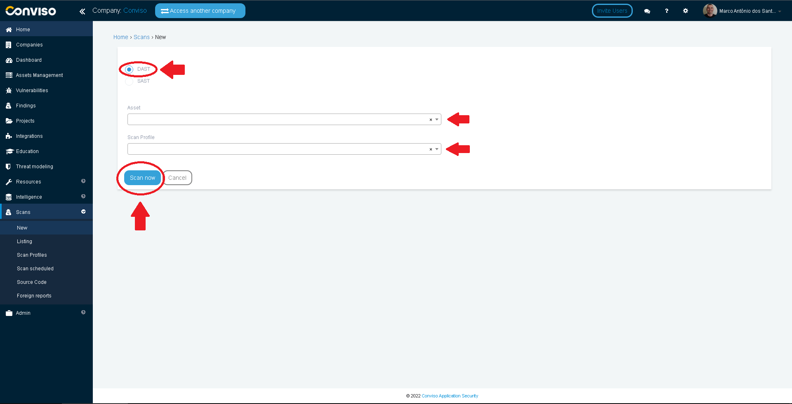

## Viewing Current DAST Scan Sessions

In order to track your current scan sessions, click on the **Scans** Menu option on the main left panel, then click on the **Listing** submenu option.

Your current scan sessions will be exhibited. You can filter your scans by status, using the drop-down list labeled **Status**, query your scans using the **Search** button or stop your scan at any time, by clicking on the **Trash** icon to the right of the scan:

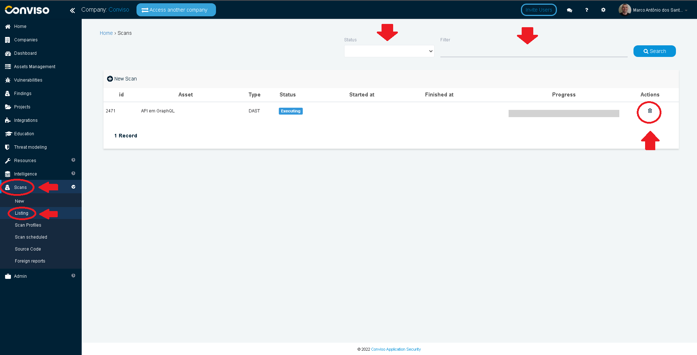

## Scheduling DAST Scans

In order to schedule new scan sessions, click at the **Scans** menu option at the main left panel, then click on the **Scheduled Scans** submenu. On the panle to the right, click on the **+ New Scheduled Scan** button:

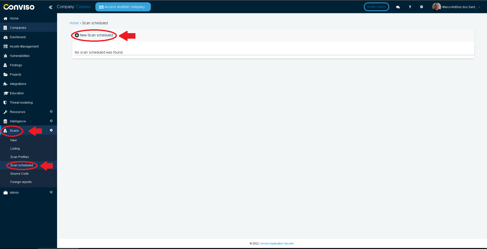

Select the **DAST** option on the **Scan Type** section of the form. From the drop-down list labeled **Asset**, choose the asset that will be scanned, and the **Hour**, **Minute** and **Week Day** when your DAST Scan will be performed. At last, on the drop-down list **Scan Profile**, select **Full Scan (Dynamic)**. When done scheduling your DAST Scan, click on the button **Send** to schedule your Scan:

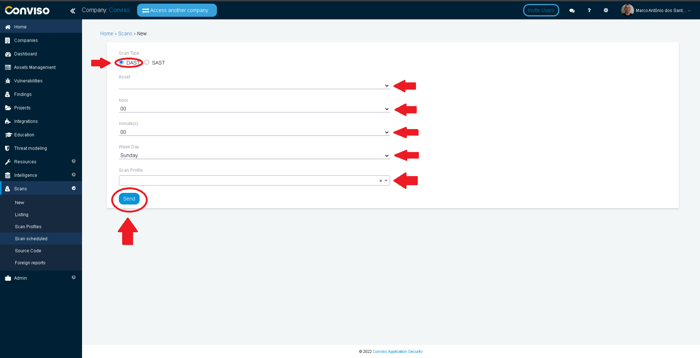

## Reviewing Findings

On the main left panel, click on the **Findings** menu: 

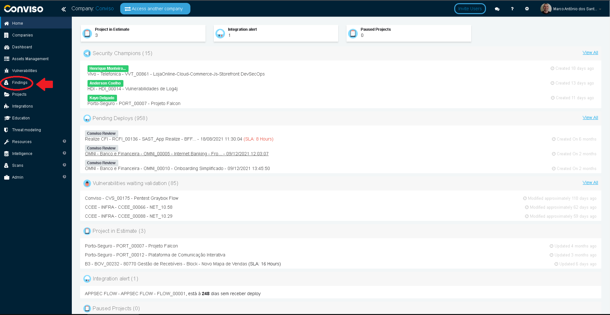

Click on the **DAST** button on the **Suggested Filters** to filter your DAST scan results:

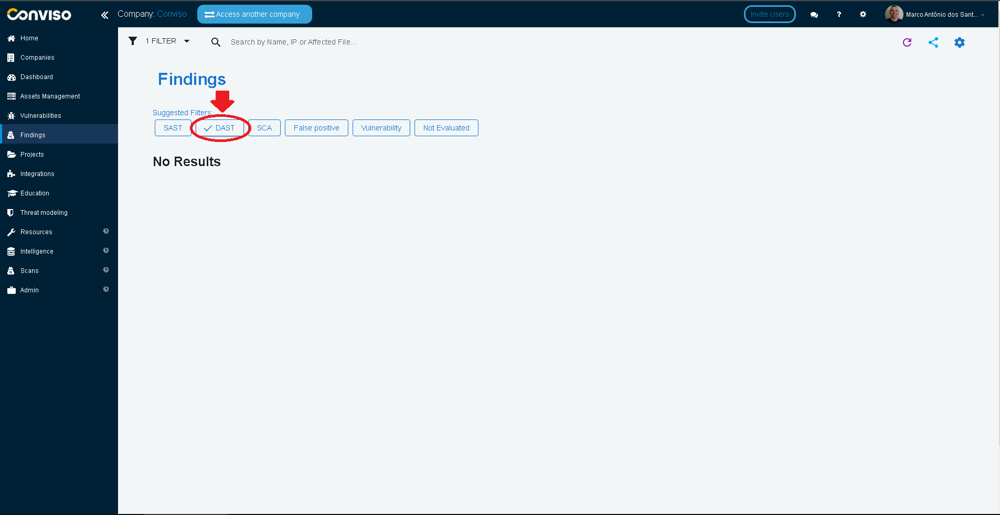

