<div style={{textAlign: 'center'}}>


</div>

## Introduction

Through the Business Intelligence integration, it is possible to optimize time by easily issuing customized reports, in addition to allowing data to be extracted and consumed on BI platforms.

## Endpoints

To use this feature, access the menu **Integrations** and then **Business Intelligence** at the right panel and click at the **Integrate** button:

<div style={{textAlign: 'center'}}>


</div>

To analyze data on your BI platform, there are 4 types of endpoints that allow the user to generate .JSON file and feed the BI tool: 

- Deploys

- Projects

- Assets

- Users

<div style={{textAlign: 'center'}}>


</div>

To create a connector with the BI tool, just copy the **Conviso Platform URL** (https://app.convisoappsec.com/), the **Endpoint**, and your **x-api-key** (you can generate your x-api-key by following the instructions [here](../../api/generate-apikey)) and insert the parameters at the BI tool you are using.

## Google Data Studio Setup

Logon to **Google Data Studio** [here](https://datastudio.google.com/), click at **Create** button and choose **Report**:

<div style={{textAlign: 'center'}}>

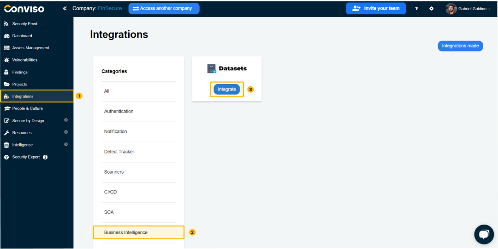

</div>

At the search box, search for ```JSON/CSV/XML``` and select the **JSON/CSV/XML Connector**:

<div style={{textAlign: 'center'}}>

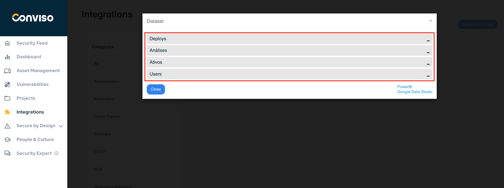

</div>

Now you have to authorize Data Studio to use a Google user account. To do so, click at the button **Authorize**:

<div style={{textAlign: 'center'}}>

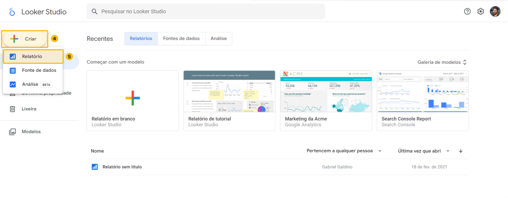

</div>

A floating window will be shown for **user selection**. Select your user (or provide an existing user credentials) by clicking over it:

<div style={{textAlign: 'center'}}>

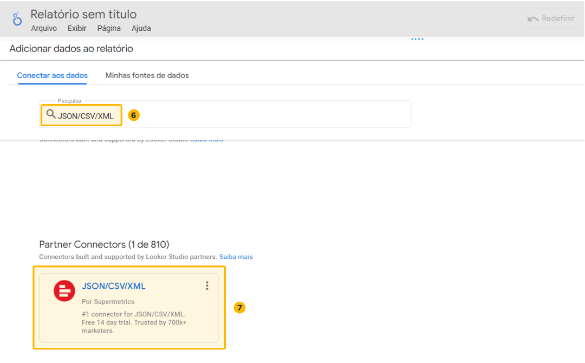

</div>

A new floating window will be shown. Click at the **Allow** button to allow the connector to access the provided Google user account: 

<div style={{textAlign: 'center'}}>

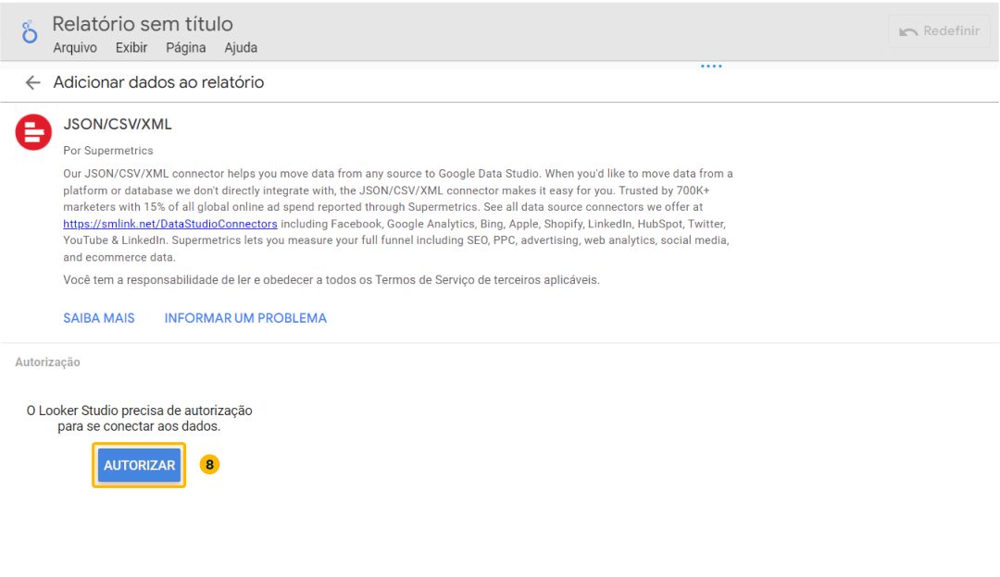

</div>

Next, click the **Authorize** button below the **JSON/CSV/XML** authorization box:

<div style={{textAlign: 'center'}}>

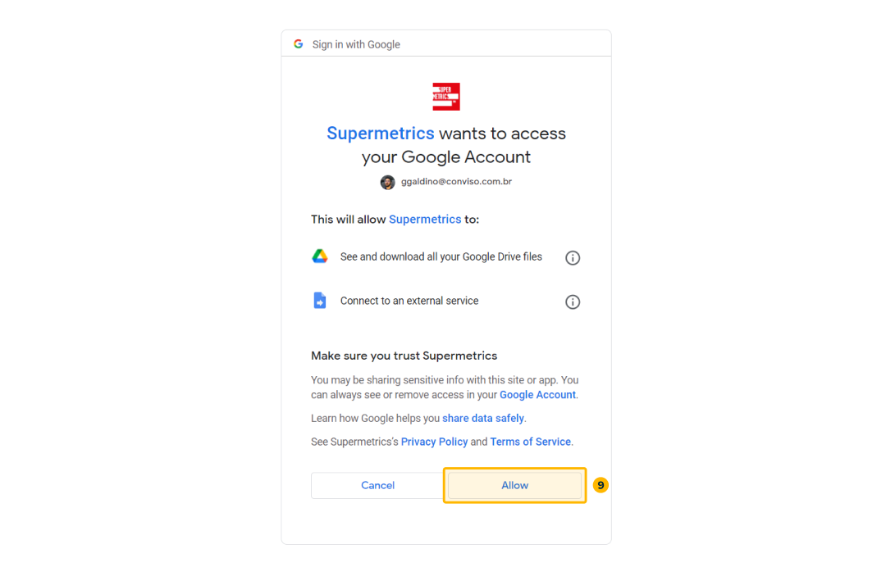

</div>

Finally, click at the **close icon** to close the **Supermetrics** floating window:

<div style={{textAlign: 'center'}}>

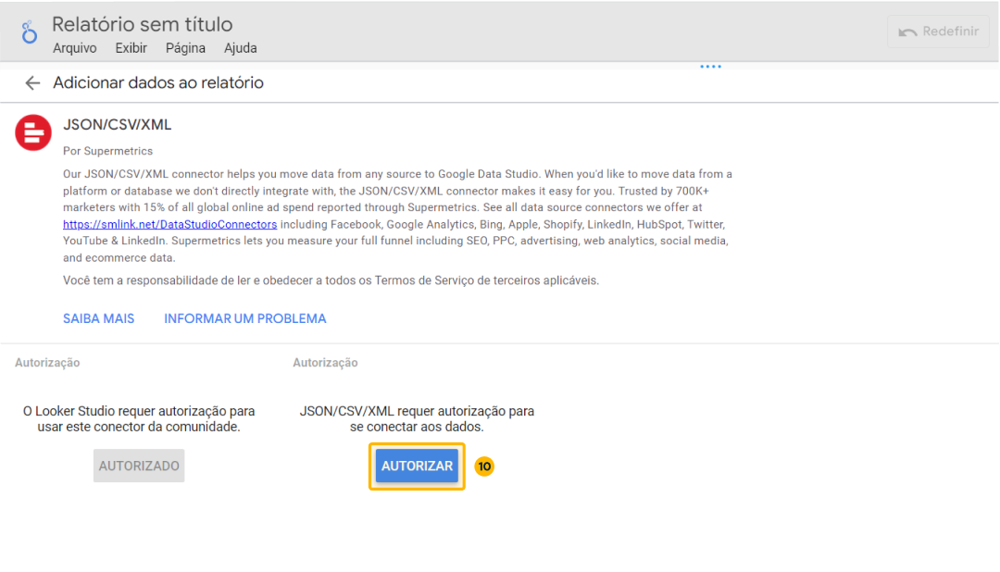

</div>

This windows will be shown. We will fill this form with the following data: **Data Type**, **Source URL or Google Drive path** and **HTTP headers**: 

<div style={{textAlign: 'center'}}>

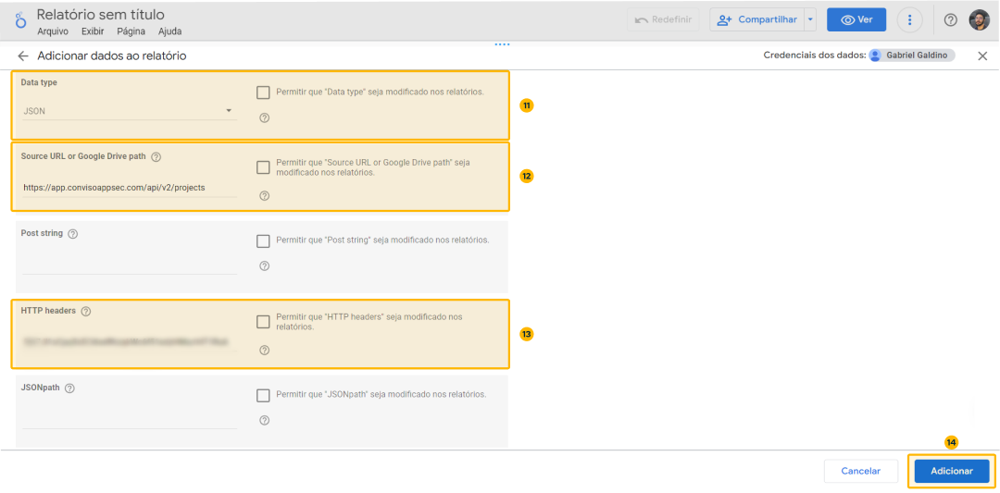

</div>

1. At **Data Type**, select **JSON**;
2. At **Source URL or Google Drive path**, insert ```https://app.convisoappsec.com/api/v2/projects```;
3. At **HTTP headers**, insert ```x-api-key:<your-generated-api-key>```.

When done filling the form, click at the button **Add**, at the lower right corner:

<div style={{textAlign: 'center'}}>

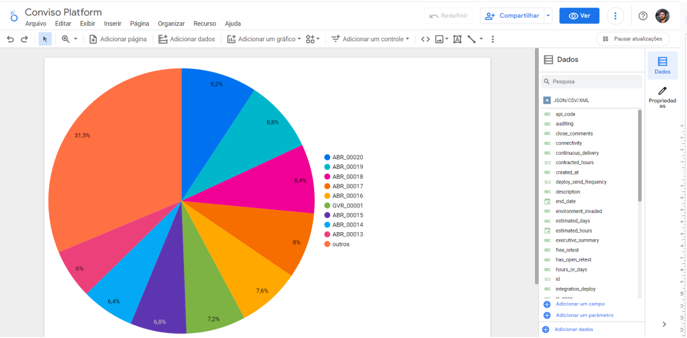

</div>

A floating confirmation window will be shown. Click at the **Add to Report** button to save:

<div style={{textAlign: 'center'}}>

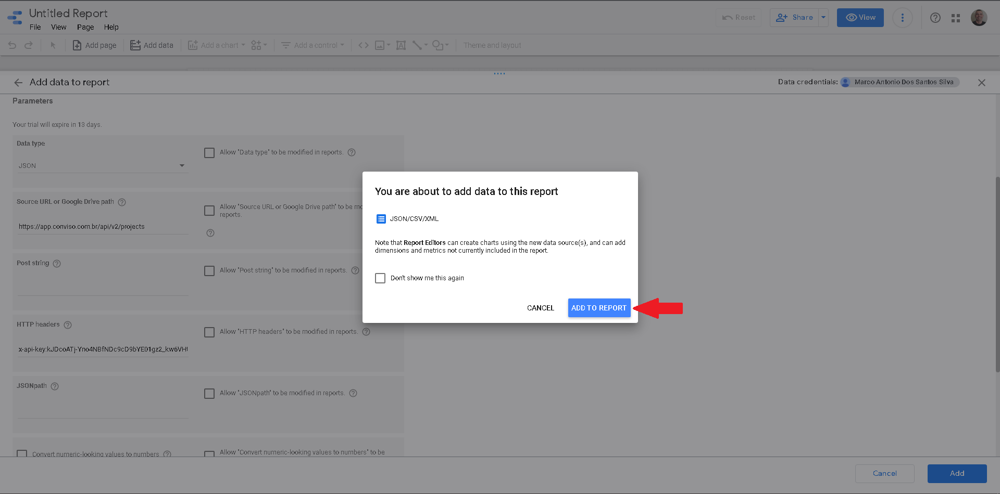

</div>

Your automatically generated **Dashboard** will be shown. It is also possible to create Dashboards of your own:

<div style={{textAlign: 'center'}}>

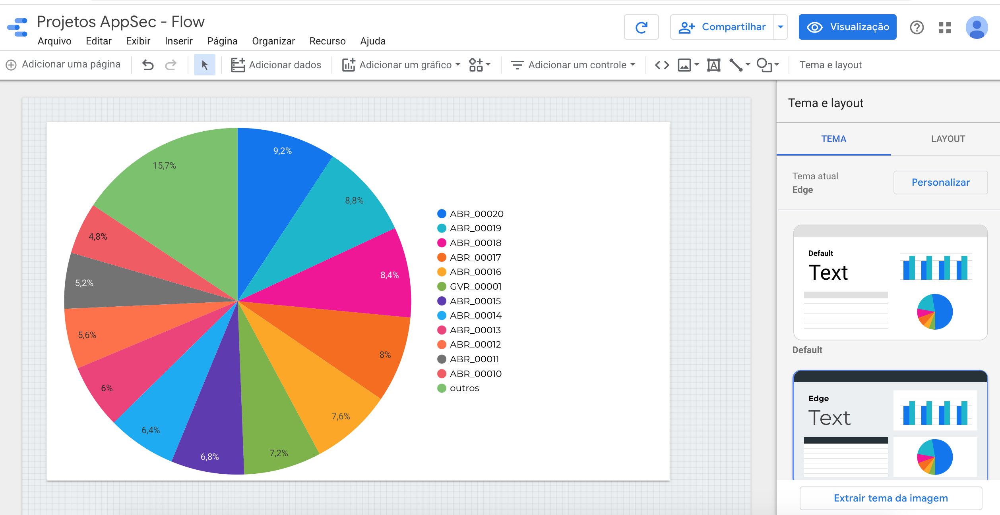

</div>
