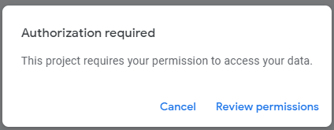

<div style={{textAlign: 'center'}}>

[](https://bit.ly/3JyRdl8)

</div>

# Introduction

[Google Looker Studio](https://datastudio.google.com/) is a powerful business intelligence tool that allows users to generate customized reports and extract data for analysis on BI platforms. This document provides instructions on integrating the Conviso Platform with Google Looker Studio, a solution for business intelligence integration.

**[Explore our Integration page to learn more and supercharge your Application Security Program  with Conviso Platform.](https://cta-service-cms2.hubspot.com/web-interactives/public/v1/track/redirect?encryptedPayload=AVxigLKtcWzoFbzpyImNNQsXC9S54LjJuklwM39zNd7hvSoR%2FVTX%2FXjNdqdcIIDaZwGiNwYii5hXwRR06puch8xINMyL3EXxTMuSG8Le9if9juV3u%2F%2BX%2FCKsCZN1tLpW39gGnNpiLedq%2BrrfmYxgh8G%2BTcRBEWaKasQ%3D&webInteractiveContentId=125788977029&portalId=5613826)**

## Integrating directly into Google Apps Script​

Follow these steps to integrate Conviso Platform with Google Apps Script:

**Step 1 -** With a new spreadsheet created, select the **Apps Script** option:

<div style={{textAlign: 'center'}}>


</div>

Step 2 - Paste the code provided below and click **Run**:

```
function test() {
  var queryTemplate = `
  {
    assets(
      companyId: "<YOUR_COMPANY_ID>"
      page: %d
      limit: 10
      search: {}
    ) {
      collection {
        id
        name
        businessImpact
        riskScore {
          current {
            value
          }
        }
      }
      metadata {
        totalPages
      }
    }
  }
  `;

  var url = "https://app.convisoappsec.com/graphql";
  var options = {
    headers: {
      'Content-Type': 'application/json',
      'x-api-key': '<YOUR_CONVISO_API_KEY>'
    },
    method: "POST"
  };

  try {
    var page = 1;
    var totalPages = 1;
    var sheet = SpreadsheetApp.getActiveSpreadsheet().getActiveSheet();
    
    sheet.clear();
    
    var headers = ["Asset ID", "Asset Name", "Business Impact", "Risk Score"];
    sheet.appendRow(headers);

    do {
      var query = Utilities.formatString(queryTemplate, page);
      options.payload = JSON.stringify({ query: query });

      var response = UrlFetchApp.fetch(url, options);
      var jsonResponse = JSON.parse(response.getContentText());

      if (jsonResponse.errors) {
        Logger.log("GraphQL Error: " + JSON.stringify(jsonResponse.errors));
        return;
      }

      var assets = jsonResponse.data.assets.collection;
      totalPages = jsonResponse.data.assets.metadata.totalPages;

      assets.forEach(function(asset) {
        var row = [
          asset.id || "",
          asset.name || "",
          asset.businessImpact || "NULL",
          asset.riskScore.current.value || "NULL"
        ];
        sheet.appendRow(row);
      });

      page++;
    } while (page <= totalPages);

    Logger.log("Data inserted into sheet successfully.");

  } catch (e) {
    Logger.log("Error: " + e.toString());
  }
}
```

<div style={{textAlign: 'center'}}>


</div>

**Step 3 -** Allow Google Apps Script to access your data:

<div style={{textAlign: 'center'}}>



</div>

**Step 4 -** Check the result in the script execution log:

<div style={{textAlign: 'center'}}>


</div>

**Step 5 -** View the information in the spreadsheet that was created earlier:

<div style={{textAlign: 'center'}}>


</div>

<!--Your automatically generated data analysis dashboard will be displayed, providing valuable insights for your Application Security Program. 

These dashboards empower you to visualize and analyze your application security data effectively, enabling informed decision-making and proactive risk management.-->

**[Unlock the full potential of your Application Program  with Conviso Platform integrations. Visit our Integration page now to get started.](https://cta-service-cms2.hubspot.com/web-interactives/public/v1/track/redirect?encryptedPayload=AVxigLKtcWzoFbzpyImNNQsXC9S54LjJuklwM39zNd7hvSoR%2FVTX%2FXjNdqdcIIDaZwGiNwYii5hXwRR06puch8xINMyL3EXxTMuSG8Le9if9juV3u%2F%2BX%2FCKsCZN1tLpW39gGnNpiLedq%2BrrfmYxgh8G%2BTcRBEWaKasQ%3D&webInteractiveContentId=125788977029&portalId=5613826)**

## Support

If you have any questions or need help using our product, please don't hesitate to contact our support team.
