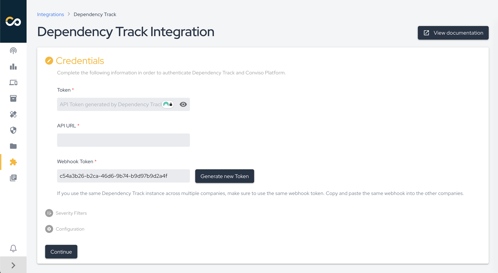
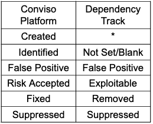

<div style={{textAlign: 'center'}}>


</div>

:::note
First time using Dependency Track? Please refer to the [following documentation](https://docs.dependencytrack.org/).  
:::

## Introduction

Dependency Track is an intelligent Component Analysis platform that allows organizations to identify and reduce risk in the software supply chain. Dependency Track takes a unique and highly beneficial approach by leveraging the capabilities of Software Bill of Materials (SBOM). This approach provides capabilities that traditional Software Composition Analysis (SCA) solutions cannot achieve.

Dependency Track monitors component usage across all versions of every application in its portfolio in order to proactively identify risk across an organization. The platform has an API-first design and is ideal for use in CI/CD environments. The Dependency Track integration with Conviso Platform is done through this API.

## Dependency Track Setup

In order to set up the Dependency Track integration, you’re going to need a token that can be generated at your dedicated instance of the Dependency Track system. To find it, go to **Administration** at the left sidebar, then select **Access Management**, and under it, **Teams**. You’ll be presented with a field showing a few rows of predefined teams, one of them being **Administrators**:

<div style={{textAlign: 'center'}}>


</div>

Click on the **Administrators** row to open the options, and under the **API Keys** section, click the **[+] icon**. A new key will be created for you: 

<div style={{textAlign: 'center'}}>


</div>

## Conviso Platform Setup

Log in to the [Conviso Platform](https://app.convisoappsec.com);

On the main menu to the left, click on **Integrations**. At the search bar, type **Dependency Track**, then click on the **Connect** button on the **Dependency Track** card:

<div style={{textAlign: 'center'}}>


</div>

You will be presented with the following form that should be filled with the token mentioned in the **API Token** field and your **Dependency Track address** in the format of ```http://<service_ip>:<service_port>/api``` in the **API URL** field. After filling all the fields in this modal, click on the **Continue** button to store you integration configuration:

<div style={{textAlign: 'center'}}>



</div>

Select which vulnerability severities you want to import from Dependency Track:

<div style={{textAlign: 'center'}}>


</div>

If everything goes right, you’ll be presented with the following screen. Click the **Check connection** button to confirm that the integration was performed correctly.

<div style={{textAlign: 'center'}}>


</div>

With the integration configured, you can now start importing your projects. To do so, click the **Add project** button.

Next, select the projects you want to import into the Conviso Platform and click **Add**.

<div style={{textAlign: 'center'}}>


</div>

After this, the import process will be initiated, and depending on the size of the project, this may take a few minutes.

After creating the integration, you can add more assets through the integration configuration page, which can be accessed in two ways:

1. Through the Asset Management page as shown in the figure below.

<div style={{textAlign: 'center'}}>


</div>

2. **Integration Settings** button on the integrations screen.

<div style={{textAlign: 'center'}}>


</div>

## General Information on Operation

In this section, we will address crucial information about the integration's operation. This includes details about the synchronization process, as well as the status mapping between the involved platforms.

### Status Mapping

When moving issues from one status to another, the Conviso platform will communicate and mark the issues in Dependency Track according to the following mapping:

<div style={{textAlign: 'center'}}>



</div>

Given that the issues reported by Dependency Track are of the SCA (Software Component Analysis) type, they are automatically created in the Identified status, not in Created. Therefore, the mapping for the Not Set/Blank state starts from Identified.

The modifications are bidirectional, meaning that when changes are made in the Conviso Platform, these changes will be replicated to Dependency Track, and the same applies in reverse.

**Note: The only exception to these status changes is for the FIXED status in the Conviso Platform. In the case of FIXED, it is not allowed for a user to move it to FIXED when the issue was opened by a scanner like Dependency Track. In this scenario, the tool itself should identify the changes and recognize that the issue has been removed. Therefore, in the next synchronization, those issues that are no longer identified by Dependency Track will be marked as FIXED in the Conviso Platform.**

When changing the status in the Conviso Platform, these changes will be replicated immediately to Dependency Track. However, if a change is first made in Dependency Track, it will only be replicated to the Conviso Platform after a synchronization between the platforms is performed.

### Monitoring and Initiation of Synchronization

To monitor the progress of an import/synchronization or initiate a synchronization, follow the steps below:

1. Go to Asset Management.
2. Click on the name of the asset for which you want to initiate or monitor synchronization.
3. On the asset's details page, click on View All next to Integration, as shown in the image below.

<div style={{textAlign: 'center'}}>


</div>

4. A page displaying a progress bar indicating the current status of synchronization, as well as the button to initiate synchronization, will appear. In case of errors during synchronization, they will also be presented on this page.

### Webhook

The **webhook token** is used for communication between **Dependency Track** and **Conviso Platform**.  
It notifies Conviso Platform whenever a **new vulnerability** is identified in Dependency Track.  

> ⚠️ **Important:** If you use the **same Dependency Track instance** for more than one *company* in Conviso Platform, you must use the **same webhook token** for all of them.

### How to Configure
1. Go to the **Credentials** section of your integration in Conviso Platform.  
2. Copy the displayed **webhook token**.  
3. Open the integration settings of the other *company* that uses the same Dependency Track instance.  
4. Paste the copied token into the corresponding field.  
5. Click the **Continue** button to save and proceed.  
6. In the **Severity Filters** section, you don’t need to make any changes. Simply click **Continue** again to save the webhook token update.  

This ensures that all *companies* sharing the same Dependency Track instance use the same token, guaranteeing consistency and proper delivery of notifications.  


Alternatively, refer to the [Azure Pipelines documentation](../integrations/azure-pipelines-cli.md#importing-and-synchronizing-assets-from-external-scanners) to automatically synchronize your assets.

[](https://cta-service-cms2.hubspot.com/web-interactives/public/v1/track/redirect?encryptedPayload=AVxigLKtcWzoFbzpyImNNQsXC9S54LjJuklwM39zNd7hvSoR%2FVTX%2FXjNdqdcIIDaZwGiNwYii5hXwRR06puch8xINMyL3EXxTMuSG8Le9if9juV3u%2F%2BX%2FCKsCZN1tLpW39gGnNpiLedq%2BrrfmYxgh8G%2BTcRBEWaKasQ%3D&webInteractiveContentId=125788977029&portalId=5613826)