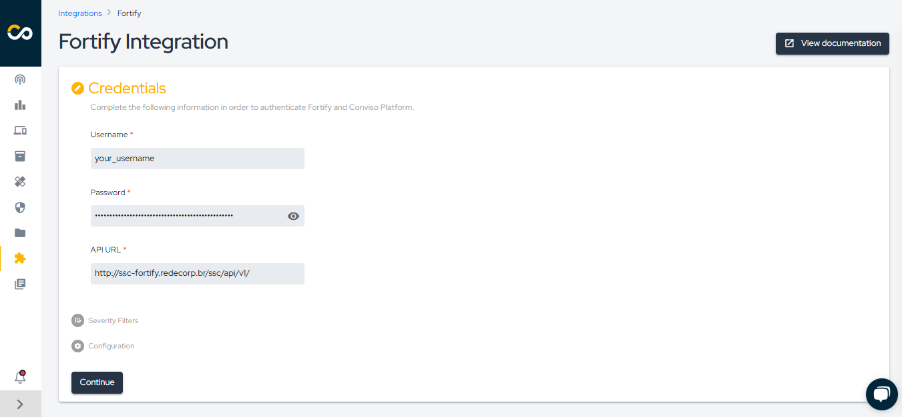

<div style={{textAlign: 'center'}}>


</div>

:::note
First time using Fortify? Please refer to the [following documentation](https://www.microfocus.com/pt-br/documentation/fortify-software-security-center/).
:::


## Introduction

This integration allows the automatic import of issues (vulnerabilities) found in Fortify into the Conviso Platform, enabling users to leverage the full potential of the Conviso Platform for vulnerability management.

## Requirements

To integrate Fortify with Conviso Platform, you will need the following data:

- Username: Credential of a Fortify user with admin privilege;

- Password: The password of the referred username;

- API URL: The API URL address obtained from Fortify subscription, e.g. ```192.168.1.15/ssc/api/v1```.

## Conviso Platform Setup

Log in to the [Conviso Platform](https://app.convisoappsec.com);

- Log in to the Conviso Platform.
- On the main menu to the left, click on Integrations.
- In the panel to the right, click on the Scanners option, then click on the Integrate button on the Fortify card.

<div style={{textAlign: 'center'}}>


</div>

Fill in the Username, Password, and API URL with the required data. When you have filled in all the necessary fields, click on the Save button to store your Fortify integration configuration settings.

<div style={{textAlign: 'center'}}>


</div>

## Synchronize Project

After setting up the integration, you need to synchronize the projects with the Conviso Platform.


<div style={{ textAlign: 'center' }}>


</div>

When clicking on 'New Project,' select the Fortify project that should be created on the Conviso platform and synchronized, as shown in the example below.

<div style={{textAlign: 'center'}}>


</div>

To check the asset synchronized with Fortify, click on asset management, search for the name, then click to view the information, as shown in the example below.


<div style={{textAlign: 'center'}}>



</div>


If you wish to synchronize manually, click on the 'synchronize' button.

<div style={{textAlign: 'center'}}>


</div>

When you click the synchronize button, the asset will start synchronization.

<div style={{textAlign: 'center'}}>


</div>

[](https://cta-service-cms2.hubspot.com/web-interactives/public/v1/track/redirect?encryptedPayload=AVxigLKtcWzoFbzpyImNNQsXC9S54LjJuklwM39zNd7hvSoR%2FVTX%2FXjNdqdcIIDaZwGiNwYii5hXwRR06puch8xINMyL3EXxTMuSG8Le9if9juV3u%2F%2BX%2FCKsCZN1tLpW39gGnNpiLedq%2BrrfmYxgh8G%2BTcRBEWaKasQ%3D&webInteractiveContentId=125788977029&portalId=5613826)

