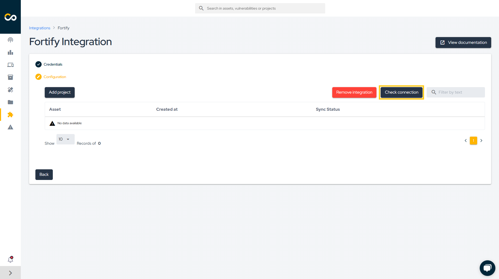

<div style={{textAlign: 'center'}}>


</div>

:::note
First time using Fortify? Please refer to the [following documentation](https://www.microfocus.com/pt-br/documentation/fortify-software-security-center/).
:::

## Introduction

This integration enables the automatic import of issues (vulnerabilities) identified by Fortify into the Conviso Platform, allowing the user to leverage all the features of the Conviso Platform in managing these issues.

## Requirements

To integrate Fortify with the Conviso Platform, you will need the following:

- Administrator-level user registered in Fortify:
    * Ensure you have a Fortify account with administrator privileges.

- API URL: The API URL address obtained from Fortify subscription, e.g. ```192.168.1.15/ssc/api/v1```.

## Conviso Platform Setup

After logging into the Conviso Platform, follow these steps:

1. In the sidebar menu, click **Integrations**.
2. Use the search bar to find **Fortify**.
3. Click the **Connect** button.

<div style={{textAlign: 'center'}}>


</div>

4. Enter the administrator credentials in the Username and Password fields.
5. Enter the API URL as described above.
6. Click **Continue**.

<div style={{textAlign: 'center'}}>


</div>

Once completed, the platforms will be connected and ready to synchronize data. You can now proceed to import your Fortify assets.

## Importing Assets

If everything goes right, you’ll be presented with the following screen. Click the **Check connection** button to confirm that the integration was performed correctly.

<div style={{textAlign: 'center'}}>



</div>

With the integration configured, you can now start importing your projects. To do so, click the **Add project** button.

Next, select the projects you want to import into the Conviso Platform and click **Add**.

<div style={{textAlign: 'center'}}>


</div>

After this, the import process will be initiated, and depending on the size of the project, this may take a few minutes.

After creating the integration, you can add more assets through the integration configuration page, which can be accessed in two ways:

1. Through the Asset Management page as shown in the figure below:

<div style={{textAlign: 'center'}}>


</div>

2. From the **Integration Settings** button in the Integrations section:

<div style={{textAlign: 'center'}}>


</div>

## General Information on Operation

In this section, we will address crucial information about the integration's operation. This includes details about the synchronization process, as well as the status mapping between the involved platforms.

### Status Mapping

When moving issues from one status to another, the Conviso platform will communicate and mark the issues in Fortify according to the following mapping:

<div style={{display: 'ruby-text'}}>

| Conviso Platform     | Fortify        |
|----------------------|----------------|
| Created              | Not Set/Blank  |
| Identified           | Exploitable    |
| False Positive       | Not an Issue   |
| Risk Accepted        | Suspicious     |
| Fixed                | Removed        |
| Suppressed           | Suppressed     |

</div>

The modifications are bidirectional, meaning that when changes are made in the Conviso Platform, these changes will be replicated to Fortify, and the same applies in reverse.

**Note: The only exception to these status changes is for the FIXED status in the Conviso Platform. In the case of FIXED, it is not allowed for a user to move it to FIXED when the issue was opened by a scanner like Fortify. In this scenario, the tool itself should identify the changes and recognize that the issue has been removed. Therefore, in the next synchronization, those issues that are no longer identified by Fortify will be marked as FIXED in the Conviso Platform.**

When changing the status in the Conviso Platform, these changes will be replicated immediately to Fortify. However, if a change is first made in Fortify, it will only be replicated to the Conviso Platform after a synchronization between the platforms is performed.

### Synchronization

To monitor or initiate a synchronization, you can follow the steps below:

1. Go to the **Assets** page.
2. Click on the name of the asset you want to sync.
3. On the asset detail page, click on **View All** next to Integration, as shown in the image below:

<div style={{textAlign: 'center'}}>


</div>

4. A new screen will appear with the option to start a sync and view the progress. Any errors encountered during syncing will also be displayed here.

Alternatively, refer to the [Azure Pipelines documentation](../integrations/azure-pipelines-cli.md#importing-and-synchronizing-assets-from-external-scanners) to automatically synchronize your assets.

[](https://cta-service-cms2.hubspot.com/web-interactives/public/v1/track/redirect?encryptedPayload=AVxigLKtcWzoFbzpyImNNQsXC9S54LjJuklwM39zNd7hvSoR%2FVTX%2FXjNdqdcIIDaZwGiNwYii5hXwRR06puch8xINMyL3EXxTMuSG8Le9if9juV3u%2F%2BX%2FCKsCZN1tLpW39gGnNpiLedq%2BrrfmYxgh8G%2BTcRBEWaKasQ%3D&webInteractiveContentId=125788977029&portalId=5613826)