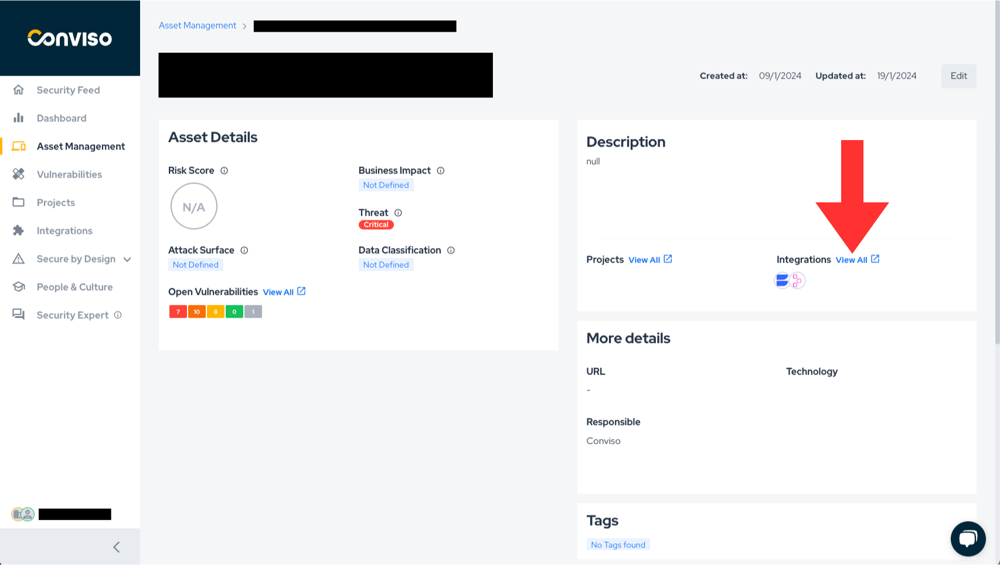

<div style={{textAlign: 'center'}}>


</div>

:::note
First time using Fortify? Please refer to the [following documentation](https://www.microfocus.com/pt-br/documentation/fortify-software-security-center/).
:::

## Introduction

This integration enables the automatic import of issues (vulnerabilities) identified by Fortify into the Conviso Platform, allowing the user to leverage all the features of the Conviso Platform in managing these issues.

## Requirements

To integrate Fortify with the Conviso Platform, you will need the following data:

- Administrator-level user registered in Fortify:
    * Ensure that you have a user account in Fortify with administrator privileges.

- API URL: The API URL address obtained from Fortify subscription, e.g. ```192.168.1.15/ssc/api/v1```.

## Conviso Platform Setup

To perform the integration between the two platforms, follow these steps after logging into the platform:

1. In the sidebar menu, click on the "Integrations" option.
2. Look for the Fortify image in the integrations; you can use the "Scanners" filter to simplify the search.
3. Click on the "Integrate" button, and a form similar to the image below will appear.

<div style={{textAlign: 'center'}}>


</div>

4. Fill in the username and password fields with the login credentials of the user with administrative-level access.
5. Fill in the API URL as per the example provided in the Requirements section.
6. Click on "Save."


By completing these steps, the two platforms will be integrated and able to communicate. Now, let's proceed to the importation of assets/repositories.

## Importing Assets

After the sixth step, the following screen displaying assets registered in Fortify will appear. On reaching this screen, you can now select which projects to import into the Conviso Platform. Utilize the search field to look for a specific project.

After selecting the projects, simply click on "Finish," and the assets will enter the queue to be imported. Depending on the project's size, this process may take a few minutes for completion.
<div style={{textAlign: 'center'}}>


</div>

**There are other ways to access this screen if you have configured the integration previously. Simply go to the Integration Configuration screen, and you can access it in two ways:**

1. Through the Assets Management screen, by clicking on "New Asset" as shown in the figure below.

<div style={{textAlign: 'center'}}>


</div>

2. Through the "Configure" button in the Integrations tab.

<div style={{textAlign: 'center'}}>


</div>

After completing either of the two steps, the configuration screen below will appear.

<div style={{textAlign: 'center'}}>


</div>

On this screen, there is a wealth of important information. Below is an explanation of the elements on this screen.

1. Table displaying the projects integrated into the platform, along with the date of the last synchronization and its current status.

2. Button to add new projects to the platform, leading to the project selection screen as shown earlier in this document.

3. Connection status between the platforms, aiding in monitoring whether the communication between the platforms is active.

4. Information used for the integration, e.g., username and API URL.

5. Button to remove the integration.

## General Information on Operation

In this section, we will address crucial information about the integration's operation. This includes details about the synchronization process, as well as the status mapping between the involved platforms.

### Status Mapping

When moving issues from one status to another, the Conviso platform will communicate and mark the issues in Fortify according to the following mapping:

<div style={{display: 'ruby-text'}}>

| Conviso Platform     | Fortify        |
|----------------------|----------------|
| Created              | Not Set/Blank  |
| identified           | Exploitable    |
| false positive       | Not an Issue   |
| risk accepted        | Suspicious     |
| Fixed                | Removed        |
| Suppressed           | Suppressed     |


</div>

The modifications are bidirectional, meaning that when changes are made in the Conviso Platform, these changes will be replicated to Fortify, and the same applies in reverse.

**Note: The only exception to these status changes is for the FIXED status in the Conviso Platform. In the case of FIXED, it is not allowed for a user to move it to FIXED when the issue was opened by a scanner like Fortify. In this scenario, the tool itself should identify the changes and recognize that the issue has been removed. Therefore, in the next synchronization, those issues that are no longer identified by Fortify will be marked as FIXED in the Conviso Platform.**

When changing the status in the Conviso Platform, these changes will be replicated immediately to Fortify. However, if a change is first made in Fortify, it will only be replicated to the Conviso Platform after a synchronization between the platforms is performed.

### Synchronization

To monitor or initiate a synchronization, you can follow the steps below:

1. Go to the Assets Management page.
2. Click on the name of the asset you want to synchronize.
3. On the asset's detail page, click on View All next to Integration, as shown in the image below.

<div style={{textAlign: 'center'}}>



</div>

4. A new screen will open, where you will find the button to initiate an integration, along with a progress bar indicating the status if synchronization is in progress. In case of any errors, they will also be displayed on this screen.

[](https://cta-service-cms2.hubspot.com/web-interactives/public/v1/track/redirect?encryptedPayload=AVxigLKtcWzoFbzpyImNNQsXC9S54LjJuklwM39zNd7hvSoR%2FVTX%2FXjNdqdcIIDaZwGiNwYii5hXwRR06puch8xINMyL3EXxTMuSG8Le9if9juV3u%2F%2BX%2FCKsCZN1tLpW39gGnNpiLedq%2BrrfmYxgh8G%2BTcRBEWaKasQ%3D&webInteractiveContentId=125788977029&portalId=5613826)