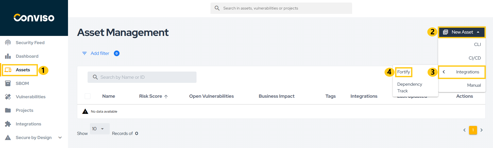

<div style={{textAlign: 'center'}}>


</div>

:::note
First time using Fortify? Please refer to the [following documentation](https://www.microfocus.com/pt-br/documentation/fortify-software-security-center/).
:::

## Introduction

This integration enables the automatic import of issues (vulnerabilities) identified by Fortify into the Conviso Platform, allowing the user to leverage all the features of the Conviso Platform in managing these issues.

## Requirements

To integrate Fortify with the Conviso Platform, you will need the following:

- Administrator-level user registered in Fortify:
    * Ensure you have a Fortify account with administrator privileges.

- API URL: The API URL address obtained from Fortify subscription, e.g. ```192.168.1.15/ssc/api/v1```.

## Conviso Platform Setup

After logging into the Conviso Platform, follow these steps:

1. In the sidebar menu, click **Integrations**.
2. Use the search bar to find **Fortify**.
3. Click the **Connect** button.

<div style={{textAlign: 'center'}}>


</div>

4. Enter the administrator credentials in the Username and Password fields.
5. Enter the API URL as described above.
6. Click **Continue**.

<div style={{textAlign: 'center'}}>


</div>

9. Configure how vulnerability statuses are synchronized between Conviso Platform and Fortify.

<div style={{textAlign: 'center'}}>


</div>

- Drag and drop Fortify statuses to map and reorder them. You can restore Conviso's default mapping at any time.

<div style={{textAlign: 'center'}}>


</div>

8. Select which vulnerability severities you want to import from Fortify:

<div style={{textAlign: 'center'}}>


</div>

9. Click **Continue**.
   
Once completed, the platforms will be connected and ready to synchronize data. You can now proceed to import your Fortify assets.

## Importing Assets

If everything goes right, you’ll be presented with the following screen. Click the **Check connection** button to confirm that the integration was performed correctly.

<div style={{textAlign: 'center'}}>


</div>

With the integration configured, you can now start importing your projects. To do so, click the **Add project** button.

Next, select the projects you want to import into the Conviso Platform and click **Add**.

<div style={{textAlign: 'center'}}>


</div>

After this, the import process will be initiated, and depending on the size of the project, this may take a few minutes.

After creating the integration, you can add more assets through the integration configuration page, which can be accessed in two ways:

1. Through the Asset Management page as shown in the figure below:

<div style={{textAlign: 'center'}}>



</div>

2. From the **Integration Settings** button in the Integrations section:

<div style={{textAlign: 'center'}}>


</div>

## General Information on Operation

In this section, we will address crucial information about the integration's operation. This includes details about the synchronization process, as well as the status mapping between the involved platforms.

### Status Mapping

When moving issues from one status to another, the Conviso platform will communicate and mark the issues in Fortify according to a default mapping configuration. This default mapping can be customized during the Status Mapping step to match your organization's specific workflow requirements:

<div style={{display: 'ruby-text'}}>

| Conviso Platform     | Fortify                        |
|----------------------|--------------------------------|
| Created              | Not Set                        |
| Identified           | Exploitable, Reliability Issue |
| In Progress          | -                              |
| Awaiting Validation  | -                              |
| Fixed                | Removed, Not Found             |
| Risk Accepted        | Suspicious, Bad Practive       |
| False Positive       | Not an Issue, Suppresses       |

</div>

The modifications are bidirectional, meaning that when changes are made in the Conviso Platform, these changes will be replicated to Fortify, and the same applies in reverse.


---

### Two-Way Updates and Bidirectional Logic

The integration operates under a **two-way synchronization model**, ensuring that updates made in one platform are consistently mirrored in the other.

#### Direction of Updates

- **From Conviso Platform → Fortify:**  
  Any change of status (such as *Risk Accepted*, *False Positive*, or *Identified*) is immediately propagated to Fortify through API communication. Note that only mapped statuses will be synchronized.  
  Specifically for the Conviso Platform → Fortify direction, if a single Conviso status is mapped to multiple Fortify statuses, only the first Fortify status in the mapping will be used.

- **From Fortify → Conviso Platform:**  
  When Fortify modifies, suppresses, or removes an issue, these updates are reflected in the Conviso Platform after the next synchronization cycle.

- **Automatic Fixed Synchronization:**  
  When Fortify no longer detects a vulnerability in a subsequent scan, that issue is automatically marked as *Fixed* in the Conviso Platform.

#### Bidirectional Summary Table

| Action | Origin | Reflected In | Behavior |
|--------|---------|--------------|-----------|
| Status change (e.g., Risk Accepted, False Positive) | Conviso Platform | Fortify | Immediate reflection |
| Suppression or removal of issue | Fortify | Conviso Platform | Applied at next synchronization |
| Issue no longer detected (Fixed) | Fortify | Conviso Platform | Automatically marked as Fixed |
| New issue detected | Fortify | Conviso Platform | Imported automatically |
| Notes/comments updates | Conviso Platform | Fortify | Reflected if supported by API |

:::tip
This **two-way update mechanism** ensures that both systems — Fortify and Conviso Platform — maintain **data integrity, consistent statuses, and synchronized workflows** without manual duplication of actions.
:::

---

### Synchronization

To monitor or initiate a synchronization, you can follow the steps below:

1. Go to the **Assets** page.
2. Click on the name of the asset you want to sync.
3. On the asset detail page, click on **View All** next to Integration, as shown in the image below:

<div style={{textAlign: 'center'}}>


</div>

4. A new screen will appear with the option to start a sync and view the progress. Any errors encountered during syncing will also be displayed here.

Alternatively, refer to the [Azure Pipelines documentation](../integrations/azure-pipelines-cli.md#importing-and-synchronizing-assets-from-external-scanners) to automatically synchronize your assets.

---

### Bidirectional Summary

The **two-way integration** ensures that both platforms remain synchronized at all times:

- Updates performed in **Conviso Platform** are instantly reflected in **Fortify**.  
- Changes performed directly in **Fortify** are replicated back to **Conviso Platform** during the next sync.  
- This synchronization keeps both platforms aligned, avoiding discrepancies between scanner results and vulnerability management workflows.

[](https://cta-service-cms2.hubspot.com/web-interactives/public/v1/track/redirect?encryptedPayload=AVxigLKtcWzoFbzpyImNNQsXC9S54LjJuklwM39zNd7hvSoR%2FVTX%2FXjNdqdcIIDaZwGiNwYii5hXwRR06puch8xINMyL3EXxTMuSG8Le9if9juV3u%2F%2BX%2FCKsCZN1tLpW39gGnNpiLedq%2BrrfmYxgh8G%2BTcRBEWaKasQ%3D&webInteractiveContentId=125788977029&portalId=5613826)
