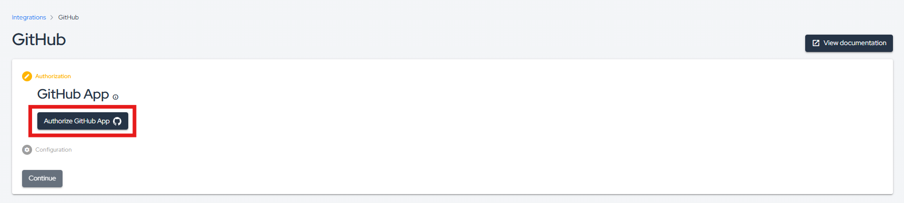

:::note
First time using GitHub Advanced Security? Please refer to the [following documentation](https://docs.github.com/en/get-started/learning-about-github/about-github-advanced-security).
:::

## Introduction

GitHub Advanced Security is a suite of security features provided by GitHub to help developers identify and remediate vulnerabilities early in the development process. This includes capabilities such as code scanning, secret scanning, and dependency review. By detecting security issues directly in your codebase, GitHub Advanced Security enables proactive management of potential threats.

This integration automatically imports vulnerabilities identified by GitHub Advanced Security into the Conviso Platform, allowing you to leverage the full range of Conviso's capabilities—such as risk scoring, tracking, and reporting—to efficiently manage and mitigate these issues.

## Requirements

To integrate GitHub Advanced Security with the Conviso Platform, ensure you meet the following prerequisites:

- Administrator-level access on the Conviso Platform.
- Administrator-level access on the relevant GitHub repository or organization.
- GitHub Advanced Security enabled and executed on your target repository.

## Conviso Platform Setup

To perform the integration between the two platforms, follow these steps:

1. In the sidebar menu, click **Integrations**.
2. Search for **GitHub** in the integrations list; you can use the **Scanners** filter to narrow down the results.
3. Click the **Integrate** button to proceed:

4. Click the **Authorize GitHub App** button and complete the GitHub authentication process:

5. Select your GitHub organization:

6. Choose whether to install the Conviso App on all your repositories or only on selected ones:

7. Click **Continue**:

8. Your repositories will be imported asynchronously. Wait a few moments, then refresh the page to view your imported assets.

Alternatively, you can access your imported assets via the **Asset Management** page.

## Analyzing your Results

Once asset synchronization is complete, all vulnerabilities will be imported into the platform. To view them, simply navigate to the asset (as shown above) and click on **Open Vulberabilities**:

Next, click **Add Filters** and select **GitHub**, in the **Source** field:

The imported vulnerabilities will then appear in the list:

Simply click on a vulnerability title to view its details:

## General Information on Operation

In this section, we will address crucial information about the integration's operation. This includes details about the synchronization process, as well as the status mapping between the involved platforms.

### Status Mapping

When moving issues from one status to another, the Conviso platform will communicate and mark the issues in GitHub Advanced Security according to the following mapping:

#### SAST or Code Scanning vulnerabilities

| Conviso Platform                   | GitHub Advanced Security                   |
|------------------------------------|--------------------------------------------|
| Created                            | Open                                       |
| Identified                         | Open                                       |
| False Positive                     | Dismissed (with "False Positive" reason)   |
| Risk Accepted                      | Dismissed (with "Won't fix" reason)        |
| Fixed                              | Fixed                                      |

#### SCA or Dependabot vulnerabilities

| Conviso Platform                   | GitHub Advanced Security                   |
|------------------------------------|--------------------------------------------|
| Created                            | Open                                       |
| Identified                         | Open                                       |
| False Positive                     | Dismissed (with "Tolerable Risk" reason)   |
| Risk Accepted                      | Dismissed (with "Innacurate" reason)       |
| Fixed                              | Fixed                                      |

#### Secrets vulnerabilities

| Conviso Platform                   | GitHub Advanced Security                   |
|------------------------------------|--------------------------------------------|
| Created                            | Open                                       |
| Identified                         | Open                                       |
| False Positive                     | Resolved (with "False Positive" reason)    |
| Risk Accepted                      | Resolved (with "Won't fix" reason)         |
| Fixed                              | Revoked                                    |

The modifications are bidirectional, meaning that when changes are made in the Conviso Platform, these changes will be replicated to GitHub Advanced Security, and the same applies in reverse.

:::note
The only exception to these status changes is for the FIXED status in the Conviso Platform. In the case of FIXED, it is not allowed for a user to move it to FIXED when the issue was opened by a scanner like GitHub Advanced Security. In this scenario, the tool itself should identify the changes and recognize that the issue has been removed. Therefore, in the next synchronization, those issues that are no longer identified by GitHub Advanced Security will be marked as FIXED in the Conviso Platform.
:::

When changing the status in the Conviso Platform, these changes will be replicated immediately to GitHub Advanced Security. However, if a change is first made in GitHub Advanced Security, it will only be replicated to the Conviso Platform after a synchronization between the platforms is performed.

### Synchronization

To monitor or initiate a synchronization, you can follow the steps below:

1. Go to the **Asset Management** page.
2. Click on the name of the asset you want to synchronize.
3. On the asset's detail page, click on **View All** next to Integrations, as shown in the image below.

4. A new screen will open, where you will find the button to initiate an integration, along with a progress bar indicating the status if the synchronization is in progress. In case of any errors, they will also be displayed on this screen.

