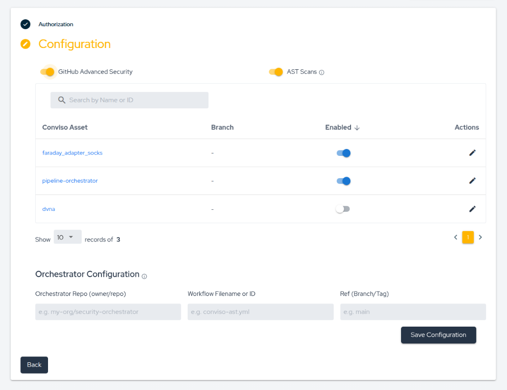

# GitHub AST Orchestrator

The Conviso Platform's **GitHub AST Orchestrator** simplifies Application Security Testing (AST) by centralizing scanning logic in a single repository. Instead of configuring workflows in every repository, the Conviso Platform triggers a `workflow_dispatch` event on a designated "Orchestrator" repository to scan other assets.

## Overview

The Orchestrator model provides several benefits:
- **Centralized Management**: Maintain and update security scanning logic in one place.
- **Consistency**: Ensure all repositories use the same tools and configurations.
- **Ease of Use**: Quickly onboard new repositories without manual workflow setup.

:::note
**Execution Costs**: Since the Orchestrator runs within your GitHub Actions environment, the execution time is consumed from your organization's GitHub Actions minutes.
:::

## Prerequisites

Before configuring the Orchestrator, ensure that:
1. You have configured the [GitHub Integration](./github.md).
2. You have a **designated repository** to act as the Orchestrator.
3. You have a Conviso API Key. Find yours [in this tutorial](../platform/security-feed.md#generate-api-key).
4. Go to your Orchestrator repository's **Settings > Secrets and Variables > Actions** and create a **New Repository Secret** named `CONVISO_API_KEY` with your API Key value.

:::important
You must create the Orchestrator repository manually and ensure the Conviso GitHub App integration has permission to see and access it.
:::

## Configuring the AST Orchestrator

### Step 1 - Enable Features

In the Conviso Platform UI, navigate to the GitHub Integration settings and ensure the following are toggled **On**:
- **GitHub Advanced Security**
- **AST Scans**

### Step 2 - Configure Orchestrator Settings

Fill in the **Orchestrator Configuration** section with the following details:
- **Orchestrator Repo (owner/repo)**: The full path to your orchestrator repository (e.g., `my-org/security-orchestrator`).
- **Workflow Filename or ID**: The name of the YAML file containing the orchestrator workflow (e.g., `ast-scan.yml`).
- **Ref (Branch/Tag)**: The branch or tag where the workflow is defined (e.g., `main`).

### Disabling the Orchestrator

You can disable the AST Orchestrator at any time by toggling the **AST Scans** switch to **Off** in the Conviso Platform integration page. This will prevent any further automatic triggers from the platform.



:::tip
Recommended setting: In the GitHub App installation on GitHub, allow access to **All repositories** to ensure the Orchestrator can scan any mapped asset.
:::

### Step 3 - Asset Mapping

Map your Conviso Assets to specific branches. This mapping is primarily for **edge cases** where an asset does not follow the branch defined in your default Orchestrator configuration.

- **Simplified Setup**: If you leave the branch mapping empty for an asset, the Orchestrator will automatically use the default configuration provided in Step 2.
- **Automatic Triggers**: By integrating with Conviso, we automatically trigger the scanning workflow whenever you **merge a Pull Request (PR)** into a branch mapped to an active asset.

:::important
The Orchestrator logic is specifically designed to run upon **PR merges**, ensuring that only verified code changes are analyzed and identifying vulnerabilities before they progress further in your environment.
:::

## Workflow Definition

The Orchestrator workflow is triggered via `workflow_dispatch`. It receives several inputs from the Conviso Platform to identify the target for scanning.

### Required Workflow Inputs

Your workflow file (e.g., `ast-scan.yml`) must define the following inputs:
- `repo_full_name`: The full name of the repository to scan.
- `branch`: The branch to scan.
- `commit_sha`: The specific commit SHA for the scan.
- `pr_number`: (Optional) The pull request number if the scan is triggered from a PR.

### Workflow Template

Copy the YAML content below into your Orchestrator repository at the path specified in your configuration (e.g., `.github/workflows/ast-scan.yml`):

```yaml
name: Conviso AST Orchestrator

on:
  workflow_dispatch:
    inputs:
      repo_full_name:
        description: 'Repository to scan'
        required: true
      branch:
        description: 'Branch to scan'
        required: true
      commit_sha:
        description: 'Commit SHA'
        required: true
      pr_number:
        description: 'PR number'
        required: false

jobs:
  conviso-ast:
    runs-on: ubuntu-latest
    container:
      image: convisoappsec/convisocli:latest
      env:
        CONVISO_API_KEY: ${{ secrets.CONVISO_API_KEY }}
    steps:
      - name: Checkout target repository
        uses: actions/checkout@v6
        with:
          repository: ${{ github.event.inputs.repo_full_name }}
          ref: ${{ github.event.inputs.commit_sha }}

      - name: Run AST Scan
        run: |
          conviso ast run \
            --vulnerability-auto-close \
            --company-id [YOUR_COMPANY_ID]
```

## Scan Logic and Execution

- **Environment**: The scan runs using the `convisoappsec/convisocli:latest` Docker image.
- **Command**: `conviso ast run --vulnerability-auto-close --company-id [ID]`
- **Blocking Status**: The scan is currently configured as **non-blocking**.
- **Results**: Identified vulnerabilities are automatically sent to the mapped asset on the Conviso Platform.

## Support

If you have any questions or need assistance, feel free to contact our support team.
