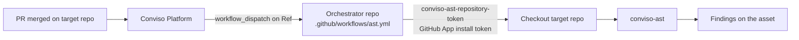
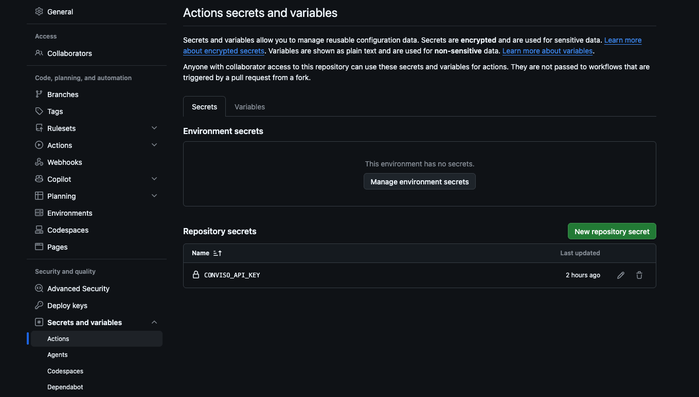
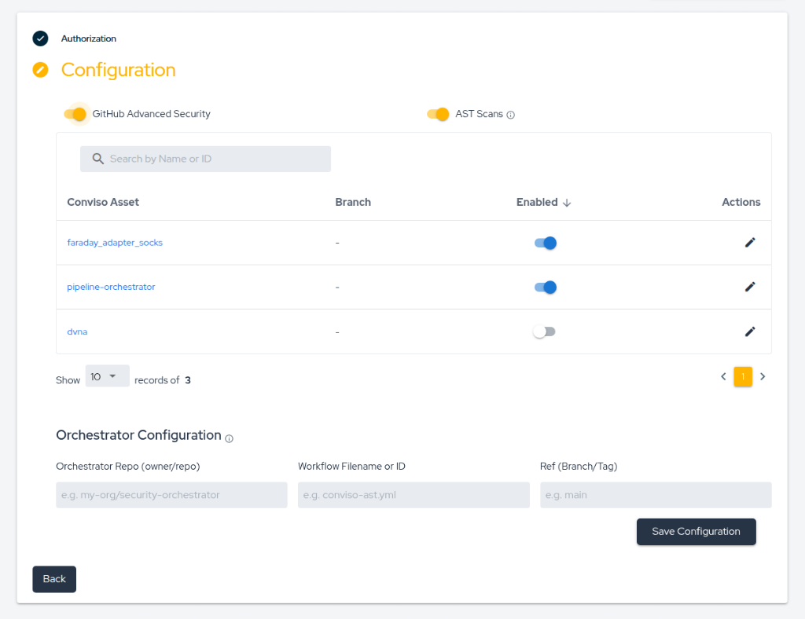
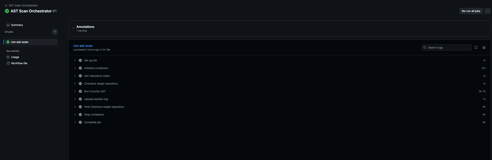
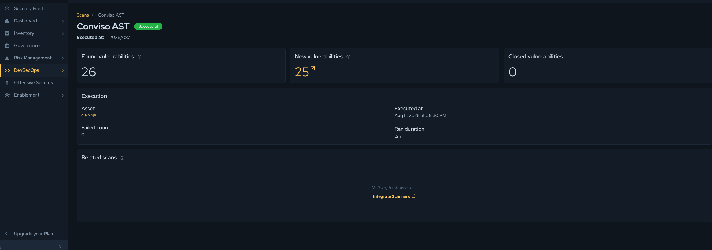

# GitHub AST Orchestrator

The Conviso Platform **GitHub AST Orchestrator** runs Conviso AST from **one** GitHub repository (the orchestrator). Application repositories do **not** need a Conviso workflow.

When an eligible pull request is **merged**, Conviso calls GitHub Actions `workflow_dispatch` on the orchestrator and passes the target repository and branch. The workflow obtains a short-lived clone credential from the Platform (using your API key), checks out the target repository, runs `conviso-ast`, and sends findings to the mapped asset.

You do **not** store a GitHub Personal Access Token for cloning.

## How it works


```mermaid
flowchart LR
    A[PR merged on target repo] --> B[Conviso Platform]
    B -->|workflow_dispatch on Ref| C[Orchestrator repo<br/>.github/workflows/ast.yml]
    C -->|conviso-ast-repository-token<br/>GitHub App install token| D[Checkout target repo]
    D --> E[conviso-ast]
    E --> F[Findings on the asset]
```

What Conviso checks before dispatching:

1. The event is a pull request that was **merged** (`action: closed` and `merged: true`).
2. **AST Scans** is enabled on the GitHub integration.
3. The repository is an **imported asset** that is **enabled**.
4. The PR **base branch** matches the configured merge target (see [Merge target branch](#merge-target-branch) below).

The Actions run always appears on the **orchestrator** repository (not on the application repository).

:::note
**Execution costs**: Jobs run on your GitHub Actions runners and consume your organization’s Actions minutes.
:::

## Before you begin

Work in this order: **GitHub setup first**, then **Conviso Platform**.

You need:

- [GitHub Integration](./github.md) connected (GitHub App installed).
- At least one application repository **imported as an asset** and **enabled**.
- A dedicated orchestrator repository (or an empty repo you will use only for this). Example / template: [convisoappsec/pipeline-orchestrator](https://github.com/convisoappsec/pipeline-orchestrator).
- Permission to create an **Actions repository secret** on the orchestrator.
- A **Conviso API key** for the same environment you will scan against (production or staging).
- The GitHub App must have access to the **orchestrator** and to every **target** repository you will scan. Prefer **All repositories** on the App installation.

| Term | Exact meaning |
| --- | --- |
| **Orchestrator repository** | GitHub repo that contains `.github/workflows/ast.yml`. Conviso triggers this repo only. |
| **Target repository** | Application repo imported as an asset. It must **not** rely on a local Conviso workflow for this flow. |
| **Ref** | Branch or tag **of the orchestrator** where GitHub loads `ast.yml` when Conviso calls `workflow_dispatch`. If you leave Ref empty in Conviso, dispatch defaults to **`main`**. |
| **Merge target branch** | The PR **base** branch on the **target** repo that is allowed to trigger a scan (for example `main`). See below. |
| **Asset** | Imported repository in Conviso (`owner/repo`) where findings are stored. |

### Merge target branch

Conviso compares the merged PR’s **base branch** to:

1. The asset’s configured AST / branch mapping, if set; otherwise  
2. The integration **Ref** (`orchestrator_ref`).

| Configuration | What triggers a scan |
| --- | --- |
| Asset branch = `master`, Ref = `main` | Only merges **into `master`** on that asset |
| Asset branch empty, Ref = `main` | Only merges **into `main`** on that asset |
| Asset branch empty and Ref empty | No branch filter (any base branch can trigger). Prefer setting Ref explicitly. |

**Ref is still the orchestrator branch that holds the workflow.** It is reused as the default merge-target filter when the asset has no branch of its own. Those are two roles of the same field — do not confuse “where `ast.yml` lives” with “any branch on the target”.

---

## Part 1 – GitHub setup

### Step 1 – Create the orchestrator repository

1. Create a GitHub repository (recommended name: `conviso-ast-orchestrator`), **or** copy from [convisoappsec/pipeline-orchestrator](https://github.com/convisoappsec/pipeline-orchestrator) and keep only `.github/workflows/ast.yml`.
2. Choose the branch that will contain the workflow (almost always **`main`**). That value is what you will set as **Ref** in Conviso.

### Step 2 – Create the `CONVISO_API_KEY` secret

In the **orchestrator** repository (not the target):

1. Open **Settings → Secrets and variables → Actions**.
2. Under **Repository secrets**, create:

| Name | Type | Required |
|------|------|----------|
| `CONVISO_API_KEY` | Repository secret | **Yes** |

Use the API key for the same Conviso environment as the Platform you configured (production vs staging).

*Repository secret `CONVISO_API_KEY` under Settings → Secrets and variables → Actions.*



:::tip Optional variable
You may add an Actions **variable** `CONVISO_COMPANY_ID`. The workflow uses it only when the `company_id` input is empty (typical for a manual **Run workflow**). When Conviso dispatches after a merge or **Run AST**, it sends `company_id` in the inputs, so the variable is not required for Platform-triggered runs.
:::

Do **not** create a GitHub PAT for clone. The workflow calls `conviso-ast-repository-token --provider github`, and the Platform returns a **GitHub App installation token** scoped to the **single target repository**, with **read-only** contents access, valid for about **one hour**.

### Step 3 – Add `.github/workflows/ast.yml`

GitHub Actions only loads workflows from **`.github/workflows/`**. A file at the repository root is ignored.

:::tip Example repository
Public template: **[convisoappsec/pipeline-orchestrator](https://github.com/convisoappsec/pipeline-orchestrator)**  

Workflow file: [`.github/workflows/ast.yml`](https://github.com/convisoappsec/pipeline-orchestrator/blob/main/.github/workflows/ast.yml)
:::

On the orchestrator branch you will set as **Ref** (usually `main`):

1. Create **`.github/workflows/`** if needed.
2. Create **`ast.yml`** so the full path is exactly **`.github/workflows/ast.yml`**.
3. Paste the YAML below (or copy it from the example repo).

*Orchestrator repository with `.github/workflows/ast.yml` on `main`.*


```yaml
name: AST Scan Orchestrator

on:
  workflow_dispatch:
    inputs:
      repo_full_name:
        description: "Repository to scan (owner/repo)"
        required: true
        type: string
      branch:
        description: "Branch to scan"
        required: true
        type: string
      api_url:
        description: "Conviso Platform URL"
        required: false
        type: string
      company_id:
        description: "Conviso company id. When empty the CONVISO_COMPANY_ID variable is used"
        required: false
        type: string
      asset_id:
        description: "Conviso asset id. When empty the scanner resolves the asset by repository name"
        required: false
        type: string
      scan_run_id:
        description: "Scan run created by the platform. Correlates this execution with the run shown in the UI"
        required: false
        type: string
      commit_sha:
        description: "Merge commit SHA (post-merge scans only)"
        required: false
        type: string
      pr_number:
        description: "Pull request number (post-merge scans only)"
        required: false
        type: string

jobs:
  run-ast-scan:
    runs-on: ubuntu-latest
    container:
      image: convisoappsec/convisoast_v2:latest

    steps:
      - name: Get repository token
        id: repo_token
        env:
          CONVISO_APIKEY: ${{ secrets.CONVISO_API_KEY }}
          CONVISO_BASE_URL: ${{ inputs.api_url || 'https://app.convisoappsec.com' }}
          CONVISO_REPO_FULL_NAME: ${{ inputs.repo_full_name }}
          CONVISO_ASSET_ID: ${{ inputs.asset_id }}
          CONVISO_SCAN_RUN_ID: ${{ inputs.scan_run_id }}
        run: |
          TOKEN=$(conviso-ast-repository-token --provider github)
          # Mask BEFORE the value reaches the step output, so it can never surface
          # in this job's log.
          echo "::add-mask::$TOKEN"
          echo "token=$TOKEN" >> "$GITHUB_OUTPUT"

      - name: Checkout target repository
        uses: actions/checkout@v6
        with:
          repository: ${{ inputs.repo_full_name }}
          ref: ${{ inputs.branch }}
          fetch-depth: 0
          token: ${{ steps.repo_token.outputs.token }}

      - name: Run Conviso AST
        env:
          CONVISO_APIKEY: ${{ secrets.CONVISO_API_KEY }}
          CONVISO_BASE_URL: ${{ inputs.api_url || 'https://app.convisoappsec.com' }}
          CONVISO_COMPANY_ID: ${{ inputs.company_id || vars.CONVISO_COMPANY_ID }}
          CONVISO_ASSET_ID: ${{ inputs.asset_id }}
          CONVISO_SCAN_RUN_ID: ${{ inputs.scan_run_id }}
          CONVISO_BRANCH: ${{ inputs.branch }}
          GIT_CONFIG_COUNT: "1"
          GIT_CONFIG_KEY_0: safe.directory
          GIT_CONFIG_VALUE_0: "*"
        run: |
          conviso-ast -p . -o /tmp/conviso-ast-session.zip

      - name: Upload session log
        if: always()
        uses: actions/upload-artifact@v4
        with:
          name: conviso-ast-session
          path: /tmp/conviso-ast-session.zip
          if-no-files-found: ignore
```

4. Commit and push to that **Ref** branch.

:::important
- Path on disk: **`.github/workflows/ast.yml`** only.  
- In Conviso, set the workflow field to the **file name** `ast.yml` (not `.github/workflows/ast.yml`). Conviso normalizes a full path to the basename, but the UI expects the file name used by the GitHub Actions API.  
- This template checks out `inputs.branch` (the PR base branch after merge). Conviso also sends `commit_sha` and `pr_number` for correlation; the template above does not pass `commit_sha` into `actions/checkout`.
:::

---

## Part 2 – Conviso Platform setup

### Step 4 – Configure the orchestrator

1. Open **Integrations → GitHub**.
2. Turn **AST Scans** **on**.  
   (**GitHub Advanced Security** is a separate toggle. It is **not** required for the orchestrator merge flow described here.)
3. Fill **Orchestrator Configuration**:
   - **Orchestrator Repo** — `owner/repo` of the orchestrator.
   - **Workflow Filename or ID** — `ast.yml`.
   - **Ref** — orchestrator branch/tag that contains `.github/workflows/ast.yml` (e.g. `main`). If empty, Conviso dispatches with ref **`main`**.
4. Save.



### Step 5 – Assets and merge target

1. Confirm each application repository is **imported** and **enabled**.
2. Set the asset branch mapping when the merge target is **not** the same as Ref (example: Ref `main` on the orchestrator, merges into `master` on the asset → map the asset to `master`).
3. If the asset has no branch mapping, merges must go into the branch named by **Ref** (or any branch only if Ref is also empty — avoid that setup).

---

## End-to-end flow (after setup)

1. Developer merges a PR into the configured merge target on an imported, enabled asset.
2. Conviso validates the event and configuration, then calls `workflow_dispatch` on `owner/orchestrator` / `ast.yml` / **Ref**.
3. Inputs include at least: `repo_full_name`, `branch` (PR base), `commit_sha`, `pr_number`, `api_url`, `company_id`, `asset_id` (blank values may be omitted).
4. Job steps: issue repository token → checkout target at `branch` → run `conviso-ast` → upload session artifact.
5. Findings appear on the asset in Conviso Platform.
6. In GitHub, open the **orchestrator** → **Actions** → **AST Scan Orchestrator** to inspect the run.

## Validation checklist

| Check | Expected |
|-------|----------|
| Secret | `CONVISO_API_KEY` exists on the orchestrator |
| Path | `.github/workflows/ast.yml` is on the **Ref** branch |
| Conviso | Orchestrator `owner/repo` + `ast.yml` + Ref saved; **AST Scans** on |
| Asset | Target repo imported, enabled; merge target branch matches mapping or Ref |
| After merge | New run under orchestrator **Actions**; findings (or a clean result) on the asset |

*Successful orchestrator run: Get repository token → Checkout → Run Conviso AST.*



*Scan result on the asset in Conviso Platform (Conviso AST).*



Manual test (optional): on the orchestrator, **Actions → AST Scan Orchestrator → Run workflow**. Set `repo_full_name` and `branch` to an imported asset. Set `api_url` if you are not on production defaults. Set `company_id` or define `CONVISO_COMPANY_ID`.

## Troubleshooting

| Symptom | Cause / fix |
|---------|-------------|
| Merge done, no Actions run | **AST Scans** off; orchestrator fields incomplete; asset disabled or not imported; PR base branch ≠ asset branch / Ref; GitHub App cannot see the repos |
| Workflow never listed | File not under `.github/workflows/`, or not on the **Ref** branch Conviso uses |
| Token step fails (HTTP 4xx) | `repo_full_name` not an imported asset for that API key/company; wrong environment (`CONVISO_API_KEY` vs `api_url`) |
| Checkout 403 | GitHub App lacks access to the **target** repository |
| Scanner missing `CONVISO_COMPANY_ID` | Manual run without `company_id` input and without variable `CONVISO_COMPANY_ID` |
| Wrong code scanned | Merge target / `branch` input mismatch; confirm you merged into the configured base branch |

## Related guides

- [Example orchestrator repository (pipeline-orchestrator)](https://github.com/convisoappsec/pipeline-orchestrator)
- [GitHub Integration](./github.md)
- [GitHub PR Scans](./github-pr-scans.md)
- [Conviso AST](../security-scans/conviso-ast/conviso-ast.md)
