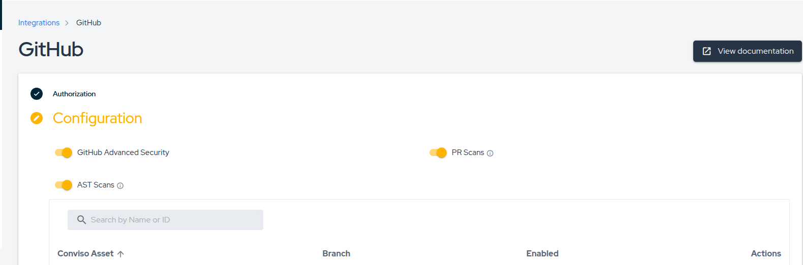
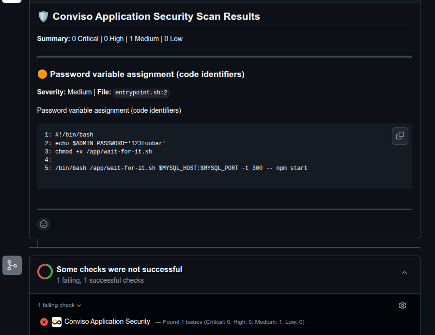

# Automated PR Scanning

The Conviso Platform **Automated PR Scanning** provides instant security feedback directly within your GitHub Pull Requests. unlike traditional CI/CD setups that require manual pipeline configuration, this feature is fully managed and automated.

When a developer opens or updates a Pull Request, the Conviso Platform automatically detects the changes and analyzes **only the modified files**. This ensures rapid feedback, allowing developers to identify and fix security issues before code is merged.

## Key Benefits

- **Zero Configuration:** No need to write YAML files, configure GitHub Actions, or set up CI/CD pipelines in every repository.
- **Speed:** The scanner uses **differential analysis**, focusing strictly on changed files to deliver results in minutes.
- **Native Integration:** Security findings appear as comments directly in the PR, and status checks can automatically block merges if critical issues are found.
- **Secure Execution:** Scans run in an ephemeral, isolated environment managed by Conviso, preserving your CI/CD minutes.

---

## Prerequisites

Before enabling PR Scanning, ensure that:

1. You have successfully configured the basic **[GitHub Integration](./github.md)**.
2. You have **Administrator** access to the Conviso Platform to adjust integration settings.
3. Your repositories are **Mapped to Assets** within the Conviso Platform.

---

## Enabling PR Scanning

To activate automated scanning for your organization:

### Step 1 - Access Integration Settings

Navigate to the **Integrations** page in the Conviso Platform, locate your active **GitHub** integration, and click **Edit/Configure**.

### Step 2 - Activate the Feature

Scroll to the configuration section and toggle **Pull Request Scanning** to **On**.

### Step 3 - Repository Level Control

Once the global setting is enabled, you can control which specific repositories are scanned via the **Asset Mapping** table on the integration page.

- **Enable Scanning:** Ensure the **Status** toggle is active for the specific asset/repository.
- **Disable Scanning:** If you disable a specific repository mapping, PRs for that repository will be ignored.

:::info
Changes to these settings take effect immediately for all new Pull Requests or new commits pushed to existing PRs.
:::

---

## The Developer Workflow

Once enabled, the security workflow integrates seamlessly into the developer's daily routine.

### 1. Triggering a Scan

The process begins automatically when a developer:

- Opens a new Pull Request.
- Pushes new commits to an existing Pull Request.

### 2. Status Checks

Immediately after the PR is updated, a **Conviso Security Check** will appear in the PR timeline with a status of **Pending**.

:::tip Blocking Merges
We recommend configuring your GitHub **Branch Protection Rules** to require the Conviso Security Check to pass before merging. This ensures no critical vulnerabilities are introduced into your main branch.
:::

### 3. Reviewing Results

Once the scan is complete (typically within a few minutes), the status check will update:

- **✅ Success:** No vulnerabilities were found.
- **❌ Failure:** Vulnerabilities were detected.

In addition to the status check, the **Conviso Bot** will post a detailed comment on the PR summarizing the findings.

The comment provides:

- **Summary:** A count of Critical, High, Medium, and Low issues.
- **Evidence:** The specific file path, line number, and a snippet of the code causing the vulnerability.
- **Description:** An explanation of the vulnerability type (e.g., SQL Injection, Hardcoded Secret) to help the developer understand the risk.

### 4. Remediation

Because feedback is provided immediately:

1. The developer reads the finding in the PR comment.
2. They push a fix to the branch.
3. The system automatically detects the update and **re-scans** the code.
4. If the issue is resolved, the status turns Green.

---

## FAQ

### Automated Scanning vs. AST Orchestrator

The Conviso Platform offers two ways to scan GitHub repositories. Choose the one that fits your needs:

| Feature                   | Automated PR Scanning                 | AST Orchestrator                    |
| :------------------------ | :------------------------------------ | :---------------------------------- |
| **Setup**                 | **Zero Config** (Toggle On)           | **Low Config** (Requires YAML file) |
| **Execution Environment** | Conviso Cloud (SaaS)                  | Your GitHub Actions Runners         |
| **Cost**                  | Included in Platform                  | Consumes your GitHub Action Minutes |
| **Scan Scope**            | **Differential** (Changed files only) | **Full Scan** (Entire repository)   |
| **Use Case**              | Rapid feedback during Code Review     | Deep analysis & Compliance          |

:::note
**Automated PR Scanning** is designed for speed and "Shift-Left" security during the code review process. It does not replace the need for occasional full-repository scans, which can be handled by the Orchestrator or Scheduled Scans.
:::

### Why are checks or comments not appearing in my PR?

If you opened a PR but do not see the "Conviso Security Check" or any comments from the bot, please verify the following:

1.  **Is the feature enabled?** Go to the GitHub Integration page in Conviso Platform and confirm that **Pull Request Scanning** is toggled **On**.
2.  **Is the specific repository allowed?** Check the "Asset Mapping" table in the integration settings. The specific repository must be mapped to an asset, and its **Status** toggle must be active.
3.  **Are permissions correct?** Ensure the installed **Conviso Application Security** GitHub App has the necessary permissions (specifically `read` and `write` access to Pull Requests and Commit Statuses). You may need to update the app permissions in your GitHub Organization settings.

### I already have a pipeline step running Conviso AST. What happens if I enable PR Scanning?

They operate independently. **Automated PR Scanning** triggers exclusively on Pull Request events (via the GitHub App), while your existing CI/CD pipeline triggers based on your YAML configuration (e.g., `on: push` or `on: pull_request`).

If your pipeline is also configured to run on PRs, **both might run simultaneously**. This is okay and often desired:

- **PR Scanning** provides immediate, focused feedback on the "diff" directly in the PR interface.
- **Pipeline AST** ensures compliance and might run a full repository scan or specific policies required for deployment.

You can choose to keep both for maximum coverage or adjust your pipeline to run only on the main branch (e.g., `on: push` to `main/master`) if you want to avoid duplicate checks during Code Review.

## Support

If scans are not triggering or you are receiving unexpected errors, please verify that your [GitHub App permissions](./github.md) are up to date, or contact our support team for assistance.
