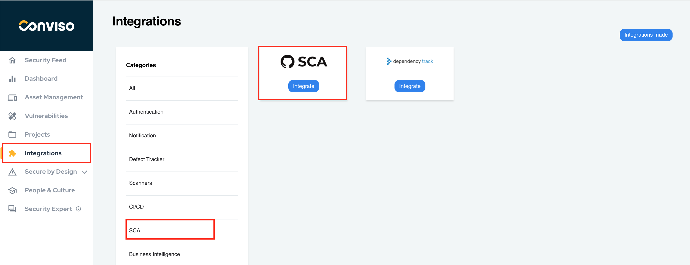
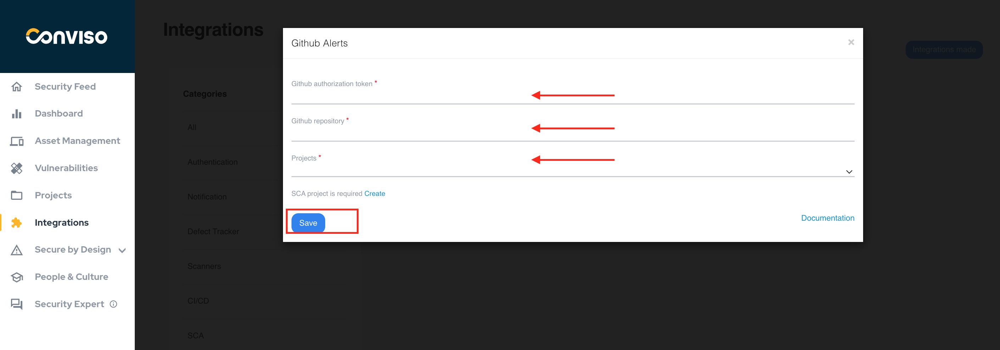
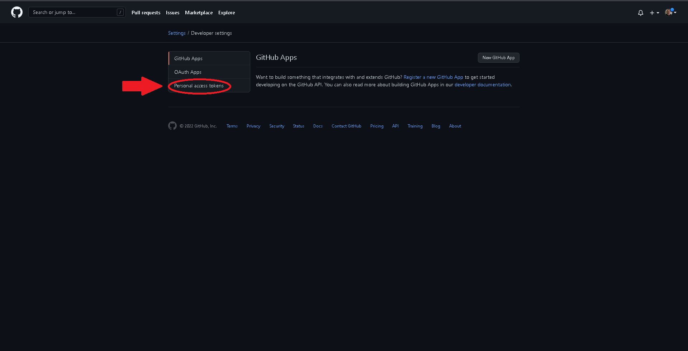
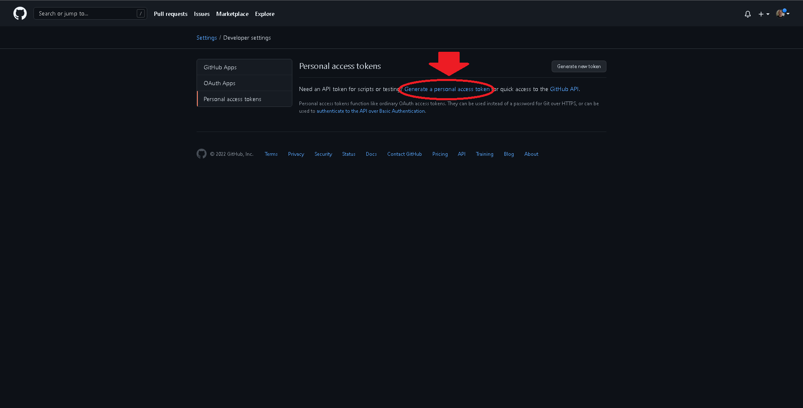
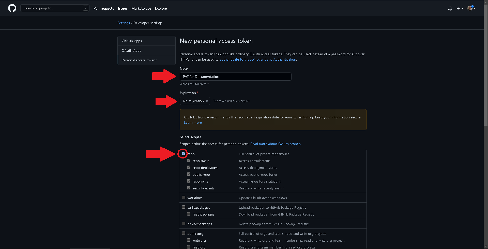
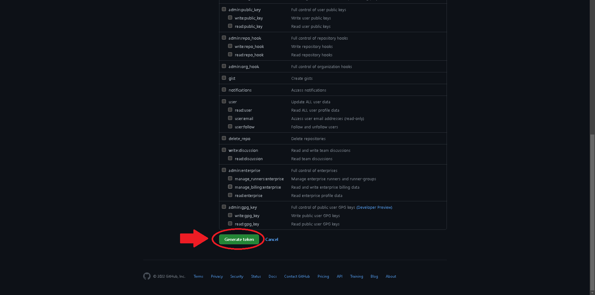
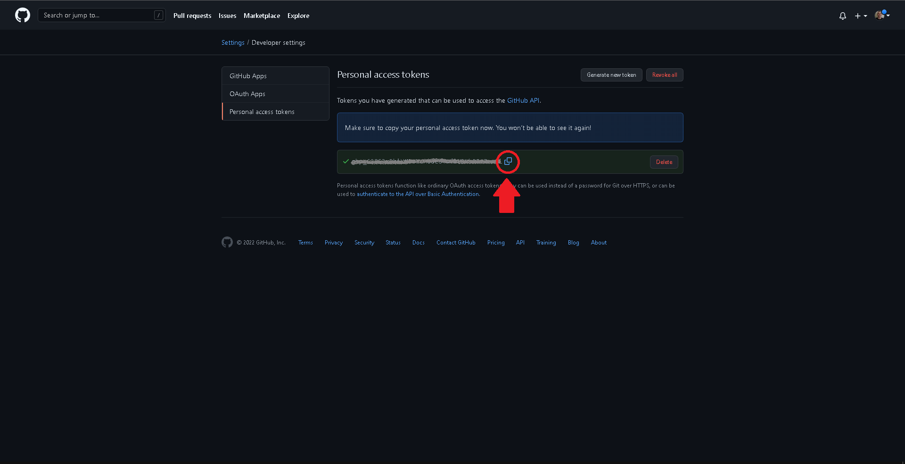
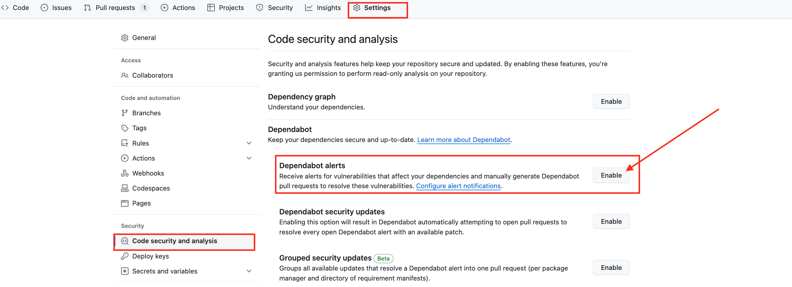
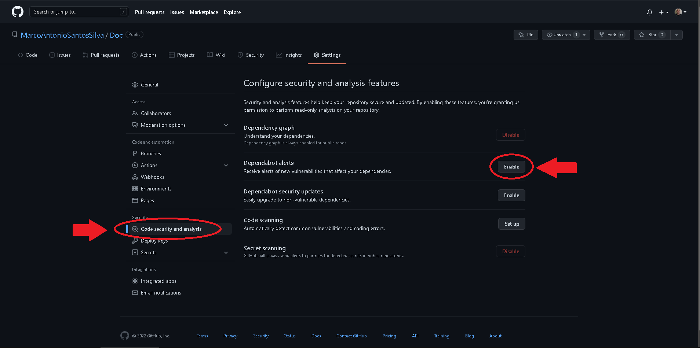
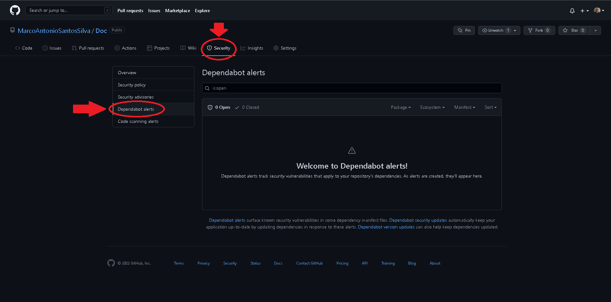

:::note
First time using Github SCA? Please refer to the [following documentation](https://docs.github.com/en/code-security/code-scanning/automatically-scanning-your-code-for-vulnerabilities-and-errors/configuring-code-scanning).
:::

## Introduction

Manage 3rd party library vulnerabilities, all company vulnerabilities identified by Github in 3rd party libraries and consolidate them using full workflow!

## Requirements

In order to integrate Github SCA to Conviso Platform, we will need the following data:

- Github token;

- Repository Name;

- A Conviso Platform Project.

## Github Setup

Log on to [Github](https://github.com/);

To the right of the top menu bar, click on your user to expand the user options, then select the **Settings** submenu:

On the left menu, scroll down and select **Developer Settings**:

Click on **Personal access tokens**:

Click on the **Generate a personal access token** link:

Label the new token as you wish, at the field **Note**, select an expiration period at the **Expiration** section and then check the box **repo**, at the section **Select scopes**:

:::note
Set an expiration period greater than your expected Conviso Platform agreement period, or select **No Expiration**. Otherwise, your token will be invalidated at the end of the selected period and your integration will stop functioning. You can choose another expiration period for your token, but keep in mind that you will have to create a new token and update the Conviso Platform integration to keep it working with the new generated token.
:::

When done, scroll down to the end of the form and click the **Generate token** button:

Your personal access token will be generated. Copy it by clicking the **Copy to clipboard** button next to the token and store it in a safe place:

## Enabling Security Alerts

At Github, select the repository you wish to integrate to Conviso Platform, then click on the **Settings** Menu:

On the left panel menu, click on the **Code Security and Analysis**, on the **Security** Section. Then, click on the **Enable** button to the right of **Dependabot alerts**: 

If there is a vulnerability on your repository, it can be viewed by clicking on the repository **Security** tab, then on the **Dependabot alerts** left menu:

The vulnerabilities shown here will be automatically sent to the Conviso Platform Project you integrate in the next section.

## Conviso Platform Setup

Log in to the [Conviso Platform](https://app.convisoappsec.com);

On the main menu to the left, click on **Integrations**. At the panel to the right, click on the **Scanners** option, then click on the **Integrate** button on the **Github SCA** card:

Fill the modal with the **Github authorization token** and the **Github repository** obtained from Github. Also, select the Conviso Platform **Projects** you wish to integrate. When done filling the form, click on the **Save** button to store your integration configuration settings:

