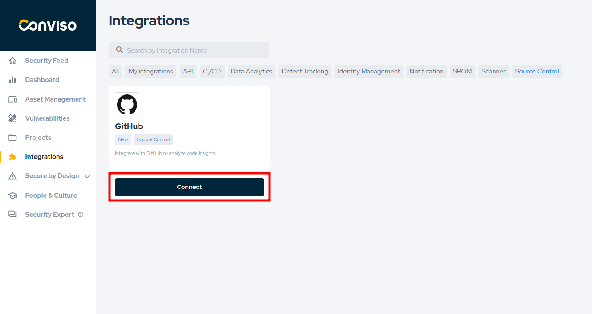
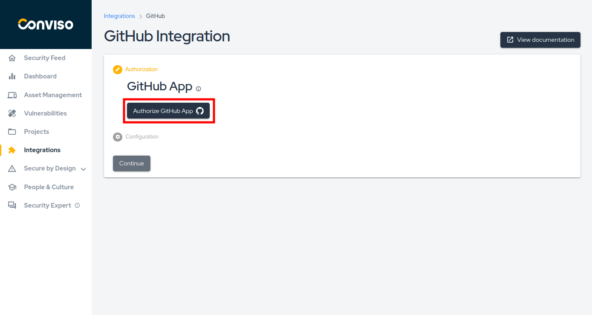
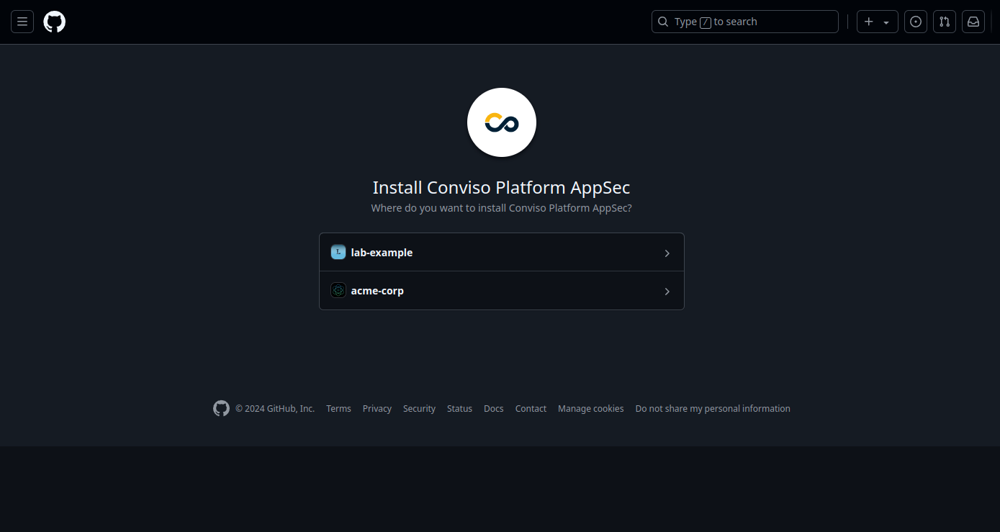
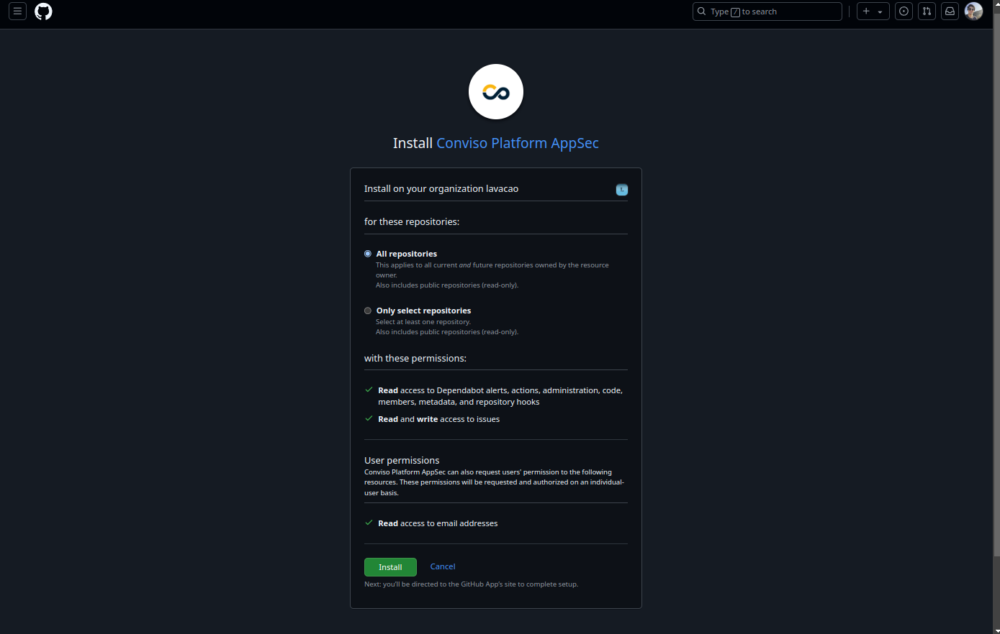
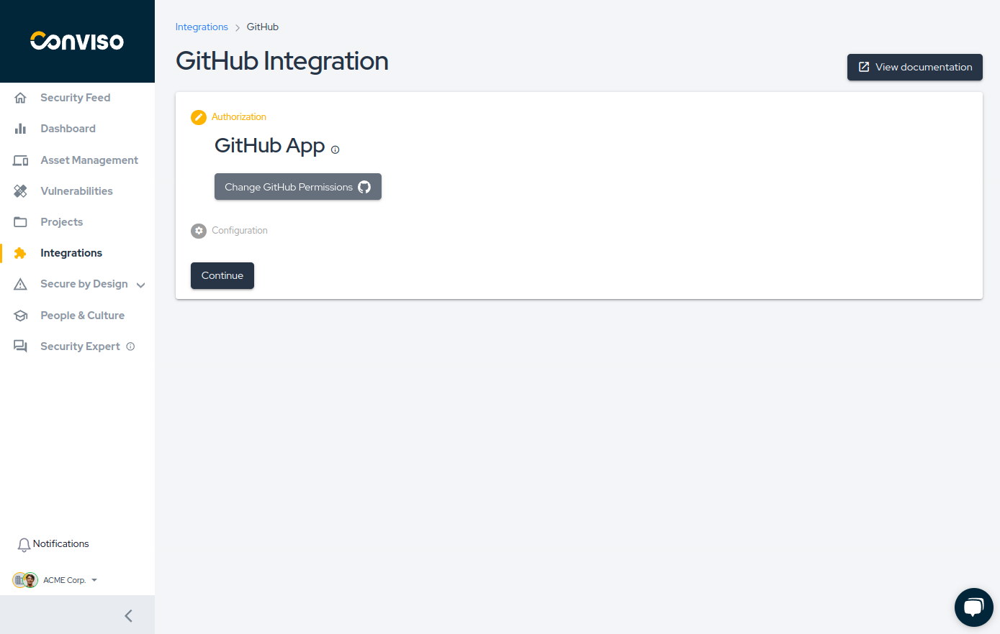
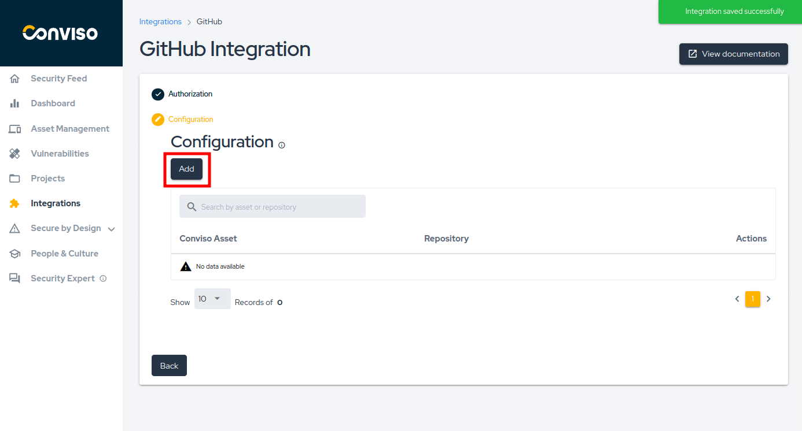
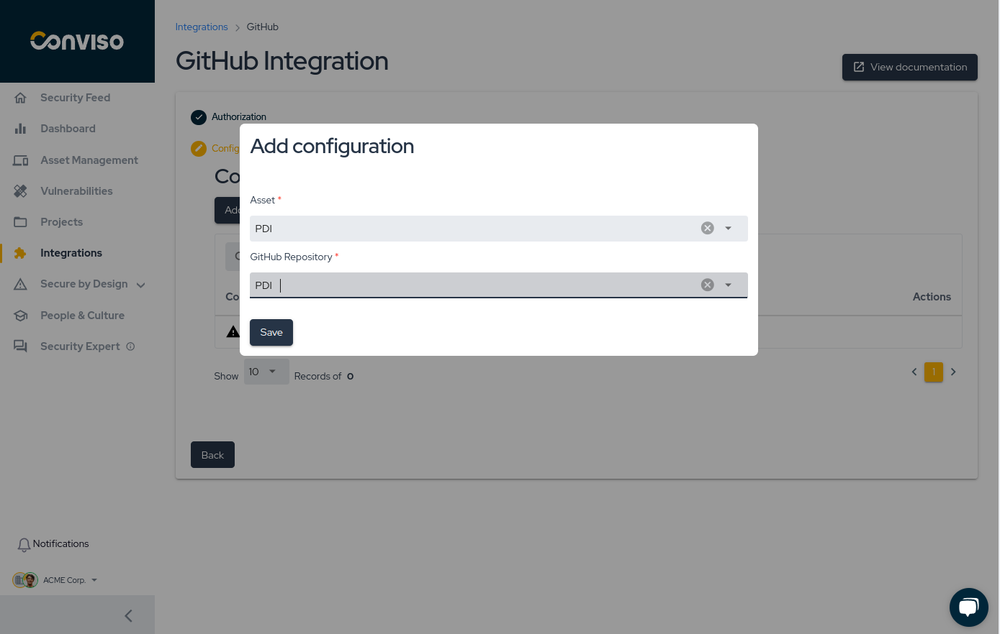
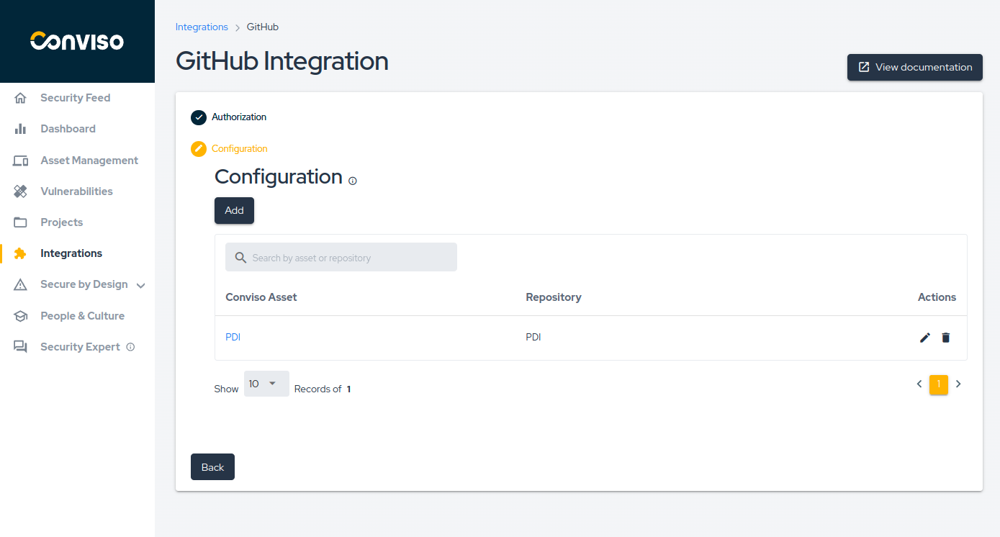

## Introduction

The **Conviso Platform** integration with [GitHub](https://github.com/) enables seamless incorporation into your development workflow.
By connecting your GitHub repositories to the Conviso Platform, you can easily monitor and analyze code insights directly from within a secure virtual environment.
This integration ensures continuous code inspection, identifying vulnerabilities, insecure coding practices, and other potential risks without disrupting your development process.

### Prerequisites

Before you can use the Conviso Platform with GitHub, ensure that:

- You have **administrator access** to your GitHub organization or repositories.

This permission allows you to grant Conviso the necessary access to the desired repositories.

## Configuring the Integration Between Conviso Platform and GitHub

Follow these steps to configure the GitHub integration with Conviso Platform.

### Step 1 - Select the Integration

Navigate to the integrations page, search for **GitHub**, and click **Connect**.

### Step 2 - Authorize GitHub App

Click **Authorize GitHub App**, which will redirect you to GitHub's authorization page where you can grant the required permissions.

### Step 3 - Select the Organization or Account

You will be presented with a list of organizations you have access to. Select the desired organization to proceed with the integration.

### Step 4 - Grant Access to Repositories

You can now choose whether to grant access to **All repositories** or manually select specific repositories by choosing **Only select repositories**.

After granting access, you will be redirected to the **Conviso Platform**.

Once redirected, click **Continue** to save the integration and proceed.

:::info
A success message, "Integration saved successfully," will confirm the integration is complete.
:::

### Step 5 - Configure Asset Mapping

Click **Add** to map a **Conviso Platform** asset to a **GitHub** repository.

Select the asset and the corresponding repository:

### Step 6 - Verify Configuration Mappings

After completing the previous steps, you can view your configured assets:

## Advanced Features: GitHub AST Orchestrator

For larger organizations, Conviso offers the **AST Orchestrator** model. This feature allows you to centralize security scanning logic in a single gateway repository, preventing the need to manage individual workflows in every project.

[Learn how to configure the GitHub AST Orchestrator](./github-ast-orchestrator.md)

## Support

If you have any questions or need assistance using our product, feel free to contact our support team.

**[Unlock the full potential of your Application Program with Conviso Platform integrations. Visit our Integration page now to get started.](https://bit.ly/3NzvomE)**
