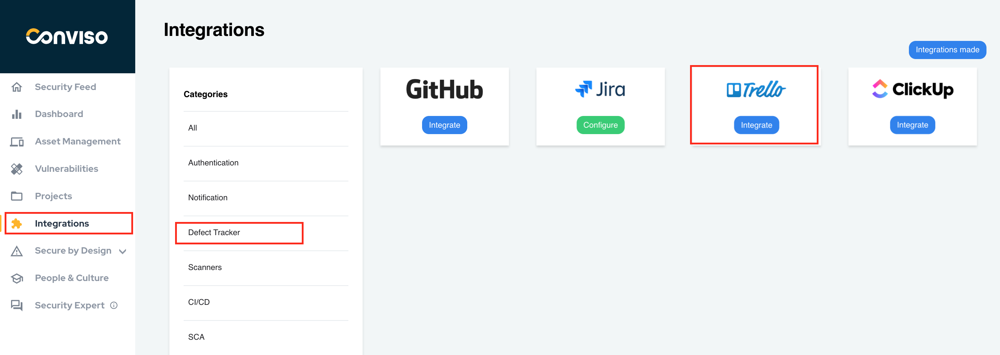
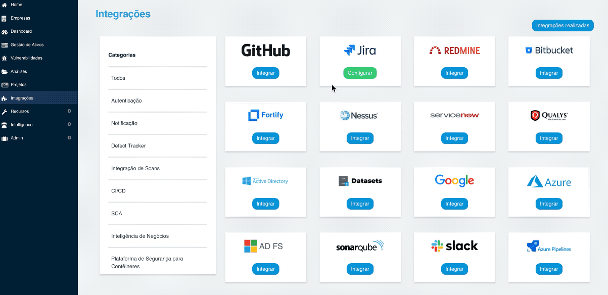
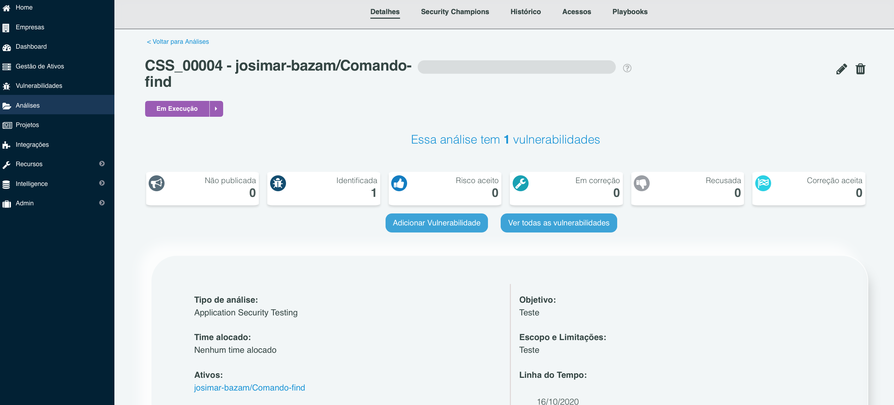
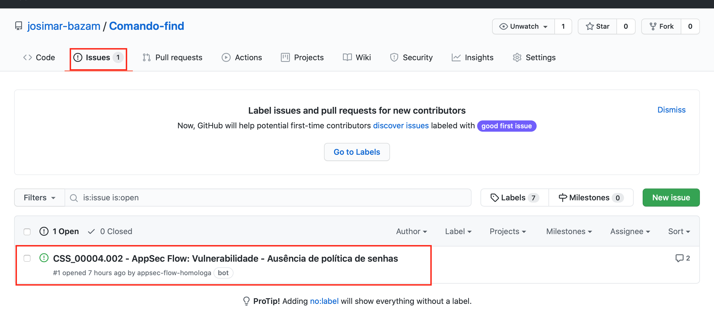

## Introduction

Conviso Platform integration with Github is done through an **API**, where we connect our product with Github, allowing the creation of issues, comments, as well as a webhook for comments made in issues.

Github's integration with Conviso Platform will benefit issue control management and vulnerabilities consolidation. With the integration done, the customer can orchestrate vulnerabilities for Github.

## Integration Configuration

Log in to the Conviso Platform. At the left Menu, choose **Integrations**. At the right panel, choose **Defect Tracker**, then click at the button **Integrate** on the GitHub card:

After clicking at the Github **Integrate** button, you will be redirected to Github, where you will have to log in and then select the repository that you want to be automatically integrated, where a new Project for that repository will be created.

Select all repositories by checking the option (All repositories) which allows Conviso Platform to access all of your GitHub repositories.

Another option is selecting a specific repository that Conviso Platform will access.

Next, an example gif demonstrating how to do it:

New Project automatically created by GitHub integration:

Whenever a new vulnerability is identified and registered in Conviso Platform, an issue will automatically be created in Github.

:::note
Make sure the GitHub repository has the option to receive issues enabled!
:::

