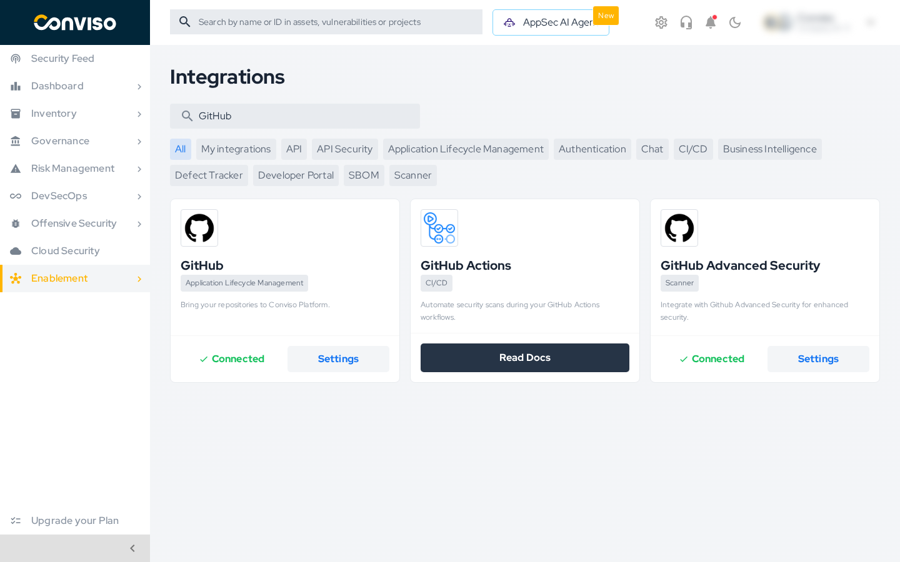
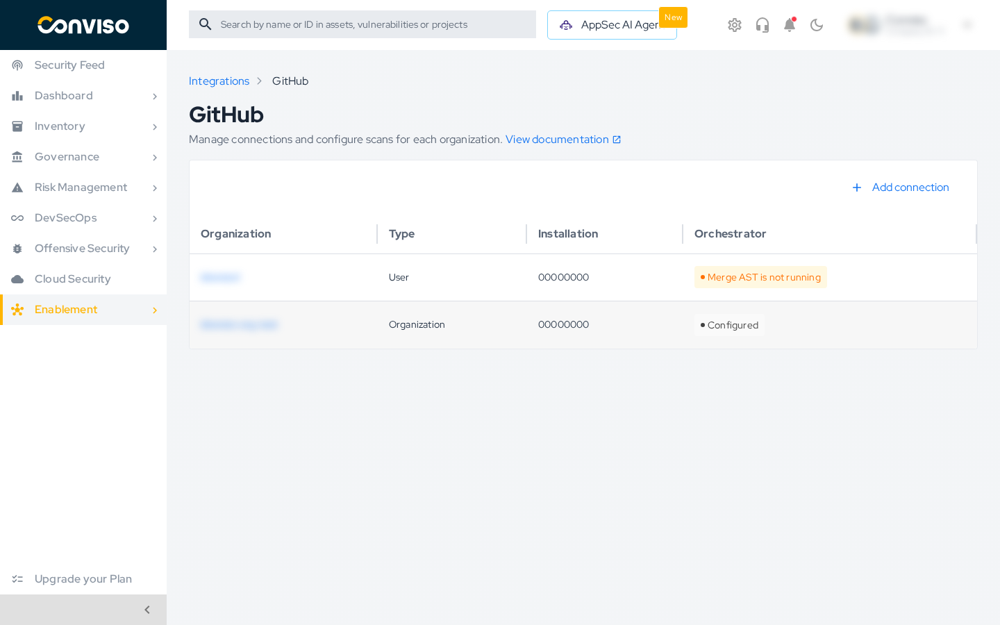
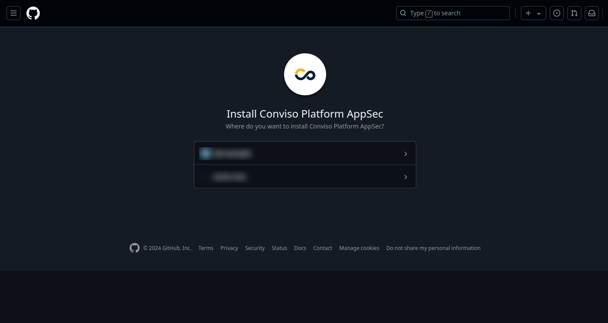
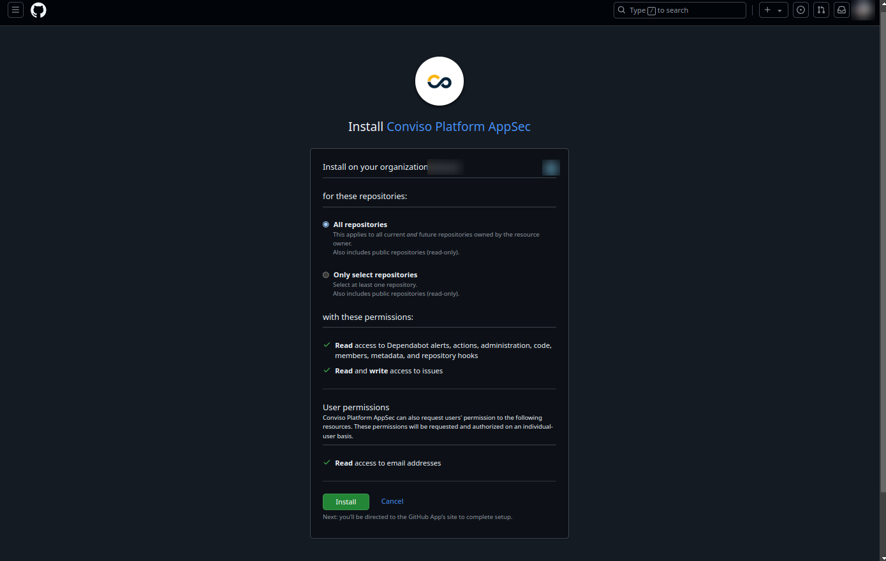
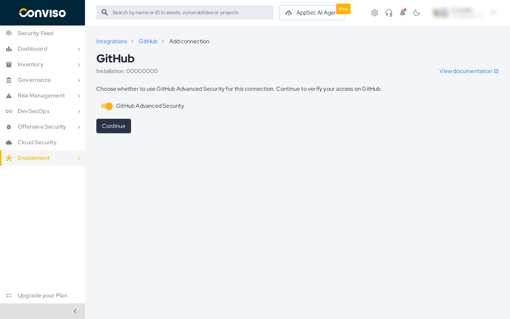
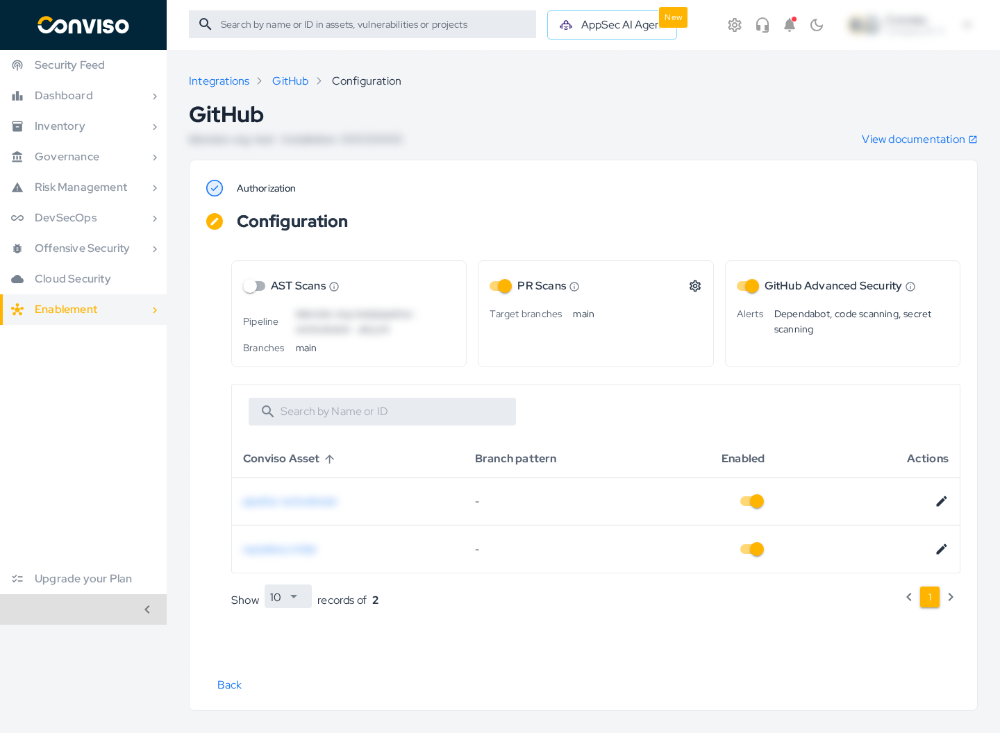
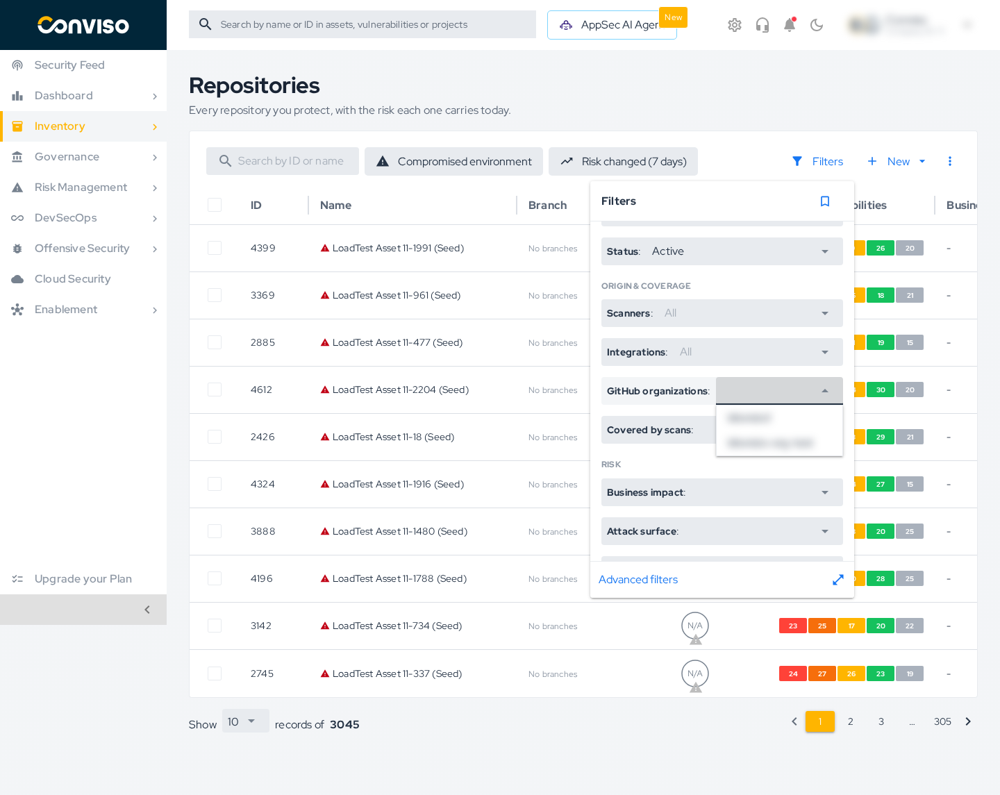

## Introduction

The **Conviso Platform** integration with [GitHub](https://github.com/) enables seamless incorporation into your development workflow.
By connecting your GitHub repositories to the Conviso Platform, you can easily monitor and analyze code insights directly from within a secure virtual environment.
This integration ensures continuous code inspection, identifying vulnerabilities, insecure coding practices, and other potential risks without disrupting your development process.

A company can connect **several GitHub organizations and user accounts**. Each one is a **connection**: one installation of the Conviso GitHub App, with its own repositories and its own scan settings.

### Prerequisites

This integration is supported only for GitHub.com (including GitHub Enterprise Cloud); for GitHub Enterprise Server (self-hosted / on-premises) instances, use the [CI/CD integration](./github-actions.md) instead.

Before you can use the Conviso Platform with GitHub, ensure that:

- You are an **owner** of the GitHub organization where you will install the Conviso GitHub App. A member who is not an owner can only request the installation, and an owner must approve it on GitHub.
- Your GitHub user has access to that installation of the App. Conviso confirms this with GitHub before it adds the connection.
- For organizations that enforce **SAML single sign-on**, you have an active SSO session for the organization on GitHub.

## GitHub connections

Go to **Integrations**, search for **GitHub**, and click **Connect**, or **Settings** if your company already has a connection. Both the **GitHub** and the **GitHub Advanced Security** cards open the same page.

The **GitHub** page lists every connection of your company:

| Column | Description |
|--------|-------------|
| **Organization** | The GitHub organization or user account where the App is installed. Shows **Not available** while Conviso has not recorded the account of an older connection. |
| **Type** | **Organization** or **User**, as GitHub reports the account. |
| **Installation** | The ID of the GitHub App installation. |
| **Orchestrator** | **Configured** when the [AST orchestrator](./github-ast-orchestrator.md) is set up. **Not configured** when it is not. **Merge AST is not running** when AST scans are on but no orchestrator is set up, so merges do not start scans yet. |

:::info
All GitHub connections of a company count as a single GitHub integration toward your plan's integration limit.
:::

## Add a connection

Repeat these steps for each GitHub organization or user account you want to connect.

### Step 1 - Start the connection

On the **GitHub** page, click **Add connection**.

### Step 2 - Install the Conviso GitHub App

GitHub opens the installation page of the Conviso GitHub App. Select the organization or account:

Choose whether the App can access **All repositories** or **Only select repositories**, then confirm:

- If the App is already installed on that account, GitHub shows **Configure** instead of **Install**. Review the repository access and save to continue.
- If you are not an owner of the organization, GitHub creates an installation request instead. Conviso shows **Installation requested** and returns to the **GitHub** page. Once an owner approves the request on GitHub, click **Add connection** again and select the organization.

### Step 3 - Choose GitHub Advanced Security

GitHub redirects you back to Conviso Platform, which shows the installation you selected. Choose whether this connection uses [GitHub Advanced Security](./github-advanced-security.md) to import its alerts, then click **Continue**. You can change this later in the connection's settings.

### Step 4 - Authorize on GitHub

GitHub asks you to authorize the Conviso GitHub App for your user. Click **Authorize**.

Conviso uses this authorization only to confirm with GitHub that your user can access the installation you selected. The authorization is discarded right after the check and is never stored.

### Step 5 - Configure the connection

Conviso adds the connection and opens its configuration page. When GitHub Advanced Security is on, Conviso starts importing the installation's repositories as assets; this can take a few minutes.

## Configure a connection

On the **GitHub** page, click the pencil icon (**Configure connection**) on the connection you want to change. The page header shows the organization and the installation of that connection.

- **Authorization**: **Manage access on GitHub** opens the installation's settings on GitHub, where you change which repositories the App can access. **Remove integration** removes this connection only; the other connections are kept.
- **Configuration**: the **AST Scans**, **PR Scans**, and **GitHub Advanced Security** cards, and the table of the connection's repositories. In the table you can turn scans off for a repository or give it its own branch pattern.

Every setting belongs to the connection you are editing. For example, an orchestrator configured on one connection only runs for the repositories of that connection.

## Work with several organizations

- **One company per installation.** An installation of the Conviso GitHub App can be connected to only one company.
- **No duplicates.** Adding an installation that is already connected to your company opens the existing connection instead of creating a new one.
- **Availability.** If your company can hold only one GitHub connection, Conviso shows a message asking you to contact Conviso support when you try to add another one.
- **Filter assets by organization.** In the repositories list, open **Filters** and use **GitHub organizations** to show only the assets imported by the selected connections.

  

- **AI Pentest.** When you choose repositories for an AI Pentest, the list includes the repositories of every GitHub connection. Repositories with the same name in different organizations appear separately.

## Troubleshooting

If Conviso cannot add a connection, it returns to the **GitHub** page and shows one of these messages:

| Message | What to do |
|---------|------------|
| This GitHub authorization link is invalid or has expired. | Authorization links are single-use and expire. Click **Add connection** and start again. |
| GitHub did not accept the authorization. | Click **Add connection** and start again. |
| Your GitHub user cannot access this installation. | Check on GitHub that your user can access the organization and the App installation, or ask an owner of the organization to add the connection. |
| Start a single sign-on session for this organization on GitHub, then add the connection again. | The organization enforces SAML single sign-on. Start an SSO session for it on GitHub and add the connection again. |
| This GitHub installation is already connected to another company. | The installation belongs to another Conviso company. Contact Conviso support. |
| GitHub did not answer. Try again in a few minutes. | Wait a few minutes and add the connection again. |
| Adding GitHub connections is not available right now. Contact Conviso support. | Contact Conviso support. |
| Contact Conviso support to connect more GitHub organizations for this company. | Your company can hold only one GitHub connection. Contact Conviso support. |
| GitHub authorization was not completed. Add the connection again. | The authorization was cancelled on GitHub. Click **Add connection** and start again. |

## Next Steps: Enable Security Scanning

Once a connection is active, you can enable automated security scanning for its repositories. Conviso Platform provides two methods to suit your workflow needs:

### 1. Automated PR Scanning (Zero Configuration)

**Recommended for most users.**
This feature provides instant security feedback directly within your Pull Requests without requiring any CI/CD configuration files in your repository. It automatically scans changed files and reports findings as comments.

[Learn how to enable Automated PR Scanning](./github-pr-scans.md)

### 2. GitHub AST Orchestrator (Custom Workflow)

**Recommended for advanced customization.**
For organizations that need centralized control over scan logic via GitHub Actions workflows. This model allows you to centralize security logic in a single gateway repository.

[Learn how to configure the GitHub AST Orchestrator](./github-ast-orchestrator.md)

## Support

If you have any questions or need assistance using our product, feel free to contact our support team.

**[Unlock the full potential of your Application Program with Conviso Platform integrations. Visit our Integration page now to get started.](https://bit.ly/3NzvomE)**
