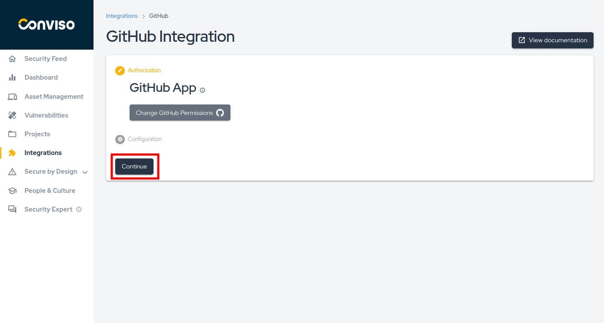

<!-- FIXME: @dsmlucas use image for github -->

## Introduction

The **Conviso Platform** integration with [GitHub](https://github.com/) allows you to seamlessly incorporate security checks into your software development lifecycle. By connecting your GitHub repositories to Conviso, you gain access to check code insights directly within the platform directly on a virtual environment. This integration enables continuous monitoring of your repositories, helping to identify vulnerabilities, insecure code patterns, and other risks without interrupting your development workflow.

### Prerequisites

Before you can use Conviso Platform with GitHub, you need to make sure that:

- Administrator access to your GitHub organization or repositories.

This will allow you to grant access to the desired respositories.

## Configure the integration between Conviso Platform and GitHub

Follow the instructions below to complete the integration setup.

### Step 1 - Select integration

Go to the integrations page, search for GitHub and then click "Connect".

### Step 2 - Authorize GitHub App

In this step, you be able to click in "Authorize GitHub App" and then you be redirected to GitHub
page to grant the needed permissions.

### Step 3 - Select the Organization or Account

In this step, you will see the organizations that you have access.
This way, you can select the desired organization to move on and integrate with Conviso Platform.

In this case we will use **lab-example** as an example.

### Step 4 - Grant access to the desired resources

In this step, you be able to select **All repositories** or **Only select repositories**
to grant access manually to the repositories.

After you grant access, you will be redirected to **Conviso Platform**.

After redirect, click on **Continue** to save the integration and proceed to the next step.

:::info
You will be notified with a success message "Integration saved successfully".
:::

### Step 5 - Configure asset mapping

In this step, after click on **Add** you be able to map the **Conviso Platform** asset based on **GitHub** repository.

Here, you can select the asset and the repository:

### Step 6 - Check configuration mappings

After execute the previous steps, you can see the configured assets similar to:

## Usage

The GitHub integration provides the following resources:

- [Code Insights](#code-insights)

### Code Insights

The **Code Insights** module allows you to thoroughly analyze your entire codebase,
focusing on the mapped assets within a secure virtual environment.
This module provides deep visibility into your code, identifying potential vulnerabilities,
insecure coding practices, and areas for improvement.
By leveraging this feature, you can ensure your application meets high-security standards throughout its development lifecycle.

### Locate the configured asset

First, you need to locate the configured asset and search for the option **More Details > Code Insights** and click on **View**

After click, this dialog will be showed, then you can click on **Start a virtual environment**:

Now, you will wait until the environment be provided:

### Accessing Code Insights

After the environment be ready, you be able to access through the **link** and **password**:

After accessing the link, a new tab will open with the following:

After paste the **password** available on previous dialog, the repository will be ready on the virtual environment:

## Support

If you have any questions or need help using our product, please don't hesitate to contact our support team.

**[Unlock the full potential of your Application Program with Conviso Platform integrations. Visit our Integration page now to get started.](https://bit.ly/3NzvomE)**
