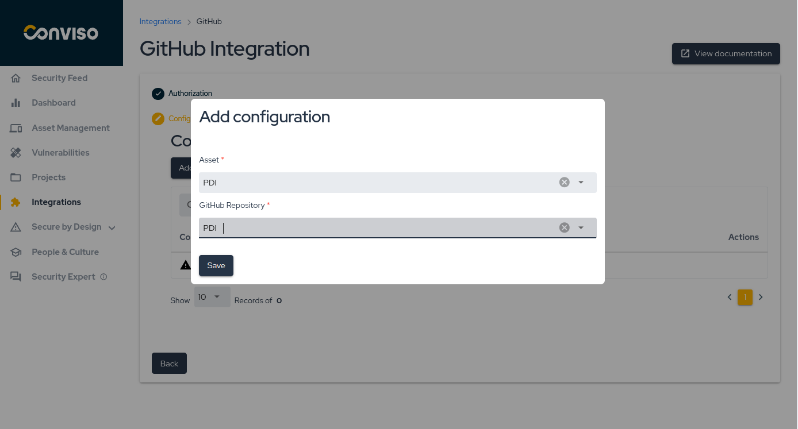

<!-- FIXME: @dsmlucas use image for GitHub -->

## Introduction

The **Conviso Platform** integration with [GitHub](https://github.com/) enables seamless integration of security checks into your development workflow. By connecting your GitHub repositories to the Conviso Platform, you can easily monitor and analyze code insights directly from within a secure virtual environment. This integration ensures continuous code inspection, identifying vulnerabilities, insecure coding practices, and other potential risks without disrupting your development process.

### Prerequisites

Before you can use Conviso Platform with GitHub, ensure that:

- You have **administrator access** to your GitHub organization or repositories.

This permission allows you to grant Conviso the necessary access to the desired repositories.

## Configuring the Integration Between Conviso Platform and GitHub

Follow these steps to configure the GitHub integration with Conviso Platform.

### Step 1 - Select the Integration

Navigate to the integrations page, search for **GitHub**, and click **Connect**.

### Step 2 - Authorize GitHub App

Click **Authorize GitHub App**, which will redirect you to GitHub's authorization page where you can grant the required permissions.

### Step 3 - Select the Organization or Account

You will be presented with a list of organizations you have access to. Select the desired organization to proceed with the integration.

### Step 4 - Grant Access to Repositories

You can now choose whether to grant access to **All repositories** or manually select specific repositories by choosing **Only select repositories**.

After granting access, you will be redirected to the **Conviso Platform**.

Once redirected, click **Continue** to save the integration and proceed.

:::info
A success message, "Integration saved successfully," will confirm the integration is complete.
:::

### Step 5 - Configure Asset Mapping

Click **Add** to map a **Conviso Platform** asset to a **GitHub** repository.

Select the asset and the corresponding repository:

### Step 6 - Verify Configuration Mappings

After completing the previous steps, you can view your configured assets:

## Usage

The GitHub integration provides the following key resources:

- [Code Insights](#code-insights)

### Code Insights

The **Code Insights** module offers a comprehensive analysis of your entire codebase, focusing on the mapped assets in a secure virtual environment. This module provides deep insights into your code, identifying potential vulnerabilities, unsafe coding patterns, and areas for improvement. By using this feature, you ensure that your application maintains high security standards throughout its development lifecycle.

### Locate the Configured Asset

To access the **Code Insights**, first locate the configured asset and navigate to **More Details > Code Insights**. Then click **View**.

After clicking **View**, a dialog box will appear where you can initiate the process by clicking **Start a virtual environment**:

Wait until the virtual environment is provisioned:

### Accessing Code Insights

Once the environment is ready, you will receive a **link** and **password** to access it:

After accessing the link, a new tab will open, displaying the following:

Enter the **password** provided in the previous dialog, and your repository will be fully accessible in the virtual environment:

## Support

If you have any questions or need assistance using our product, feel free to contact our support team.

**[Unlock the full potential of your Application Program with Conviso Platform integrations. Visit our Integration page now to get started.](https://bit.ly/3NzvomE)**
