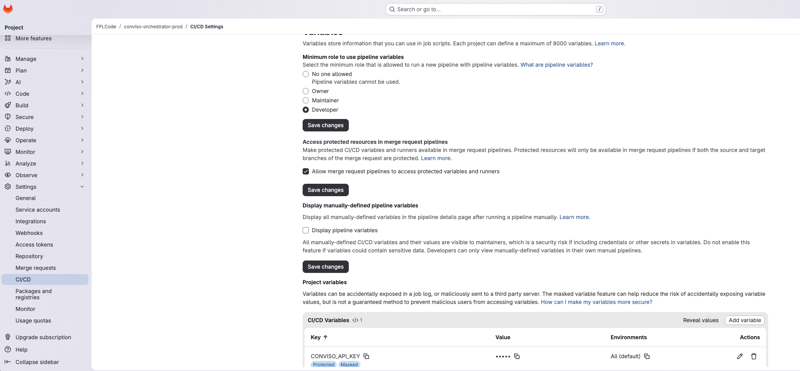
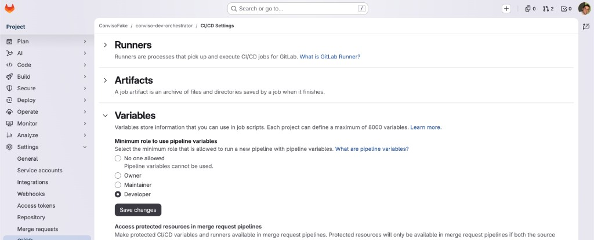
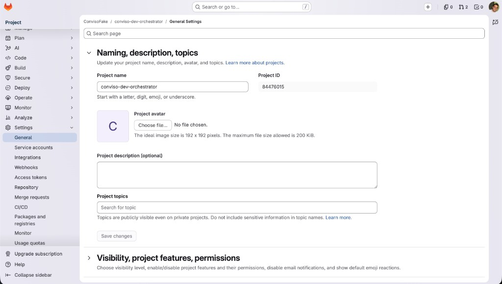
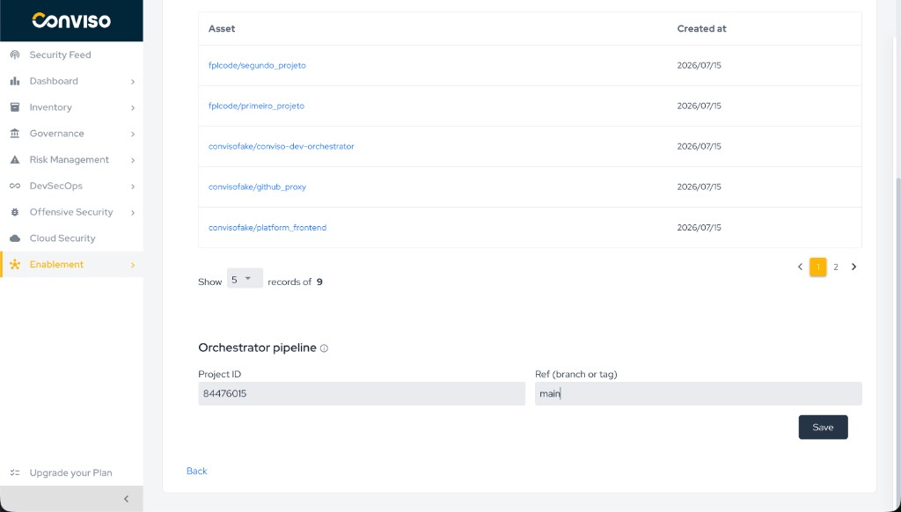
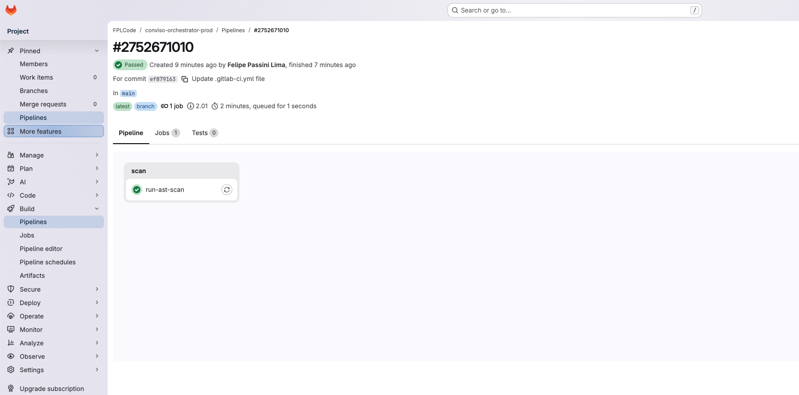
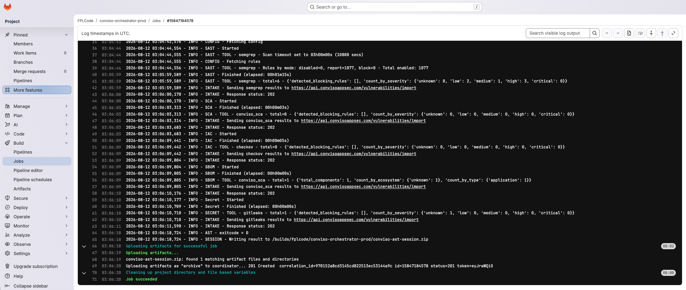

# GitLab AST Orchestrator

The Conviso Platform **GitLab AST Orchestrator** runs Conviso AST from **one** GitLab project (the orchestrator). Application projects do **not** need a Conviso CI file.

When an eligible merge request is **merged**, Conviso triggers a pipeline on the orchestrator and passes the target repository and branch. The job obtains a short-lived clone credential from the Platform (using your API key), clones the target repository, runs `conviso ast run`, and sends findings to the mapped asset.

You do **not** store a `GITLAB_TOKEN` or other clone PAT on the orchestrator — only `CONVISO_API_KEY`.

## How it works


```mermaid
flowchart LR
    A[MR merged on target project] --> B[Conviso Platform]
    B -->|Create pipeline on Ref| C[Orchestrator project<br/>.gitlab-ci.yml]
    C -->|conviso-ast-repository-token<br/>integration OAuth token| D[Clone target repo]
    D --> E[conviso ast run]
    E --> F[Findings on the asset]
```

What Conviso checks before dispatching:

1. The event is a merge request that was **merged**.
2. **AST scans on merge** is enabled on the GitLab integration.
3. The repository is an **imported asset** that is **enabled**.
4. The MR **target branch** matches the configured [AST branch pattern](#ast-branch-pattern).

The pipeline always appears on the **orchestrator** project (not on the application project).

:::note
**Execution costs:** Pipelines run on your GitLab runners and consume your CI minutes.
:::

## Before you begin

Work in this order: **GitLab setup first**, then **Conviso Platform**.

You need:

- [GitLab ALM integration](./gitlab-repositories.md) connected (OAuth).
- At least one application project **imported as an asset** and **enabled**.
- A dedicated orchestrator project (or an empty project you will use only for this). Example / template: [convisoappsec/pipeline-orchestrator](https://github.com/convisoappsec/pipeline-orchestrator).
- Permission to set **CI/CD variables** and create pipelines on the orchestrator (see [Pipeline variables policy](#pipeline-variables-policy)).
- A **Conviso API key** for the same environment you will scan against (production or staging).

| Term | Exact meaning |
| --- | --- |
| **Orchestrator project** | GitLab project that contains `.gitlab-ci.yml`. Conviso triggers this project only. |
| **Target repository** | Application project imported as an asset. It must **not** rely on a local Conviso CI file for this flow. |
| **Ref** | Branch or tag **of the orchestrator** where GitLab loads `.gitlab-ci.yml` when Conviso creates the pipeline. |
| **AST branch pattern** | Regular expression matched against the merged MR's **target** branch on the **target** project. Only a branch it matches triggers a scan. See below. |
| **Asset** | Imported repository in Conviso (`group/project` path) where findings are stored. |

### AST branch pattern

Conviso decides whether a merge triggers a scan by matching the merged MR's **target branch**
against a **regular expression** you configure — the **AST branch pattern**. One pattern can name
several branches (`main|develop`) or a whole family of them (`release/.*`).

Before this, the platform compared that branch to a **single name**, with exact equality. Only two
setups were expressible: one branch, or every branch.

#### Where you set it

| Level | Where | Applies to |
| --- | --- | --- |
| **Project** | The **Branch pattern** column on the project table, in the integration's configuration step | That project only |
| **Integration** | **Branch pattern that runs the AST**, on the integration configuration page | Every project of this integration that has no pattern of its own |

#### Which one applies

The first level that is configured wins:

1. The project's own **Branch pattern**.
2. The integration's **Branch pattern that runs the AST**.
3. The integration **Ref** — *legacy fallback*, so nothing changes for a setup that was already using Ref as a branch filter.
4. Nothing configured — **every branch** triggers a scan.

:::note Ref is the orchestrator's branch, not a branch policy
**Ref** means "which branch of the orchestrator project holds `.gitlab-ci.yml`". It was reused as a branch
filter before the branch pattern existed, and it still is when nothing else is set — but it is no
longer the field to use for branch policy. Set a branch pattern instead, and leave Ref meaning the
one thing it should mean.
:::

#### How a pattern is matched

* **The whole branch name must match.** `main` matches `main` and nothing else — not `maintenance`, not `remain`.
* **A plain branch name behaves exactly as it did before.** Every value already configured in your account keeps meaning exactly what it means today. There is nothing to migrate and nothing you need to do.
* **`|` is how you list branches:** `main|develop|homolog`.
* **The pattern is validated when you save it.** One that does not compile, is longer than 500 characters, or is too slow to evaluate is refused, with the reason shown under the field.
* **A pattern that fails at merge time does not dispatch.** If a stored expression errors or times out while a merge is being evaluated, Conviso skips the scan rather than spending your CI budget on a decision it could not make.

#### Examples

| Pattern | Merges that trigger a scan |
| --- | --- |
| *(nothing set at any level)* | Every branch |
| `main` | `main` only |
| `main\|develop` | `main` and `develop` |
| `release/.*` | Every branch under `release/` |
| `main\|release/.*` | `main`, and every branch under `release/` |
| `main` *(stored before this feature)* | `main` only — unchanged |

#### Running the AST on demand

**Run AST** on the asset offers a **Branch to scan** picker, listing only the branches that match
that asset's pattern. If the pattern matches none of the asset's branches, the button is disabled
and says so — adjust the pattern in the integration settings.

---

## Part 1 – GitLab setup

### Step 1 – Create the orchestrator project

1. Create a GitLab project (recommended name: `conviso-ast-orchestrator`), **or** copy from [convisoappsec/pipeline-orchestrator](https://github.com/convisoappsec/pipeline-orchestrator) and keep only `.gitlab-ci.yml`.
2. Choose the branch that will contain the CI file (almost always **`main`**). That value is what you will set as **Ref** in Conviso.

### Step 2 – Create the `CONVISO_API_KEY` variable

In the **orchestrator** project (not the target):

1. Open **Settings → CI/CD → Variables**.
2. Create:

| Name | Flags | Required |
|------|-------|----------|
| `CONVISO_API_KEY` | **Masked** | **Yes** |

Use the API key for the same Conviso environment as the Platform you configured (production vs staging).

:::caution Protected variables
Only mark the variable as **Protected** if the orchestrator **Ref** branch is a protected branch. Otherwise GitLab does not inject the variable and the job fails without an API key.
:::

*CI/CD variable `CONVISO_API_KEY` under Settings → CI/CD → Variables.*



:::tip Optional variable
You may add `CONVISO_COMPANY_ID`. The pipeline uses it only when the `company_id` input is empty (typical for a manual **Run pipeline**). When Conviso dispatches after a merge or **Run AST**, it sends `company_id` in the variables, so this fallback is not required for Platform-triggered runs.
:::

Do **not** create a `GITLAB_TOKEN` for clone. The job calls `conviso-ast-repository-token --provider gitlab`, and the Platform returns the GitLab integration’s OAuth credential for that run.

### Step 3 – Add `.gitlab-ci.yml`

:::tip Example repository
Public template: **[convisoappsec/pipeline-orchestrator](https://github.com/convisoappsec/pipeline-orchestrator)**  

CI file: [`.gitlab-ci.yml`](https://github.com/convisoappsec/pipeline-orchestrator/blob/main/.gitlab-ci.yml)
:::

On the orchestrator branch you will set as **Ref** (usually `main`):

1. Create **`.gitlab-ci.yml`** at the project root.
2. Paste the YAML below (or copy it from the example repo).

```yaml
stages:
  - scan

run-ast-scan:
  stage: scan
  image:
    name: convisoappsec/convisoast:latest
    entrypoint: [""]
  rules:
    - if: '$repo_full_name && $branch'
  variables:
    GIT_STRATEGY: none
  script:
    - export CONVISO_API_KEY="$CONVISO_API_KEY"
    - |
      export CONVISO_API_URL="${api_url:-https://api.convisoappsec.com}"
      CONVISO_API_URL="${CONVISO_API_URL%/}"
      case "$CONVISO_API_URL" in
        https://app.convisoappsec.com)
          export CONVISO_API_URL="https://api.convisoappsec.com"
          ;;
        https://staging.convisoappsec.com)
          export CONVISO_API_URL="https://api.staging.convisoappsec.com"
          ;;
      esac
    - export CONVISO_REPO_FULL_NAME="$repo_full_name"
    - |
      case "${asset_id:-}" in
        ""|none|0) unset CONVISO_ASSET_ID || true ;;
        *) export CONVISO_ASSET_ID="$asset_id" ;;
      esac
      case "${scan_run_id:-}" in
        ""|none|0) unset CONVISO_SCAN_RUN_ID || true ;;
        *) export CONVISO_SCAN_RUN_ID="$scan_run_id" ;;
      esac
    - umask 077 && conviso-ast-repository-token --provider gitlab > repo_token
    - |
      git clone --branch "$branch" \
        "https://oauth2:$(cat repo_token)@${CI_SERVER_HOST}/${repo_full_name}.git" target
    - rm -f repo_token
    - cd target
    - export GIT_CONFIG_COUNT=1 GIT_CONFIG_KEY_0=safe.directory GIT_CONFIG_VALUE_0='*'
    - export CONVISO_COMPANY_ID="${company_id:-$CONVISO_COMPANY_ID}"
    - export CONVISO_BRANCH="$branch"
    - conviso ast run --repository-dir . --output "$CI_PROJECT_DIR/conviso-ast-session.zip"
  artifacts:
    when: always
    paths:
      - conviso-ast-session.zip
    expire_in: 1 week
```

3. Commit and push to that **Ref** branch.

:::important
- GitLab CI must clear the image entrypoint with `entrypoint: [""]`, so the job runs its own script; otherwise it may fail with `unrecognized arguments: sh -c ...`.
- This template clones `branch` (the MR target branch after merge). Conviso also sends `commit_sha` and `mr_iid` (from `pr_number`) for correlation.
:::

### Pipeline variables policy

If Conviso fails to trigger with **Insufficient permissions to set pipeline variables**, open the orchestrator project → **Settings → CI/CD → Variables** and set **Minimum role to use pipeline variables** to **Developer** or **Maintainer**. The GitLab user connected via OAuth must have at least that role on the orchestrator project.

*Minimum role to use pipeline variables set to Developer.*



---

## Part 2 – Conviso Platform setup

### Step 4 – Configure the orchestrator

1. Open **Integrations → GitLab → Configuration**.
2. Turn **AST scans on merge** **on**.
3. Under **Orchestrator pipeline**, fill:
   - **Project ID** — numeric GitLab project ID of the orchestrator.
   - **Ref** — orchestrator branch/tag that contains `.gitlab-ci.yml` (e.g. `main`).
   - **Branch pattern that runs the AST** — optional regular expression for the branches on the **target** projects that should trigger a scan, e.g. `main|develop`. Leave it empty to keep using **Ref** as the filter. See [AST branch pattern](#ast-branch-pattern).
4. Save.

The Project ID is shown in GitLab under the orchestrator project → **Settings → General**:

*Find the numeric Project ID in GitLab General settings.*



Then paste it into Conviso and set the ref:

*Orchestrator pipeline – Project ID, Ref, and Save.*



### Step 5 – Assets and branch pattern

1. Confirm each application project is **imported** and **enabled**.
2. Set **Branch pattern that runs the AST** on the integration page when more than one branch should be scanned — `main|develop`, or `release/.*`.
3. Override it for a single project from the **Branch pattern** column on the project table, when that one ships from a different branch than the rest.
4. If you set neither, the integration **Ref** is still used as the filter (legacy behavior); if Ref is empty too, every branch triggers a scan.

See [AST branch pattern](#ast-branch-pattern) for how the expression is matched and validated.

---

## End-to-end flow (after setup)

1. Developer merges an MR into a branch matching the AST branch pattern, on an imported, enabled asset.
2. Conviso validates the event and configuration, then creates a pipeline on the orchestrator project / **Ref**.
3. Variables include at least: `repo_full_name`, `branch` (MR target), `commit_sha`, `mr_iid`, `api_url`, `company_id`, `asset_id` (blank values may be omitted).
4. Job steps: issue repository token → clone target at `branch` → run `conviso ast run` → upload session artifact.
5. Findings appear on the asset in Conviso Platform.
6. In GitLab, open the **orchestrator** → **Build → Pipelines** → job **`run-ast-scan`** to inspect the run.

## Validation checklist

| Check | Expected |
|-------|----------|
| Variable | `CONVISO_API_KEY` exists on the orchestrator (Masked; Protected only if Ref is protected) |
| Path | `.gitlab-ci.yml` is on the **Ref** branch |
| Conviso | Orchestrator Project ID + Ref saved; **AST scans on merge** on |
| Asset | Target project imported, enabled; the merged branch matches the AST branch pattern (project level, integration level, or Ref as the legacy fallback) |
| After merge | New pipeline on the orchestrator with job `run-ast-scan`; findings (or a clean result) on the asset |

*Successful orchestrator pipeline: stage `scan`, job `run-ast-scan` Passed.*



*Successful `run-ast-scan` job log (token → clone → conviso ast run → session artifact).*



Manual test (optional): on the orchestrator, **Build → Pipelines → New pipeline**. Set variables `repo_full_name` and `branch` to an imported asset. Leave `api_url` empty for production (`https://api.convisoappsec.com`). Set `company_id` or define `CONVISO_COMPANY_ID`.

## Troubleshooting

| Symptom | Cause / fix |
|---------|-------------|
| Merge done, no pipeline | **AST scans on merge** off; Project ID/Ref incomplete; asset disabled or not imported; the merged branch does not match the AST branch pattern |
| A branch you expected to scan is skipped | The pattern does not match the whole branch name. `main` does not match `main-hotfix`; use `main.*` if that is what you meant. Check the project pattern first — it overrides the integration's |
| No branch scans any more, after editing a pattern | A stored pattern that fails to compile or times out is treated as "do not dispatch". Reopen the field, save a valid expression, and confirm it is accepted |
| The pattern is refused when you save it | It does not compile, is longer than 500 characters, or is too slow to evaluate. The reason is shown under the field |
| **Run AST** is disabled on the asset | The pattern matches none of the asset's branches. Adjust it in the integration settings |
| **Insufficient permissions to set pipeline variables** | Set minimum role to Developer/Maintainer (see above) and ensure the OAuth user has that role |
| `unrecognized arguments: sh -c ...` | Missing `entrypoint: [""]` on the `convisoast` image |
| Token / clone fails (HTTP 4xx) | `repo_full_name` not an imported asset for that API key/company; wrong environment (`CONVISO_API_KEY` vs `api_url`); GitLab integration not authorized |
| `CONVISO_API_KEY` empty / auth errors on unprotected branch | Variable is **Protected** but Ref is not a protected branch — uncheck Protected or protect the branch |
| Unreadable / HTML response from Platform | Use the API host (`api.*`), not `app.*` / `staging.*`. The template normalizes those hosts automatically |
| Scanner missing `CONVISO_COMPANY_ID` | Manual run without `company_id` and without variable `CONVISO_COMPANY_ID` |
| Wrong code scanned | `branch` mismatch; confirm you merged into a branch the AST branch pattern matches |

## Related guides

- [Example orchestrator repository (pipeline-orchestrator)](https://github.com/convisoappsec/pipeline-orchestrator)
- [GitLab Integration](./gitlab-repositories.md)
- [GitLab CI/CD (per-repo pipeline)](./gitlab.md)
- [Conviso AST](../security-scans/conviso-ast/conviso-ast.md)
