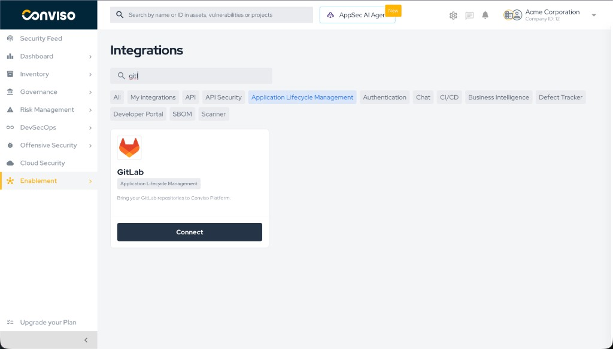
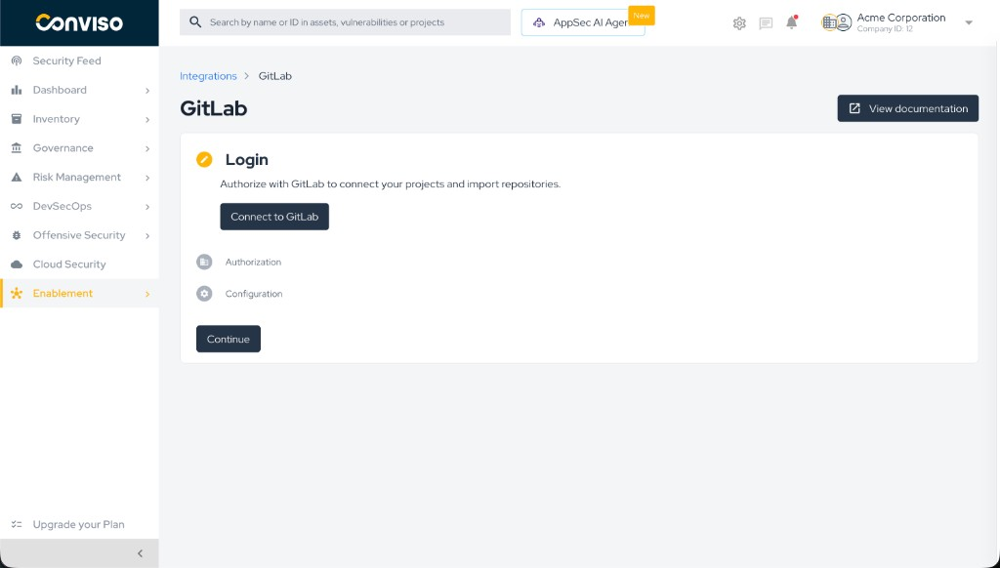
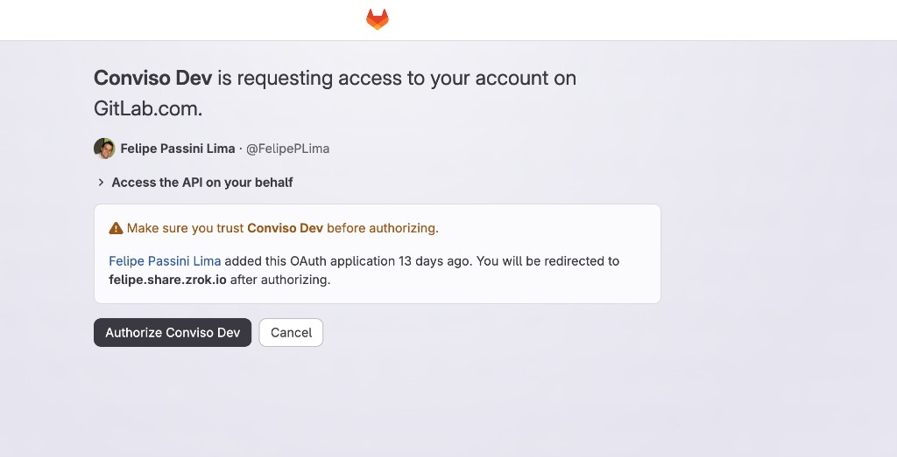
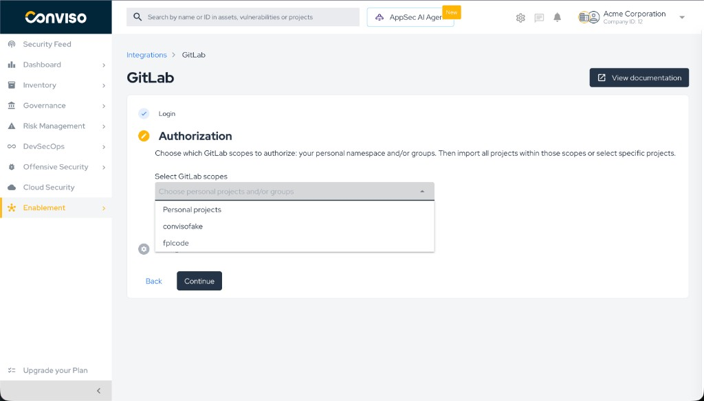
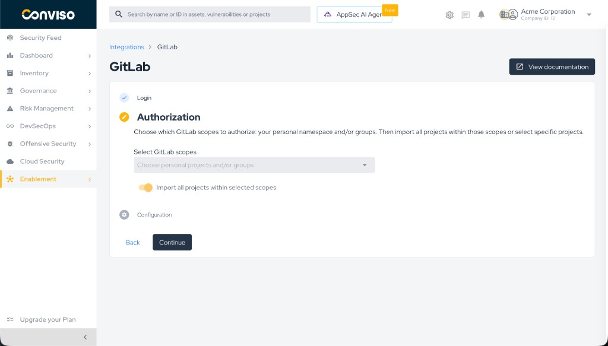
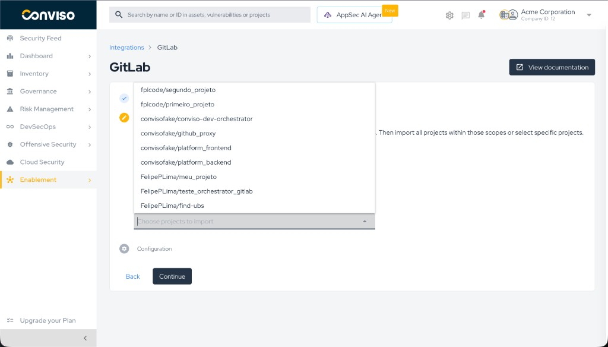
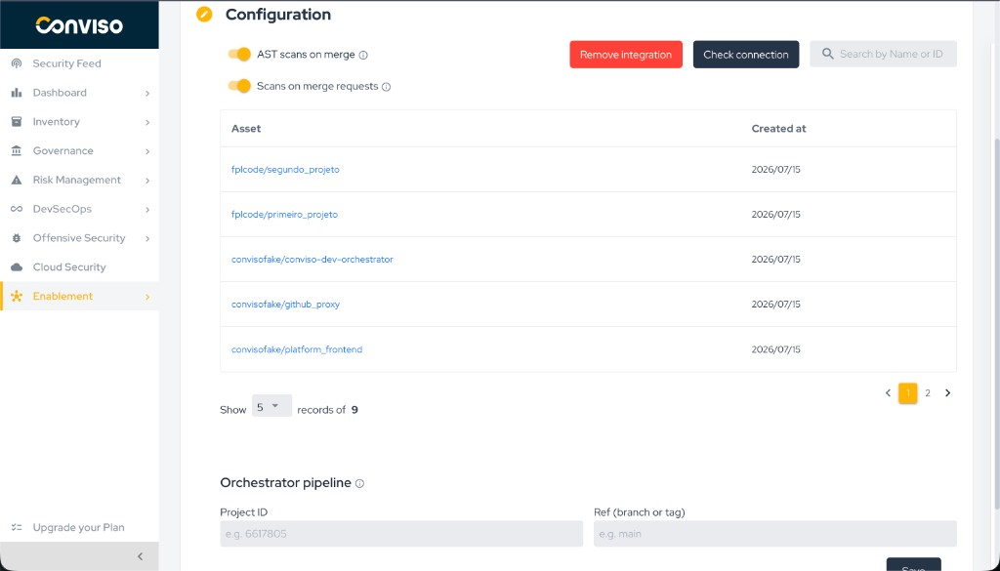
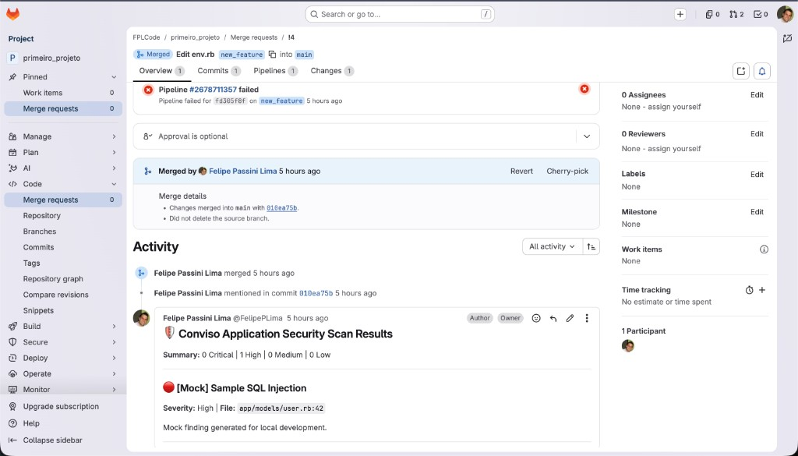

# GitLab Integration

The **Conviso Platform** integration with [GitLab](https://gitlab.com/) connects your GitLab namespaces (personal projects and/or groups) to the platform. Once connected, you can import repositories as assets and enable automated security scanning on merge requests and after merges.

Setup has three steps: **Login** (OAuth with GitLab), **Authorization** (select scopes and repositories), and **Configuration** (manage assets and scan toggles).

:::info
This guide covers the **Application Lifecycle Management (ALM)** integration (`GitLab` / repository manager).  
For running Conviso AST directly inside a project’s own `.gitlab-ci.yml`, see the [GitLab CI/CD pipeline guide](./gitlab.md).
:::

## Objective

By the end of this guide, you will have:

- Connected a GitLab account to Conviso Platform via OAuth.
- Authorized personal projects and/or groups and imported repositories as assets.
- Understood how to enable **Scans on merge requests** and **AST scans on merge**.

## Prerequisites

- A GitLab account with access to the projects/groups you want to connect (Maintainer or Owner recommended for webhook creation).
- Permission to authorize the **Conviso Platform** OAuth application on the GitLab consent screen.
- Your Conviso Platform **company** has the GitLab ALM integration available.

## OAuth permissions (why `api`)

GitLab OAuth does **not** provide a narrow “write webhooks / commit status only” scope. Write operations required by this integration use the GitLab REST API and therefore need the **`api`** scope.

| Need | GitLab API usage | Required OAuth scope |
|------|------------------|----------------------|
| List user, groups, projects | `GET /user`, groups, projects | Covered by `api` (or `read_api` alone for **read**) |
| Create/delete project & group webhooks | Project/group hooks API | **`api`** (write) |
| Commit status on MR commits | Commit statuses API | **`api`** (write) |
| Comments on merge requests | MR notes API | **`api`** (write) |
| Trigger orchestrator pipeline | Pipelines API | **`api`** (write) |

`read_api` alone is **not enough**: webhooks, commit statuses, MR notes, and pipeline triggers would fail.

The Conviso OAuth application requests only what GitLab exposes for these operations today: **`api`**. We do not request unrelated scopes (e.g. registry, sudo, runner management).

:::note
If your organization restricts OAuth apps, an administrator may need to approve the Conviso application. After reconnecting, existing tokens keep their scopes until users re-authorize.
:::

## Steps

### Step 1 – Open the GitLab integration

1. In Conviso Platform, go to **Integrations**.
2. Filter by **Application Lifecycle Management** if needed.
3. Find the **GitLab** card (repository manager) and click **Connect**.

*Step 1: Integrations page with the GitLab card and Connect button.*

### Step 2 – Connect to GitLab (Login)

1. On the **Login** step, click **Connect to GitLab**.
2. Sign in to GitLab if prompted and review the permissions (OAuth scope `api`).
3. Click **Authorize** / **Accept**.
4. You are redirected back to Conviso Platform and moved to **Authorization**.

*Step 2: Login step with Connect to GitLab.*

You are redirected to GitLab’s OAuth consent screen. Review the requested permission (**Access the API on your behalf** / scope `api`) and click **Authorize**.

*GitLab OAuth consent – authorize the Conviso application.*

### Step 3 – Authorize scopes and import repositories

1. In **Select GitLab scopes**, choose:
   - **Personal projects** (your personal namespace), and/or
   - One or more **groups**.
2. Choose how to import repositories:
   - **Import all projects within selected scopes** (on): import everything under those scopes and keep discovery for new projects when webhooks allow it.
   - Toggle **off** to select specific projects from the dropdown.
3. Click **Continue**. Import runs in the background; assets appear on **Configuration** shortly after.

*Step 3: Select GitLab scopes (Personal projects and/or groups).*

*Step 3b: Import all projects within selected scopes.*

If you turn **Import all…** off, pick repositories manually:

*Step 3c: Choose specific projects to import.*

:::tip
If you see a warning about group webhooks after import, configuration still succeeded, but **auto-discovery of new repositories** in those groups may be limited until hooks are fixed (permissions / secret / network).
:::

### Step 4 – Configuration

On **Configuration** you can:

- Browse imported **assets** (search by name or ID).
- Enable **Scans on merge requests** (differential scan when an MR is opened/updated).
- Enable **AST scans on merge** and set the **Orchestrator** project ID + ref (see [GitLab AST Orchestrator](./gitlab-ast-orchestrator.md)).
- Use **Check connection** or **Remove integration**.

*Step 4: Configuration – assets, scan toggles, and orchestrator fields.*

## Authorize all projects – how new repos are included

If **Import all projects within selected scopes** is on:

- **Group scopes:** Conviso creates group webhooks (`project_events` / merge request events as configured). New projects under those groups can be auto-imported when GitLab notifies the platform.
- **Personal projects:** There is no group webhook for personal namespaces; Conviso uses a **scheduled sync** (similar pattern to other ALMs) when personal scope + import-all are enabled.

If you selected specific projects only, only those repositories are imported; new ones are not auto-added.

## Scans on merge requests

**Scans on merge requests** give security feedback when a GitLab merge request is opened or updated. The scan runs in an environment managed by Conviso — no `.gitlab-ci.yml` is required in the target repository.

Findings are reflected as **commit status** and, when applicable, an **MR note** so developers see results in the merge request.

### Enabling MR scans

1. Open **Integrations** → **GitLab** → **Configuration**.
2. Turn **Scans on merge requests** **on**.
3. Ensure the relevant assets remain **active** in the assets table.
4. Open or update a merge request in an imported project to validate.

:::info
Changes apply to new MR events (open/update/reopen). Existing MRs update on the next push/sync event.
:::

### How it works

1. GitLab sends a **Merge request** webhook to Conviso.
2. Conviso enqueues a differential scan for the head commit.
3. Results are reported back to the merge request (status / notes).

### Example – feedback on the merge request

After the scan finishes, Conviso can post an **MR note** with a summary of findings:

## AST Orchestrator (on merge)

For full AST after merge via a central GitLab CI project (Project ID, ref, `CONVISO_API_KEY`, clone token), see the dedicated guide:

[Configure the GitLab AST Orchestrator](./gitlab-ast-orchestrator.md)

## Validation

| Step | Expected result |
|------|-----------------|
| Login | OAuth completes; Authorization step unlocks |
| Authorization | Import starts; Configuration shows assets |
| MR scans | Opening an MR shows Conviso commit status / feedback |
| AST on merge | Merge into the configured branch triggers the orchestrator pipeline |

## Troubleshooting

| Problem | What to do |
|--------|------------|
| **GitLab OAuth is not configured** | Platform missing `OAUTH_GITLAB_CLIENT_ID` / `SECRET` / `REDIRECT_URI`. Contact your administrator. |
| **Invalid or expired OAuth state** | Restart **Connect to GitLab** without editing the callback URL. |
| **No groups / projects in the dropdown** | Confirm OAuth succeeded and your user can see those groups in GitLab. Reconnect if needed. |
| **Import finished but assets missing** | Wait and refresh Configuration (async import). Use **Check connection**. |
| **No feedback on the MR** | Confirm **Scans on merge requests** is on, asset active, and the project webhook includes **Merge request events**. |
| **Webhook delivery failing** | Check GitLab **Settings → Webhooks** recent deliveries; ensure Conviso callback URL is reachable from GitLab. |
| **MR scan / AST not triggering** | Confirm toggles, asset active, webhooks on the target project, and reachable `APP_URL` + webhook secret. |
| **Orchestrator: Insufficient permissions to set pipeline variables** | On the orchestrator project: CI/CD settings → allow Developer/Maintainer to set pipeline variables; user must have that role. |

## Support

Contact Conviso support if you need help with the GitLab ALM integration.

## Related guides

- [GitLab AST Orchestrator](./gitlab-ast-orchestrator.md)
- [GitLab CI/CD (AST in project pipeline)](./gitlab.md)

**[Explore other Conviso Platform integrations.](https://bit.ly/3NzvomE)**
