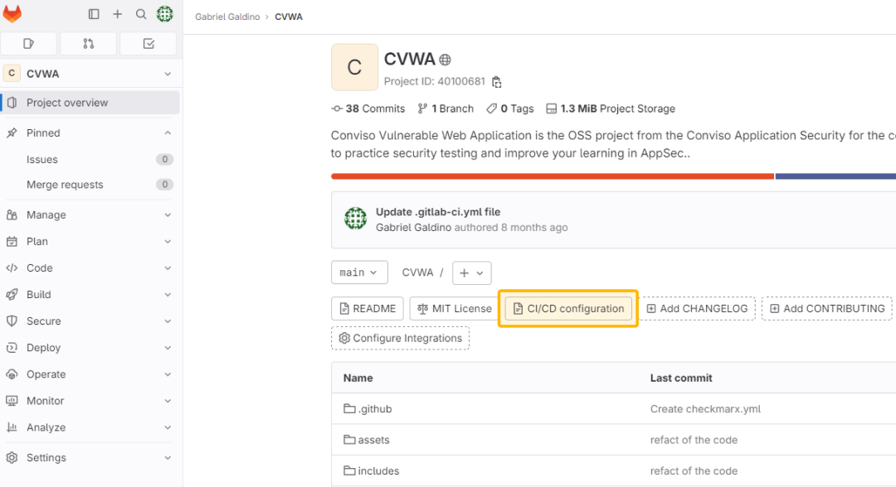

<div style={{textAlign: 'center'}}>

[](https://bit.ly/3JyRdl8)

</div>

## Introduction
With Conviso Platform integrated into your [Gitlab](https://gitlab.com/) Secure CI/CD Pipeline, you can automate and streamline your security processes, ensuring that your applications undergo thorough security assessments throughout the development lifecycle. 

You can run the Conviso Platform **AST (Application Security Testing)**. The tool offers both **Static Application Security Testing (SAST)** and **Software Composition Analysis (SCA)** and **Code Review** directly on your Gitlab pipeline.

The [CLI](https://docs.convisoappsec.com/cli/installation/) is a docker image in this integration for all execution and connection with the Conviso Platform. 

**[Explore our Integration page to learn more and supercharge your Application Security Program  with Conviso Platform.](https://bit.ly/3NzvomE)**

### Prerequisites

Before you can use Conviso Platform with Gitlab, you need to make sure that:
1. You have your API Key, which is a code that identifies you to Conviso Platform. Find yours [using this tutorial](../api/generate-apikey.md).

2. You must also set two environment variables for the runner: ```FLOW_API_KEY``` and ```FLOW_PROJECT_CODE``` These codes tell Conviso Platform which project and account you are using. To do this on Gitlab, you must:
**2.1** Go to your project’s **Settings > CI/CD** and expand the **Variables** section.
**2.2**  Select **Add variable** and fill in the detail. 

3. After you create a variable, you can use it in the ```.gitlab-ci.yml```configuration file or in job scripts. To make the ```.gitlab-ci.yml``` file, go to your repository page and click on **“CI/CD Configuration”**:

<div style={{textAlign: 'center'}}>

[](https://bit.ly/3JyRdl8)
</div>

This will allow you to write the code that we will use in this tutorial!

## Usage

By the end of this tutorial, you will know how to:

* [**Perform a Conviso AST scan to analyze your application's security**](#perform-a-conviso-ast-scan-to-analyze-your-applications-security)
* [**Run a scan exclusively using Conviso SAST**](#run-a-scan-exclusively-using-conviso-sast)
* [**Run a scan exclusively using Conviso SCA**](#run-a-scan-exclusively-using-conviso-sca)
* [**How to Send Your Code to Conviso Platform for Code Review**](#how-to-send-your-code-to-conviso-platform-for-code-review)
* [**How to Use Code Review, SAST and SCA Together**](#how-to-use-code-review-sast-and-sca-together)

**[Learn more about Conviso Platform integrations!](https://bit.ly/3NzvomE)**

## Perform a Conviso AST scan to analyze your application's security

Harness the power of Application Security Testing (AST) by incorporating the Conviso AST scan into your application's security analysis. This versatile tool combines Static Application Security Testing (SAST), Software Composition Analysis (SCA), and Code Review capabilities, providing comprehensive security analysis directly within your pipeline.

Follow the steps below to integrate Security Code Review seamlessly into your pipeline, creating a comprehensive solution within your ```.gitlab-ci.yml``` file:

```yml
conviso-ast:
    image: convisoappsec/convisocli:latest
    services:
        - docker:dind
    variables:
        FLOW_PROJECT_CODE: "HERE"
    only:
        variables:
            - $FLOW_API_KEY
    script:
        - conviso ast run
    tags:
        - docker

```

**Note:** To scan your repository with AST, you need to have a project registered on Conviso Platform. The ```Project Code``` is found on the specific project page. You also need your API Key, which [you can find using this tutorial](../api/generate-apikey.md).

The identified vulnerabilities will be automatically sent to your Project on Conviso Platform. Now you can use the [Vulnerabilities Management](../general/vulnerabilities_management.md) resource to work on the correction flow.

## Run a scan exclusively using Conviso SAST

The steps below will show you what your ```.gitlab-ci.yml``` must have to perform Static Application Security Testing (SAST):

```yml
conviso-sast:
    image: convisoappsec/convisocli:latest
    services:
        - docker:dind
    variables:
        FLOW_PROJECT_CODE: "HERE"
    only:
        variables:
            - $FLOW_API_KEY
    script:
        - conviso sast run
    tags:
        - docker
```

Alternatively, you can specify the diff range manually. In the example below, we scan between the current commit and the immediately previous one on the current branch:

```yml
conviso-sast:
    image: convisoappsec/convisocli:latest
    services:
        - docker:dind
    variables:
        FLOW_PROJECT_CODE: "HERE"
    only:
        variables:
            - $FLOW_API_KEY
    before_script:
        - export START_COMMIT=`git rev-parse @~1`
    script:
        - conviso sast run --start-commit $START_COMMIT --end-commit $CI_COMMIT_SHA
```

## Run a scan exclusively using Conviso SCA

The steps below will show you what your ```.gitlab-ci.yml``` must have to perform Software Composition Analysis (SCA):

```yml
conviso-sca:
    image: convisoappsec/convisocli:latest
    services:
        - docker:dind
    variables:
        FLOW_PROJECT_CODE: "HERE"
    only:
        variables:
            - $FLOW_API_KEY
    script:
        - conviso sca run
    tags:
        - docker
```

## How to Send Your Code to Conviso Platform for Code Review

The Code Review process is when a Conviso expert looks at your code and gives you feedback. You can send your code from Gitlab to Conviso Platform for Code Review using the script below.

To track the code changes, Conviso Platform can use time tags, versioning tags or the Git tree.

### Using Tags ordered by time

This way, you use tags to mark different versions of your code. Conviso Platform will use the tags to find the changes in your code. It will use the time of the tags to sort them.

```yml
codereview-job-tags-by-time:
    image: convisoappsec/convisocli:latest
    services:
        - docker:dind
    variables:
        FLOW_PROJECT_CODE: "HERE"
    only:
        variables:
            - $FLOW_API_KEY
    script:
        - conviso deploy create with tag-tracker sort-by time
    tags:
        - docker
```

### Using Tags ordered by versioning style

For example, it will use numbers like 1.0, 1.1, 2.0, etc.

```yml
codereview-job-tags-by-version-style:
    image: convisoappsec/convisocli:latest
    services:
        - docker:dind
    variables:
        FLOW_PROJECT_CODE: "HERE"
    only:
        variables:
            - $FLOW_API_KEY
    script:
        - conviso deploy create with tag-tracker sort-by versioning-style
    tags:
        - docker
```

### Without using Tags, ordered by Git tree

This way, you don’t use tags at all. Conviso Platform will use the Git tree to find the changes in your code.

```yml
codereview-job-tags-by-version-style:
    image: convisoappsec/convisocli:latest
    services:
        - docker:dind
    variables: 
        FLOW_PROJECT_CODE: "HERE"
    only:
        variables:
            - $FLOW_API_KEY
    script:
        - conviso deploy create with values
    tags:
        - docker
```

If you want to learn more about these ways of sending your code, [read this](../guides/code-review-strategies.md) guide on Code Review Deploy Strategies.

## How to Use Code Review, SAST and SCA Together

You can use Conviso Platform to do Code Review, SAST and SCA; using all three together to make your applications more Secure in your CI/CD Pipeline

Here is an example of a pipeline with all three features:

```yml
appsec-flow:
  image: convisoappsec/convisocli:latest
  services:
    - docker:dind
  variables:
    FLOW_PROJECT_CODE: "HERE"
  only:
    variables:
      - $FLOW_API_KEY
  before_script:
    - deploy_create_output_vars="$(mktemp)"
  script:
    - |
      conviso deploy create \
        -f env_vars \
        with values > "$deploy_create_output_vars"
    - source "$deploy_create_output_vars"
    - |
      conviso sast run \
        --start-commit "$FLOW_DEPLOY_PREVIOUS_VERSION_COMMIT" \
        --end-commit "$FLOW_DEPLOY_CURRENT_VERSION_COMMIT"
    - |
      conviso sca run    
  after_script:
    - rm -f "$deploy_create_output_vars"
  tags:
    - docker
```

**[Unlock the full potential of your Application Program  with Conviso Platform integrations. Visit our Integration page now to get started.](https://bit.ly/3NzvomE)**

## Support

If you have any questions or need help using our product, please don't hesitate to contact our support team.

## Resources

By exploring our content, you'll find resources to help you to understand the benefits of the Conviso Platform integrations for Secure CI/CD Pipeline:

[AppSec: Integrations with CI/CD tools through Conviso Platform](https://bit.ly/3ODN0jw): Follow this article to understand how we can integrate your main tools within a single platform.

[](https://cta-service-cms2.hubspot.com/web-interactives/public/v1/track/redirect?encryptedPayload=AVxigLKtcWzoFbzpyImNNQsXC9S54LjJuklwM39zNd7hvSoR%2FVTX%2FXjNdqdcIIDaZwGiNwYii5hXwRR06puch8xINMyL3EXxTMuSG8Le9if9juV3u%2F%2BX%2FCKsCZN1tLpW39gGnNpiLedq%2BrrfmYxgh8G%2BTcRBEWaKasQ%3D&webInteractiveContentId=125788977029&portalId=5613826)