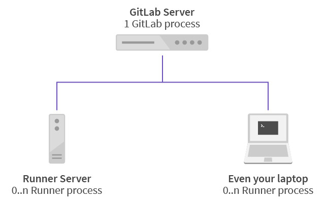
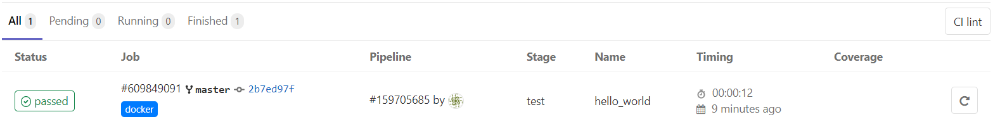
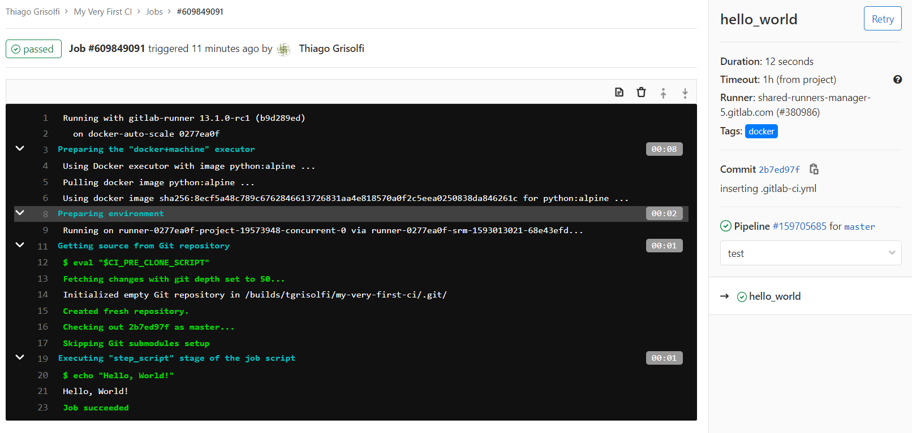
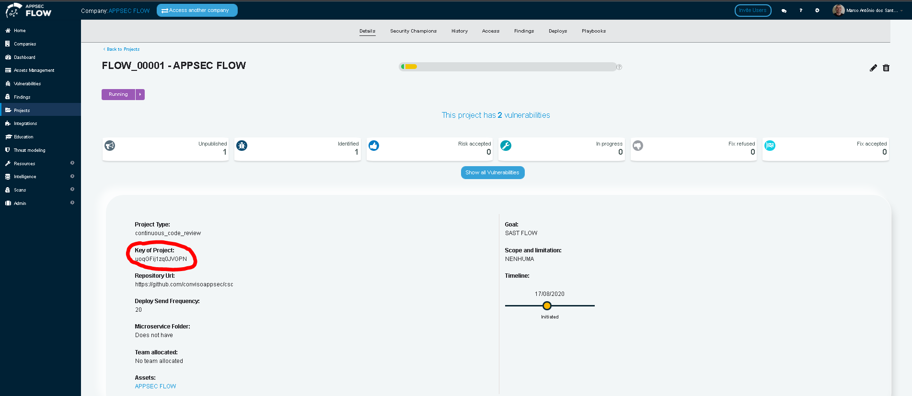

<div style={{textAlign: 'center'}}>


</div>

:::note
First time using Gitlab? Please refer to the [following documentation](https://docs.gitlab.com/).  
:::

## Introduction

The GitLab platform has powerful features. Among them, easily run pipelines in your code repository using CI/CD: Continuous Integration & Continuous Delivery or Continuous Deployment.

Continuous Integration is a very broad concept, but for this guide it can be abstracted as the step in which the code is exposed to a test environment in a continuous way; in a commit, daily, in a merge to a specific branch and many other user configurable triggers right on your project page.

Continuous Delivery is the step that usually takes place immediately after all integrations are successful. The software is ready to be published, according to the scrutiny of all the checks carried out in the continuous integration stage, and human approval is now required for the release of a new version to the public.

Continuous Deployment is usually used in mature projects, where the integration and delivery stage is already consolidated enough that the software is automatically put into production.

Pipeline in this context of CI/CD, is the term that gives the wake that the code will go through whenever we want. These pipelines are usually made up of stages that can be nicknamed as needed (with a few reserved words). In the community we commonly find the terms: scan, verify, build, test, deploy, among others.

Stages can contain one or more jobs which are actually the automation actions performed by GitLab Runner, the pipeline runner agent. In Figure 1, we can visualize the architecture; the GitLab Server element can be either the [Cloud platform](https://gitlab.com) as well as an on-premises installation of GitLab. The runners can be local, in the cloud, and as the diagram demonstrates even on a project developer's laptop, for example.

<div style={{textAlign: 'center'}}>



</div>

Also, runners implement different types of executors. To understand in greater detail about runners and to know the different types of runners and their capabilities, In this document we will cover the shell and docker type runners.

:::note
In the case of using GitLab on-premise, it is assumed that the instance administrator has knowledge about installing runners. Otherwise, we strongly recommend reading the official GitLab documentation in the [runner](https://docs.gitlab.com/runner/) and [executors](https://docs.gitlab.com/runner/executors/) sections.
:::

## First Steps

By default (it is configurable), the behavior of a pipeline in GitLab is through the configuration of the .gitlab-ci.yml file in the repository root. As the extension indicates, the format used by this file is the YAML markup language. The description of CI within the versioning system brings many benefits, among them we can highlight two: old version pipelines still work correctly and different branches can have different pipelines.

Below, we can check out an example that would be like a **Hello, World!** of a pipeline to illustrate some features that can be used in the file structure:

```yml
image: "python:alpine" 
hello_world:
    script:
        - echo "Hello, World!"
    tags:
        - docker
```

By committing this file to the repository, we can already check the result of the execution by navigating to the main repository page under **CI / CD -> Pipelines**. You should see something like the figure below:

<div style={{textAlign: 'center'}}>


</div>

In this pipeline screen, we could have a macro view of the status of all the stages executed. To view the jobs individually, you can access **CI / CD -> Jobs**. You should see something like the figure shown below:

<div style={{textAlign: 'center'}}>



</div>

On the jobs screen, by clicking on the **passed** button, we can see the execution of the job we have configured for the repository, as shown below:

<div style={{textAlign: 'center'}}>



</div>

After this introduction, it is recommended to consult the official GitLab documentation in the [YAML](https://docs.gitlab.com/ee/ci/yaml/) section, where you can discover all the other super powers of the ```gitlab-ci.yml``` file.

## Conviso Setup

### Requirements

Before you can start setting up Conviso features in your pipeline, your runner must complete all of the following requirements:

- Be a specific or group runner;

- Defined docker or docker+machine executor type;

- Have external access (this can be restricted to specific addresses);

- Git

### CI/CD Configuration

Accessing your project's main page, you must set the ```CONVISO_API_KEY``` variable with an Conviso Platform API key. If you don't have a key, it can be found on your platform user's profile editing page, following the steps below:

1. In the upper right corner, click on your username and on **Edit profile**;

2. Click on the **API Key** tab and then on **Generate**;

3. A window will appear asking for confirmation of your action, click **confirm**;

4. Your API key has been updated, copy the value displayed on the screen.

To set the ```CONVISO_API_KEY``` variable in GitLab, follow the steps below:

1 - In your GitLab project under **Settings -> CI/CD -> Variables**;

2 - Fill in as the image below (missing image!!!!);

3 - Click on **Add variable**.

If you already have a **Continuous Code Review** type project in Conviso Platform, you can repeat the steps above for the ```CONVISO_PROJECT_CODE``` variable. The value of this variable can be found in Conviso Platform at the Project page as **Project Key**.

<div style={{textAlign: 'center'}}>



</div>

### .gitlab-ci.yml File Configuration

The interface with Conviso and the GitLab CI/CD platform is done through the use of the command line tool available in [PyPi](https://pypi.org/project/conviso-flowcli/). Like every CLI tool, it is easily integrated into CI environments. For its full functioning, the prerequisites specified at the beginning of this session must be followed.

We recommend reading the following [document](../guides/code-review-strategies) to understand the different strategies/approaches for creating a deploy for Code Review.

## Code Review

After choosing the strategy used to send deploys to Code Review, it is possible to create a specific job for this action in the GitLab pipeline. The prerequisites for executing this functionality are the configurations made previously (definition of the ```CONVISO_API_KEY``` and ```CONVISO_PROJECT_CODE``` variables). Below are the code snippets from the ```.gitlab-ci.yml``` file that illustrates the creation of exclusive jobs for the code review deployment.

**With TAGS, sorted by timestamp**

```yml
codereview-job-tags-by-time:
    image: convisoappsec/flowcli:latest
    services:
        - docker:dind
    variables:
        CONVISO_PROJECT_CODE: "HERE"
    only:
        variables:
            - $CONVISO_API_KEY
    script:
        - conviso deploy create with tag-tracker sort-by time
    tags:
        - docker
```

**With TAGS, sorted by versioning-style**

```yml
codereview-job-tags-by-version-style:
    image: convisoappsec/flowcli:latest
    services:
        - docker:dind
    variables:
        CONVISO_PROJECT_CODE: "HERE"
    only:
        variables:
            - $CONVISO_API_KEY
    script:
        - conviso deploy create with tag-tracker sort-by versioning-style
    tags:
        - docker
```

**Without TAGS, sorted by GIT Tree**

```yml
codereview-job-tags-by-version-style:
    image: convisoappsec/flowcli:latest
    services:
        - docker:dind
    variables: 
        CONVISO_PROJECT_CODE: "HERE"
    only:
        variables:
            - $CONVISO_API_KEY
    script:
        - conviso deploy create with values
    tags:
        - docker
```

## SAST

In addition to deploying for code review, it is also possible to integrate a SAST-type scan into the development pipeline, which will automatically perform a scan for potential vulnerabilities, treated in Conviso Platform as findings.

The requirements for running the job are the same as already practiced: ```CONVISO_API_KEY``` and ```CONVISO_PROJECT_CODE``` defined as environment variables for the runner.

```yml
conviso-sast:
    image: convisoappsec/flowcli:latest
    services:
        - docker:dind
    variables:
        CONVISO_PROJECT_CODE: "HERE"
    only:
        variables:
            - $CONVISO_API_KEY
    script:
        - conviso sast run
    tags:
        - docker
```

In the above job, we didn't use any options at the ```conviso sast run``` command. In this case, the default behavior is to perform the analysis of the entire repository. This is because the default values used for the ```--start-commit``` and ```--end-commit``` options use first commit and current commit (HEAD), respectively.

Alternatively, we can specify the diff range manually. In the Example below, we scan between the current commit and the immediately previous one on the current branch:

```yml
conviso-sast:
    stage: <stage desejado>
    image: convisoappsec/flowcli:latest
    services:
        - docker:dind
    variables:
        CONVISO_PROJECT_CODE: "HERE"
    only:
        variables:
            - $CONVISO_API_KEY
    before_script:
        - export START_COMMIT=`git rev-parse @~1`
    script:
        - conviso sast run --start-commit $START_COMMIT --end-commit $CI_COMMIT_SHA
```

## SCA

The following code snippet will trigger a SCA scan and send the results to Conviso Platform:

```yml
conviso-sca:
    image: convisoappsec/flowcli:latest
    services:
        - docker:dind
    variables:
        CONVISO_PROJECT_CODE: "HERE"
    only:
        variables:
            - $CONVISO_API_KEY
    script:
        - conviso sca run
    tags:
        - docker
```

## Getting Everything Together: Code Review + SAST + SCA Deployment

The SAST and SCA analysis can be complementary to the code review carried out by Conviso's professional, even serving as input for the analyst. The job below will perform the deploy for code review of the code and will use the same diff identifiers to perform the SAST and SCA analysis, forming a complete solution in the pipeline. An example of a complete pipeline with all solutions can be seen in the snippet below:

```yml
stages:
  - test

appsec-flow:
  stage: test
  image: convisoappsec/flowcli:latest
  services:
    - docker:dind
  variables:
    CONVISO_PROJECT_CODE: "HERE"
  only:
    variables:
      - $CONVISO_API_KEY
  before_script:
    - deploy_create_output_vars="$(mktemp)"
  script:
    - |
      conviso deploy create \
        -f env_vars \
        with values > "$deploy_create_output_vars"
    - source "$deploy_create_output_vars"
    - |
      conviso sast run \
        --start-commit "$CONVISO_DEPLOY_PREVIOUS_VERSION_COMMIT" \
        --end-commit "$CONVISO_DEPLOY_CURRENT_VERSION_COMMIT"
    - |
      conviso sca run    
  after_script:
    - rm -f "$deploy_create_output_vars"
  tags:
    - docker
```

The pipeline used above covers practically all the concepts exercised in this guide. Analyzing some points, we can make observations:

- The CI routine with Conviso's tools can integrate with a stage already present in your pipeline, as an example, in the stage called **test**, as well as being executed in a new one;

- The execution of the SAST job and the deploy of code review can be executed at any point in the pipeline, as it uses only the code from the repository and not any artifact generated by the execution of a stage or job in the pipeline;

- The deployment strategy used in this last example could be any of the three specified in the **Code Review Deploy** section above. Choose the one that best suits your development process;

More information about CLI and the complete documentation about its commands can be seen on the project page in [Pypi](https://pypi.org/project/conviso-flowcli/).