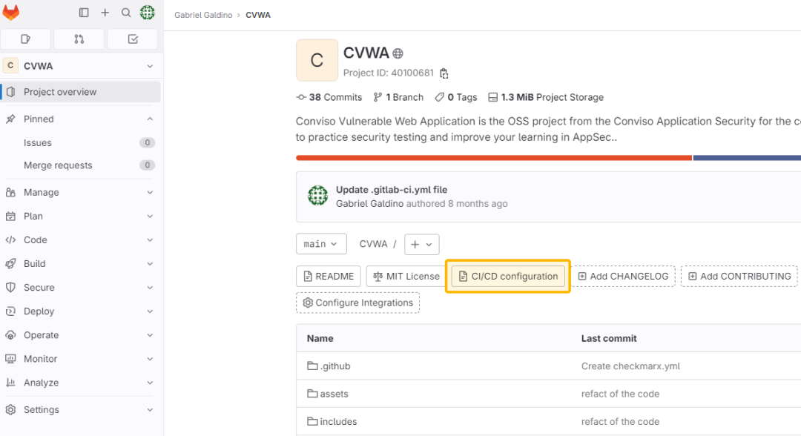

<div style={{textAlign: 'center'}}>

[](https://bit.ly/3JyRdl8)

</div>

## Introduction
With Conviso Platform integrated into your [Gitlab](https://gitlab.com/) Secure CI/CD Pipeline, you can automate and streamline your security processes, ensuring that your applications undergo thorough security assessments throughout the development lifecycle. 

You can run the Conviso Platform **AST (Application Security Testing)**. The tool offers both **Static Application Security Testing (SAST)** and **Software Composition Analysis (SCA)** and **Code Review** directly on your Gitlab pipeline.

The [security scans workflow](../security-scans/conviso-ast) is used in this integration for all execution and connection with the Conviso Platform. 

**[Explore our Integration page to learn more and supercharge your Application Security Program  with Conviso Platform.](https://bit.ly/3NzvomE)**

### Prerequisites

:::info
This integration works for both Cloud and On-Premises Gitlab solutions.
:::

Before you can use Conviso Platform with Gitlab, you need to make sure that:
* You have your API Key, which is a code that identifies you to Conviso Platform. Find yours [using this tutorial](../platform/security-feed.md#generate-api-key).

* You must also set an environment variable for the runner: ```CONVISO_API_KEY```. This code tells Conviso Platform which account you are using. To do this on Gitlab, you must:
  * Go to your project’s **Settings > CI/CD** and expand the **Variables** section.
  * Select **Add variable** and fill in the detail. 

* After you create a variable, you can use it in the ```.gitlab-ci.yml```configuration file or in job scripts. To make the ```.gitlab-ci.yml``` file, go to your repository page and click on **“CI/CD Configuration”**:

<div style={{textAlign: 'center'}}>


</div>

This will allow you to write the code that we will use in this tutorial!

## Perform a Conviso AST scan to analyze your application's security

Harness the power of Application Security Testing (AST) by incorporating the Conviso AST scan into your application's security analysis. This versatile tool combines Static Application Security Testing (SAST), Software Composition Analysis (SCA), and Code Review capabilities, providing comprehensive security analysis directly within your pipeline.

Follow the steps below to integrate Security Code Review seamlessly into your pipeline, creating a comprehensive solution within your ```.gitlab-ci.yml``` file:

```yml
conviso-ast:
    image: convisoappsec/convisoast:latest
    services:
        - docker:dind
    only:
        variables:
            - $CONVISO_API_KEY
    script:
        - conviso ast run --vulnerability-auto-close
    tags:
        - docker

```

The identified vulnerabilities will be automatically sent to your Project on Conviso Platform. Now you can use the [Vulnerabilities](../platform/vulnerabilities) resource to work on the correction flow.

## Running Conviso AST with the GitLab CI/CD component

Instead of writing the job above, you can include the **Conviso AST** component from the GitLab CI/CD Catalog. A single component covers Static Application Security Testing (SAST), Software Composition Analysis (SCA), Infrastructure as Code (IaC), Software Bill of Materials (SBOM), secret and container scanning, and it resolves the branch, the path to scan and the session archive from the pipeline itself. To configure it, follow these steps:

1. Access the [GitLab CI/CD Catalog](https://gitlab.com/explore/catalog).
2. Search for **gitlab-ast-component** or directly visit [this link](https://gitlab.com/explore/catalog/convisoappsec/gitlab-ast-component).
3. In the project you want to scan, go to **Settings → CI/CD → Variables** and add `CONVISO_API_KEY` with your [Conviso API Key](../api/api-overview.md#generate-api-key). Mark it as **Masked**. Leave **Protect variable** off, or a job on an unprotected branch will not see the key.
4. Edit your `.gitlab-ci.yml`.
5. Configure the pipeline with the following code:
```yaml
workflow:
  rules:
    - if: $CI_COMMIT_BRANCH == "main" || $CI_COMMIT_BRANCH == "staging"

include:
  - component: gitlab.com/convisoappsec/gitlab-ast-component/ast@1
    inputs:
      company_id: $CONVISO_COMPANY_ID
```
6. Replace `$CONVISO_COMPANY_ID` with your company ID, or store that ID as a CI/CD variable with the same name. Adjust the pipeline settings below to your workflow.
7. Save it and run the pipeline.

**Pipeline Settings**: the component itself needs only `company_id` plus `CONVISO_API_KEY` — everything around it is a starting point you should adapt:
- `workflow.rules`: The branches worth scanning. `main` and `staging` are an example, so use your own. Without `workflow:`, GitLab starts a pipeline on every branch.
- Merge request pipelines: add `- if: $CI_PIPELINE_SOURCE == "merge_request_event"` to scan merge requests as well.
- Other jobs in the same file: `workflow:` applies to the whole pipeline. If other jobs must run on every branch, put `rules:` on those jobs instead and leave this include as-is.

**Field Descriptions**:
- `CONVISO_API_KEY`: Your [Conviso API Key](../api/api-overview.md#generate-api-key). It is a CI/CD variable, not a component input. Always store it as a masked variable.
- `company_id`: Your company ID in the Conviso Platform.
- `scan_types`: Which scan types to run — `sast`, `sca`, `iac`, `sbom`, `secret`, `container`. Optional; leave it empty to run all of them.
- `image_name`: The image analyzed by the `container` scan (e.g. `myorg/app:$CI_COMMIT_SHA`). Optional, and the `container` scan is skipped without it.
- `baseline_ref`: Branch to compare against so only what changed is scanned, such as `main` or `$CI_MERGE_REQUEST_TARGET_BRANCH_NAME`. Optional. The component already clones with `GIT_DEPTH: "0"`.
- `asset_id`: Pins the scan to a specific asset, skipping the automatic lookup by repository URL. Optional; use it if a scan stops with an asset ambiguity error.

**Expected Behaviors**:
- **Branch association**: The scan is recorded against the branch the pipeline is for. In a **merge request** pipeline, this is the branch the merge request is coming **from**, so its findings are not filed under the target branch.
- **Findings never fail the pipeline**: The job fails only when a scan or an upload fails. Add `allow_failure: true` on the `conviso-ast` job if you do not want even that to stop the pipeline.
- **Session archive**: Every run writes a zip with the raw output of each scan and the debug log, published as the job artifact `conviso-ast-session.zip`. It is the first artifact Conviso support asks for.

:::note
The component requires a **Linux x64** runner that can pull `convisoappsec/convisoast_v2`. Shared runners on GitLab.com qualify. The image is published for `linux/amd64` only.
:::

## Running the Conviso Containers

To perform the [Conviso Containers](../security-scans/conviso-containers/conviso-containers.md), you can use the example configuration below:

```yml
conviso-containers:
  image: convisoappsec/convisoast:latest
  services:
    - docker:dind
  variables:
    CONVISO_COMPANY_ID: <YOUR_COMPANY_ID>
  only:
    variables:
      - $CONVISO_API_KEY
  script:
    - export DOCKER_BUILDKIT=1
    - export IMAGE_NAME="my-image"
    - export IMAGE_TAG="latest"
    - docker pull $IMAGE_NAME:$IMAGE_TAG
    - docker build -t $IMAGE_NAME:$IMAGE_TAG .
    - conviso container run "$IMAGE_NAME:$IMAGE_TAG"
```

If you'd like to scan a public image available on DockerHub, modify the configuration as shown below:

```yml
conviso-containers:
  image: convisoappsec/convisoast:latest
  services:
    - docker:dind
  variables:
    CONVISO_COMPANY_ID: <YOUR_COMPANY_ID>
  only:
    variables:
      - $CONVISO_API_KEY
  script:
    - export IMAGE_NAME="vulnerables/web-dvwa"
    - export IMAGE_TAG="latest"
    - docker pull $IMAGE_NAME:$IMAGE_TAG
    - conviso container run "IMAGE_NAME:$IMAGE_TAG"
```

:::note
These are only examples. You are required to provide the image for scanning, and you can use alternative methods based on your environment.

The `IMAGE_NAME` and `IMAGE_TAG` are variables that should be adjusted based on your project. For example, you may want to name the image after your project or version it differently.
:::

## Run a scan exclusively using Conviso SAST

The steps below will show you what your ```.gitlab-ci.yml``` must have to perform Static Application Security Testing (SAST):

```yml
conviso-sast:
    image: convisoappsec/convisoast:latest
    services:
        - docker:dind
    only:
        variables:
            - $CONVISO_API_KEY
    script:
        - conviso sast run
    tags:
        - docker
```

Alternatively, you can specify the diff range manually. In the example below, we scan between the current commit and the immediately previous one on the current branch:

```yml
conviso-sast:
    image: convisoappsec/convisoast:latest
    services:
        - docker:dind
    only:
        variables:
            - $CONVISO_API_KEY
    before_script:
        - export START_COMMIT=`git rev-parse @~1`
    script:
        - conviso sast run --start-commit $START_COMMIT --end-commit $CI_COMMIT_SHA
```

## Run a scan exclusively using Conviso SCA

The steps below will show you what your ```.gitlab-ci.yml``` must have to perform Software Composition Analysis (SCA):

```yml
conviso-sca:
    image: convisoappsec/convisoast:latest
    services:
        - docker:dind
    only:
        variables:
            - $CONVISO_API_KEY
    script:
        - conviso sca run
    tags:
        - docker
```

**[Unlock the full potential of your Application Program  with Conviso Platform integrations. Visit our Integration page now to get started.](https://bit.ly/3NzvomE)**

## Support

If you have any questions or need help using our product, please don't hesitate to contact our support team.
