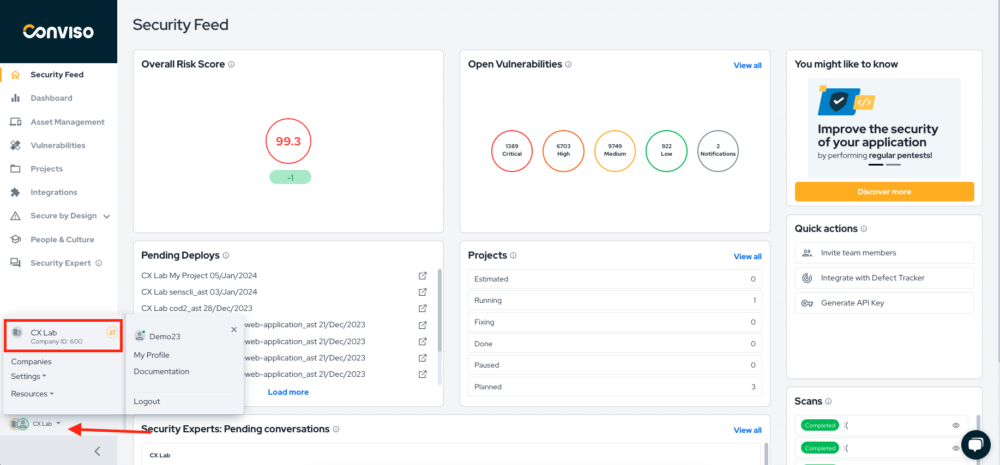

<div style={{textAlign: 'center'}}>


[](https://bit.ly/3JyRdl8)


</div>


## Introduction

With Conviso Platform integrated into your [Gitlab](https://gitlab.com/)CI/CD Pipeline, you can automate your security processes, ensuring that your applications undergo through automated security assessments in new versions of your code.
You can run Conviso Platform **AST (Application Security Testing)**. This product offers **Static Application Security Testing (SAST)**, **Software Composition Analysis (SCA)**, Infrastructure as Code (IaC) and enables **Continuous Code Review** performed by our Security Analysts directly on your Gitlab pipeline.


The [CLI](https://docs.convisoappsec.com/cli/installation/) is used for this integration and will be responsible for the communication with Conviso Platform.


**[Explore our Integration page to learn more and supercharge your Application Security Program  with Conviso Platform.](https://bit.ly/3NzvomE)**


### Prerequisites


Before you can use Conviso Platform with Gitlab, you need to make sure that:
1. You have your API Key, which is a code that identifies you to Conviso Platform. Find yours [using this tutorial](../api/generate-apikey.md).


2. You must also set an environment variable for the runner: ```CONVISO_API_KEY```, this is generated directly on the Conviso Platform. (See step 1)
**2.1** Go to your project’s **Settings > CI/CD** and expand the **Variables** section.
**2.2**  Select **Add variable** and fill in the details.


3. After you create a variable, you can use it in the ```.gitlab-ci.yml```configuration file or in job scripts. To make the ```.gitlab-ci.yml``` file, go to your repository page and click on **“CI/CD Configuration”**:


<div style={{textAlign: 'center'}}>


[](https://bit.ly/3JyRdl8)
</div>


## Perform a Conviso AST scan to analyze your application's security


Harness the power of Application Security Testing (AST) by incorporating the Conviso AST scan into your application's security analysis. This versatile tool combines Static Application Security Testing (SAST), Software Composition Analysis (SCA), and Code Review capabilities, providing comprehensive security analysis directly within your pipeline.


You can use Conviso Platform to perform Code Review, SAST, and SCA, utilizing all three together to enhance the security of your applications in your CI/CD Pipeline.


Follow the steps below to integrate Security Code Review seamlessly into your pipeline, creating a comprehensive solution within your ```.gitlab-ci.yml``` file:


```yml
conviso-ast:
   image: convisoappsec/convisocli:latest
   services:
       - docker:dind
   only:
       variables:
           - $CONVISO_API_KEY
   script:
       - conviso ast run
   tags:
       - docker
```


**Note:** You also need your API Key, which [you can find using this tutorial](../api/generate-apikey.md).


The identified vulnerabilities will be automatically sent to your Asset on Conviso Platform. Now you can use the [Vulnerabilities Management](../general/vulnerabilities_management.md) resource to work on the correction flow.


## Troubleshooting


If you encounter authentication issues after loading the ```CONVISO_API_KEY``` variable, please ensure it has been properly loaded within the environment session of all tasks utilizing the CLI.


Error. ‘credentials’ cannot be null.


To address this error, add the following lines to the configuration.


```
steps:
- checkout: self
 persistCredentials: true
```


If you have access to multiple business units (BU), we recommend defining a variable COMPANY_ID. To obtain the ID, click on the company name located in the bottom left, as exemplified in the image




```
conviso-ast:
 image: convisoappsec/convisocli:latest
 services:
   - docker:dind
 script:
   - export CONVISO_COMPANY_ID=000
   - conviso ast run
 tags:
   - docker


```


## Support


If you have any questions or need help using our product, please don't hesitate to contact our support team.


## Resources


By exploring our content, you'll find resources to help you to understand the benefits of the Conviso Platform integrations for Secure CI/CD Pipeline:


[AppSec: Integrations with CI/CD tools through Conviso Platform](https://bit.ly/3ODN0jw): Follow this article to understand how we can integrate your main tools within a single platform.


[](https://cta-service-cms2.hubspot.com/web-interactives/public/v1/track/redirect?encryptedPayload=AVxigLKtcWzoFbzpyImNNQsXC9S54LjJuklwM39zNd7hvSoR%2FVTX%2FXjNdqdcIIDaZwGiNwYii5hXwRR06puch8xINMyL3EXxTMuSG8Le9if9juV3u%2F%2BX%2FCKsCZN1tLpW39gGnNpiLedq%2BrrfmYxgh8G%2BTcRBEWaKasQ%3D&webInteractiveContentId=125788977029&portalId=5613826)


