## Introduction

The Google SSO (Single Sign-On) integration aims to increase user security on the platform. With this SSO feature, managers will have full control of who should have access to the Conviso Platform. The impact will be positive for your company's support teams tasks, reducing common “forgot my password” calls by employees, customers and suppliers, allowing the process to flow more quickly.

Benefits:

- Authenticate using corporate email;

- User control.

## Google Web App Setup

:::note
In order to configure Google SSO, it is necessary to have Admin privileges on the Google Workspaces.
:::

1. Log in to your [Google Admin Console](https://admin.google.com/);

2. Click on the **Apps** at the left menu and choose the **Web and mobile apps** option: 

<div style={{textAlign: 'center'}}>

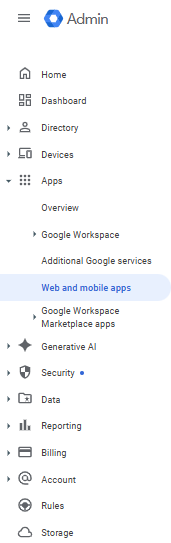

</div>

3. On the top Web and mobile apps menu bar, click on the **Add app** and choose the **Add custom SAML App** option: 

<div style={{textAlign: 'center'}}>

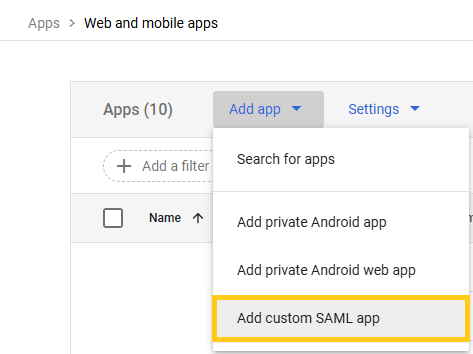

</div>

4. A configuration wizard will start. First, name you application as you wish (we strongly recommend that you use a related label to your new Web Application, like **Conviso Platform SSO**). If you wish, you can also create a brief description to your Web App and an app icon to better describe your application (optional). As an app icon, you can use [this one](../../static/img/sso-google-icon.png):

<div style={{textAlign: 'center'}}>

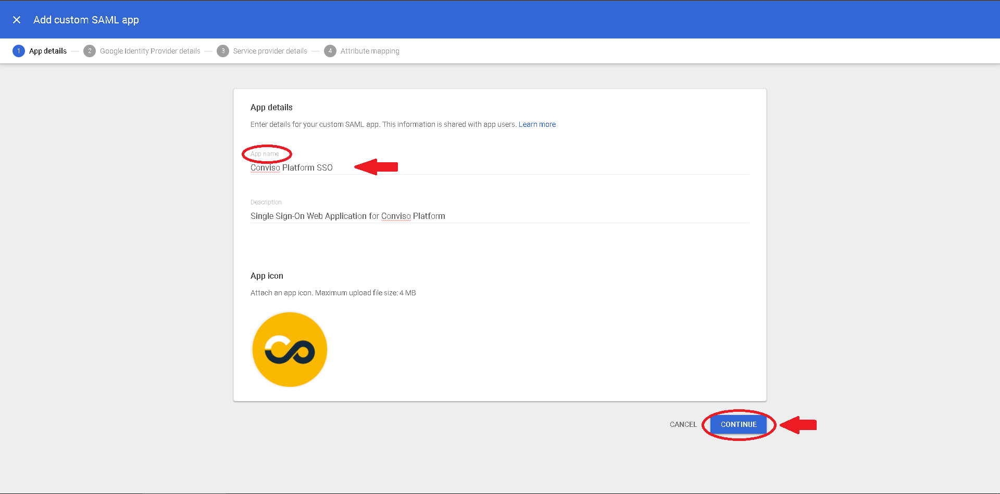

</div>

5. In the following step, you will review the following configuration data, you will use it later at the Conviso Platform Setup (you can always get back to this configuration section to copy the data). Click on the **Continue** button to go to the next step;

<div style={{textAlign: 'center'}}>

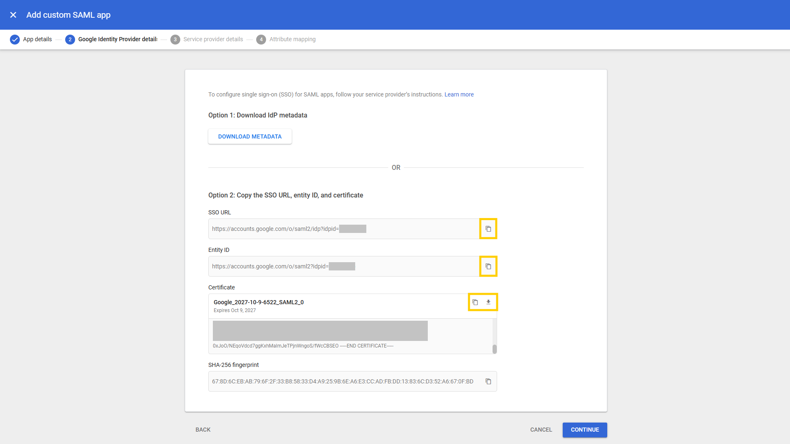

</div>

6. At this point you must provide the following URLs:

- At the **ACS URL** field, paste ```https://auth.app.convisoappsec.com/realms/conviso-platform/broker/google_<YOUR_COMPANY_ID>/endpoint```
- At the **Entity ID** field, paste ```https://auth.app.convisoappsec.com/realms/conviso-platform```
- At the **Start URL** field, paste ```https://app.convisoappsec.com```

Also, you must check the **Signed Response** checkbox, before clicking on the **Continue** button:

<div style={{textAlign: 'center'}}>

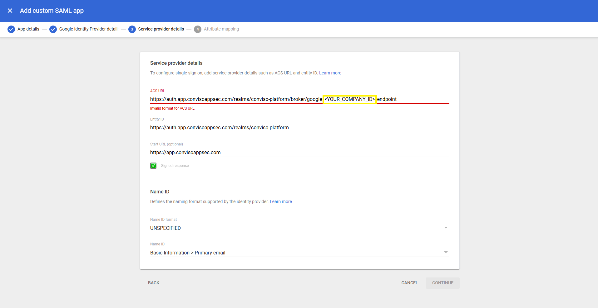

</div>

6. In the next setup section, we will add the necessary attribute mappings. This is important to be able to correct log in to the Conviso Platform. Click on the **Add mapping** button to start configuring it:

<div style={{textAlign: 'center'}}>

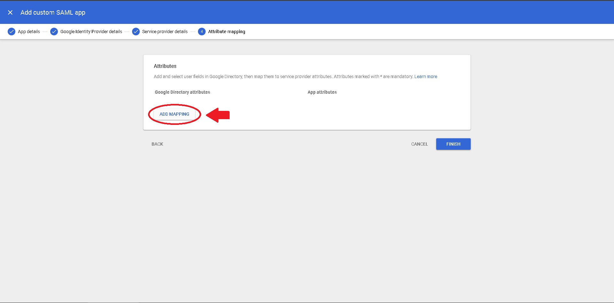

</div>

7. You must add the following attribute mappings, associating each **Google Directory attribute** with its corresponding **App attribute**, as shown below.

- **Primary email** -> **email**

- **First Name** -> **first_name**

- **Last Name** -> **last_name**

When done, click on the **Finish** button:

<div style={{textAlign: 'center'}}>

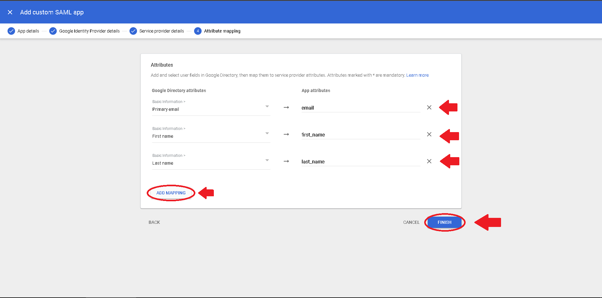

</div>

8. Now, we must enable users to get access to this Web Application. Expand the **User Access** configuration section, by clicking at the down arrow at its right side, as indicated below:

<div style={{textAlign: 'center'}}>

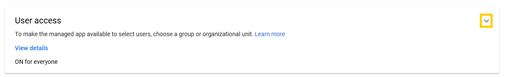

</div>

9. On the **Service Status** option, check **ON for everyone** and click at the **Save** button at the end of this form, as shown below:

<div style={{textAlign: 'center'}}>

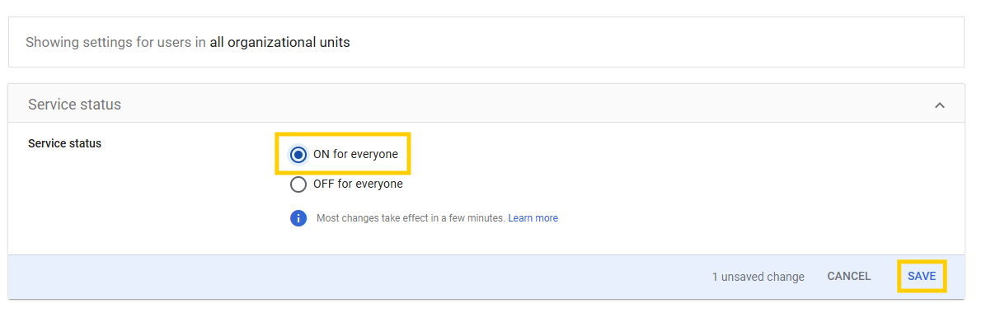

</div>

## Google SSO Authentication Setup

1. On the left menu at the main **Google Admin Console**, go to **Security**, then **Authentication** and then **SSO with SAML Apps**. Leave this screen opened;

<div style={{textAlign: 'center'}}>

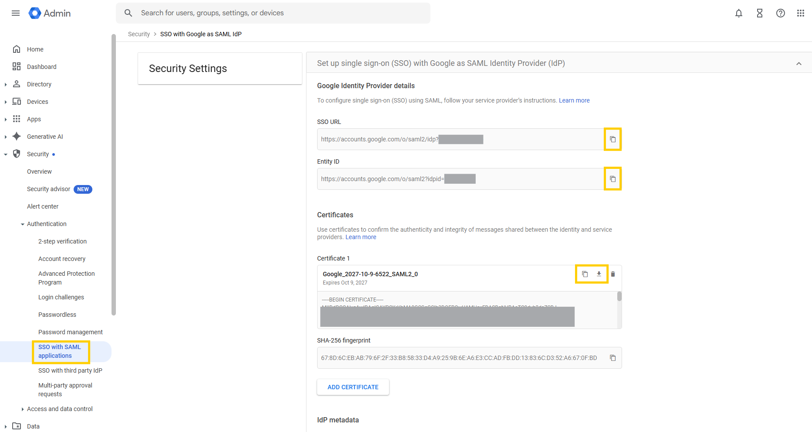

</div>

2. Log on to **Conviso Platform**. Make sure your **Company** is selected. Select **Integrations** on the left menu and then select **Authentication**. Find the Google SSO card and click on Connect::

<div style={{textAlign: 'center'}}>

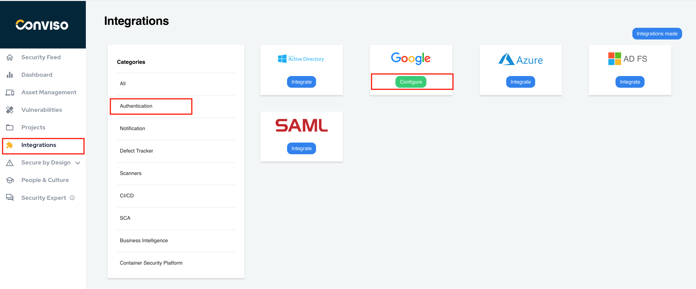

</div>

3. The following screen will open. Copy the matching fields obtained from **Google Workspaces** to the corresponding fields at this screen. First, the **SSO URL**. Next, the **Entity ID** and, then, the **Certificate**. Finally, fill the **Authorized Domains** field with all your domain name and aliases, if they exist:

<div style={{textAlign: 'center'}}>

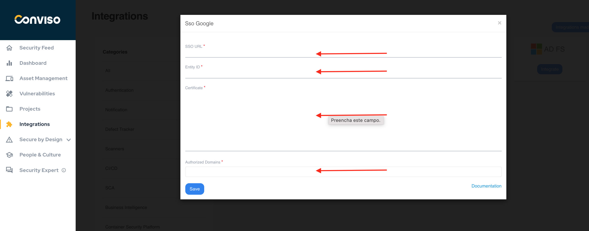

</div>

4. At last, click **Continue** to store your Google SSO integration configuration.

The two steps that follow — **Group Mapping** and **Role Mapping** — are optional, and each is covered in its own section below. Once the integration is saved you can come back at any time and jump straight to a step by clicking its title.

## Setup Group Mapping Integration

Group mapping puts a user in a Conviso **Team** based on the Google Workspace groups they belong to. Once a mapping exists, every SSO login applies it: the user joins the mapped Teams, and loses the mapped Teams their groups no longer include.

### On the Google Workspace side

1. In the **Google Admin Console**, open your Conviso Platform SAML app and go to the **Attribute mapping** step.

2. Under **Group membership (optional)**, click **Search for a group**, type a few letters of the group name and select it. Repeat for every group you intend to map.

3. In **App attribute**, enter **`groups`**.

:::caution
The app attribute has to be named exactly `groups`. Any other name is not read by the Conviso Platform, and the mapping fails silently: it saves, no error appears, and the user simply never joins the Team.

Two more things worth knowing about this mapping: a custom SAML app accepts at most 75 groups, and the assertion carries only the groups the user actually belongs to, directly or indirectly. Groups you did not list here are never sent.
:::

### On the Conviso Platform side

1. [Create a Team](../platform/user-management.md) in the Conviso Platform, specifying the desired Profile and Access Type for the group's users.

2. Retrieve the Google Workspace group identifier — the value the app attribute will carry for that group.

3. In the Google SSO integration page, open the **Group Mapping** step, select the Team you created and associate it with that identifier. Use **Add mapping** to declare more than one.

4. Click **Continue**.

## Setup Role Mapping Integration

Group mapping decides which **Team** a user joins. Role mapping decides which **access profile** the user gets — what they are allowed to do once inside the company. The two are independent: you can use either, or both.

### On the Google Workspace side

Google Workspace has no built-in role concept for SAML apps, so the value has to come from a user attribute you map yourself:

1. Create a [custom user attribute](https://knowledge.workspace.google.com/admin/apps/creating-custom-attributes-using-the-user-schema) to hold the role, and fill it in for each user.

2. In the SAML app's **Attribute mapping** step, under **Google Directory attributes**, click the **Select field** menu and choose that attribute.

3. In the matching **App attributes** field, enter **`roles`**.

:::caution
The app attribute has to be named exactly `roles`, and the value has to match the one you type in the Conviso Platform character for character, apart from case and surrounding spaces.
:::

### On the Conviso Platform side

1. Open the **Role Mapping** step of the integration.

2. For each role, type the value exactly as Google Workspace sends it and select the access profile it should grant. Use **Add mapping** to declare more than one.

3. Click **Confirm**.

### What happens on each login

Declaring the first mapping is what hands the access profiles of that company over to Google Workspace. From then on, every SSO login re-evaluates the user's profile:

- **A role that matches a mapping** — the user gets the mapped access profile, replacing whatever profile they had.
- **No role, or only roles that match nothing** — the user is set to the global **viewer-only** profile. Profiles granted manually in the Conviso Platform do not survive the next login, so an operator who needs to override a profile has to change it in Google Workspace.
- **More than one matching role** — one of them is applied, and there is no guarantee of which: the order of a multivalued attribute is not defined, so it may differ between logins. Assign a single mapped role per user.

While a company has **no** mapping declared, nothing changes: access profiles keep being managed entirely in the Conviso Platform.

:::note
An access profile says what a user is allowed to do; it is not what gives them access to the company's data. That comes from an invite or from a Team the user joined through group mapping. A user mapped only by role logs in with the mapped profile and still sees nothing until they have access.
:::

## Verifying Google SSO Integration

To check if everything is correct, you may click **Integrations**, then **Authentication**:

<div style={{textAlign: 'center'}}>

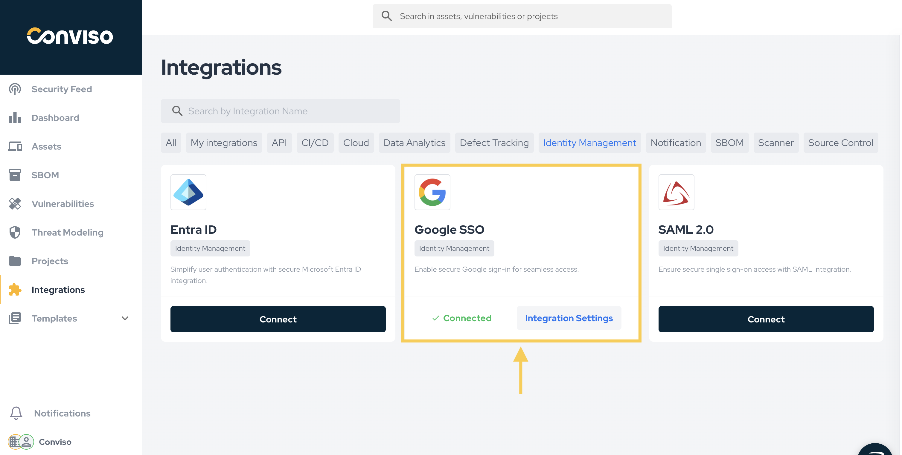

</div>

Select the integration you want to view and click at the **Integration Settings**

## Test application

Before testing the SSO integration, ensure you are logged out of the Conviso Platform.

The SSO test process is mandatory in the Google provider. Follow these steps to test the integration:

<div style={{textAlign: 'center'}}>


</div>

1. Click **TEST SAML LOGIN**.

2. You will be redirected to the Conviso Platform and automatically authenticated.

The test will verify that the SSO configuration is working correctly between Google SSO and the Conviso Platform.

### Email Field Mapping in SAML 2.0

When configuring the Google SSO integration via SAML, it is important to ensure that the **email field** is used correctly as the mapping parameter. The email configured in your SSO identity provider must match the **email of the logged-in user on the Conviso Platform** to ensure proper authentication.

#### How this works:

During the SSO authentication process, the **email** is used as the primary identifier to map the user's identity in the Conviso Platform. This means the email value provided by the SSO identity provider in the **SAML Assertion** must match exactly with the user's email in Conviso. If not, login might fail.

Therefore, when configuring the identity provider (such as Google Workspaces or others), make sure the `email` field is mapped correctly and matches the email associated with the user's account in the Conviso Platform.

[](https://cta-service-cms2.hubspot.com/web-interactives/public/v1/track/redirect?encryptedPayload=AVxigLKtcWzoFbzpyImNNQsXC9S54LjJuklwM39zNd7hvSoR%2FVTX%2FXjNdqdcIIDaZwGiNwYii5hXwRR06puch8xINMyL3EXxTMuSG8Le9if9juV3u%2F%2BX%2FCKsCZN1tLpW39gGnNpiLedq%2BrrfmYxgh8G%2BTcRBEWaKasQ%3D&webInteractiveContentId=125788977029&portalId=5613826)