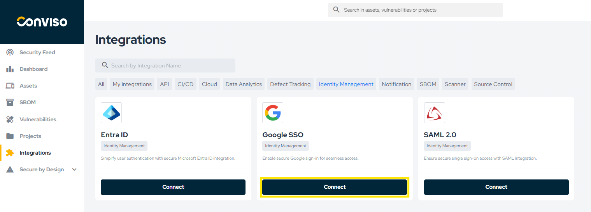
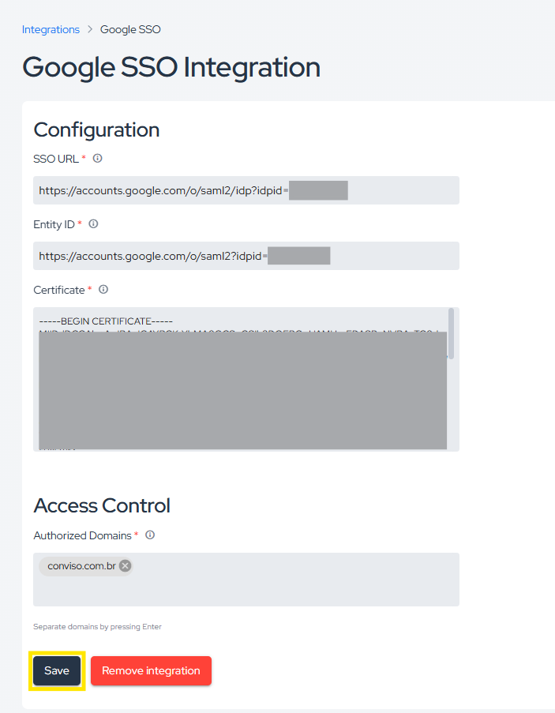

## Introduction

The Google SSO (Single Sign-On) integration aims to increase user security on the platform. With this SSO feature, managers will have full control of who should have access to the Conviso Platform. The impact will be positive for your company's support teams tasks, reducing common “forgot my password” calls by employees, customers and suppliers, allowing the process to flow more quickly.

Benefits:

- Authenticate using corporate email;

- User control.

## Google Web App Setup

:::note
In order to configure Google SSO, it is necessary to have Admin privileges on the Google Workspaces.
:::

1. Log in to your [Google Admin Console](https://admin.google.com/);

2. Click on the **Apps** at the left menu and choose the **Web and mobile apps** option: 

<div style={{textAlign: 'center'}}>


</div>

3. On the top Web and mobile apps menu bar, click on the **Add app** and choose the **Add custom SAML App** option: 

<div style={{textAlign: 'center'}}>


</div>

4. A configuration wizard will start. First, name you application as you wish (we strongly recommend that you use a related label to your new Web Application, like **Conviso Platform SSO**). If you wish, you can also create a brief description to your Web App and an app icon to better describe your application (optional). As an app icon, you can use [this one](../../static/img/sso-google-icon.png):

<div style={{textAlign: 'center'}}>


</div>

5. In the following step, you will review the following configuration data, you will use it later at the Conviso Platform Setup (you can always get back to this configuration section to copy the data). Click on the **Continue** button to go to the next step;

<div style={{textAlign: 'center'}}>


</div>

6. At this point you must provide the following URLs:

- At the **ACS URL** field, paste ```https://app.convisoappsec.com/portal_users/saml/auth```
- At the **Entity ID** field, paste ```https://app.convisoappsec.com/portal_users/saml/metadata```
- At the **Start URL** field, paste ```https://app.convisoappsec.com```

Also, you must check the **Signed Response** checkbox, before clicking on the **Continue** button:

<div style={{textAlign: 'center'}}>


</div>

6. In the next setup section, we will add the necessary attribute mappings. This is important to be able to correct log in to the Conviso Platform. Click on the **Add mapping** button to start configuring it:

<div style={{textAlign: 'center'}}>


</div>

7. You must add the following attibute mappings, associating each **Google Directory attribute** with its corresponding **App attribute**, as shown below.

- **Primary email** -> **email**

- **First Name** -> **first_name**

- **Last Name** -> **last_name**

When done, click on the **Finish** button:

<div style={{textAlign: 'center'}}>


</div>

8. Now, we must enable users to get access to this Web Application. Expand the **User Access** configuration section, by clicking at the down arrow at its right side, as indicated below:

<div style={{textAlign: 'center'}}>


</div>

9. On the **Service Status** option, check **ON for everyone** and click at the **Save** button at the end of this form, as shown below:

<div style={{textAlign: 'center'}}>


</div>

## Google SSO Authentication Setup

1. On the left menu at the main **Google Admin Console**, go to **Security**, then **Authentication** and then **SSO with SAML Apps**. Leave this screen opened;

<div style={{textAlign: 'center'}}>


</div>

2. Log on to **Conviso Platform**. Make sure your **Company** is selected at the upper blue bar, select **Integrations** on the left menu and then select **Authentication** on **Categories** panel:

<div style={{textAlign: 'center'}}>



</div>

3. At the right panel, find the Google card and click on **Configure**:

<div style={{textAlign: 'center'}}>


</div>

4. The following floating screen will open. Copy the matching fields obtained from **Google Workspaces** to the corresponding fields at this screen. First, the **SSO URL**. Next, the **Entity ID** and, then, the **Certificate**. Finally, fill the **Authorized Domains** field with all your domain name and aliases, if they exist:

<div style={{textAlign: 'center'}}>



</div>

5. At last, click Save to store your Google SSO integration configuration.  

## Verifying Google SSO Integration

To check if everything is correct, you may click **Integrations**, then **Authentication** and then **Integrations Made**:

<div style={{textAlign: 'center'}}>


</div>

Select the integration you want to view and click at the icon **Edit** on the column **Actions**:

<div style={{textAlign: 'center'}}>


</div>

Check if everything is OK. Make changes if needed and click close to leave this screen without saving it or click the button **Save** to store the modified configuration.

<div style={{textAlign: 'center'}}>


</div>

## Post-configuration Actions

In order to change the authentication type in Conviso Platform, we must go to the **Integrations** screen and click on **Authentication**.

Click the button below the Conviso icon to change the authentication type from SSO (Disabled) to Default Login and Password (Enabled), or vice-versa:

<div style={{textAlign: 'center'}}>


</div>

If **Disabled**, login will be done via SSO. When **Enabled**, the login and password will be used to access Conviso Platform.

:::note
 In order to disable the login and password option, we must have an SSO integration already configured.
:::