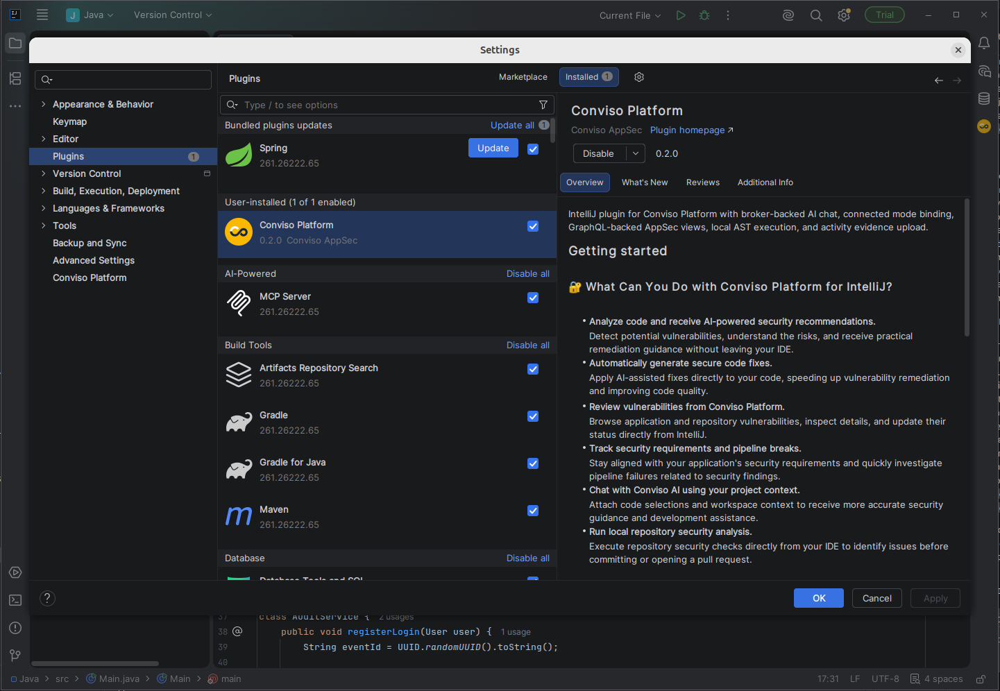
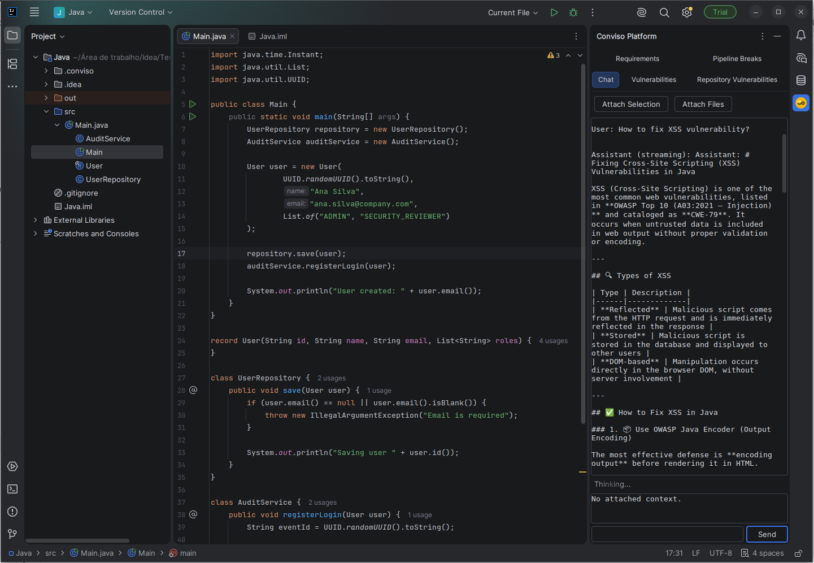

## Objective

Use Conviso Platform in IntelliJ IDEA to review security data, analyze code with AI assistance, and run local repository scans without leaving the IDE.

## Prerequisites

- IntelliJ IDEA 2026.1 or a compatible JetBrains IDE based on platform build 261 or later
- A Conviso Platform account with access to the required company
- A Conviso Platform API token
- An open project
- Docker installed and running to use local SAST, SCA, or AST scans

AI features depend on the capabilities enabled for your Conviso Platform account.

## Install the Plugin

1. Open **Settings > Plugins**.
2. Select **Marketplace**.
3. Search for **Conviso Platform**.
4. Click **Install**.
5. Restart the IDE if prompted.

## Configure Access

1. Open **Settings > Conviso Platform**.
2. Enter your **API Token**.
3. Select a company from the **Company ID** list.
4. Click **Test API**.
5. Click **Apply**.
6. Open **Tools > Conviso Platform > Open Conviso Platform**.

The API token is stored in the JetBrains Password Safe. Use **Check AI Access** in the settings page to confirm whether AI capabilities are available for the selected company.

## Use Conviso Platform

The Conviso Platform tool window provides:

- **Chat** — ask security questions, attach a code selection or files, search for similar issues, analyze selected code, and review suggested fixes.
- **Vulnerabilities** — filter findings by asset or title, inspect details, generate an AI-assisted fix, and update status.
- **Repository Vulnerabilities** — review findings from the latest local repository scan.
- **Requirements** — browse projects, requirements, and activities; update statuses and add evidence to an activity.
- **Pipeline Breaks** — review failed security gate executions and their failure reasons.

Double-click an item in a list to open its detailed information.

### Analyze Selected Code

1. Select the relevant code in the editor.
2. Open **Tools > Conviso Platform**.
3. Select **Analyze Security and Suggest Fix**.
4. Review the response in the **Chat** tab.
5. Click **Apply Suggested Fix** only after reviewing the proposed code.
6. Confirm the replacement.

### Run a Local Repository Scan

1. Confirm Docker is running.
2. Open the repository as an IntelliJ project.
3. Open **Tools > Conviso Platform**.
4. Select **Run Repository SAST**, **Run Repository SCA**, or **Run Repository AST**.
5. Open the **Repository Vulnerabilities** tab to review the detected issues.

Local scans run as dry runs and do not upload a new scan result to Conviso Platform.

## Validation

- **Test API** succeeds and the company list contains the expected company.
- The tabs load data for the selected company.
- A local scan populates **Repository Vulnerabilities**.

## Troubleshooting

### Platform Data Does Not Load

Open **Settings > Conviso Platform**, confirm the API token and company, and run **Test API** again.