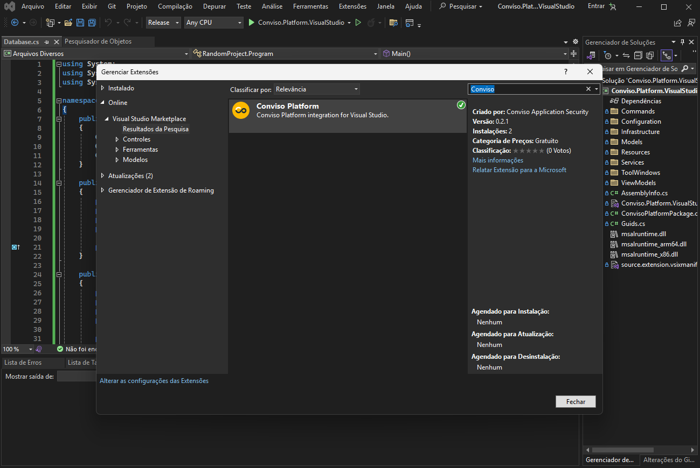
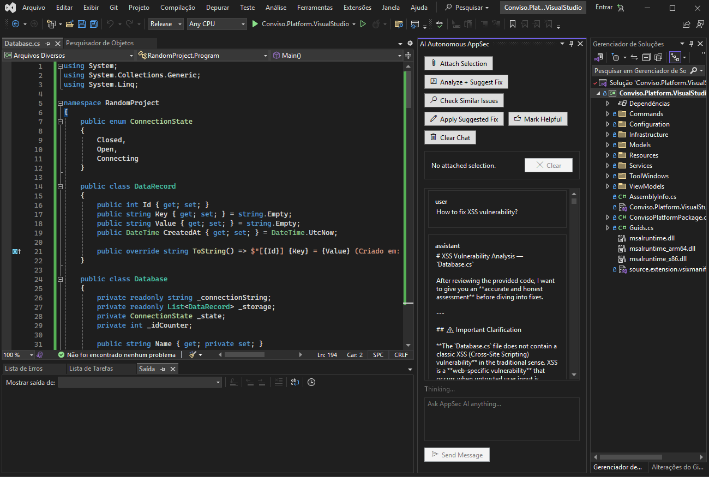

## Objective

Use Conviso Platform in Visual Studio to analyze selected code, review security findings, and follow projects and security gate executions without leaving the IDE.

## Prerequisites

- Visual Studio 2022 version 17.x on a 64-bit Windows system
- Community, Professional, or Enterprise edition
- A Conviso Platform account with access to the required company
- A Conviso Platform API token

AI features depend on the capabilities enabled for your Conviso Platform account.

## Install the Extension

1. In Visual Studio, open **Extensions > Manage Extensions**.
2. Select **Online**.
3. Search for **Conviso Platform**.
4. Click **Install**.
5. Close Visual Studio and complete the installation when prompted.
6. Reopen Visual Studio.

## Configure Access

1. Open **Tools > Conviso Settings**.
2. On the **Platform API** tab, enter your API token.
3. Click **Test API**.
4. To use AI features, click **Test Chat**.
5. Open the **Scope** tab and select a company.
6. Click **Save Settings**.

The API token is protected with Windows user-level data protection.

## Use Conviso Platform

Open the following windows from the **Tools** menu:

- **Conviso Chat** — ask security questions, analyze selected code, attach editor context, search the workspace for similar issues, and review suggested fixes.
- **Conviso Vulnerabilities** — filter findings by asset, inspect details, generate an AI-assisted fix, and update status.
- **Conviso Requirements** — browse projects, requirements, and activities and update project or activity status.
- **Conviso Pipeline Breaks** — inspect failed security gate executions, including the source, asset, trigger, and failure reasons.

### Analyze Selected Code

1. Open a source file and select the relevant code.
2. Choose **Tools > Analyze + Suggest Fix**.
3. Review the response in **AI Autonomous AppSec**.
4. If a code block is suggested, select the code to replace.
5. Click **Apply Suggested Fix**.
6. Confirm the replacement after reviewing it.

The extension does not replace code without confirmation.

### Review and Update a Vulnerability

1. Open **Tools > Conviso Vulnerabilities**.
2. Optionally select an asset or enter a text filter.
3. Select a vulnerability to view its details.
4. Click **Generate Fix** to request AI-assisted remediation guidance.
5. Enter an allowed status and click **Update Status** when the finding must be changed.

## Validation

- **Test API** and **Test Chat** succeed in **Conviso Settings**.
- The selected company's data appears in the Conviso windows.
- Selecting a vulnerability, requirement, or pipeline break displays its details.
- An analyzed selection produces a response in **AI Autonomous AppSec**.

## Troubleshooting

### Company List Is Empty

Confirm the API token with **Test API** and verify that the account has access to at least one company.