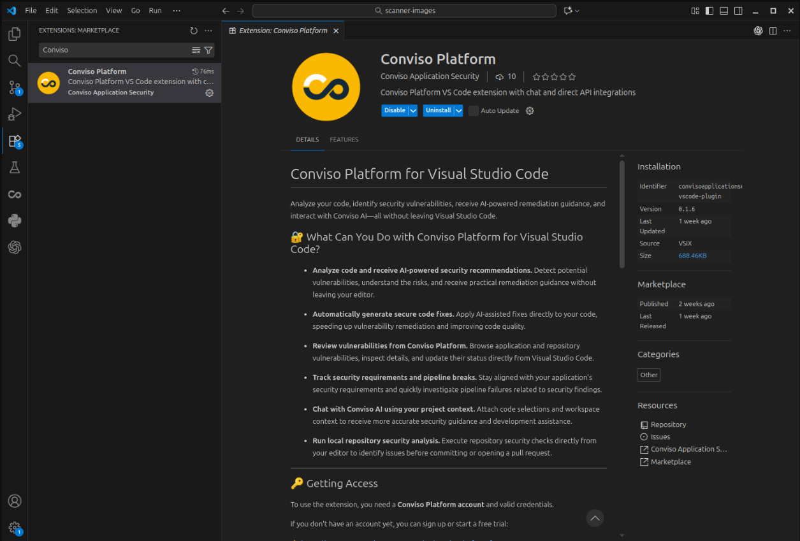
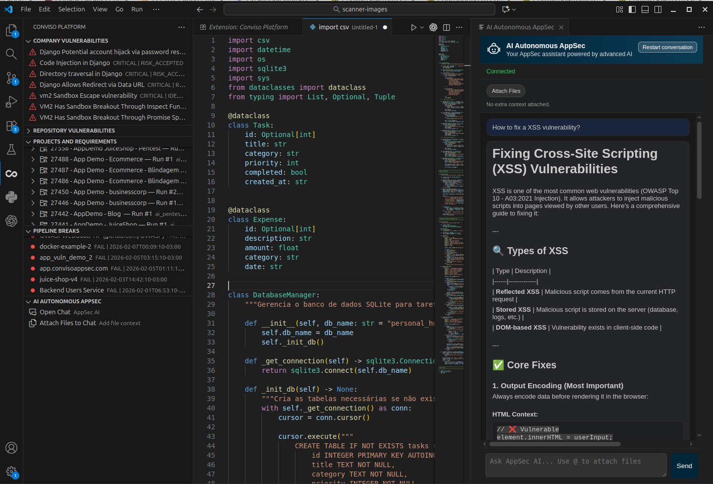

## Objective

Use Conviso Platform in Visual Studio Code to review security data, analyze code with AI assistance, and run local repository scans without leaving the editor.

## Prerequisites

- Visual Studio Code 1.90 or later
- A Conviso Platform account with access to the required company
- A Conviso Platform API key
- An open workspace folder
- Docker installed and running to use local SAST, SCA, or AST scans

AI features depend on the capabilities enabled for your Conviso Platform account.

## Install the Extension

1. Open **Extensions** in Visual Studio Code.
2. Search for **Conviso Platform**.
3. Select the extension published by **Conviso Application Security**.
4. Click **Install**.
5. Reload Visual Studio Code if prompted.

## Configure Access

1. Open the Command Palette.
2. Run **Conviso Platform: Configure API Access**.
3. Enter your Conviso Platform API key.
4. Select one of the companies available to your account.
5. Open the **Conviso Platform** icon in the Activity Bar.

The extension stores the API key in Visual Studio Code's secret storage. To change only the active company later, run **Conviso Platform: Configure Company ID**.

## Use Conviso Platform

The Conviso Platform view provides:

- **Company Vulnerabilities** — review findings, inspect details, filter results, and update a vulnerability's status.
- **Repository Vulnerabilities** — review findings from the latest local repository scan.
- **Projects and Requirements** — browse projects, requirements, and activities; update statuses and attach activity evidence.
- **Pipeline Breaks** — investigate failed security gate executions and their failure reasons.
- **AI Autonomous AppSec** — chat about security, attach code or files as context, analyze selected code, and review suggested fixes.

### Analyze Selected Code

1. Select the relevant code in the editor.
2. Right-click the selection.
3. Open **Conviso Platform** and select **Analyze Security and Suggest Fix**.
4. Review the explanation and suggested code in **AI Autonomous AppSec**.
5. Apply the suggested fix only after reviewing the proposed change.

You can also use **Attach Selection to AI Chat** or **Attach Files to AI Chat** when you want to ask a broader question with additional context.

### Run a Local Repository Scan

1. Confirm Docker is running.
2. Open the repository as a workspace folder.
3. Open the Command Palette.
4. Run one of the following commands:
   - **Run Repository SAST**
   - **Run Repository SCA**
   - **Run Repository AST**
5. Open **Repository Vulnerabilities** to review the detected issues.

Local scans run as dry runs and do not upload a new scan result to Conviso Platform.

## Validation

- The Conviso Platform views load data for the selected company.
- Opening an item displays its details.
- **AI Autonomous AppSec** returns a response when AI access is enabled.
- A local scan populates **Repository Vulnerabilities**.

## Troubleshooting

### Platform Views Do Not Load

Run **Conviso Platform: Configure API Access** again and confirm that the API key has access to the selected company.

### AI Chat Does Not Connect

Confirm that the API key is valid and that AI capabilities are enabled for your account. Then run **Conviso Platform: Connect**.

