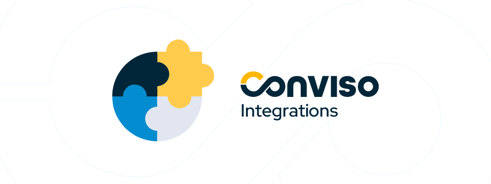

## Introduction

Conviso Platform seamlessly integrates with your current tools and workflows, enabling you to effortlessly enhance the security of your applications throughout the entire Secure Software Development Lifecycle (S-SDLC).  

[Optimize your software security with the Conviso Platform! Schedule a free demo and start strengthening your defenses today.](https://cta-service-cms2.hubspot.com/web-interactives/public/v1/track/redirect?encryptedPayload=AVxigLKtcWzoFbzpyImNNQsXC9S54LjJuklwM39zNd7hvSoR%2FVTX%2FXjNdqdcIIDaZwGiNwYii5hXwRR06puch8xINMyL3EXxTMuSG8Le9if9juV3u%2F%2BX%2FCKsCZN1tLpW39gGnNpiLedq%2BrrfmYxgh8G%2BTcRBEWaKasQ%3D&webInteractiveContentId=125788977029&portalId=5613826)
 
**This guide will walk you through various integration options with Conviso Platform:** 
- [Single Sign-On (SSO)](#set-up-conviso-platform-single-sign-on-sso)
- [CI/CD](#conviso-platform-cicd-integration)
- [Data Analytics](#data-analytics-integration)
- [Defect/Bug Tracking](#defectbug-tracking-integration)
- [Notifications](#communication-and-notification)
- [Software Composition Analysis (SCA)](#software-composition-analysis-sca-integration)
- [Security Scans](#consolidate-vulnerability-management-through-integrated-security-scans)

**Note:** You can also check the **[Conviso CLI](../cli/installation.md)** and **[Conviso API](../api/api-overview.md)** guides to check integration possibilities.  If a tool is not found in our list of integrations, please don't hesitate to contact our support team.

## Set up Conviso Platform Single Sign-On (SSO)

Set up Single Sign-On (SSO) to allow your developers and teams easy access to Conviso Platform through your current SSO provider. Let's start with the SSO setup process to streamline access on the Conviso platform:
* **[ADFS](../integrations/adfs.md)**
* **[Azure AD](../integrations/azure-ad.md)**
* **[Google](../integrations/google.md)**
* **[LDAP](../integrations/ldap.md)**
* **[SAML 2.0](../integrations/saml.md)**

**Note:** It is possible to configure custom Identity providers that support SAML 2.0 protocol. So, if there is no specific integration for your tool, you can just use the generic SAML 2.0 integration instead.

## Conviso Platform CI/CD Integration

Incrementally incorporating CI/CD Integration has become a prevalent practice, enabling you to adopt the integration in stages. By integrating Conviso Platform with your development pipeline, automated analysis can be performed, providing transparency and insights to your teams. We support integrations with the following CI/CD platforms:
* **[AWS Codebuild](../integrations/aws-codebuild.md)**
* **[Azure Pipelines CLI Mode](../integrations/azure-pipelines-cli.md)**
* **[Azure Pipelines Graph Mode](../integrations/azure-pipelines-graph.md)**
* **[Bitbucket Pipelines](../integrations/bitbucket-pipelines.md)**
* **[CircleCI](../integrations/circleci.md)**
* **[Codefresh](../integrations/codefresh.md)**
* **[GitHub Actions](../integrations/github-actions.md)**
* **[GitLab](../integrations/gitlab.md)**
* **[Jenkins](../integrations/jenkins.md)**
* **[Jenkins Single Pipeline for Multiple Repositories using Webhooks](../integrations/jenkins-single-pipeline.md)**

## Data Analytics Integration

Unlock the full potential of your data by integrating it into our platform! Export information and create customized dashboards to visualize and analyze your application security data dynamically and flexibly.
* **[Google Data Studio](../integrations/datastudio.md)**
* **[PowerBI](../integrations/powerbi.md)**

## Defect/Bug Tracking Integration

By integrating the Conviso Platform with your Defect Tracker tool, you can seamlessly manage and track defects within your development workflow. This streamlines the process of identifying and addressing issues, enhancing collaboration and efficiency. Our platform supports the following Defect Tracker integrations:
* **[Azure Boards](../integrations/azure-boards.md)**
* **[BusinessMap](../integrations/businessmap.md)**
* **[ClickUp](../integrations/clickup.md)**
* **[Jira](../integrations/jira.md)**

## Communication and Notification
Efficient collaboration and communication are crucial for successful application development. By integrating with Slack, it is possible to send information about vulnerabilities to a specific communication channel:
* **[Slack](../integrations/slack.md)**

## Software Composition Analysis (SCA) Integration

This integration enables the platform to identify and mitigate risks in your software supply chain effectively. Leveraging the capabilities of a Software Bill of Materials (SBOM), our unique approach goes beyond traditional Software Composition Analysis (SCA) solutions, providing enhanced capabilities that drive comprehensive security measures:
* **[Dependency-Track](../integrations/dependency-track.md)**

## Consolidate Vulnerability Management through Integrated Security Scans

Integrate external scanning tools with Conviso Platform to synchronize and consolidate findings in a centralized manner. This integration allows you to effectively manage and address vulnerabilities identified by various scanning tools, providing a comprehensive view of your application security landscape:
* **[Fortify](../integrations/fortify.md)**
* **[SonarCloud](../integrations/sonarcloud.md)**
* **[SonarQube](../integrations/sonarqube.md)**

## Support for Conviso Platform Integrations

If you have any questions or don’t find a specific tool in our list of integrations, please don't hesitate to contact our support team.

## Resources
By exploring our content you'll find resources to help you to understand the benefits of Conviso Platform integrations:

[Securing your code on GitHub with Conviso Platform integration](https://bit.ly/3oFnBvv): In this post, we will guide you to guarantee the security of the code of your application stored and managed on GitHub using the Conviso Platform.

[Elevating the security of your application through the integration of Bitbucket with Conviso Platform](https://bit.ly/3qunqDK): To ensure we can implement a security-first mindset without impacting development speed, we built our platform integration with Bitbucket.

[Integration with Jira and GitHub, a unified vision of vulnerabilities:](https://bit.ly/3IYTZjw) With Conviso Platform we can centralize all the development process information in one platform to have all data and structured information delivered to the teams.

[AppSec: Integrations with CI/CD tools through Conviso Platform:](https://bit.ly/3ODN0jw) Follow this article to understand how we can integrate your main tools within a single platform.

[Conviso Platform now offers an integration with ClickUp:](https://bit.ly/45QL5hF) Managing tasks is often challenging for a team of developers in a day-to-day life that involves tight deadlines. Therefore, adopting a product that facilitates this routine by creating calendars, scheduling tasks, and setting reminders is essential. The integration of ClickUp with the Conviso Platform aims to optimize this routine.

