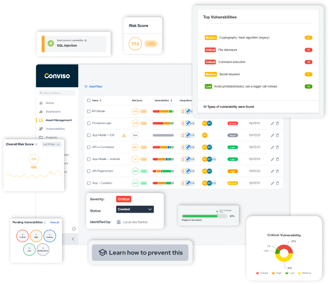

## Introduction

Saving time and increasing productivity are two of the most desired metrics within a business, and they are possible to be achieved thanks to technology and the integration flow made available by it.
The following integrations connect Conviso Platform to other tools, allowing integrated management of your company's data and processes. Integrating sectors, teams and collaborators is a strategy that makes everything work together, in a collaborative, synchronized and transparent way.
We will list the benefits that each integration category can offer to your business, and will show how to integrate each one, in order to maximize your results.

### Authentication/SSO

Once the SSO (Single Sign On) integration is completed with any of the tools below, it is possible to access Conviso Platform using the same login and password as the integrated platform.
It is possible to configure custom Identity providers that support SAML 2.0 protocol.
So, if there is no specific integration for your tool, you can just use the generic SAML 2.0 integration instead.

### CI/CD

By integrating Conviso Platform with a development treadmill, we were able to perform automated analysis and provide transparency to teams.

### Container Security Platform

This integration allows you to synchronize vulnerabilities found in Cloud Workload Protection Platforms (CWPP) and Cloud Security Posture Management (CSPM) solutions and import them into Conviso Platform, enabling consolidated management on the platform.

### Data Analytics

Integration with datasets makes it possible to export information from Conviso Platform and create custom dashboards in Power BI, Google and others.

### Defect/Bug Tracking

Once you've added one or more of these integrations, you'll be able to create an issue directly in your Defect Tracker tool.

### Notification

By integrating with Slack, it is possible to send information about vulnerabilities to a specific communication channel.

### SCA

Integrate with an intelligent Component Analysis platform that allows Conviso Platform to identify and reduce risk in the software supply chain. It takes a unique and highly beneficial approach by leveraging the capabilities of Software Bill of Materials (SBOM). This approach provides capabilities that traditional Software Composition Analysis (SCA) solutions cannot achieve.

### Scanners

From the integration with external scans, it is possible to synchronize tools and extract the findings to manage in a consolidated way from Conviso Platform.
