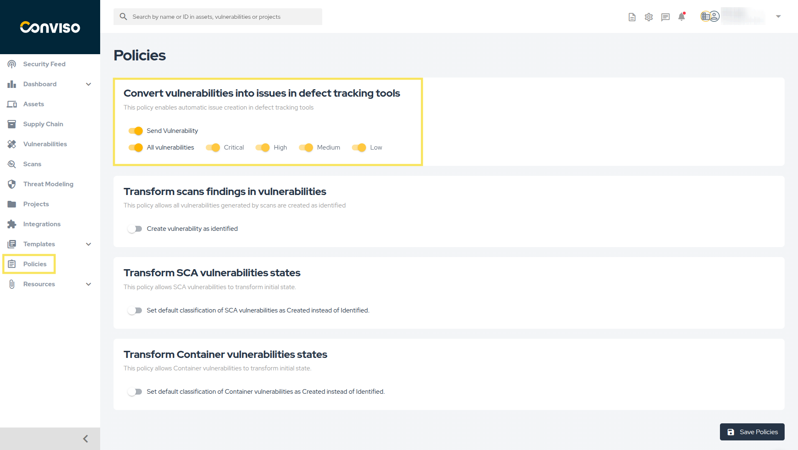
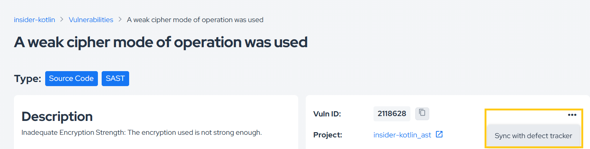
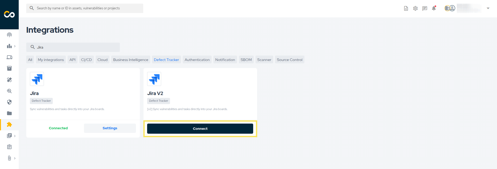
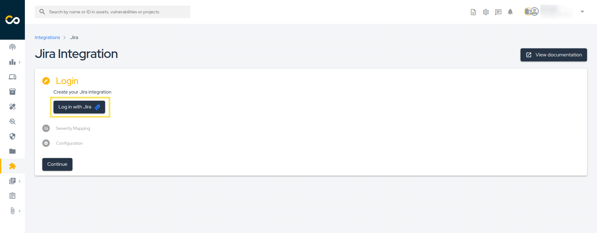
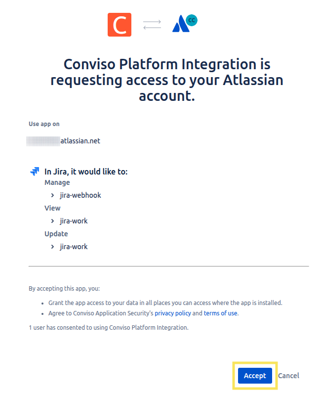
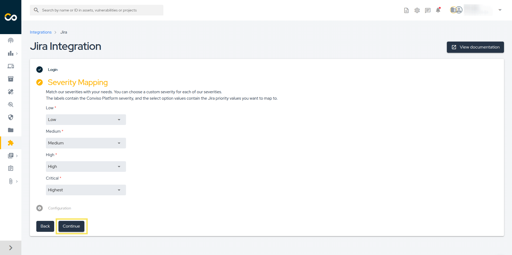
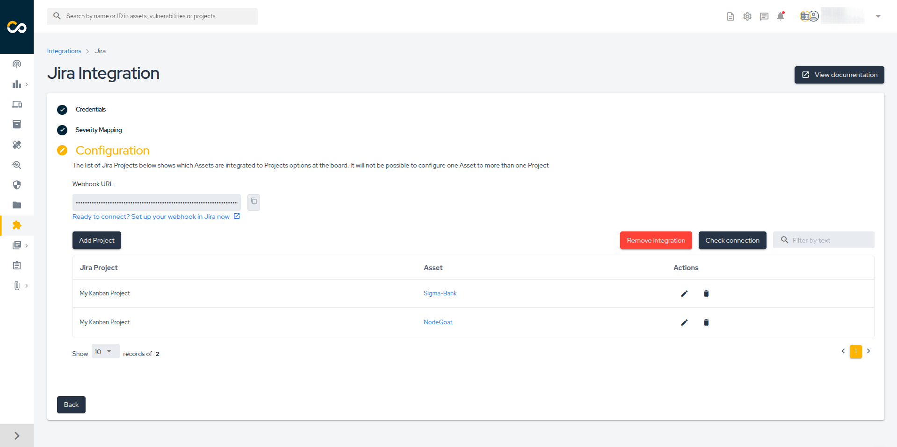
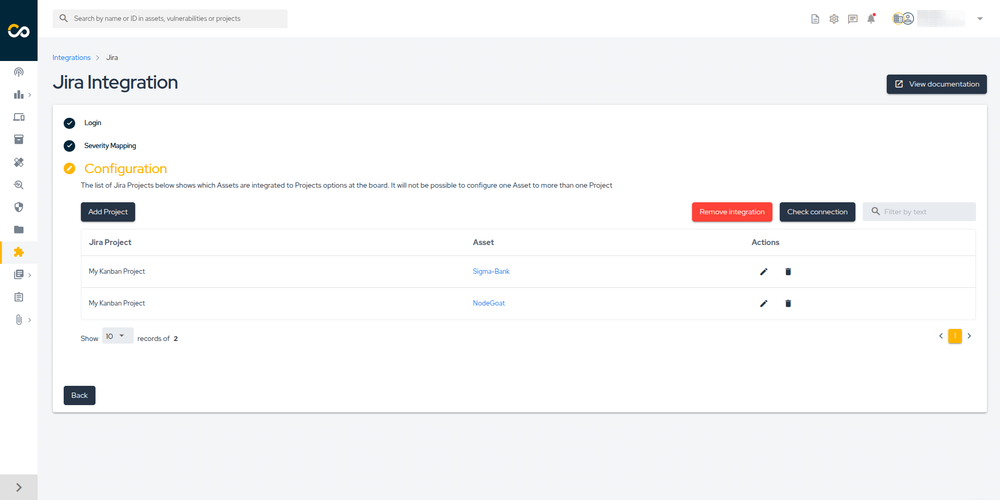

<div style={{textAlign: 'center'}}>


</div>

## Introduction
Integrating Jira in Conviso Platform will let developers gain productivity while we do all the hard work by automating the whole vulnerability management triage process.

New vulnerabilities identified in Conviso Platfom are created in real time directly in Jira.

With our two-way integration capability, every status update from both solutions are automatically updated in order to reduce the toil and increase productivity.

### Prerequirements
To set up the integration, you'll need the following information:

1. A user with **Admin permissions in Jira**.

2. A user with **Admin permissions in Conviso Platform**.

## Usage
To seamlessly integrate Conviso Platform with Jira, follow these step-by-step procedures:

**[1 - Configure the integration between Conviso Platform and Jira](#configure-the-integration-between-conviso-platform-and-jira)**

**[2 - How to Modify the Policy to Automatically Create Issues in Jira](#how-to-modify-the-policy-to-automatically-create-issues-in-jira)**

**[3 - How to Manually Create Issues in Jira](#how-to-manually-create-issues-in-jira)**

## Configure the integration between Conviso Platform and Jira

**Step 1** - Access the **Conviso Platform**, look for **Integrations** on the left-side menu, select **Defect Tracking**, and finally, click the **Connect** button located just below the Jira card, as shown in the example image below:

<div style={{textAlign: 'center'}}>


</div>

**Step 2** - Click the **Log in with Jira** button to authenticate with Jira:

<div style={{textAlign: 'center'}}>


</div>

**Step 3** - On the page below, grant the necessary permitions so the Conviso Platform application can perform the required actios on your Jira.

<div style={{textAlign: 'center'}}>


</div>

**Step 4** - **Severity Mapping** refers to Jira's two-way integration with Conviso Platform. Select which severity will be mapped to Jira's priority:

<div style={{textAlign: 'center'}}>


</div>

**Step 5** - Then, in **Configuration**, click on the **Add Project** button to start pairing Conviso Platform Projects with **Jira Projects**:

<div style={{textAlign: 'center'}}>


</div>

**Step 6** - Finally, to add a new project, select the **Asset** in Conviso Platform that you want to associate with your **Jira Project**. Then, choose the appropriate **Jira Issue Type** and **map the Conviso Platform statuses to the corresponding Jira statuses**. Once everything is configured, click **Save**.

<div style={{textAlign: 'center'}}>


</div>

**Step 7** - After saving your integration settings, you can review, update, or delete the configuration in the Conviso Platform. To do so, go to your integration panel and click the **Edit** icon to review or make change changes; or the **Trash** icon to permanently delete the integration:

<div style={{textAlign: 'center'}}>


</div>

**Step 8** - Whenever a new vulnerability is detected, it will be automatically sent to the linked Jira project, as shown in the example below:

<div style={{textAlign: 'center'}}>


</div>

## How to Modify the Policy to Automatically Create Issues in Jira

Conviso Platform allows you to enable a policy that defines which vulnerability severities will be automatically sent to Jira. To configure it, follow the steps below:

**Step 1 -** At the sidebar menu, click **Policies**.

**Step 2 -** Enable the **Convert vulnerabilities into issues in defect tracking tools** policy. You can choose to send vulnerabilities of all severities (selecting **All vulnerabilities**) or enable only specific severities:

<div style={{textAlign: 'center'}}>



</div>

## How to Manually Create Issues in Jira

If you need to manually create a vulnerability in Jira, there are two available methods:

1. [Creating a vulnerability in Jira from the vulnerability details page](#creating-a-vulnerability-in-jira-from-the-vulnerability-details-page)

2. [Creating a vulnerability in Jira via API](#creating-a-vulnerability-in-jira-via-api)

### Creating a vulnerability in Jira from the vulnerability details page

To create a vulnerability in Jira from the vulnerability details page, follow the steps below:

1. Go to the vulnerability details page.

2. Click the three-dot icon, as shown in the example below.

<div style={{textAlign: 'center'}}>



</div>

3. Select **Sync with defect tracker**.

### Creating a vulnerability in Jira via API

To create a vulnerability in Jira using the API, follow the steps below:

1. Retrieve the vulnerability ID.
2. Execute the following mutation, replacing the ID with the one you retrieved:

```graphql
mutation {
  syncVulnerabilityWithDefectTracker(input: {id: <YOUR_VULNERABILITY_ID>}) {
    issue {
      id
    }
  }
}
```

:::note
If you need help using our API, [click here](../api/api-overview.md).
:::

## Migrating Jira Configuration

If you already have an existing Jira integration configured but need to migrate your setup, follow the steps below:

**Step 1** - Access the **Conviso Platform**, look for **Integrations** on the left-side menu, select **Defect Tracking**, and finally, click the **Connect** button located just below the **Jira V2** card, as shown in the example image below:

<div style={{textAlign: 'center'}}>



</div>

**Step 2** - Click the **Log in with Jira** button to authenticate with Jira:

<div style={{textAlign: 'center'}}>



</div>

**Step 3** - On the page below, grant the necessary permitions so the Conviso Platform application can perform the required actios on your Jira.

<div style={{textAlign: 'center'}}>



</div>

**Step 4** - **Severity Mapping** refers to Jira's two-way integration with Conviso Platform. Select which severity will be mapped to Jira's priority:

<div style={{textAlign: 'center'}}>



</div>

**Step 5** - Then, in **Configuration**, you’ll see your imported settings, as shown in the example below.

**Original Jira Configuration**:

<div style={{textAlign: 'center'}}>



</div>

**Imported Configuration in the New Version**:

<div style={{textAlign: 'center'}}>



</div>

## Support

Should you have any questions or require assistance while using the Conviso Platform, feel free to contact our dedicated support team.
