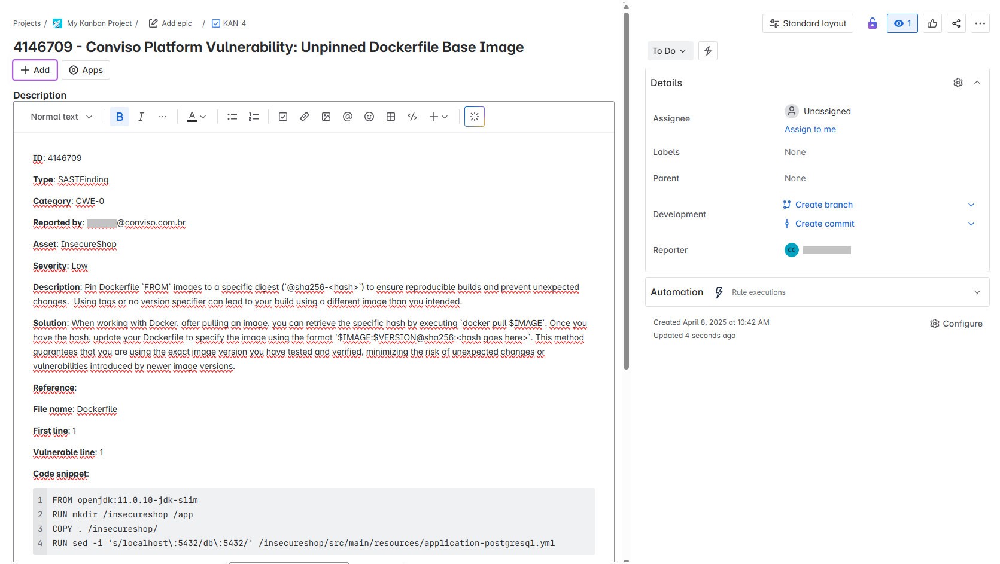

<div style={{textAlign: 'center'}}>


</div>

:::note
First time using Jira? Please refer to the [following documentation](https://www.atlassian.com/software/jira/guides).  
:::

## Introduction

The integration of the Conviso Platform with the Jira tool is done via API where we connect our product with Jira, which allows the creation of issues, comments, and as well as a Webhook for comments made on an issue.

Jira's integration with Conviso Platform will benefit issue control management and vulnerability consolidation. With the integration performed, the customer can orchestrate vulnerability to Jira.

The Conviso Platform uses two-way communication with Jira, that is, if a user adds comments in the Jira discussion field, the added message will automatically appear on the vulnerability's Security Champions tab. This allows a Conviso technician to interact with the development team that is doing corrections.

## Requirements

To perform the integration, we will need 3 pieces of information:

1. Jira's website address;

2. Email or Username;

3. Token API.

## Integration Setup

First let's access Jira and copy the URL, as shown in the image below:

<div style={{textAlign: 'center'}}>


</div>

Then, to generate the **API Token**, access the following link: [API - TOKEN](https://id.atlassian.com/manage-profile/security/api-tokens):

<div style={{textAlign: 'center'}}>


</div>

After clicking the create API token button, as shown in the image above, copy the API key, as shown in the image below:

<div style={{textAlign: 'center'}}>


</div>

The next step within Jira is to copy the project key that should receive Conviso Platform issues. Look for the **Settings** button and then the Key option, as shown in the image below:


<div style={{textAlign: 'center'}}>


</div>

Now that we have the necessary information, let's go to Conviso Platform, look for the **Integrations** on the left side menu, choose **Defect Tracker** at the **Categories** panel to the right and finally the **Integrate** button just below Jira's card, as illustrated in the example image below:


<div style={{textAlign: 'center'}}>


</div>

Then, all Jira information must be filled in the fields requested by Flow, and that were demonstrated how to obtain at the beginning of this document.

<div style={{textAlign: 'center'}}>


</div>

:::note
The checkbox **Verify SSL** must be checked only if the certificate associated with Jira is issued by a Public Certificate Authority. For Private CAs or self-signed certificates, use **https://** at the site address URL and leave this box **unchecked**.
:::

Click on button **Authorize Jira** to check if your credentials are properly set. The **Credentials** panel will shrink and the **Configuration** panel will expand. Click on the **Add** button to start pairing **Conviso Platform Projects** with **Jira Projects**:

<div style={{textAlign: 'center'}}>


</div>

At the drop-down list **Projects**, select the Conviso Platform Project you want to associate to your Jira Project, which will be chosen at the drop-down list **Jira Project**: 

<div style={{textAlign: 'center'}}>


</div>

:::note
You may associate several Conviso Platform Projects to a single Jira Project.
:::

After creating the Projects Associations, the panel will expand and ask you for the **Jira Issue Type** that you want to link. Choose from **Epic**, **Task** or **Subtask** types:

<div style={{textAlign: 'center'}}>


</div>

If your Jira has custom fields, they must be filled in. To include them, use the **Custom Mapping (optional)** section:

<div style={{textAlign: 'center'}}>


</div>

After mapping all the Conviso Platform status to Jira status, click at the **Save** button. If you made a wrong association and want to delete it, just choose the incorrect association and click at the trash icon at the right of it. Remember to **Save** when you are done, in order to properly store your integration configuration:

<div style={{textAlign: 'center'}}>


</div>

After saving you integration configuration, you may want to review, make changes to it or even remove it from Conviso Platform. To do so, at your integration configuration panel, choose the **Edit** icon to review or change it; If you wanto to completely delete it, use the **Trash** icon at its right:

<div style={{textAlign: 'center'}}>



</div>
Whenever a new vulnerability is identified, it is automatically sent to the project in Jira, as shown in the image below:

<div style={{textAlign: 'center'}}>


</div>

## Webhooks

You may configure **Webhooks** in order to use the two-way communication with Jira. 
:::note
The Webhook function works with Jira version 7.1 and above.
:::

The integration of the WebHook type with Jira allows all comments made on Jira issues to also be registered in Conviso Platform. To start configuring a WebHook, it is initially necessary to obtain an external access code that will be used in the Conviso Platform application.

Initially, you must access the Login page with your username and password and on the right side of the screen click on the Settings icon (User Management), follow the example below:

<div style={{textAlign: 'center'}}>


</div>

Then, click on the Jira icon:

<div style={{textAlign: 'center'}}>


</div>

In the menu on the left, look for Webhooks and then click on the **Create a webhook** button, as shown in the image below:

<div style={{textAlign: 'center'}}>


</div>

When clicking on the button to create a Webhook, we must use this URL and at the end put the token generated by the integration inside Conviso Platform:

```yml
https://app.convisoappsec.com/payload?issue_id=${issue.id}&issue_key=${issue.key}&project_id=${project.id}&project_key=${project.key}&jira_authorization_token=SEU_JIRA_TOKEN
```

In order to copy the token generated in the integration, access **Conviso Platform**. Go to the menu at the left, choose **Integrations**, click at **Defect Tracker** at the **Categories** panel to the right and then click **Configure** at the Jira's card:

<div style={{textAlign: 'center'}}>


</div>

The following window will be shown. Click at the **Eye** icon to exhibit the token. Use the **Copy** icon to the right to copy the token to your clipboard:

<div style={{textAlign: 'center'}}>


</div>

Now we have to add the retrieved token at the end of the URL. It will look like this:

```yml
https://app.convisoappsec.com/payload?issue_id=${issue.id}&issue_key=${issue.key}&project_id=${project.id}&project_key=${project.key}&jira_authorization_token=SEU_JIRA_TOKEN
```

Back to Jira, add the link with the token at the URL field, as follows in the example below:

<div style={{textAlign: 'center'}}>


</div>

Activate the comment event and click on create to finish the Webhook integration:

<div style={{textAlign: 'center'}}>


</div>

By carrying out this process, we can add comments on the Security Champions tab of vulnerability or add the comment directly to the issue created in Jira:

<div style={{textAlign: 'center'}}>


</div>

The comments will appear in Jira's comment field, as shown in the image below:

<div style={{textAlign: 'center'}}>


</div>

## Mapping External Fields to Conviso Platform

:::note
In order to use this feature, your Jira must be configured in the English language.
:::

This functionality allows vulnerabilities in Conviso Platform to have their status synchronized with jira and vice versa.
To enable it, you have to register a new webhook in Jira that allows sending some data when a Task is modified.
In the same webhook registration screen shown in the section above, we will register a new webhook:

<div style={{textAlign: 'center'}}>


</div>

In the URL field, use a predefined URL, with your token at its end:

```https://app.convisoappsec.com/api/v1/integrations/jira/update_vulnerability?issue_key=${issue.key}&project_key=${project.key}&jira_authorization_token=YOUR TOKEN```

Your token can be retrieved from Conviso Platform, Integrations, at Jira integration configuration, as shown below:

<div style={{textAlign: 'center'}}>


</div>

After doing so, edit the Jira integration Configuration and associate the Conviso Platform fields with their respective fields in Jira, at the **Custom Mapping** section:

<div style={{textAlign: 'center'}}>


</div>

<div style={{textAlign: 'center'}}>


</div>

**Status in Conviso Platform**: are current statuses that each vulnerability can be at Conviso Platform.

**Status in Jira**: are current status that each task can assume on Jira.

In the example above, when we change a vulnerability status at Conviso Platform to **False Positive**, Jira will change its status to **Done** and vice versa: when we change to **Done** in Jira, it will change to **False Positive** at Conviso Platform.

:::note
Don't forget to click **Save** after configuring Jira's integration!
:::